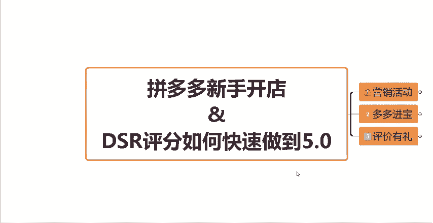
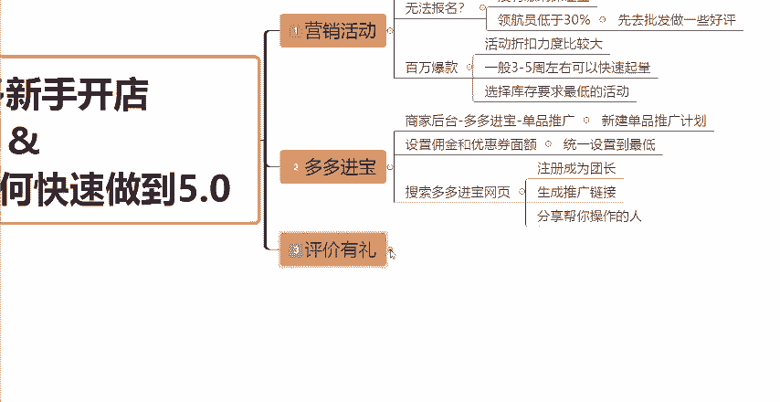

# 【拼多多运营实操教程】中小卖家拼多多开店打造新品全流程教学！跟着实操半个月，爆款成功率翻倍，快速实现日销300+单！ - P11：第11节：拼多多DSR评分快速做到5.0 - 拼多多-运营 - BV1UN2wY3E5W

下半年做拼多多啊，想要提升店铺的DSR评分，其实很简单。今天呢这期视频我就分享我一直在用的几个方法，尤其是最后一个可以快速的帮你的店铺DSR做到4点9分以上。安全的同时呢，效果也还不错。

关键是你自己呢也能够操作。那么记得点赞收藏一键三连支持一下，我把详细的一个步骤分享给你。那首先第一个呢就是报名营销活动。首先进入我们的这个店铺的商家后台，可以看到有一个百万爆款的一个活动。

在我们的店铺商家后台找到这个店铺营销，点击营销活动，在这个地方就会看到有一个百万爆款啊，百万爆款。然后这个呢。

我们可以去选择参加。如果说你发现你无法报名啊，发现无法报名基本上就两种情况。要么你没有缴纳这个保证金，要么你的这个领航员的评分低于30%。如果说你的领航员低于百低于30%这种情况的话，你可以先到批发啊。

先到批发里面去做一些好评就可以了。然后这一个活动的话，它的一个活动的折扣力度是比较大的，一般3到5周左右啊，就会快速的一个起量。那每一个类目呢，它会有一定会有一定的一个差异。

所以说你们自己去斟酌一下适不适合你们。如果说适合的话，你就可以去报名。如果说你是单纯的想要提升权重的话呢，也可以去选择活动最低要求的一个库存，然后提交等待审核就可以了。

这一个活动的一个效果还是非常非常的不错的。那么第二种呢就是我们可以通过多多。

进宝去把我们的DSR评分做起来。那么我们在同样的啊打开我们的店铺后台，找到多多进宝，在单品推广当中可以去实现这一步操作。呃，具体在后台给大家演示一遍啊，在我们的店铺后台，然后往下滑有一个多多进宝。

我们直接点击推广设置。然后在这个地方它会有一个单品推广。然后如果说没有开通的商家朋友们需要去开通一下，开通完之后啊，开通完之后我们去设置一个单品推广，然后创建一下这个商品的计划。

把我们需要操作的这个链接添加进去，然后点击下一步操作，成功之后呢，你就会看到需要让你设置一个优惠券面额和设置一个佣金比例的这样的一个页面。然后优惠券面额，我们统一的去把它设置到最低。

然后佣金的话也设置到最低，然后点击立即推广就可以了啊。然后这一步。

创建成功之后呢，它会显示一个状态，就是在推广中就证明你设置成功的。然后在推广中下边啊，它你们会看到有一个复制链接。这个时候呢我们需要去把这个链接复制一下，然后我们打开网站啊。

打开网站搜索多多进宝进入多多进宝的官方页面。在这个页面呢，首先如果说你们没有注册过的小伙伴需要先注册一个账号，注册完之后啊，你就成功的成为了这个多多进宝的一个团长啊，这个时候你的身份就是团长身份了。

然后我们把刚才复制的这个短链接。

然后打开这个推广管理当中有一个转链工具啊，把刚才的短链接在这里面转化为推广链接。这个时候把推广链接分享给帮你操作的人，或者分享给你的亲朋好友，或者说一些微信群啊，都可以，知道吧？

然后让他们通过这个渠道去下单，去帮你做成交。那么在这通过这个渠道成交的这些订单呢。因为多多进宝，它是属于这个官方平台的一个途径啊，它是正规途径。所以说在这个途径里面下单的这个订单啊。

大部分是会被记录为有效订单的，它就可以帮助我们快速的去把DSR评分给做出来的，好吧。

然后这是第二个方法。然后第三种方法呢，就是通过评价有礼的方法，通过这样的一个营销工具去做。但是呢这一个方法呢就比较适合店铺本身是有订单的这样的一些商家朋友们，如果说你是一个完全的新店，你通过这个方法呢。

可能就效果不如前两个那么的好了，知道吧？那还是跟大家讲一下啊，通过我们的商家后台，然后找到营销工具，可以看到有一个评价有理。大家可以在店铺的后台，你们自己去看一下啊，在我们的这个店铺营销。

然后点击营销工具，然后往下滑会看到有一个营这个评价有礼金啊，就是这样的一个活动。

然后在这个里面呢，我们可以去设置啊评价返现金额啊，评价返现金额预算的话呢，你们自己去定，根据你们自己的一个情况来，如果说你卖的这个产品客单价比较高，你的利润空间呢也比较高的话。

那你这个返现金额呢也就可以设置的高一点。相反的，你就可以设置的低一点。比如说8毛钱1块钱或者1。52块钱都是可以的。你们自己去定。那如果说是你们店铺单量比较少的这些商家朋友们呢。

必要的时候可以去配合直通车去就是去开一些直通车，然后去拉一些订单，拉一些真实的订单，然后再通过这个评价有理啊，把这个呃评价这一个点给做好，把这些做好了之后呢，店铺的DSR评分拉到5分的之后。

就会吸引大量的免费流量进店，知道吧？那么主要的一个方式呢就是通过这三个方法快速的把我们的DSR评。

分做到5。0。那么看到这里，如果说还有不懂的小伙伴可以在评论区扣三个6，找我领取一份我给大家整理的店铺综合的运营大礼包。那么也别忘了一键三连支持一下，好吧，感谢大家的一个观看。

