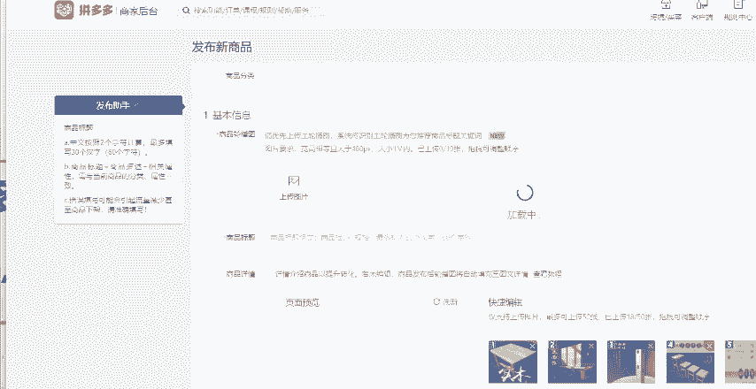

# 【拼多多运营实操教程】中小卖家拼多多开店打造新品全流程教学！跟着实操半个月，爆款成功率翻倍，快速实现日销300+单！ - P13：第13节：拼多多新品上架“200W+”销量 - 拼多多-运营 - BV1UN2wY3E5W

拼多多新品上架就有几万几十万，百万家的销量到底是怎么做到的呢？其实操作并不难，当下就有几种方法可以实现。今天呢这期视频我就手把手教大家一步一步如何去操作，上架就出百万家销量，提升你店铺产品的一个转化率。

让你领先同行一步，这个方法其实不用那么复杂，不走拼内购不走活动折扣，大家可以点赞关注收藏起来。首先第一步需要去发布产品。这里大家要注意，不要直接通过店铺后台发布新商品去发布。

我们打开店铺后台找到商品列表，然后点击发布机会商品，点击发布机会商品之后，选择消费者正在收啊，这个地方有一个消费者正在搜。然后我们这个地方呢是搜索量比较大，但是商品紧缺的一些这种产品啊。

我们直接找到同款去发布就可以了啊，找到同款去发布。然后。

发布的时候，主图这个地方你留一张就可以啊，留一张就可以。标题的话你可以随便去写。然后详情页的话正常发布SQ的话，我们可以去做两个规格啊，SQ可以做两个规格给大家看一下啊。

设置两个规格。然后库存的话，你如果说打算改多少，你就填多少。这边唯一要注意的是你的这个价格啊，因为拼多多上它会有一个拼单价和一个单买价，拼单价你需要去设置到40041，一定要先设置到4041。

然后两个规格啊就全部设置到4041。然后单买价呢比拼单价贵1块钱就可以，就是4042，把这个价格设置好啊，把这个价格设置好。然后下面这个地方它会有一个满件折扣满两件，这个地方大家要设置到9。9折啊。

先设置到9。9折，这两个地方设置好之后啊，你就会看到这个地方它的拼这个折后，拼单价最终的一个价格在4000块钱左右，设置好之后啊，最后提交上架就可以了啊，提交上架就可以了。然后上架通过之后上架完成之后。

我们在这个地方会。

看到啊有一个设置优惠券的一个这个地方啊，设置优惠券的一个地方。我们点击设置优惠券进来之后，这个优惠券的名称呢，你可以随便的去填啊，这个就是第二步设置优惠券，优惠券的名称随便去写。

然后领取时间设置为当天金额的话，大家要注意金额的话，设置最高，根据定价，我们这边可以直接设置这个优惠券的金额2000块钱啊，2000块钱。然后发行张数啊，我们可以先设置个比如说10张。

然后后续如果说还有需要的话，我们可以再去添加啊，这边根据我们需要下单的量，我们可以先设置为10张，设置完之后选择创建啊，选择创建。然后这一步做好之后啊，我们用手机找到我们刚才设置的这个商品，找不到的话。

可以在你的店铺后台直接的去分享链接啊，分享链接。

给你自己，然后打开这个产品的这个商品页面。然后切记啊，你要把你刚才就是是创建好的这个优惠券全部的给它领取完，防止被其他人领走了，被薅羊毛知道吧？然后我们回到店铺的后台首页，找到你刚才的这个链接啊。

找到你刚才这个链接，然后点击编辑啊，点击编辑这个时候我们需要去改一下价格了，却要改一下价格，第一个规格的价格，我们拼单价改到9。09啊，9。09。然后这个单买价设置到11块钱。然后第二个规格呢。

拼单价我们设置到3。03元，单买价我们设置到5块钱啊，把这两个规格的一个价格要给它改掉啊，给它改掉。然后下面的这个满件折扣，还是跟刚才一样的，设置到9。9块啊，不对，9。9折啊，9。9折。

然后点击确定这个时候呢，我们再找到什么，找到这个。

营销工具啊，找到我们的这个店铺后台有一个。这个我们往下滑营销工具，然后在营销工具当中呢，我们需要去创建一个限时限量购。然后我们通过限时限量购，把我们的产品打一折。

知道吧？打一个折打一个折，这个是有规格级的啊，阶梯阶梯的。然后规格一就是刚才设置的规格一，刚才设置的这个9。9块啊，不是9。09元的这个规格，我们给它打一个4折啊，打一个4折。

然后规格2就是刚才设置的3。03元的这个SQ我们给它去打一折啊，去打一折，然后点击创建。这个时候我们再回到手机端去看这个产品打四折的啊，打四折的这个SQ呢。

就是呃三毛啊打4折的3块的这个SQ打一折。然后我们回到手机端看这个产品，它就是一毛钱啊，就是一毛啊，就是三毛钱，说错了，就三毛钱。然后我们可以直接的去拍拍6667啊，拍6667。

就是拍6600767件产品啊，拍667件产品。这个时候下单的价格是200。1元。然后通过我们刚才领取的2000元的优惠券，我们最终的下单价格呢，就是一毛钱。你们看一下你们最终的付款。

这个价格是不是一毛钱。如果说是一一毛钱的话，操作就是没有问题的，知道吧？那么你们这样去做一次的话，你们的这个销量就是6667。如果说你们想做1万加的销量，你们就去做两次，按照同样的操作去做两次。

如果说你们想做10万加的销量就去做20次。

想做100万加的话，你们就去做200次，知道吧？就是根据你们想改多少销量，你们去做多少次就可以了。然后记住啊，拍单之后一定要去发真实物流，不要去发空包，知道吧？发空包的话容易出问题。

然后还有一个点就是你们改完销量了之后，如果说你们优惠券没有用完的，记得一定要把优惠券给取消掉，避免后期被被薅羊毛了，好吧，然后销量累积成功之后啊，就是你们的销量改完了之后，回到你们的这个商品列表。

回到你们的商品列表，因为刚才这个链接，你们的这个主图，还有这个标题是随便做的嘛，对吧？但后续你们一定要把这个商品的信息重新的编辑好，主图标题详情页SQ布局，一定要全部的按照正常链接去把它重新的改一下。

好吧，以上呢就是全部的流程的。新品没做的话，抓紧时。

间去做吧，想改销量的，按照我今天教你们的这个方法可以去改了。看到这边还有什么不懂的小伙伴呢，或者说需要一些表格资源的，可以评论区留言666找我领取一份我整理的店铺综合运营大礼包。好吧，那么看到这边。

如果说你学会了，记得一键三连支持一下。

