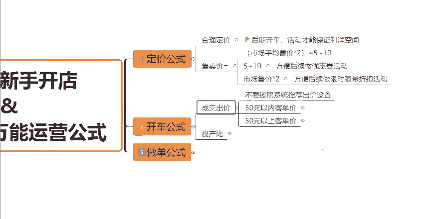
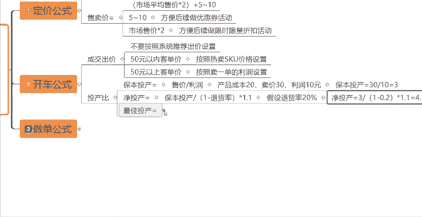

# 【拼多多运营实操教程】中小卖家拼多多开店打造新品全流程教学！跟着实操半个月，爆款成功率翻倍，快速实现日销300+单！ - P14：第14节：拼多多轻松学会万能运营公式 - 拼多多-运营 - BV1UN2wY3E5W

拼多多新手开店，如果你也是刚做，不会定价也不会开车，做单呢也没有效果。那么今天这一个视频我就给大家分享几个万能的公式，学会了，你就能够轻松的解决这些问题。大家可以关注点赞，收藏一波，方便后面继续学习。

首先第一个呢就是定价的公式了。只有一个合理的一个定价，我们在后期不管说是去开车还是上活动，都能够保证有一定的利润空间。那么不管你是做什么产品啊。

定价都可以按照这个公式来售卖价等于市场平均售价乘以2加上5到10块钱。这个市场平均售价呢，大家可以去自己找到自己的一个同行，然后去算出他们的平均售价就可以了。那么这个5到10块钱啊。

是为了我们上架后可以去做一些优惠券，做5到10块钱的一个优惠券的面额。那么乘以二呢，是为了我们上架后去做。

限时限量的一个活动，做打折促销，可以更大的提升我们的一个转化率。我们这样去定价，也是为了后续提价提可以提前做好准备。因为如果说我们后续提价的话，直接在商品编辑当中在这个地方去修改产品的价格的话。

很容易啊被降权，降低我们的这个流量的。按照公式定价，那么想要提价的话呢，我们就可以直接的去把这个优惠力度给缩减就可以了啊，这是第一个定价的一个公式。那么第二个呢就是开车的万能公式，万能出价公式啊。呃。

首先第一个是成交的出价。因为我们在开直通车的时候，出价其实是有两种的。第一种呢是这个成交出价。那么第二种呢是按投产比的一个出价。首先成交出价，我们在设置出价的时候。

它会系统会给到我们这一个推荐的一个出价。我们不要按照系统推荐的这个出价去设置啊，成交出价，你按照我这个公式来。首先。

我们先分析一下我们的这个产品的客单价是多少。如果说你的这个产品客单价是在50块钱以内的，那么你就按照自己热卖的这个SQU的价格去设置这个成交出价就可以了。然后如果说你的产品的客单价是在50块钱以上的。

那你就根据自己卖一单的这个利润空间去设置这个出价就可以了。比如说你的一个客单价是100块钱，那么你卖一单的利润呢有40块钱。你的这个最终的成交出价，最高就可以设置到40块钱啊。

那么你们就根据这两种情况去设置这个成交出价就可以了。

然后呃按照投产比出价的话呢，首先你们要知道啊这个投产比它的几种这种投产的计算的公式啊。首先第一个是保本的投产，保本投产呢，它等于售价除以利润。那比如说呃我们的产品成本是20块钱，那我们卖30块钱。

利润呢一单就是10块钱。那这个时候你的保本投产就是30除以10就等于3，也就是你要你的这个ROY要达到3才是保本的一个状态啊，这个就是保本的一个投产。那么前期我们的如果说按照投产比去出价，在这个地方啊。

切换一下目标投产比啊，前期的话我们可以先按照刚才我们说的这个保本的投产去出价啊，先按照这个保本的这个投产，先把全站给它开起来。那么有了一定的数据之后。

就是我们积累了一定的成交之后呢，我们就会知道这个产品啊它的实际的退货率有多少了。那。假设我们的这个退货率是20%啊，我们按照前面的我们算出来的这个保本投产是3，我们就可以去得出我们的净投产是多少了。

净投产它就等于啊保本投产除以一减去退货率再乘以1。1%，那按照前面我们算出的保本投产等于3，那么净投产就等于3除以1，然后减去20%的退货率再乘以1。1就得到了1个4。13的这样的一个这样的一个数据。

为什么呢？因为这个平台啊是经常会罚款，然后会有一些退款的，然后耗材又比较多，而且比如说要扣一些什么扣点呢，所以说我们把这一个数值乘以1。1是一点也不过分的。也就是说什么呢？保本投产是3。

然后退货率是20%。你的这个直通车最这个投。

投产啊最少要开到4。13以上，你才不会赔钱，你才是挣钱的，知道吧？这个呢就是净投产的一个公式啊，就是净投产等于保本投产除以一减退货率再乘以1。1。那么有了权重之后啊。

我们要开到多少投产才会烧的越又快又挣钱呢。这个时候我们就需要去算出一个叫做最佳投产的一个这个数据啊。那么最佳投产等于净投产乘以1。3。

这个就是我们的一个最佳投产。拿前面这个举例子啊。

我们算出了净投产等于4。13，然后我们用这个净投产乘以1。3就等于这个5。36，对吧？那所以说我们的这个直通车呃，能够开到5。36的情况下，是一个最好的一个数据啊，是一个最佳投产的一个数据。

那所以说呃我们假设一下，按照前面的这种情况，对吧？我的成本20，我卖30，然后在退货率是20%的情况下，前期的推广出价是保本投产是3。然后拉数据以后，得到的这个投产，你最少要拉到4。13到5。36之间。

那么你拉到了这个范围之内啊，你的这个直通车开的才是有意义的，不然的话你都是亏钱的啊，都是亏钱的。那么这个计算公式啊，如果说搞懂的小伙伴呢，你们就按照这样的去出价。如果说还不懂的，可以在评论区找到我我。

可以给你分享一个这个公式，然后一些数据的计算表格，好吧，不会算的兄弟们呢，你们自己去把数据带入进去，自己去输入就可以去计算了。这个呢就是开车的一个公式。然后第三个是我们做单的一个公式啊，做单。

如果说你想要有效果的话啊。

那么你就要按照这个公式来。首先它的一个核心呢就是你需要去记录同行同城级优秀的一个数据。来，我给大家看一下，我们打开商家的后台，然后在这个地方呢，我们可以看到店铺的访客数据。

然后我们还可以看到这个成交的UV价值数据，这两个地方都有一个看到没有？有三条线，一条线呢是我们店铺自己的一个访客数据，绿色的呢是同行同城的平均数值，然后黄色的呢是同行同城的优秀数值。

然后包括这个成交UV价值，这个地方也是一样的，有三条线有同行同城平均的，有同行同城优秀的。那在这两个数据当中呢，我们就需要去把同行同层级优秀的数值，把这个数据给记录下来啊，要记录下来。然后我们运用公式。

销售额啊等于访客数成交乘以成交UV价值。也就是比如说这个后台啊，你的访客数同行同层级优秀的访客数大概是在8000多，对吧？在8000多的一个数值，然后成交UV价值大概是在10左右的一个UV价值。

然后你用这个访客数用8，比如说用8000乘以10就等于多少，等于8万。那么8万达到8万以上呢，就是同行同层级优秀的一个销售额的一个这个数值。那么我们就可以把这个数据给计算出来了。

那么这个数据呢也叫做GMV啊，就是坑产，知道吧？然后第二个呢就是我们把这个GMV我们把坑产算出来了之后呢，我们肯定要去算出我们要做的这个单量嘛，对吧？

单量呢就等于GMV除以你产品的客单价，就得到了你最终要做多少的一个单量。达到了这个单量，这样做单的话，才能够使你的这个数据最大化。好吧，所以说新手坐店了，你就记住这几个公式。

完全满足了你前期的一个运营需求了。那么看到这里呢还有什么不懂的小伙伴，或者说需要一些表格资源的呢，可以在评论区评论666找我领取一份我整理的店铺综合运营大礼包。如果说这一个视频对你有帮助的小伙伴呢。

也别忘了一键三连啊，支持一下，感谢你的观看。

