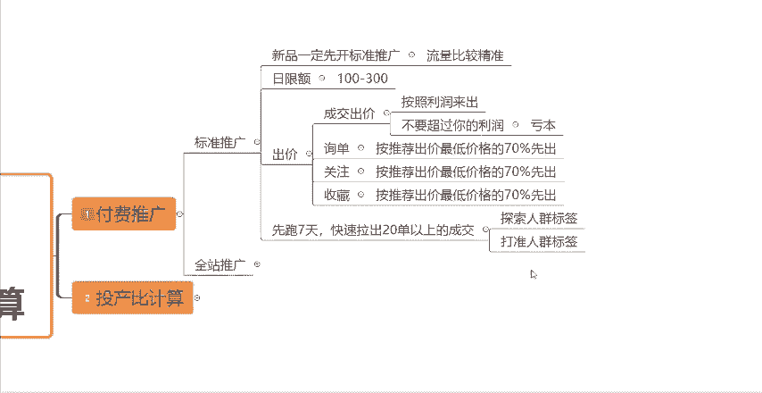

# 【拼多多运营实操教程】中小卖家拼多多开店打造新品全流程教学！跟着实操半个月，爆款成功率翻倍，快速实现日销300+单！ - P15：第15节：拼多多直通车ROI及利润如何计算 - 拼多多-运营 - BV1UN2wY3E5W

很多拼多多新手在前期开店的时候会发现自己的直通车不赚钱，甚至还会亏钱。那是因为你还没有了解到直通车的具体开法，以及我们直通车里面，比如说ROI以及利润应该怎么去计算。我要达到多少的ROI才是保本的。

要达到多少才是盈利的。这些计算公式都是你们要先学会的。那么今天这一期视频呢，我就来重点的跟大家讲解一下，关于我们直通车ROI以及利润，这如何去计算的一个公式。那首先呢先跟大家介绍一下。

关于我们拼多多平台当中的两种付费推广的一个模式。一个是标准推广，一个是全站推广。那么标准推广是在什么样的一个情况下使用呢？就是如果说你是做一个新品新链接。那么新链接呢你一定要先开标准推广。

因为标准推广在前期啊它的流量相对来讲是比较精准的。所以说前期呢可以帮我们提升一下我们的这个投产，提升下。

转化率。然后如果说我们把链接上完了之后啊，我们可以直接的打开拼多多后台点击标准推广，然后在这个地方把你要推广的产品全部的添加进来。然后你需要去设置好日限额跟出价。

关于这个日限额跟出价怎么去设置呢？根据你的日限额的话，根据你自己的一个预算情况来，如果说你的预算资金比较少，你可以先出个100块钱。如果说你的预算比较多，你可以出个200300都是可以的。然后这个出价。

你需要设置成交出价询单出价，关注出价跟收藏出价，成交出价的话，按照你的利润来出就可以了，不要超过你的利润，知道吧？因为如果说你的成交出价超过了你的利润的话，你很有可能会亏本的，好吧？

比如说你卖一单50块钱，那你赚20块钱，你的这个成交出价，最高最高就只能出到20块钱，好吧。然后这个。

询单关注收藏这边你去点击的话，你会发现系统它是会给到你一个相似商品一般出价的一个最低跟最高的一个区间值的。这个呢就是系统的一个推荐出价。那我们前期呢不要按照这个系统的推荐出价去出价啊。你记住一个公式。

按照系统给你的推荐出价的这个最低出价的70%来出价。好吧，前期先按照这个公式去出价，后期我们再根据这个数据来慢慢的去做优化去做调整就可以了。然后按照以上的一个设置方式呢，我们先把标准推广计划给创建好。

创建好之后，先跑7天，快速的拉出20单以上的一个成交。因为我们一个直通车的计划，在刚开始创建的时候，这个时候这个计划还处在一个学习期的一个情况下，只有当你的这个计划拿到了20单以上的一个成。

要才这个时候系统才会探索到精准的人群标签，并且给你打上精准的人群标签，好吧，这就是一个。

标准推广前期的一个操作。那么当你的这个标准推广计划呢，能够拉出20单以上的成交之后啊，你就可以考虑去转全站推广了。那么全站推广它跟标准推广不一样的一个点是在哪呢？

标准推广它的一个成交出价是按照你自己设置的一个出价来来设置的。那么全站的话呢，你会发现它在成交出价这个地方啊，它是让你按照目标投产比来出价的啊，它是让你设置一个投产比，不是让你设置多少钱呢？

所以说你想要学会怎么去开全站推广的话，你就一定要知道投产比里面一些计算的公式是什么？我首先先跟大家讲解一下，实际投产比的一个计算公式啊。实际投产比，它等于你的交易额除以你的总花费。

比如说这个时候我的直通车花了1000块钱。那么1000块钱给我带来了5000块钱的交易额。那么我用5000除。

1000，我的投产比，我的实际投产比最终就是5，这个就是就是你的实际投产比啊。然后你还需要知道你的盈亏平衡线在哪啊，也就是我们所所说的保本ROI。然后这个保本ROI呢，也是你这个全站推广。

前期在目标投产比这个地方需要去出的一个价格啊，去需要去设置的一个数值，就是你的保本OI。然后保本ROI呢，它等于你的客单价除以你的利润，那比如说你的这个产品，你一单卖100块钱，对吧？

然后你的利润空间呢是50块钱，这个时候啊你的保本ROI就是2，也就意味着你的这个直通车计划，只要ROI达到了2，你就是保本的，就是不亏钱的。但是达到了二就一定不亏钱的吗？不是的。

因为我们在运营店铺的过程当中，在开车的过程当中呢，还有可能会遇到一些退款啊，包括一些平台的扣点啊、服务费啊，以及处罚呀之类的，对吧？还会有一些其他的这种额外的成本。

所以最后呢我们还要去算下面的一些数据啊，然后我先教大家去做这个盈利的一个计算，就是你需要知道你开的这个直通车啊，比如说你花了1000，卖了5000，你最终的一个盈利是多少，这个要怎么计算。

那么盈利呢它就等于你的交易额减掉你的退款金额乘以你的利润比，再减去你直通车的总花费，就是你的盈利额。比如说你卖了5000，然后在5000当中呢，退了500块钱，那你就用5000减去500。

再乘以比如说你的利润是50%，对吧？你就乘以50%，再减掉你。1000块钱的直通车花费，那你最终的这个盈利呢就是1250块钱。好吧，这个呢就是你们的这个盈利的一个计算。那刚刚我说了啊。

你达到了保本RY还不够，那你还要去学会你去算你的净投产。

进投产呢它的一个公式呢是保本RY除以1减退货率乘以1。1，这个是我们的净投产啊，那根据上面的情况，我们来算一下，比如说。我的保本投保本RY是2，对吧？那我2除以一减去退货率，那假设我们的退货率是10%。

我们就一减去0。1，再乘以1。1。那最终我们得到的一个净投产就是2。44，也就意味着当你的这个直通车计划呢，达到了2。44的这样的一个投产，你就是一个净投产，就是你这个直通车计划呢。

是一定不会亏钱的就算有退款也是不会亏钱的好吧，就达到2。44的这样的一个净投产，但是我们开直通车就是为了不亏钱嘛？我们是为了赚钱的，对不对？所以说这边还教大家一个就是最佳投产的计算方式。

最佳投产等于什么等于净投产乘以1。3。按照上面的情况，比如说我们的净投产，我们算出来了是2。44，然后我们用2。44去乘以1个1。3，最终啊2。44乘以1。3，最终得到的一个投产是3。17。

也就意味着当你的直通车达到了2。44到3。17这样的一个范围内，就是你比较良性的一个状态，比较良性的一个投产，知道吧？在这个区间之内，你的这个直通车是挣钱的。

反而反之，你的直通车RY如果说低于了2。44，你就有可能是亏钱的。好吧，你达超过了2。44，你就是赚钱的。所以说你们在开车的时候啊，在开车的过程当中，一定要学会怎么去算你的这个直通车的盈利。

怎么去算你的净投产，算你的盈亏平衡线，怎么去算你要达到的一个最佳投产是多少，这边就把是这个公式全部的交给了你们。那么看到这边的小伙伴呢，如果说还有不懂的。

那么可以在评论区评论666找我领取一份我整理的这个拼多多运营的综合资源大礼包。那么还有其他关于店铺过程当中的一些运营问题呢？大家也可以在评论区找到我，我都可以给你们解答一下。

那看到这边呢小伙伴也别忘记啊，一键三连，支持一下，感谢你们的观看。

