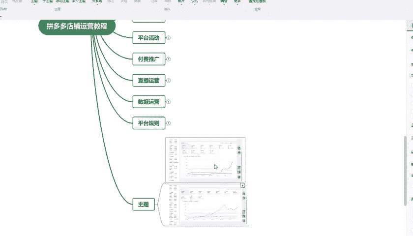
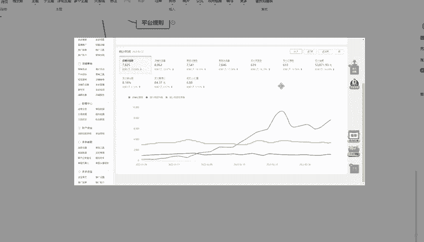
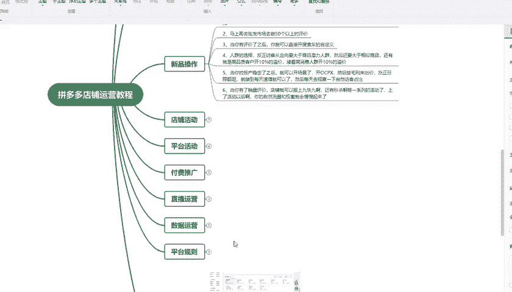

# 【拼多多运营实操教程】中小卖家拼多多开店打造新品全流程教学！跟着实操半个月，爆款成功率翻倍，快速实现日销300+单！ - P16：第16节：拼多多运营质量和价格 - 拼多多-运营 - BV1UN2wY3E5W

这一期的内容比较长，但是你看完再按照这一套运营思路去操作，会让你的店铺数据大幅的提升。我会把内容分为几个板块，然后分别针对每一个板块详细的讲解清楚，持续关注拼多多不迷路。

有很多做这个拼多多店铺的新手卖家，不知道怎么把拼多多零访客零店铺的新店，利用30天的时间提升到日销几十单，或者说是几百单的。其实对于一个新手卖家来说，觉得这个是一个天文数字。但是只要你掌握了一套正确。

而而且高效的运营思路，它其实非常的简单。接下来我分享的这个就是运营公司现在在用的一套完整的拼多多店铺运营的流程，可以说是企业级别的，而且是具有实战性适合大部分的类目和一些新手或者小白卖家去操作。

首先我给大家看一下，通过这一套方法起店的一些店铺的数据。

我们先来看一下这个店铺的数据啊，这个店铺是通过这一套的思路，把一个零数据零访客的这个店铺从。2月10号到2月底，然后把这个访客直接从零干到了800多。这个支付买家说也是直接干到了四五十单的样子。

这一天是38单，而且这个数据还是在持续上升的。另外一个店铺也给大家看一下，这个店铺的话，时间稍微长一点，但是数据也非常的好啊。这个店铺我们是通过一个半月的时间，也是从新店直接做到了7000多个访客。

这个支付的订单数啊是非常的好啊，就是说做到了六七百单，平均每天刷。平均每天的这个支付买家数都是六七百单，然后支付金额也是啊几万的这个支付金额。这个店铺可以说是我们完全按照这套思路来进行操作的。

这些都是实战得出来的数据，然后总结一下这些结论。其实你就可以按照这一套的思路去操作你的店铺。而且这种操作复制性非常的强的非常适合一些呃新手才开始接触拼多多店铺的卖家，或者说是你做了很长时间。

但是店铺一直没有效果的啊，这个老的卖家朋友啊，接下来我给大家分享一下我们这一套思路的几个步骤啊。第一是我们的市场分析。市场分析可以说是非常重要的。尤其是一些新上的产品。因为你没有做这个市场分析。

可能导致你前期操作的数据和你想象的差距比较大。但是我们做市场分析的目的主要就是先要了解好这个产品，然后了解好这个市场，了解好这一个产品所对应的消费者的他的购物习惯，它的人群标签。

以及我们可以通过测图测款来选。择一个比较容易起爆的产品。因为本身运营占一半，店铺的这个商品，它的潜力占一半。如果说你产品不好的话，你就算有再好的运营功底，它效果也是会差强人意的。第二个是我们的商品发布。

商品发布，对于一些老的卖家来说，他觉得非常简单。但是可能他在操作的时候会忽略掉一些点，然后就导致产品做不起来。比如说我们的图片标题这些制作，其实它是我们产品的基础，也叫做我们产品的内功，内功。

如果说你没有做好，你再去做推广，其实也是徒劳无益的。商品发布之后就要开始操作新品操作主要是这几个点。第一是我们要去做改销量，改销量应该对于一些老的这个卖家朋友都比较清楚。

我们做拼多多必须要去做这个改销量。在什么时候去改销量，该改多少。这也是一个非常重要的一个点。然后把销量改了之后，我们需要去做这个评价，有评价之后，该开车的开车，该报名活动的报名活动。

这些时间节点和操作细节，我都我后面都会做详细的讲解，以及后面的店铺的活动，平台活动付费推广，还有这个直播运营数据运营平台规则，这些我都会每一节课都会详细的给大家讲解。

所以我啊这里讲解了这些视频啊，其实我都会录录制成文件，可以直接找我领取。我这里准给大家也准备了一些呃这个资料，这些福利，可以直接找我领取。好的，这节课的介绍内容就包含到这些。好的，谢谢大家观看。

