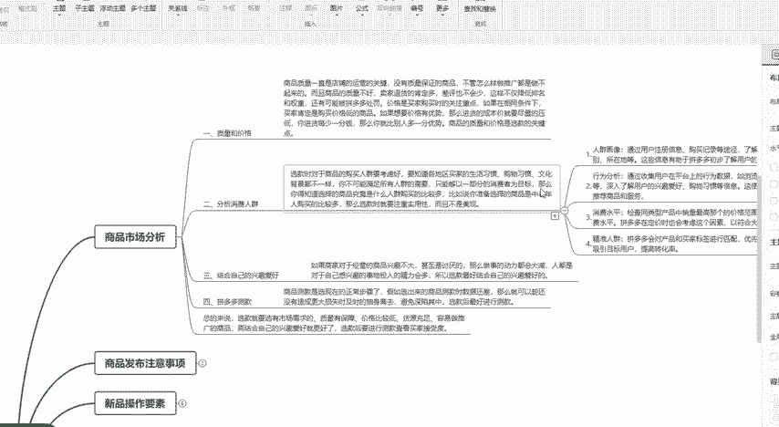
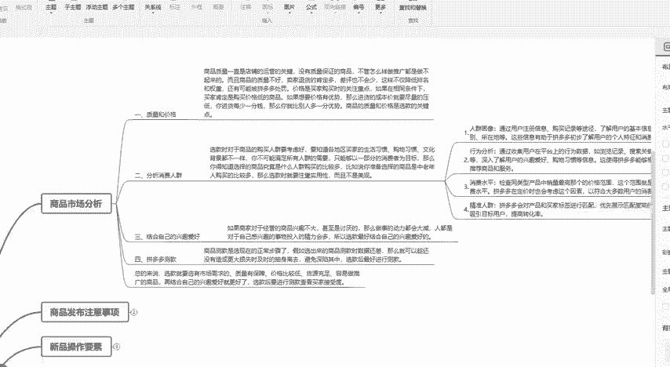
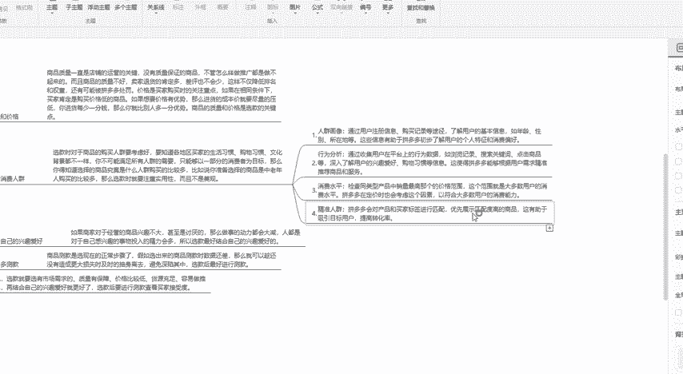
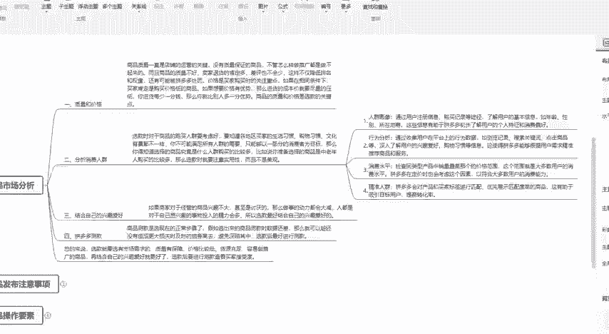
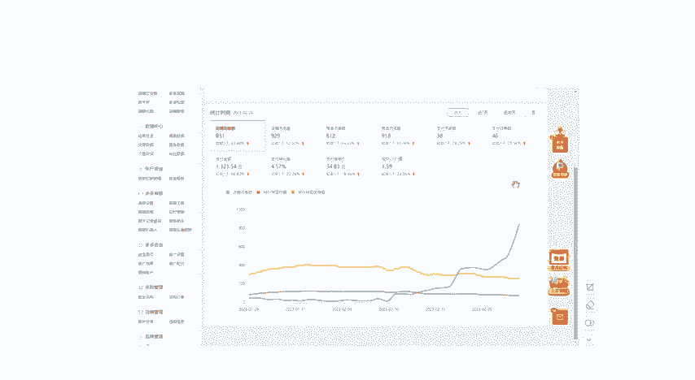
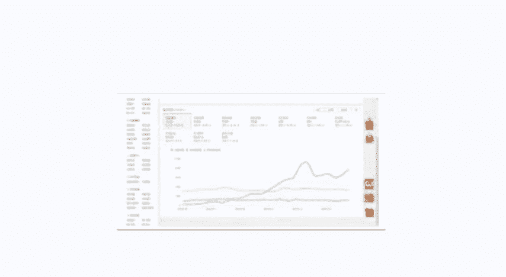

# 【拼多多运营实操教程】中小卖家拼多多开店打造新品全流程教学！跟着实操半个月，爆款成功率翻倍，快速实现日销300+单！ - P17：第17节：拼多多开店消费人群分析 - 拼多多-运营 - BV1UN2wY3E5W

这一期的课程比较长啊，我会把拼多多店铺的运营方式通过分成几个部分，然后给大家一一的进行讲解。其对于新手卖家和老卖家来说都是非常实用的。持续关注做拼多多不迷路。

这一节课我们主要是给大家讲解一下我们商品的市场分析，如何来分析消费人群。平常有很多新老卖家在做店铺的过程中，无论你做的时间长短。但是如果你操作的方式不对，这样店铺就不容易做起来。

其中一个非常重要的一个点就是我们选品的时候，一定要去分析这个产品的消费人群怎么去分析呢？我们需要从这几个点去出发。第一是我们要知道这个商品，他的买家人群的消费习惯。比如说我们是做一个女装的。

但是我们店铺进来的人群都是男性这样子的人群会有转换吗，肯定是不可能的。所以说这就是有很多新老卖家，店铺做不起的原因。无论你做的时间长短，只要你做的方法不对，你做的效果都是为零的。

然后除了我们的性别、年龄、消费习惯以及他的消费成绩，这些标签，需要做到店铺的标签和店铺进来的访客的标签统一的情况下，我们店铺的人群才是精准的。

然后我们怎么去分析？第一是我们的人群画像在我们的访客分析里面。说到这里，其实我就想问一个问题，有多少做过拼多多的卖家，无论你是新买家还是老的这个卖家，你知道怎么去分析这个拼多多的人群。

可能很多这个卖家都是不知道的吧。我们在这里去分析这个访客的消费人群，分析他的性别年龄以及他的消费成绩。第二是分析他的行为。比如说我们有的商品他的购买决策时间比较长，有的比较短，这是什么意思？

比如说我要去买一个临时，可能我都不需要思考，或者说思考30秒就够了。但是我要去买一个家具或者家电，我可能看了一眼，马上就购买了吗？不可能对吧？这个就是行为分析的重要性。

就是说根据我们的买家的这个购买决策周期来进行推送，以及来分析他的人群，这样子对于我们产品的转化，其实帮助就更大。比如说我们做。拼多多大家都知道，拼多多里面有一个多多搜索和多多场景。

像如果我们的购买决策比较短的话，这种产品这种类目我们就更适合去做多多场景。因为它是根据买家的兴趣标签来进行推送。然后推送之后，买家看到他就直接进行购买，而不会进行众多的这个比价，或者说是跟同行的对比啊。

或者说是再去考虑。这个就是。人群里面的行为分析。第三是我们的消费水平。消费水平其实它和我们的客单价是有这个同样的这个作用啊。就是说我们的产品如果你的产品是60780。如果你的产品是6780。

但是我们的消费人群都是进来的20到50这样子的人群会不会进行购买，肯定也是不会购买的。所以说消费人群和产品的这个客单价不符，会导致我们的转化率极低。第四是我们的精准人群的这个标签的匹配度。

我刚刚说了上面的三个标签，但是我们的匹配度越高的话，它的转化效果就越好。如果匹配度低，或者说只匹配一项，它可能有转化。但是这个就是完全是靠运气，而不是靠技术。所以说我们来分析我们的消费人群它的重要性。

这个就可以填出来的。

大家可以按照我所说的这个方法去操作，也可以嗯来跟我这个学习。我这里其实也有人在跟按照我所说的方法去学习，基本上也就是啊一个月或者两个月就直接把店铺做报了。比如说这一个店铺。

也是通过就是说一个月左右的时间，直接现在已经是做到了这个38个这个支付买家说，一般的话平均每天也就是五六十单的样子。另外一个也是按照我所说的方法去做的。现在哈也是基本上是做到了这个啊一两百单的样子。

然后除了啊说了这个数卷，大家可以直接在评论区有我的联系方式，可以直接找我领取这些学习资料。