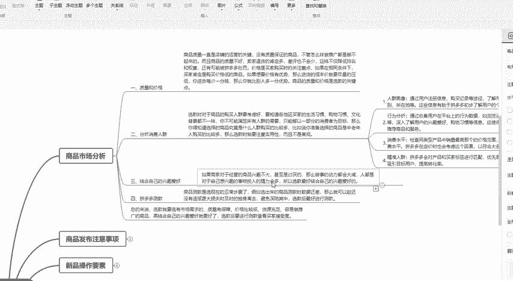
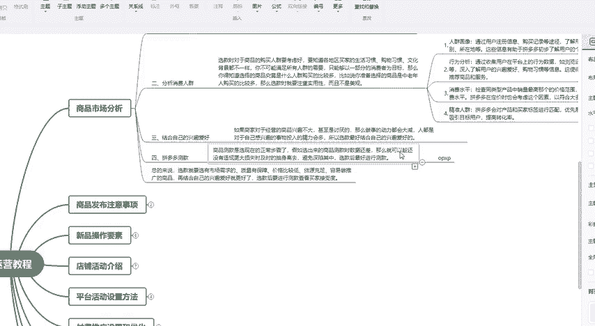
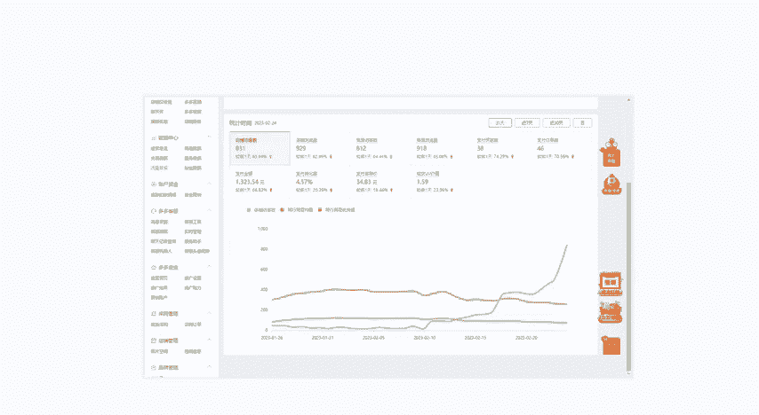

# 【拼多多运营实操教程】中小卖家拼多多开店打造新品全流程教学！跟着实操半个月，爆款成功率翻倍，快速实现日销300+单！ - P18：第18节：拼多多运营测款思路 - 拼多多-运营 - BV1UN2wY3E5W

这一期的课程比较长啊，但是你按照我所讲解的方法去操作，相信可以帮助你的店铺大幅的提升。持续关注做拼多多不迷路。接下来我会给大家讲解一下我们市场分析里面的拼多多去测款，怎么去测款。

其实对于一些新手或者小白卖家来说比较迷茫。对于一些做这个拼多多的老卖家，但是技术又不是很好的。或者说是店铺没有做出效果的，也是非常重要的一个点。那么我们怎么去这个做这个拼多多的测款？

首先我们选品的时候一定要非常重要。就是说我们去测款是根据什么测，就是说根据我们选的产品在这个产品里面找到一个更好的产品进行测款。但是如果说你选的品里面没有一个好的。

他测出来的数据都差这样子也浪费了这个时间，也浪费了你的这个啊金钱。所以说我们在选品我前面有讲到，我们要分析我们的质量和价格，要分析我们的分析这个消费人选，以及结合我们的这个个人爱好。

为什么要结合个人爱好。就是说你对一个产品或者说对一个类目，你没有什么兴趣，你肯定就不会花更多的时间去钻研，然后把这个店铺做的更好啊，前面的课程没有听到，可以直接联系我，然后我把这个课件发给你。

然后我们说到这个拼多多的这个测款，测款我们怎么去测？我们是通过我们的OCP叉去测。我们通过我们的OCP叉OCP叉相信有做过这个拼多多的这个。老卖家都知道这个工具类似于淘宝的直通车，它其中它是分为三种。

第一种是多多搜索。第二种是多多啊这个营销。第三是我们的全站。这个多多营销又叫做多多场景，它其实就相当于是我们的内容板块。也就是我们像我们平常打开这个拼多多的这个APP，它的首页或者说是其他页面。

它推送的这些内容就叫做多多场景也叫做多多营销。然后我们在拼多多上面买东西，我们可以直接通过关键词去搜索。这就叫做多多搜索。其实它的原理是购买广告位，让我们的商品强曝光给买家。那么我们需要根据我们的商品。

然后来选择我们通过哪种方式来测款。嗯，那么怎么去选择呢？比如说我们的产品我们要去考虑这个产品，它的买家的购买习惯。比如说我们这个产品是做一个连衣裙做女装的买家来购买这个连衣裙。

它是平常是喜欢通过搜索一个关键词来购买，还是说看到了有喜欢的，在刷拼多多的这个时候，看到有喜欢的，直接点击购买。它是哪种情况多一些。其实一般的话。拼多多一般它不同于抖音。

不同于这个小红书刷的这种情况还是比较少一点。所以说大部分的类目它是通过多多搜索来做这个这个测款。这个意思可以理解吧。所以说我们就需要通过多多搜索来做这个测款嗯。

把这个我们一般的话我建议是大家多选一些商品，就是说选择10到20款，我们在10到20款里面选3到5款优质的作为爆款打造。我们需要把这个款选好了选款的方式按照我前面所讲的方法选好之后。

我们就加入到多多搜索，然后进行测款，进行测款之后再根据数据，比如说这个产品啊，我们加入到测款里面，它的转化率非常的高啊，然后它的这个询单呢，或者说是意向客户比较多的话，就说明这个产品比较好。

我们就继续去做它的这个出品单去做它的改销量，或者说是通过其他的渠道去搜索去报名。活动这样子来打造爆款，这就是我们做这个拼多多测款的这个方式啊啊。

我这里其实也有啊，就是说按照我所说的方法来做起来，店铺，基本上现在有的店铺每天现在有几十单的这个销量，有的也有几几百单，或者说是更多的这个销量。

其实你只要按照我所说讲解讲解的这种这一套整套的这个方法去做店铺，基本上都是可以做起来的。然后我这里也准备了一些呃学习的资料，可以直接在评论区加我的联系方式找我领取就可以了。

