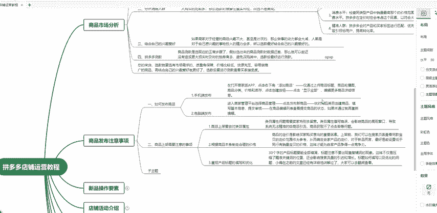
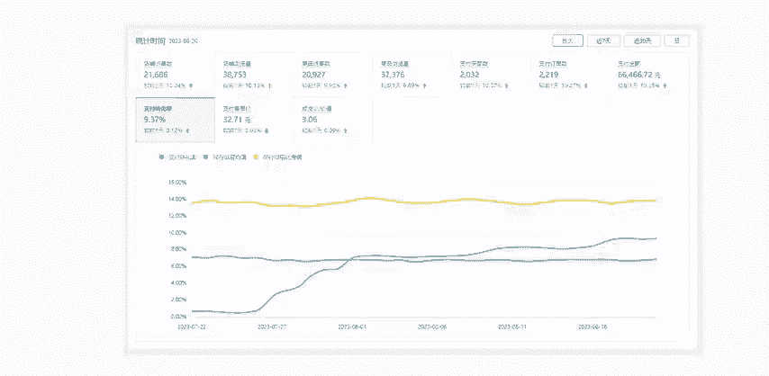
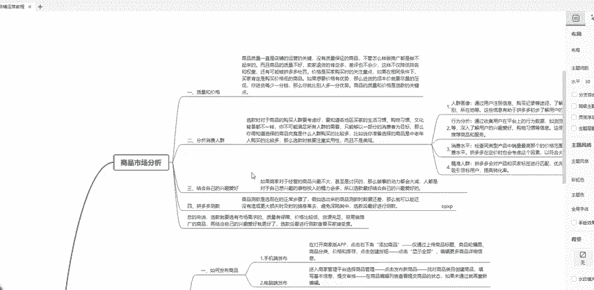
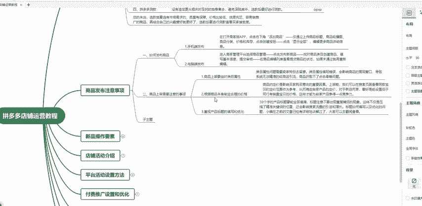
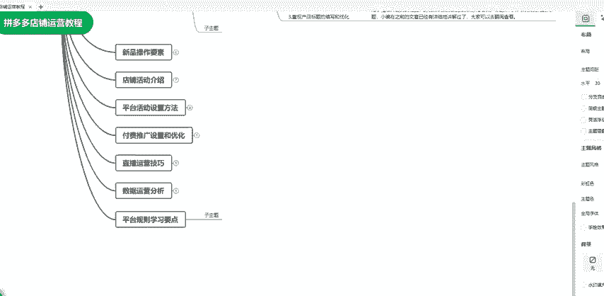

# 【拼多多运营实操教程】中小卖家拼多多开店打造新品全流程教学！跟着实操半个月，爆款成功率翻倍，快速实现日销300+单！ - P19：第19节：拼多多开店发布商品操作 - 拼多多-运营 - BV1UN2wY3E5W

这一期的课程比较长。但是你如果按照我所讲解的这个方法来做店铺的话，你的拼多多店铺会大幅的提升。无论是新手小白还是老卖家，只要是按照我这套方法来做，都是可以把店铺做起来的。

接下来我会按把这个拼多多整体运营思路分成几个板块来进行讲解。每一个板块针对的点不同，你只要按照我说的方法去做就可以了。这个方法也非常的简单，持续关注做拼多多店铺不迷路。嗯。

这一节课啊我们主要是讲解一下商品发布的注意事项，有很多同学啊，尤其是一些新手小白做拼多多店铺的时候，发布产品不知道该怎么去发。有很多是用什么一件复制的工具，或者说是一些工具去做快速铺，其实是不好的。

为什么呢？因为我们如果通过一件铺虽然说速度很快，但是他发布的这个产品啊，其实它的权重是会受影响的。所以说我们去发布最好的方法就是用最传统的方式，也是拼多多它的平台建议我们的方式。

去通过手机端或者说是电脑端去发布产品。那么怎么去做呢？我们这里来说一下，我们做拼多多的店铺去发布产品有两种方式，第一种是通过手机端，第二种是电脑端。其实通过第三种就是软件用这种一键负责工具去发布。

这个不是我建议的方式，也不建议这个新手卖家去做。因为你做新手卖家，你除了把拼多多店铺做起来，你最重要的一个点，还是你要学会方法。所以说你去做这种偷懒是没有任何意义的。第一个是用手机端去发布手机端。

我们打开这个商家版的APP，不是我们买家版的在这里点击添加商品。然后在这里我们需要添加商品的标题，商品的主图轮播图，然后我们要选择商品的分类，然后设置价格和库存，把这些都上传进去之后就O了。

点击完成这样子我们一个商品就添加成功了。如果是我们的PC端的话也是一样的。在我们PC端的后台点击商品管理，点击发布新的商品。在这里我们选择创建类目注意一个点，就是我们在做拼多多店铺的时候。

放类目一定要放正确类目，不要去听网上说说什么错放类目。这样子其实它会对我们产品的流量产生影响。除非就说你是做一些就是说类嘛这种伪禁品的类目，你要把它的产品放到其他的。正常类目去，你这样可以错放类目。

但是我们平常对于一些新手小白来说，我们是你卖什么产品，我们就放什么类目。如果自己不知道应该放什么类目了，你可以直接输入你的产品名称，系统会根据你的产品名称来给你推荐我们产品应该放到哪个类目。

这就是我们做拼多多发布产品是你做一个店铺的第一步操作，我们第一步操作如果说做错了的话，店铺就很容易做不起来，这也是有很多这个新手小白在做拼多多店铺做了一年半载或者说多做了几个月。

店铺一直没有做起来的原因，就是它的第一步就已经做错了。所以说我们做这个商品的发布，一定要去注意。后面我会讲解我们发布商品以及上架需要的注意的事项啊，其实我这边也有很多就是按照我所说的方法来做。

把店铺做起来，像我们这个店铺啊，也是通过我这个整套的这个做店思路，把店铺现在已经做起来。

这个支付金额的话，一天的话也是好几万的这个支付金额啊，除了这个之外，我们另外一个店铺也是把这些。产品啊基本上都是卖的卖爆了的。所以说你只要按照我所讲解的这一套的方式去做的话，我们是完全可以把店铺做起来。

因为我这一套的这个思路，并不是说只是针对某一个点去讲。因为我前面也讲解过我们商品如何做这个市场分析。这一节我们是讲解这个商品的发布注意上，以及后面的我们新品操作店铺活动。

以及我们的付费的玩法和直播的技巧，这些数据分析，我都会做一一一的讲解。唉，就是说如果说想要就是说把拼多多店铺做好，其实可以直接在评论区联系我的方式。我这里有准备了一些课件资料啊。

像我们拼多多的整体的玩法，以及它需要啊的一些操作的这个计划。我这里都是有做准备的，可以直接加在评论区联系我的方式，直接找我领取就可以了。

