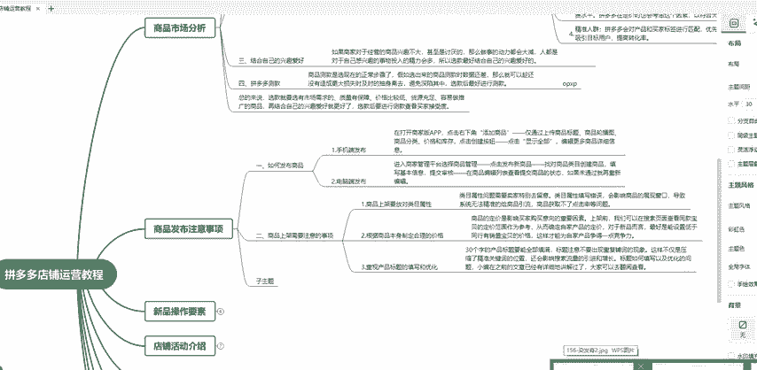
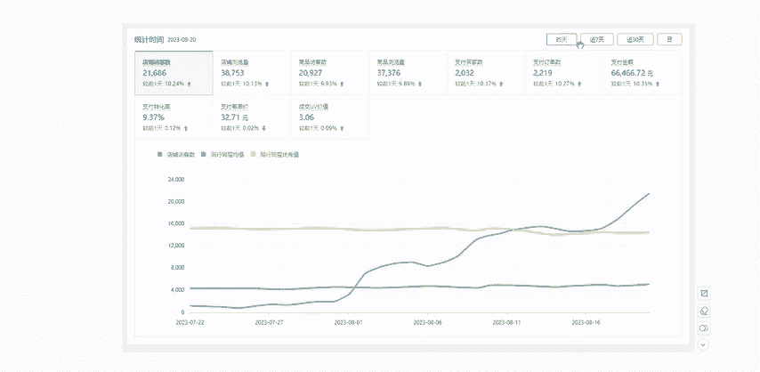

# 【拼多多运营实操教程】中小卖家拼多多开店打造新品全流程教学！跟着实操半个月，爆款成功率翻倍，快速实现日销300+单！ - P20：第20节：拼多多商品上架注意事项 - 拼多多-运营 - BV1UN2wY3E5W

这一期的课程比较长，但是无论你是新手小白还是老卖家，只要你按照我这一套的方法去运营拼多多店铺，都是可以把店铺做报的。因为我前面也有按照我这套方法做起来的这个学员。啊只要是完全按照我所说这套方法。

都是可以把店铺做报的啊，持续关注做拼多多不迷路啊。这一期我主要是会把我们拼多多整体店铺运营的啊这个几个思路，我分成几个点来给大家进行讲解啊，这一节课我们来讲解一下我们商品发布的注意事项。前面我说过。

如何去发布商品，其实这个也是我们做拼多多店铺的基础。如果你连发布商品都不会的话，你这样子做店铺怎么可能做得好呢？所以说我们把商品发布之后，我们需要来说一下我们商品上架的注意事项。

我们发布商品并不是就直接上架了。我们需要先发布到仓库里面，然后做相应的优化之后再把商品上架，然后才开始卖。第一个点就是我们商品上家要放对类目属性，有很多这个新售小白对商品的类目还不是很了解。

也不知道我们这个产品应该放到哪个类目。因为说有很多这个同行，它的这个类目并不是放到同一个类目里面的啊。比如说我们的一些百货类目，他就可能放到不同的类目去。

但是我们怎么去选择一个最符合我们这个产品的类目来放呢。第一种方式就是我们去看同行的这个类目是放在哪个类目。第二种就是根据我们的竞品。如于我们做店铺不能够盲目的埋头自去做，我们一定要选择一个合适的竞品。

我们作为参考，看到他把这个产品放到哪个类目，我们也放到哪个类目去。因为我们选择同样的赛道去做的话，我们就需要放到不一同样的这个产品类目去。第一就是商品的内幕。第二就是商品的属性。

有很多这个啊新手小白在做店铺过程中，这个属性有的是空白的，有的是没有填写。其实属性对我们产品的影响很大。什么意思呢？就是说系统啊，它会根据属性来匹配精准人群。如果你的属性写的错误，或者说是没写。

如果你没写的了，系统不知道你需要什么样的人群，他就会给你随机的匹配人群。如果你这个属性写错了的话，他就会根据你错误的属性来匹配错误的人群，这样子就会导致你的店铺做不起来。

这也是有很多这个老卖家做了很长时间做了这个啊几个月或者说一年的店铺都没有做报道原因。第二是根据我们商品本身来制定合理的价格。我们做拼多多不同于淘宝啊，因为淘宝有很多它的都可以做到这个不同的这个价格。

然后也卖的很好。但是我们拼多多。因为系统它会考核我们产品的价格力什么叫做价格系统它自动就会针对你这个产品来找同行的同款产品，然后看一下我们的价格针对于同行的整体来说，在一个什么样的水平。

如果说同行都是卖3。5块6块7块，你一下卖个三五十。这样子就完全没有价格力，这样子吧啊这个拼多多它的系统是不会给你分配很多的这个流量进来的。所以说我们要考核我们的这个产品啊的价格。

我们一定要把价格设置到高，就是说我们这个产品的价格一定要比同行有优势。这样子你的流量会更多，并不是有很多这个老卖家没有做起来，老卖家觉得哎这个价格大不了就是买家看到不买，其实不只是这。不简单。

系统也会根据这个价格，没有价格低的话，不会给你分配更多的流量。第三是注重我们产品的标题填写和优化。为什么呢？因为我们无论是做拼多多还是淘宝还是京东，还是我们现在的抖店，除了抖店稍微有点特殊抖店。

因为它是做内容营销的嘛，其他的三个传统电商，它的流量主要来源一定是搜索，就是买家是通过搜索来找到宝贝的，所以说标题的重要性就是在这里了。因为买家要搜索了，它搜索的词一定是你标题里面包含或者说是相关的词。

如果是不相关，它是搜索不到你这个宝贝的。所以说我们的标题一定要是选择符合我们产品的词，并且要选择多一些的蓝孩子，什么叫做蓝孩子，这个蓝孩子就是说有很多人搜索，但是有很少的卖家去使用。

这个就叫做蓝孩子这样子的词对我们来说帮助就很大。然后呃这个就是我们商品上架的注意事项。嗯，其实我这里也有就是说按照我这套方法做起来店铺像这一个店铺，现在也是按照我这套的方法做了几个月的时间。

现在店铺的话反客已经是上万了，然后支付金额的话也是几十万的支付金额。这个店铺就是说完完整整的按照我这套的这个玩法去做。然后把这个啊店铺做报道啊。

然后我这里啊就是有很多这个啊新手小白的卖家不知道拼多多店铺该怎么运营。如果你不知道你可以在评论区联系我的方式啊啊，然后我这里准备了一些拼多多的这个运营思路，以及我们前期的操作计划数据分析的这个啊技巧。

你可以直接在评论区联系我，然后找我免费领取就可以了。

