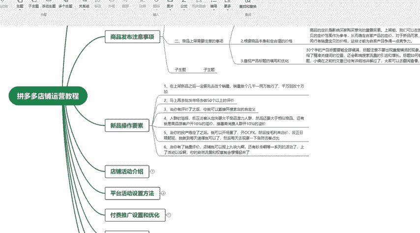
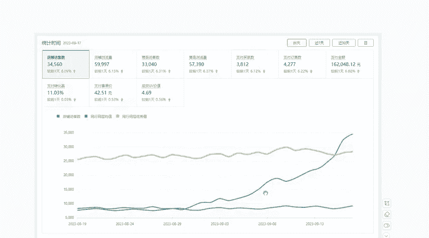

# 【拼多多运营实操教程】中小卖家拼多多开店打造新品全流程教学！跟着实操半个月，爆款成功率翻倍，快速实现日销300+单！ - P21：第21节：拼多多新品操作要素 - 拼多多-运营 - BV1UN2wY3E5W

这一期的课程很长，但是你只要是按照我这一套方法来做拼多多店铺，无论你是新手小白，还是说做了很久店铺没有做起来的啊，这个小伙伴都可以直接把店铺做成爆款店铺。

我后面会把拼多多店铺运营的知识分成几个章节进行讲解。然后每一个章节我都会详细的去说这个操作该怎么去做，然后怎么能够快速的把店铺做起来。这一节课我们讲解一下新品操作的要素。当我们的产品上架之后。

一定要去做它的数据。然后这样子拼多多的系统才能到给到我们店铺的流量。那么我们在这个新品上架之后需要怎么去做呢？我给大家分了几个步骤。第一个步骤，我们新品上架一定要去做的一个点就是改销量。

有很多这个做拼多多的小伙伴还不知道怎么去做改销量，不知道的，可以在评论区加我这个是免费直接教你这个方法直接去修改拼多多的方法。然后你学会了这个方法之后。

你做任何的产品都可以直接去直接修改拼多多的这个宝贝销量不用去找别人也不用去花钱去做我们的啊销量啊就是说我们一般的话可以把它改到几千到一两万就行了。如果啊是比较大的店铺，或者说你店铺本身有产品卖的比较好。

然后我们要上一个新款，你可以稍微再改大一些。但是对于一些新手小白啊，就说你的这个店铺刚刚才开始做，你直接改个10万加的销量，这个也不现实，而且看起来特别的假，所以说我们一定要量丽。而行。

第一就是我们的改销量，是我们做拼多多的商品必须要做的一个操作，也是每一个拼多多的卖家必须要会的一个技能非常的重要。然后我们把销量改了之后，我们该怎么去做呢？销量改了之后，我们就应该去做我们的出评单。

什么叫做出评单？就是类似于淘宝，它要做好评晒图一样的。我们做拼多多商品一定也要去做评价。如果你没有评价的话，你没有能够说服买家来购买你产品的这个功能啊。所以说我们要把这个评价做一下，评价的话就做好评。

但是有一个问题就是有很多小伙伴，尤其是一些新手小白才刚刚接触到做这个拼多多店铺，你没有手里没有资源。其实对于一个卖家而言，你手里没有操作资源，你这个店铺做起来就已经非常的难了。

那么需要拼多多的这个做出行单的资源，可以在评论区加我的联系方式，我也是免费分享给大家，也是我自己在用，或者说我。带的一些店铺在用的一个非常的优质的资源，我们需要去做多少呢？我们不需要做太多。

因为这个是需要考虑到成本的。对于一些新手小白来说，你前期的投诉资金有限，你不能够去支持你做太多的这个出品单，我们做多少呢，做50以上就行了。做50到100，这个不贵啊，其实做出平单的话。

做50到100的出评单，价格其实非常的低。一般的话就是说做兼职的学生党都可以做到的。然后我们把这个出行单做出来，显示出来之后，我们要自己去看一下这些评价有没有显示。因为有的不靠谱的资源。

他做的出行单会被系统过滤掉。就相当于说评价它不显示出来，自然不显示出来。那你做它的意义是什么。所以说没有显示出来就等于没有。所以说你这样子你就就等于白做了，我们要去检查一下这个评价有没有显示出来。

当你的评价显示出来，我们这个产品才正式的开始做推广。这个时候，我们需要介入我们的OCP叉，或者说是自定义的推广，通过这种方式来提升我们产品的流量。这个是我们新品操作的前面一半需要做的这个内容啊。

像我讲解的这一套方法，其实有很多店铺也是按照我这套方法去做的。比如说我现在截图的这个店铺，按照我所说的这个方法做了几个月的时间。

就直接把这个店铺的支付买家干到了1000家的支付买家平均就是说每天都是在1000家，最低的也是八九万，然后这个支付金额也是好几万的这个支付金额。所以所以说只要是按照这套方法。

无论你是新店铺还是老店铺都可以做啊，像另外一个店铺也是按照这一套方法来做了，就是说小半年的时间把这个支付买家数干到了这个3800，然后支付的金额就非常的大了。这个我们这边就不做了。

然后支付的指定量数也是4000多。

所以说这个店铺可以看出这个曲线都是从低到高的一个差不多是有坡度的上升的这个趋势啊。其实只要你做这个拼多多店铺，只要是你用正确的方法去做的话，都可以做到这个效果。

另外我这边也准备了一些拼多多的这个做店铺的干货啊，可以直接在评论区加我的联系方式找我领取，这里有做拼多多的不同的玩法，比如说我们的OCP叉该怎么去设置，怎么去优化。比如说我们店铺的整体运营。

该怎么去规划，还有这些基础的知识点。比如说我们的啊这些做推广的它的原理介绍，它的功能介绍，我这里都准备了一些学习的资料，可以直接在评论区加我的联系方式找我领取就可以了。

