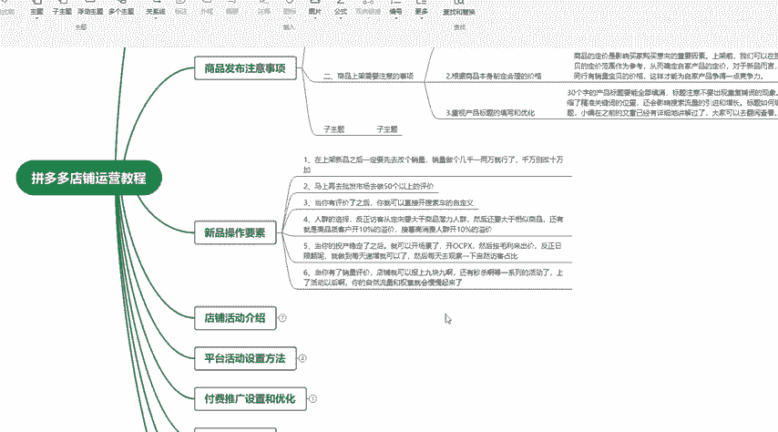
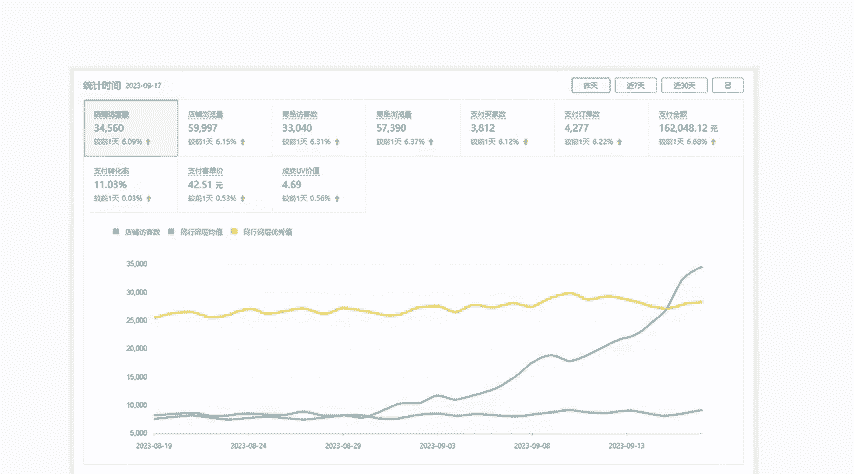

# 【拼多多运营实操教程】中小卖家拼多多开店打造新品全流程教学！跟着实操半个月，爆款成功率翻倍，快速实现日销300+单！ - P22：第22节：拼多多新品多多推广 - 拼多多-运营 - BV1UN2wY3E5W

这一期的课程比较长，但是这一期的课程全是干货分享。对于一些新手小白，或者说是做了很长时间，店铺，但是没有做出效果的，都可以按照我这套啊做拼多的店铺思路去操作啊，持续关注做拼多多不迷路啊。

这一节我们还是啊来讲解一下这个新品操作的要素，前面我给大家讲解了新品操作，前面要去做这个改销量，要做出品单，以及我们要开这个车去做推广。然后这一节我们要重点讲解一下这个车该怎么去开。

其实有很多新手小白呀啊，他都不知道我们开车的目的是什么，以及它的原理是什么？我们这里就着重来讲解一下。首先我们开车啊它主要的作用就是提升我们的产品曝光。什么叫做产品的曝光？

就是让我们的产品被更多的买家看到我们开车的前期你作为一个新品，你不可能说直接就提升转化是不可能的，也不现实。所以说我们前期要做，就是说让首先让更多的买家能够看到我们的产品。

他能够看到我们就已经达到我们的目的了。他就说就算不购买，他只看到的话，我们前期要达到的目的就已经到了。为什么我们要这样做呢？有很多这个小白，他不知道他说你只是给买家看，他也不购买，那我们岂不是亏了。

其实你如果这样想的话，你的这个拼多多店铺永远都做不起来。因为你要去想一下我们的拼多多系统给我们分配流量的原理是什么。无论是做拼多多还是做任何一个电商平台，它系统分配的原理，就是说优胜劣汰。

什么叫做优胜劣劣汰呢？就是你的产品越好，他越愿意分配给你流量。如果你的产品越差的话，他越不给你分配流量，他并不会联系你也不会可怜你。而是说你能够吸引到他，你能够就说让他满意。

他才会来更加的给你分配更多流量，就类似于一个锦上添花的作用。所以说我们新品前期是没有曝光，没曝光，我们就通过付费推广来拉曝光。

这样子让更多的买家来点击来看到我们的产品这样子让系统觉得哎我们这个产品可以因为有这么多人点击，有这么多的这个数据积累，而且数据提升的速度非常的快。这样子让系统觉得我们这个产品是一个好宝贝。

这样子系统才能够给我们分配更多流量。这就是这个系统给到自然流量的曝光的原点。那么我们作为一个拼多多的这个新品，我们的目的。肯定是提升更多的自然免费流量。

但是我们需要操作的并不是说你直接去提升自然免费流量，你直接提升是提升不上去的。所以说我们就要来弯道超车，我们通过付费推广来带动免费流量的提升。然后我们平常开这个OCP它有两种啊，第一种是多多搜索。

第二种是多多场景，我们要需要区分一下，我们什么情况下需要用到多多搜索，什么时候需要用到多多场景。比如说我们要去琢磨我们自己卖的产品，他的意向客户，就是真实买家，他的购买习惯。

他喜欢是通过逛的方式来购买我们的产品，还是说想要通过搜的方式来。购买我们的产品。比如说我这里举个例子，比如说我们是卖这个女装的小零食，这种的话，其实它就更适合多多场景。

因为很多买家他并不是今天非要来买一个这个产品才来购买，而是他在逛的同时，他看到了，觉得喜欢就直接购买了。如果你是卖家具的，或者说是卖一些工业品的这种的话，他肯定不可能说这些客户是通过逛的方式来购买。

它都是直接来搜索它的目的性非常的强烈，他直接来搜索。这个时候我们就开多多搜索，这就是它的区别。然后我们把这个开起来之后，我们需要去调价，让他有自然的展现。如果说没有自然的展现的话。

我们就需要把这个出价提高这样子我们的展现量上去。这个周期一般的话，我们要开一周左右的时间，就是7天7到10天都是可以的。我们通过开7到10天。这个时候我们的付费流量，他其实他的曝光是稳定的。

因为我们每天把钱花出去，他一定是有足够的流量。才能够把我们这个钱花掉。如果你没花出去了，你就应该提价。如果你花出去了，我们的目的就已经达到了。就算没有一个转化，目的都已经达到了。通过这个周期操作。

我们会发现我们的免费流量啊，它就会开始有这个提升了。而且由于这个新品有系统的扶持。所以说我们的免费流量提升还是比较快的。这个时候我们这个宝贝它由于我们前面是做了这个促品量呢，有销量，有流量的时候。

它就会开始有真实的转化。后后续我们就可以去报名一些活动啊，像这种9。9块的秒杀啊，或者说是其他的活动，我们就把它报起来。然后随着自然流量和自然转化的提升我们的宝贝的啊这个整体权重和自然搜索的访客。

也会进步的提升。这个是我们新品前期要做的整体的操作思路。原理哈其实就是我们通过付费带免费，我们通过前期把基础的数据做上去，然后通过付费带免费的方式，把免费流量做一定的基础之后，再报活动，放大免费流量。

这就是我们新品操作的这个要素。当然我后面也会讲解我们爆品打造。因为这个新品操作，你这样只能够让我们的新品有正常的流量和正常的真实成交。但是你要做到爆款的话，其实还有更多的路要走啊。

我们还有更多的操作要做。

像按照我这套方法，其实做起来店铺也很多，像这一个店铺，按照我这套方法做了也是呃小几个月的时间，把我们店铺的这个支付买家数做到了1000家，然后的这个支付金额也做到了这个5万加。除了这个之外。

我们另外一个店铺是按照我这套方法做了小半年的。这个支付买家数干到了3800，然后支付金额就有点大了。我这里就不说了。所以说只要你按照我这套方法去打造店铺基本上都是可以做起来。

不说百分之百至少是95%以上的这个概率是能够做起来的。然后我这里也准备了一些学习资料啊，包括我们的做拼多多店铺的玩法，以及我们的系统考核的点，还有我们做店铺的，包括店铺的装修啊。

或者说活动的报名啊以及一些拼多多的一些黑科技的玩法，都可以直接在评论区联系我，直接找我领取就可以了。

