# 【拼多多运营实操教程】中小卖家拼多多开店打造新品全流程教学！跟着实操半个月，爆款成功率翻倍，快速实现日销300+单！ - P23：第23节：拼多多运营秒杀活动 - 拼多多-运营 - BV1UN2wY3E5W

hello，各位小伙伴们，大家好，欢迎来到我的拼多多系列课堂啊。那么今天由我巨黄教育的西罗老师带大家认识一下拼多多的秒杀活动。首先我们先来了解一下秒杀活动到底能对于我们的店铺呢能带来什么样的一个好处。

首先。

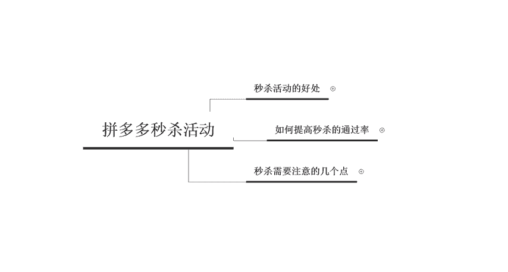

在秒杀活动呢，它的呃好处主要有3个。第一个呢是高流量。拼多呃这个秒杀活动呢是在拼多多首页里面的第一个啊有千万级的一个流量，也是拼多多流量以及转化率最好的一个频道之一，售罄率可以达到595%以上。

那么第二个好处呢是搜索排位会上升啊，这个呢可以强行的提升我们商品的一个权重啊，保持我们商品搜索排位的一个上升。呃，也就是说它的一个销量呢是计入到搜索位里面的。第三个是可以晋升首页。

那么我们这个秒杀活动呢可以把商品的销量推的很高啊，也可以把销量给推报，只要满足商品评分和销量的一个要求，就可以立刻让商品直接上首页。那这个呢是秒杀活动所给我们的商品带来的一些好处。

那么我们在实际操作的过程中，如何来提高秒杀的一个通过率呢？

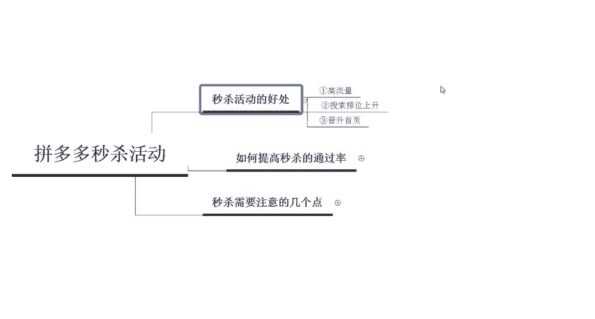

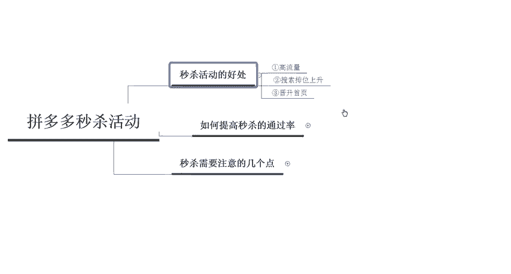

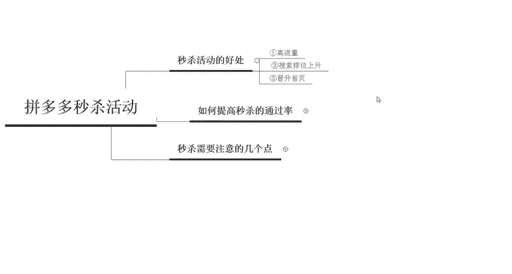

首先第一个啊，我们要先控制商品的一个啊标题。那么在写标题的时候呢，主要通过几个方面啊，第一个呢是材质。那么在材质里面呢啊会可以填写啊我们面料的一些棉质或者是标题头部啊突出的时候呢，用这个大括号啊。

那么第二个呢是规格啊，因为我这边这个篇幅有限，所以说只给大家写了一个啊，第二个是规格。比如说我们的产品呢是单件套还是说套装还是两盒装。那么这个呢你也要写在标题里面啊，第三个呢是服务啊，服务里面。

比如说顺丰到家上门安装或者是赠送一些教程。那这种呢也属于服务的一些。

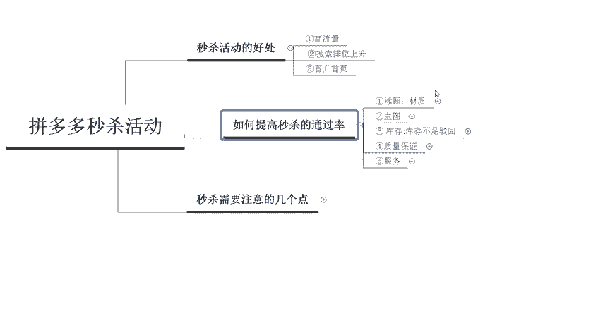

内容你可以直接写在标题里面呃，第四个是卖点啊，比如说我们赠送腰带或者是买一赠一啊这一类的啊，第五个呢是品牌，有品牌的可以重点突出品牌名称。那么这个呢就是我们在上秒杀的时候，标题所需要注意的一些地方。

那么第二个呢是主图，在主图的呃设设置的时候呢，首先你要保证清晰展示商品的一个主图图片呢啊要质量要干净啊，就是说背景呢啊要必须要有一些美感的这个。啊，必须要有美感啊，不要有最呃不要有太多的一个文字。

牛皮癣，不允许我们的这个图片中出现文字啊，这个点是非常重要的。那么第三个点呢是呃库存不足啊，如果说你商品里面的库存不足的话，啊，会影响到你的一个秒杀啊上秒杀的一个通过几率啊。

不同的SKU商品库存必须要保持均衡，畅销款的一个库存必须要充足啊，比如说服饰类啊，服饰类的话，小码到大码啊，这个库存都要足。畅销的款式呢库存多啊更容易通过。

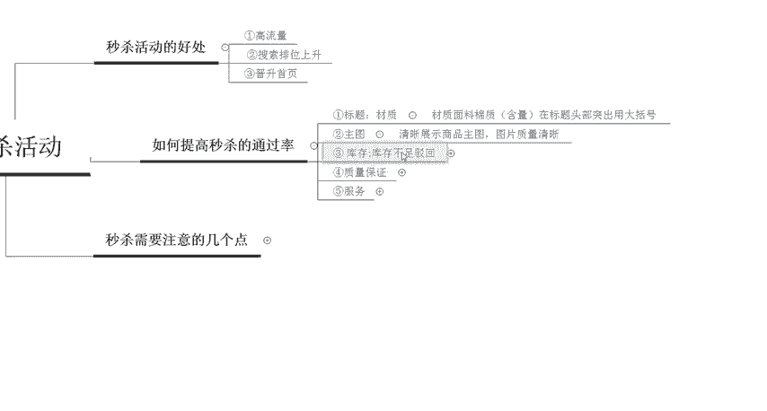

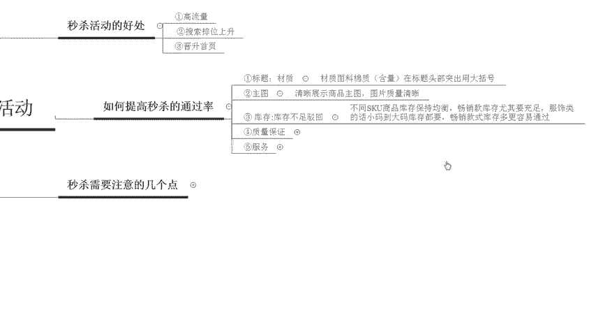

那么第四个点通过的这个呃提高秒杀通过概率的第四个点呢是质量上面的一些保证啊，也就是说啊如果说你在呃商品的这个展示下面呢有这个评价。那么如果是好评直接就会通过。如果是中评可能就会呃驳回。

如果是差评也会被驳回啊，这个只是说我们漏出来的一个一些评价啊。如果说已经被屏蔽掉的评价，那是没有关系的啊，是没有关系的那最后一个呢就是服务在服务里面呢，主要就是发货及时啊，然后客服的一些回复要及时啊。

对应的啊应对应对一些这个不佳的一些评价的时候呢啊以及优化之后啊，然后要有这个提报啊，如果说有不好的这个评价呢，建议在下面啊，一定要去回应他们啊，比如说我们的产品怎么怎么样。

或者是你可以找这个客服随时解决你的问题啊，这之类的。

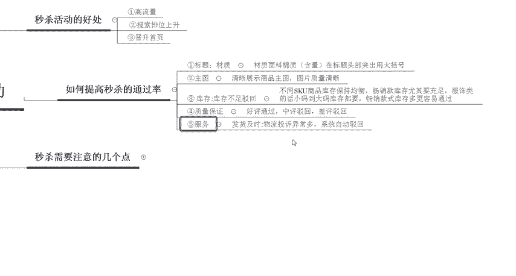

好，那么以上呢就是如何提高这个秒杀的一个通过率。那么最后呢我们来了解一下秒杀活动。上活动的时候呢，需要注意的几个点啊，主要有3个。第一个啊秒挂的一个原因啊，就是说我们的一个产品呢上了秒杀活动呢。

有可能你在一呃，比如说你报了1万多的一个货值必须在两个小时内必须要卖完。2万以上的一个货值呢必须要在4个小时内啊售完。就是说你的GMV要达到2万啊，主题秒杀的时长呢一般是6个小时啊。

货值一般都是5000。

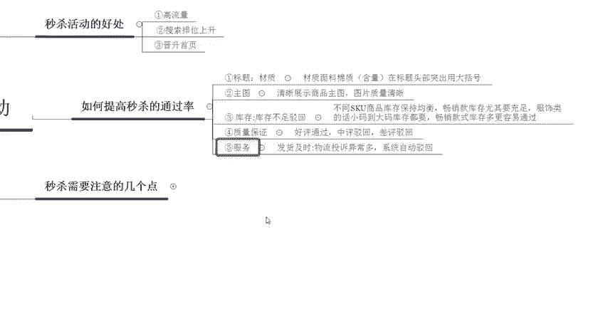

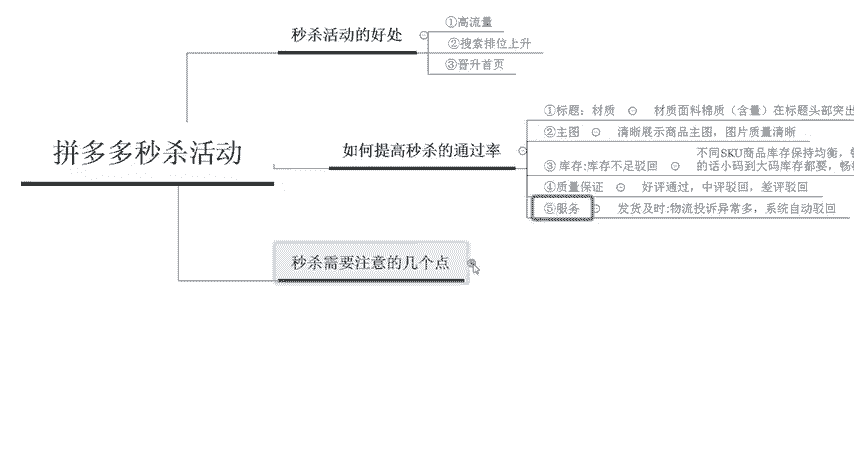

卖的越快，在秒杀中排名越高啊，所以说你可以直接呃找一些账号去拍去秒啊。然后那个第二个点呢是不需要自己去改价的。活动结束之后呢，只要你的线上的库存是充足的。然后系统会自动切价啊，自动切回你商品的一个原价。

所以说不需要你自己频繁的去改动价格啊，改动价格会影响宝贝的一个权重的啊，然后第三个就是秒挂的一个影响。如果说你上秒杀活动，直接啊秒杀的一个效果不好的话，它会把你关进小黑屋啊，只是说权重不会增加。

但是说后期提报的时候呢啊需要换换款式来提报这个链接，基本上就废了啊，就是上不了这个活动了啊，他们会参考这个之前的一些呃数据啊。

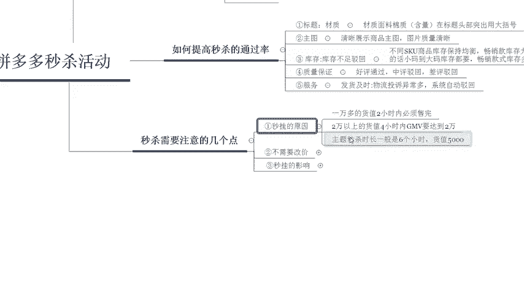

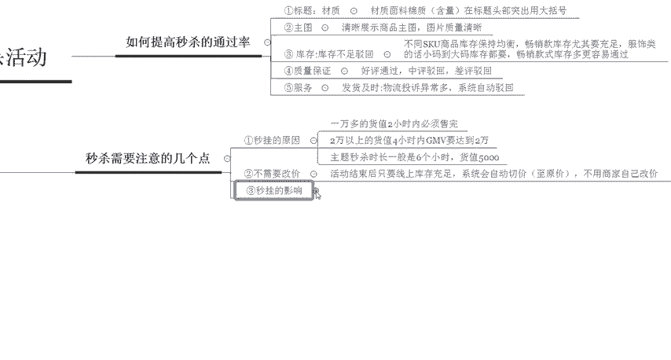

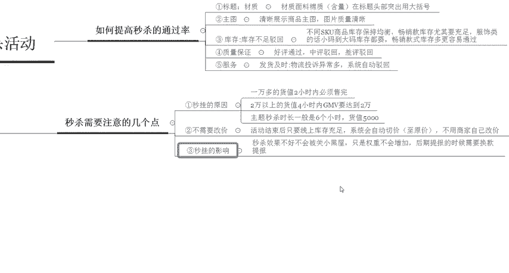

那么以上呢就是我们对于拼多多秒杀活动的一些了解啊。那如果说大家有任何不理呃，有任何不理解的地方，欢迎大家私信我啊，然后我也会定期在这个平台呢更新和分享更多的拼多多干货的一些内容。那么现在私信我。

还有拼多多的一些干货大礼包领取哦啊，感谢大家的观看再见。

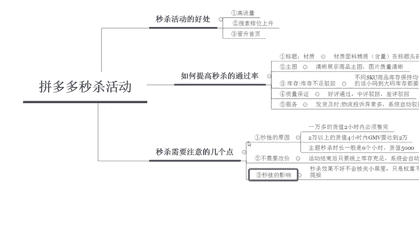

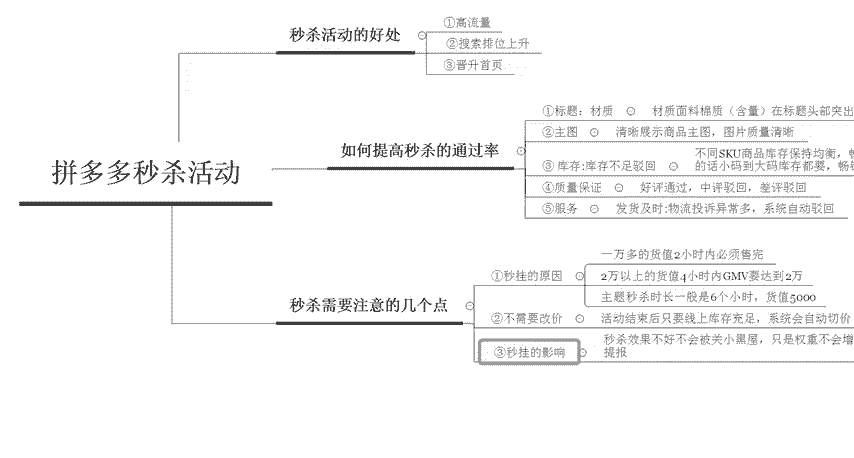