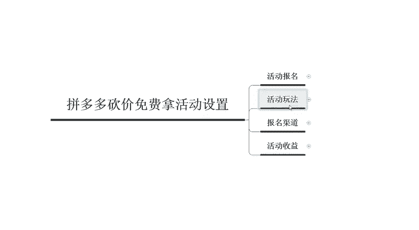
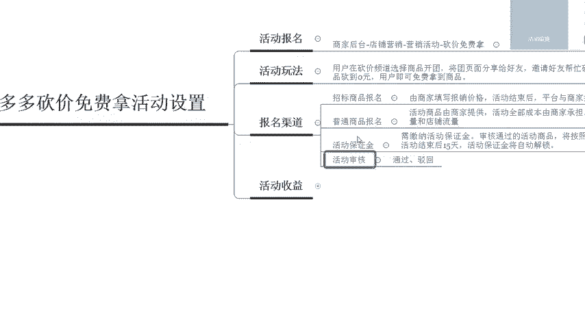

# 【拼多多运营实操教程】中小卖家拼多多开店打造新品全流程教学！跟着实操半个月，爆款成功率翻倍，快速实现日销300+单！ - P24：第24节：拼多多砍价免费拿活动设置 - 拼多多-运营 - BV1UN2wY3E5W

Yeah。hello，各位小伙伴们，大家好。首先欢迎大家来到我的拼多多系列课堂啊，那么今天将由我巨黄教育的西罗老师带大家认识一下拼多多砍价免费拿的活动究竟应该如何来设置啊。

首先我们先来了解一下拼多多砍价免费拿的一个呃活动报名的一个具体的一些事宜。

那么么我们必须在这个商家后台店铺营销，然后找到对应的这个营销活动，然后找到砍价免费拿的活动啊。

我这边呢有一个这个后台数据的一个截图啊，但是说因为现在拼多多后台的一些呃系统上面规则上面的一些改变，很多的商品呢都没有办法参加了。现在目前针对的是农产品或者是多多果园类的啊，免费砍价。

免费拿的这个活动呢，还可以在正常进行。那其他类目呢会有呃不定时的一个开放啊，那么第二个呢，我们来了解的是这个活动的一些玩法，到底是应该怎么样来玩的。

就是简单的就是说呃用户呢在砍价的这个频道呢选择一个商品来进行开团。然后呢会把这个开团的这个页面呢分享给他的一个好友，然后邀请好友呢帮忙进行砍价。如果说把这个价格砍到0元的话。

然后这个用户就可以免费的拿到这个商品，就相当于是免费送的一个这样的一个方式啊，但是说这样的一个活动呢，呃给我们带来很大的一个收益呢，就是说。

啊，想要让他的一些呃消费者的亲朋好友去帮忙去进行砍价。所以说我们产品的一个曝光量呢也是会非常大的。因为他们都会不断的去进行分享啊，那么我们在报名的时候呢，报名的渠道到底都有哪些呢？重点是分为两个啊。

第一个呢是招标的一个商品报名。第二个呢是普通商品报名啊，我们在真实报名的时候呢，可以自己来进行选择啊，招标的这个商品报名呢是必须要由我们商家来填写报销的一个价格。然后活动结束之后呢。

平台会跟商家按照报销的一个价格进行报销结算啊，这个报销的一个价格呢，就是说啊我们产品呢砍价的时候应该是多少钱啊，比如说我们砍价的时候呢，是100块钱。那你砍完这100块钱呢，这100元呢。

就是属于一个报销的一个价格。那普通商品的一个报名呢也是由我们的这个呃活动商品呢是由商家来进行提供的啊，而且呢活动全部的成本由商家来进行。

单一般情况下，我们在报名活动的时候都会选择普通商品来进行报名啊，因为这样的话，我们的商家呢可以通过活动提升商品的一个销量和商和店铺的一个流量。但是说这个活动呢并不是说每一个店铺都可以去进行参加的。

它是有一定的一个条件的啊，就是说最起码你的店铺里面啊要有5000元的一个保证金，需要缴纳5000元的保证金。然后活动结束15天之后，会把这个保证金自动的解锁，退还到你的账户里面。

所以说这个呃项目呢它是属于一个付费的一个项目啊。然后活动审核的时候呢，分为两种情况。第一种呢是通过第二种是驳回，一旦发现你的商品呢被驳回啊，一般情况下都是价格上面的一些问题啊。

那这个活动到底能给我们店铺带来什么样的一个活动收益呢？啊，首先第一个可以快速积累的商品。

基础销量啊。那么第二个呢是提供高额的流量和商品的一个曝光量。那么以上呢就是我们呃在做拼多多过程中啊，有很多的人问到这个拼多多砍价的一个活动。那以上呢就是砍价活动的一些基础设置和一些基础了解。

那如果说大家还有任何不理解的地方啊，欢迎大家随时私信我啊，我也会定期的在这个平台分享更多的一些干货内容啊，那么今天给大家分享的课程呢到这里就结束啊，感谢大家的观看再见。

