# 【拼多多运营实操教程】中小卖家拼多多开店打造新品全流程教学！跟着实操半个月，爆款成功率翻倍，快速实现日销300+单！ - P25：第25节：拼多多秒杀活动后的维护 - 拼多多-运营 - BV1UN2wY3E5W

hello，各位小伙伴们，大家好，欢迎大家来到我的拼多多系列课堂。我是巨黄教育的西楼啊。那么前段时间呢给大家分享了这个拼多多秒杀活动啊，也有很多的小伙伴啊是私信我啊，说这个活动已经上去了。

但是说呃活动结束之后呢，不知道应该怎么样去维护啊。虽然说卖的订单非常好，但后期的一个流量自己维护不好啊，所以说今天呢就带大家来认识一下秒杀活动结束之后，我们到底应该怎么样去维护。那维护的时候呢。

主要分为两个部分啊，第一个部分呢活动加推广助理的一个订单的爆发啊，当我们在做这个秒杀活动的时候呢，你要注意一个点啊，秒杀的活动呢呃一般情况下都是属于一种战略亏损的一个状态啊。

因为秒上秒杀活动目的就是为了快速的提升销量的一个权重。所以说它整体的一个效果呢，以及影响推广是比较显著的，所以说可以延续我们商品的一个销售力。当你上活动的。

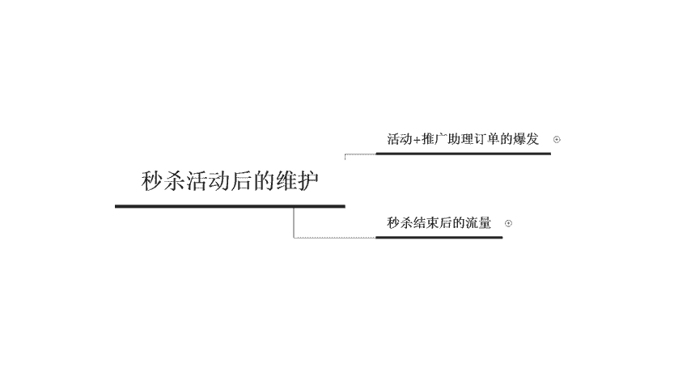

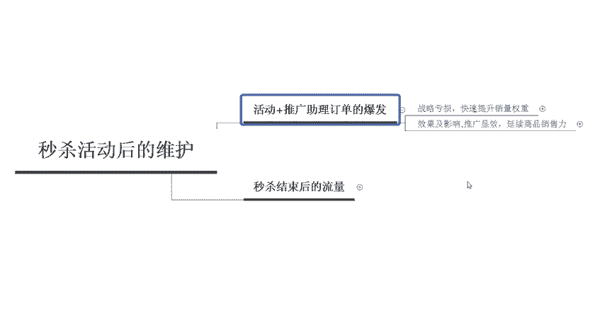

时候千万不要想着在活动上面可以赚到太多的钱啊，比如说我们在实际操作的一个过程中呢，你一旦上了活动，你就可以调整对应的一个推广，加大投投放的力度。比如说呃提升我们搜索推广的关键词。

还有场景推广定向的一个出价。因为你当你上活动的时候，你就会获取到非常非常庞大的一个流量。那么这个时候呢，你需要啊付费流量也跟上啊，多个渠道把流量给做上来。当你流量和推广到达一定程度之后。

那么呃你的一个数据呢也会不断的去进行攀升。所以说啊不仅仅是上了活动之后就可以了。你要做一系列的一个维护，或者是你在做付费推广的时候，你可以直接取消这个推广上线啊，比如说我们推广的这个日销耗呢。

从原先的一天几千块钱啊，提升到这个15000提升幅度，相对来说要比要更大一些。

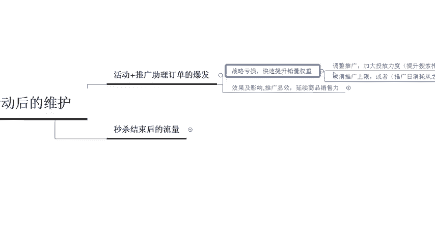

那么第二个呢，我们在实际操作的时候呢，这个效果还有影响推广。如果说显效的话，会影响会延续这个商品的一个销售力啊。那比如说会影响到我们活动对于推广转化率的一个提升是非常显著的。

那么第二个呢是可以提高这个质量分。第三个呢是相同的一个出价。我们在呃对应的一个呃排名下面可以获取到更多的一个流量啊。那么第四个呢是相同的流量，可以以更低的成本来进行获取。所以说这个呢就是我们在呃。

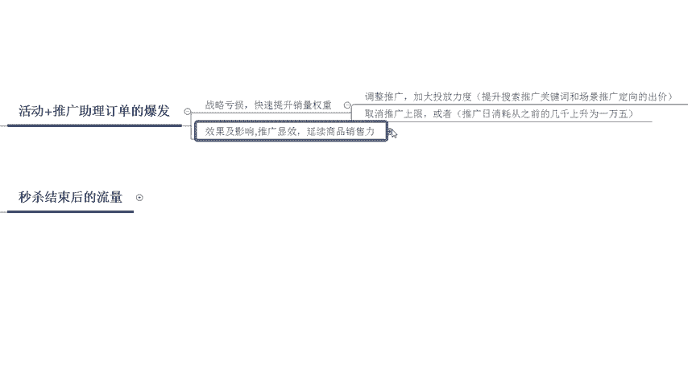

推广助理之后啊，就是上了秒杀之后，我们开车或者是开这个场景所给我们带来的一系列的收益。所以说活动结束之后，你要加大对开车的一个力度啊，那么第二个呢是秒杀结束之后的这个流量端口，那么大家一定要认识清楚。

那流量入口呢主要分为三大流量入口。第一个呢是类目的流量秒杀呢它会提高我们类目的一个排名。所以说秒杀效果好的话啊，那么这个机会呢啊是有机会可以排到类目前20名的。所以说当你的类目流量上升了之后。

你要对应的去做一些其他的一些促销活动。第二个呢是搜索的这个流量，秒杀呢可以提高我们商品的一些推荐权重。各个场景的露出机会呢会变得更多。所以说在在上秒杀活动的时候呢，多个流量渠道入口。

然后对应的一个转化率。那么我们也需要控制好。第三个呢是搜索流量啊，在做这个秒杀活动的时候呢，可以提高我们搜索的一个质量分提高搜索的一个排名。

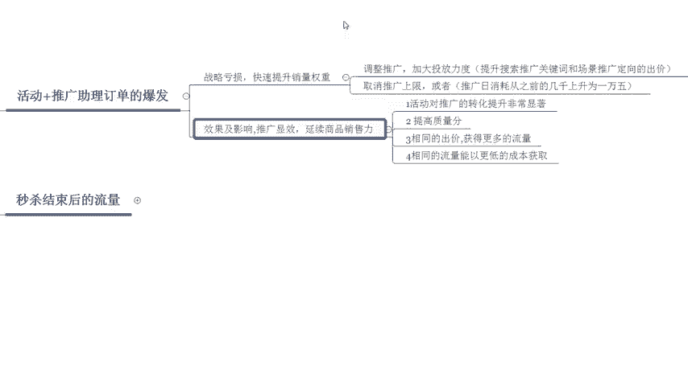

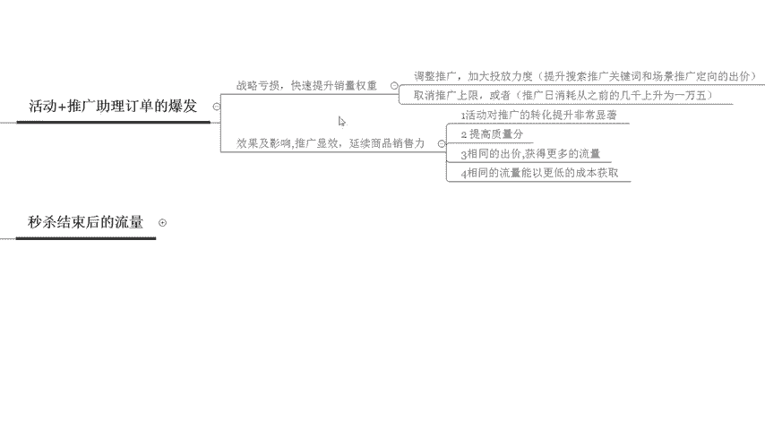

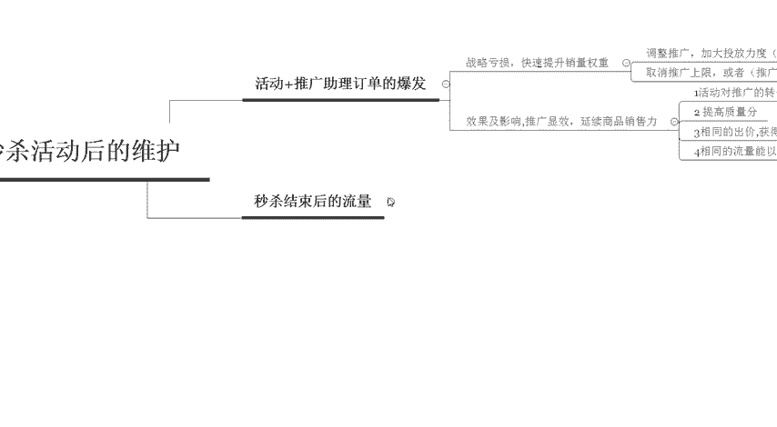

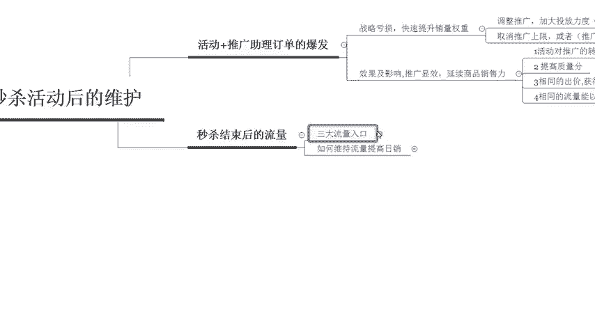

所以说我们在上秒杀活动的时候，不仅仅只是一个活动，其他多渠道的方位全部都要动起来。那么我们到底应该怎么样去维持流量提高日销呢？啊，主要分为三个点。第一个做好售后服务。

提升这个复购率和呃老带新的一个比率啊，经常去检查评价，建议一天两次或者是多次来进行这个评价的一个检查。第二个呢是获取消费者的一个信任，用心的去做服务，让顾客感觉到呃，对于你对于他的一个重视啊。

让他感觉呃对于你的店铺是比较满意和信任的啊，这样的话他就会去收藏或者是推荐客户一般收到货之后呢，感觉产品很好，肯定会收藏店铺，或者是把这个产品分享给自己的呃身边的这些亲戚朋友来进行购买的。

那么第三个呢就是我们在上完秒杀活动之后呢，那么你需要做一段时间的缓冲。就是。

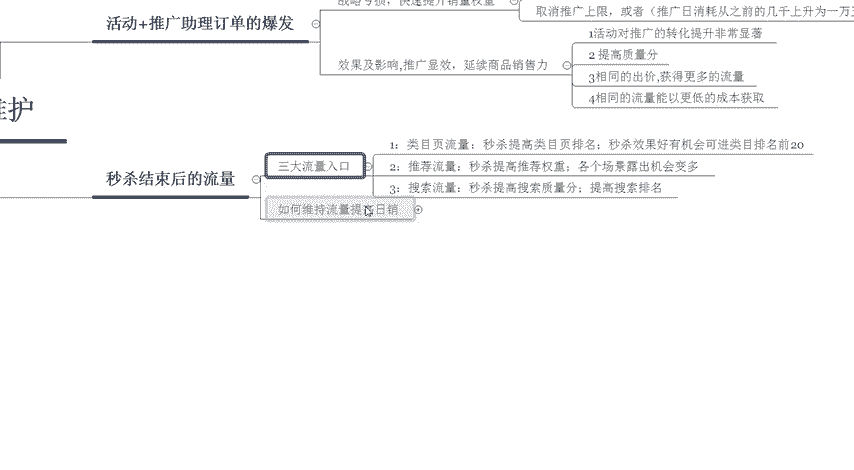

你可以直接去报名其他的资源位，通过概率呢可能会更高。比如说呃9。9块，还有名品折扣、爱逛街品牌清仓等等这一类的活动啊，都是可以上的。那么以上呢，就是我们在做这个秒杀活动的时候啊。

重点要去维护的几个流量入口，还有我们在推广的时候啊，应该怎么样去进行推广啊。

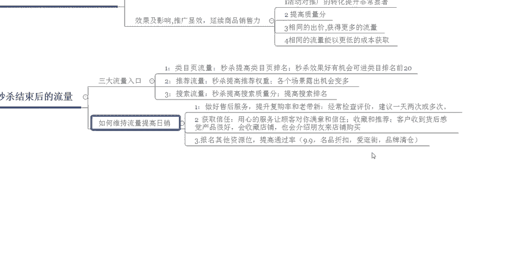

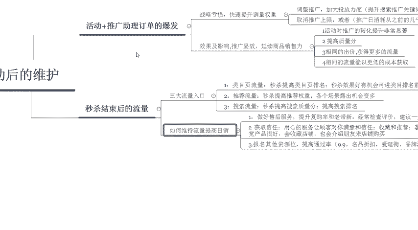

啊，那如果说有小伙伴们啊不知道这个秒杀活动后续应该详细的怎么样来安排啊，那么也可以私信我啊，找我领取这个秒杀活动啊，结束之后维护的这个表格啊，然后呢也相当于是一个福利赠送给大家啊。

后续呢我也会定期的在这个平台呢分享更多的一些干货内容。那么欢迎大家这个关注啊。那么今天的一个介绍呢，到这里就结束了。感谢大家的观看，再见。

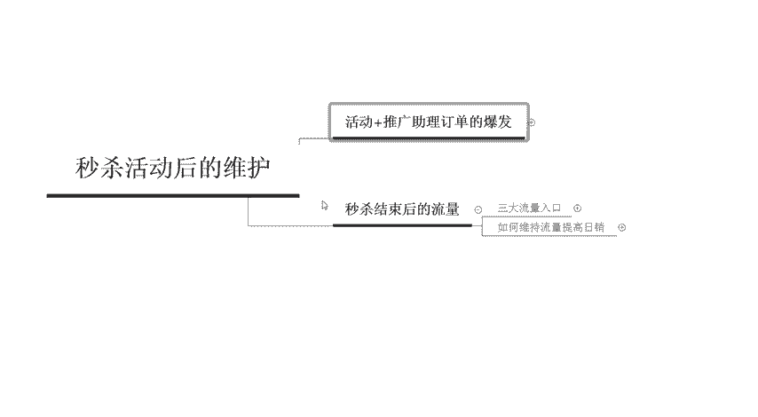

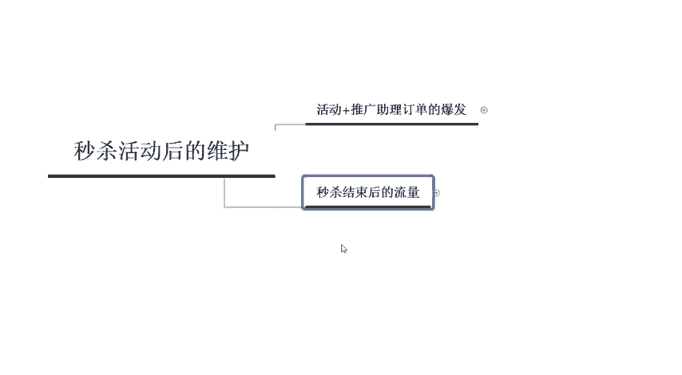

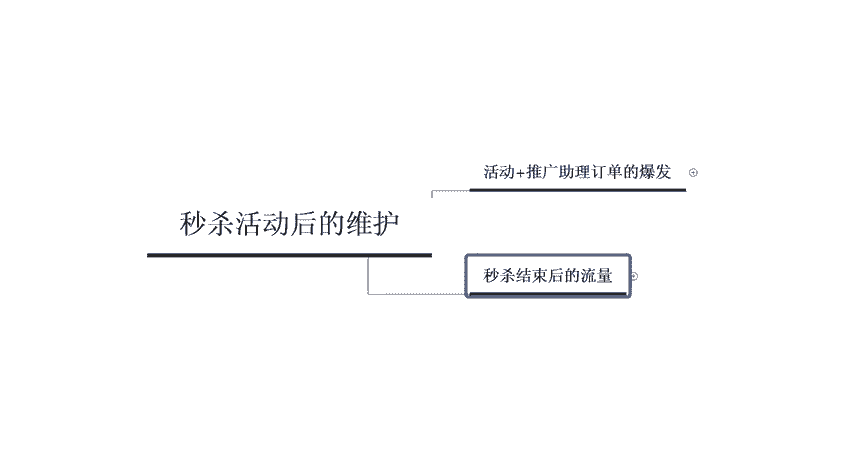