# 【拼多多运营实操教程】中小卖家拼多多开店打造新品全流程教学！跟着实操半个月，爆款成功率翻倍，快速实现日销300+单！ - P26：第26节：拼多多拼单卡活动 - 拼多多-运营 - BV1UN2wY3E5W

hello，各位小伙伴们，大家好。近期呢有很多的朋友私信我说呃，老师有没有比较好的一些拼多多的一些活动啊，可以给我们的店铺新品带来比较好的一个收益的啊。

那么今天呢就由我巨黄教育的西罗老师带大家来认识一下拼多多里面的一些比较实用的基础的活动啊，那么我们今天呢主要是了解拼多多的一些拼单啊，拼多多的这个拼单卡活动啊。

我们先来做一个基础的了解认识一下拼单卡的这个活动到底是一个呃什么样的一个内容啊，首先我们先来了解一下它的定义。其实就是说消费者在拼多多平台上购买某一件商品的时候呢，在确认收货之后。

系统会跳出来一张与这个购买商品所对应的一个卡片那这张卡片呢就是拼单卡。其实在操作的时候呢，这个拼单卡的一个定位呢，主要是适用于品牌特卖的一个频道，专门扶持于品牌店铺的。所以说。

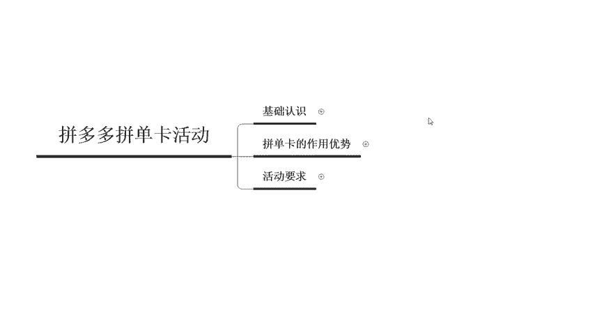

啊，有些人呢可能你在操作过程中没有。就从来没有接触过这个拼单卡的这个活动啊，那是因为你的店铺呢啊本身就不是品牌，所以说啊没有上来这个品牌特卖呢，是没有办法得到这个拼单卡的啊。

那第三个呢就是活动的一个周期。一旦你参加了这个活动之后呢，上线之后是1到3天左右的一个时间啊，然后是看你自己的一个排期规划而定的。你自己想要设置一天，那就是一天，然后呢想要设置3天就设置3天。

它整体的一个活动形式呢，是以单品直降或者是全店折扣啊，这两种方式，就是说直接把你单品去降价，或者是给你店铺内整个这个全店的商品呢全部打8折或者是打9折。以这样的一个形式啊。那么活动的一个条件呢。

是这个用户啊，就是消费者拥有了这个类目的品类卡或者是通享卡，才能使用这个折扣的一个优惠。如果说你没有卡的话，只能原价购买。所以说一定要先领取到这个对应的卡片才可以。

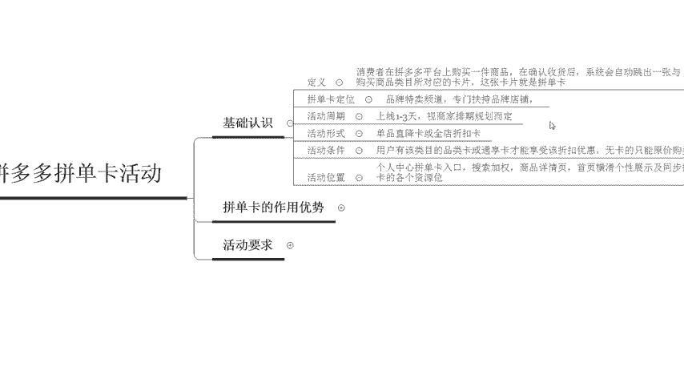

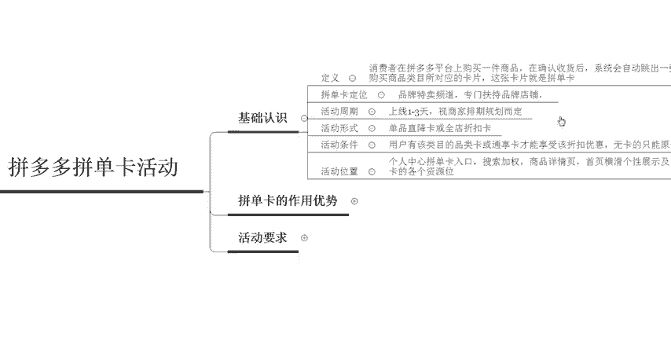

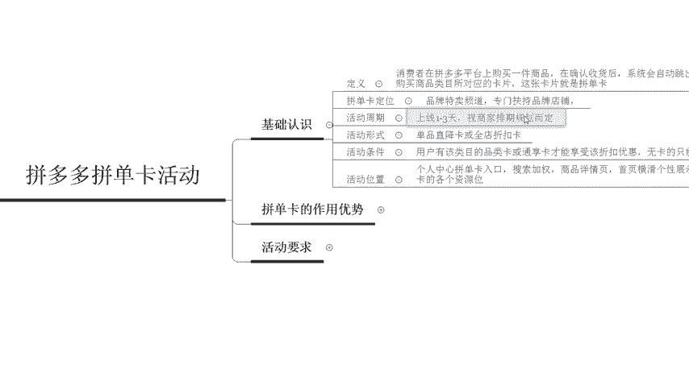

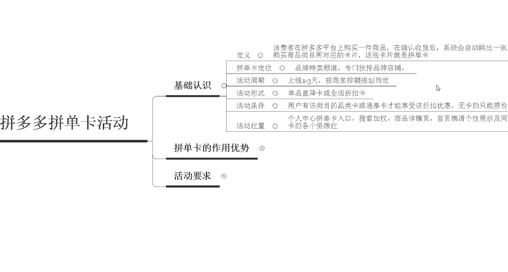

然后活动的位置呢是在个人中心的一个拼单卡入口啊，会有对应的一个搜索加权，还有商品详情页以及首页恒华个性展示的一些呃同步拼单的各个资源位的一些浮现。

所以说对于我们店铺呢还是会有非非常大的一个帮助的那么拼单卡它具体到底有哪些作用和优势呢，它的作用和优势主要有以下四个点啊。首先第一个呢是相对精准的一些呃流量和用户。

它所带来的这个流量和用户呢都是比较精准的那平台呢也会根据于这个拼单卡的一些类目，把品牌呢推送给一些呃特定的一些人群，让这些店铺呢可以获取到比较精准的一些用户流量。

那第二个好处呢就是给品牌商品更多的一些曝光机会啊，利于店铺的一些动销啊，因为有很多的商品呢啊或者是品牌。你在做店铺的时候呢，店铺的一个呃内容会非常的多，就是商品的布局呢会非常的多。那这样的情况下。

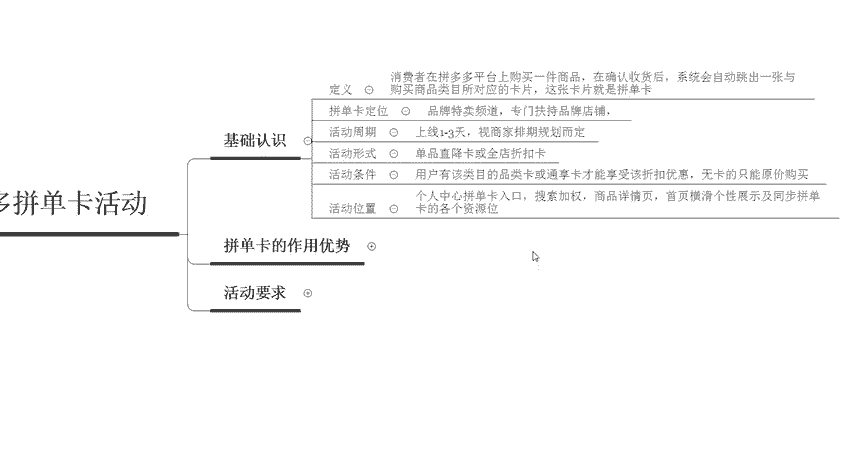

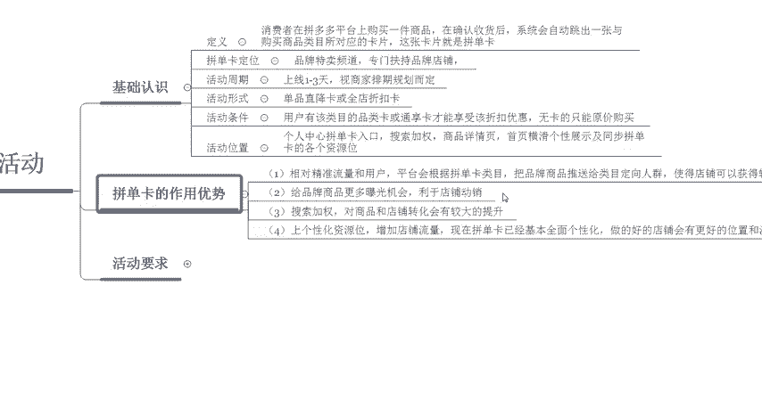

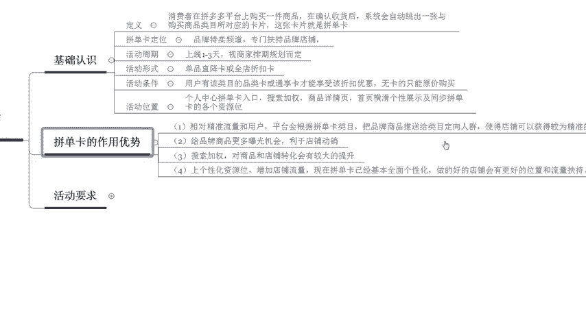

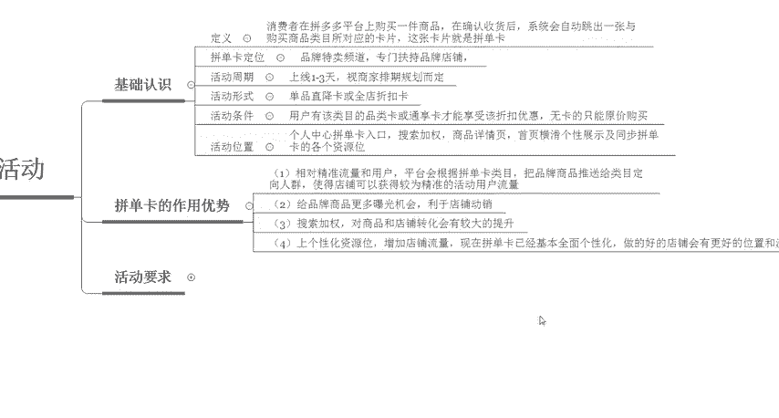

包括那些没有流量的这些商品呢，你都可以把它的动销给做起来。然后第三个呢是可以给我们的搜索位来加来加权。对于商品和店铺的一个转换呢会有非常大的一个提升。啊，我自己的一个店铺啊，之前在做这个拼单的时候呢。

呃最高的时候应该是一天大概800多单啊，我们可以详细的来看一下啊，也就是最近。

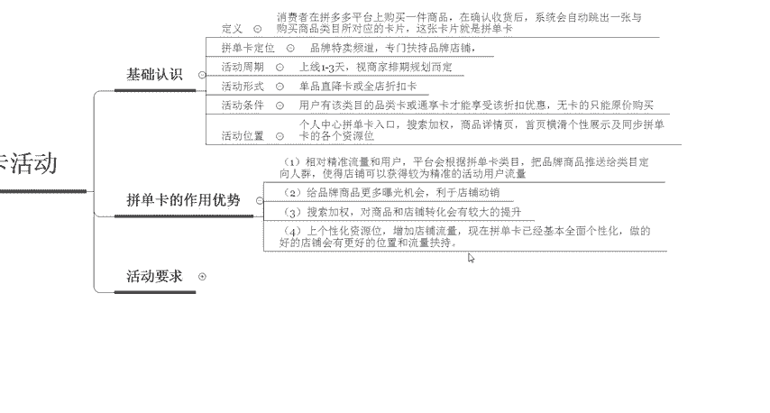

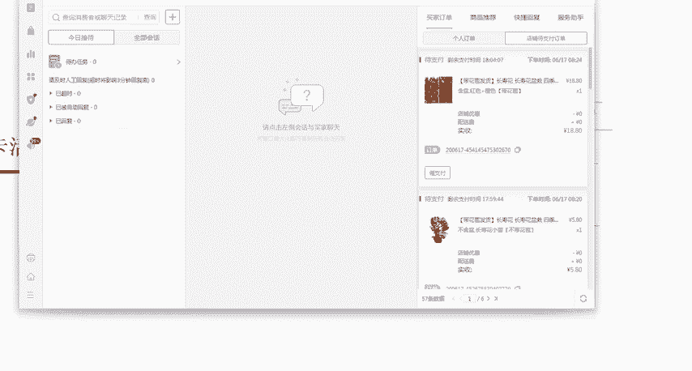

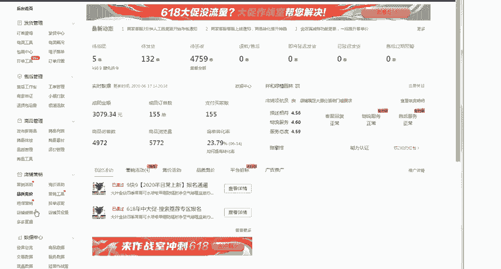

在参与了这个活动之后呢，会有非常大的一个提升啊，大家可以看到整体的一个流量呢，还有这个曝光都是有非常大的一个提升的啊。当天呢是已经卖到了800多单啊，870单啊，这个呢就是实际带来的一个效果啊。

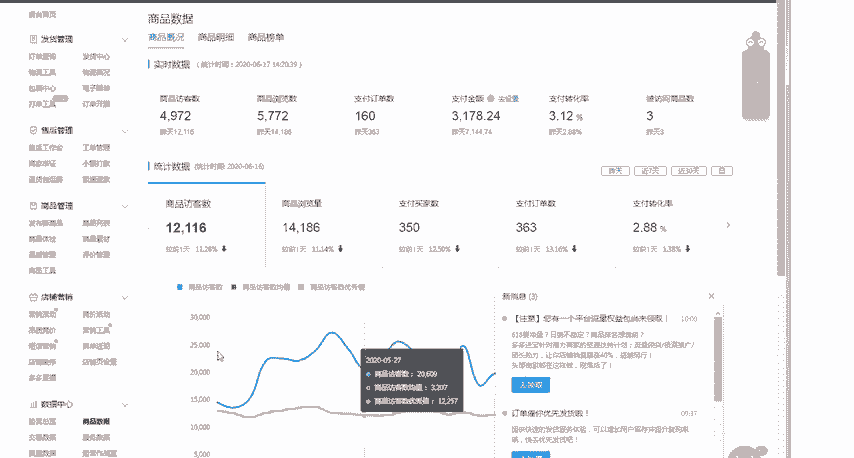

所以说这个活动呢对于我们一些店铺来说会有非常大的一个好处啊。那么第四个点呢是呃上了这个活动之后呢，会有一个个性化的资源位啊，那么可以增加店铺的一个流量。现在的这个拼单卡呢已经基本全面实现了这个个性化。

做的好的话，店铺会有更好的位置和流量扶持啊，那么是不是说啊每一个店铺都可以直接上这个活动呢，也并不是啊，这个活动呢是有对应的一个要求的。我们接下来看一下拼单拼多多这个拼单卡活动呢。

到底有什么样的一个活动要求啊，那首先啊你报名的这个单品或者是品牌店必须要有品牌资质授权啊，就是在你的店铺里面必须要有品牌的这个资质授权。那么第二个呢是这个全网最低价啊，近30天内必须要是全网最低价。

第三个呢是啊拼单卡和这个秒杀断码清仓，还有就是你上的上架的正常的这些活动啊，它都是不互斥的，不叠加的。如果说你上了这个秒杀的活动，你就没有办。

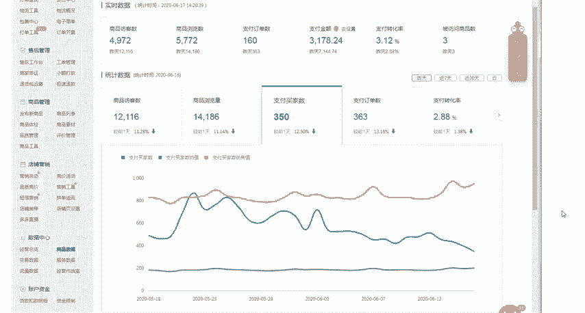

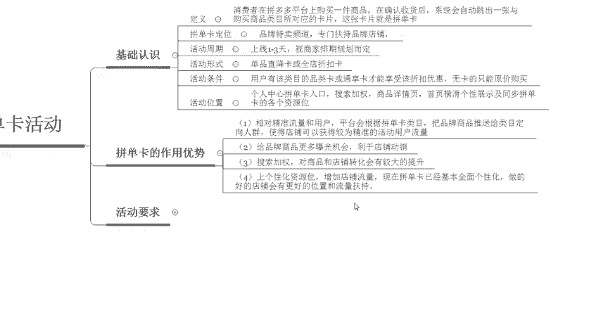

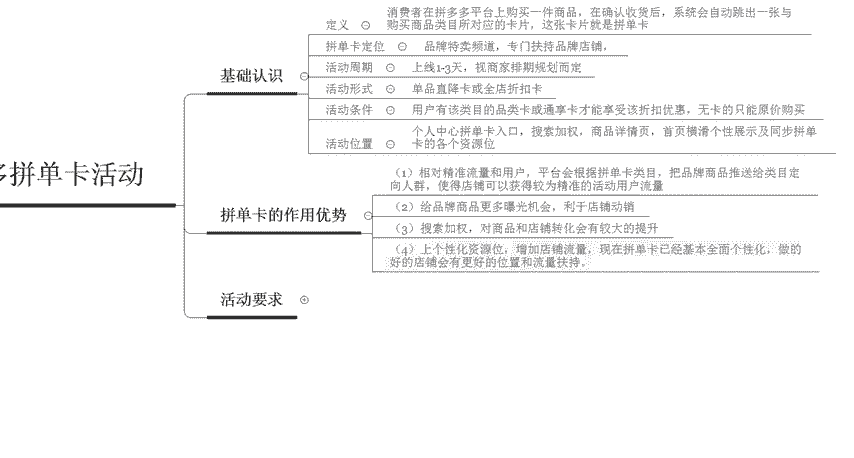

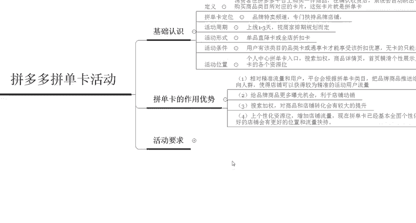

办法使用这个拼单卡。所以说商家报名的时候呢，要一定要错开排期来进行提报啊。第四个呢是参加这个拼单卡的一个活动呢啊然后再去参加这个秒杀断码清仓。

新人专享等等这一类的一个活动呢啊直接就会在这个场景中心会把这个拼单卡领券中心给隐藏掉。所以说热卖的一些款呢，在拼单卡期间不要去随意的上报以上的这些活动啊，像秒杀断码清仓新人专享，还有定金活动啊等等。

这些都会影响。然后第五个呢就是店铺呢会过滤啊，会有一定的一个过滤度啊，店铺里面的商品，如果说低于4个的话，全店是不展示的啊。如果说单品券是低于一个的，那么全店也是不展示的啊。

然后在单品折扣券是最低价是低于5元。那么要求在设置的时候呢，这个大额大额折扣券去吸引买家去进行购买，这样也是不行的那第六个呢是我们在上这个拼单。卡活动的时候呢，服饰啊运动类的这个店铺呢。

需要在18号之后开通这个运费险保证，否则的话是没有进行这个打标的啊。

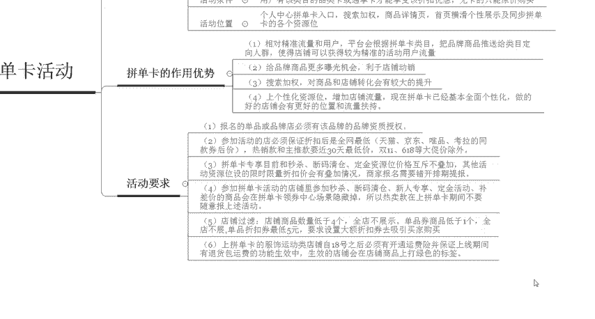

那么以上呢就是我们在设置拼单卡的活动的时候呢，所需要注意的一些细节，以及它的一个活动要求。包括它的一些作用以及基础的一些认识。那么大家到底现在对于这个拼单卡活动，有没有清晰的了解了呢？啊。

其实在拼多多里面想要开一家挣钱的店铺并不难，难的是你们不会运营啊，所以说我这边呢是刚好专业，那么你刚好需要你可以直接来找我。那么我也会定期的分享一些更多的拼多多干货内容啊，现在私信我。

还有福利大礼包领取啊，赶紧来找我吧。那么今天的这个分享呢到这里就结束了，感谢大家的观看，再见。

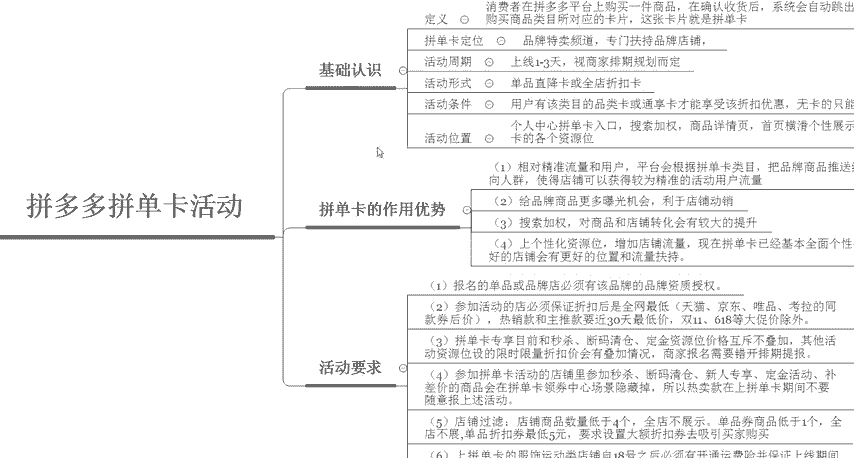