# 【拼多多运营实操教程】中小卖家拼多多开店打造新品全流程教学！跟着实操半个月，爆款成功率翻倍，快速实现日销300+单！ - P27：第27节：拼多多开店多多进宝 - 拼多多-运营 - BV1UN2wY3E5W

hello各位小伙伴们，大家好，我是巨黄教育的西楼啊。那么今天带大家来认识一下拼多多的多多定宝啊。因为前段时间呢有个同学私信我说啊开通了多多进宝之后呢，但是推不动啊，可能是你的资源或者是产品有问题啊。

那么今今天呢就先带家来呃带大家来认识一下什么是这个多多定宝啊，如何来使用这个多多进宝来快速的走量啊，首先我们先来认识一下多多进宝呢可以给我们的店铺带来什么样的一个好处，或者是它的一个作用是什么啊。

首先第一个它可以为我们的商品呢快速的累积基础的销量权重。那么第二个呢可以累积这个搜索排名的一个权重。第三个呢是可以快速的打造爆款。第四个是扩宽流量渠道啊，从这个站内站外还有全方面的一些推广啊。

不仅仅局限于拼多多平台，大家都知道拼多多呢，都是从这个微信分享里面啊火起来的。所以说。那个多多进宝呢，它也是通过这个分享的形式可能会更多一些啊。那么最后一个呢就是可以为我们全店来进行引流。

提升店铺的一个知名度和用户粘性。像有一些比较大一些的在拼多多里面做的比较好的一些品牌啊，比如说做呃水果呀，或者是做这个鞋袜的那这种呢啊有以超低价的一个价格呢去进行拼团或者是多多客的一个分享啊。

都可以为自己的店铺呢带来大量的一个粉丝群。那么这个呢也是对于拼多多店铺呢一个非常重要或者是明显的一个作用啊，那下面呢我们就来先认识一下这个拼多多的这个多多进宝到底是一个什么样的东西啊，多多进宝呢。

它其实嗯适用的产品呢是有一定局限的啊，有一定局限的。比如说利润较高的一些产品可以去做，或者是季节性比较强的啊，比如说其橙，还有这个呃家亲等生活用品啊，生活必需品可能会用的更多一些。那多多进宝呢。

它整体的一个定义呢就是说呃它是属于一个比较新型的一个营销工具。我们商家呢可以自主的去设置对应哪个佣金比例。比如说你设置10%或者是20%。那么这样的情况下呢，就可以激励到一些推广者。

然后去帮助你的这个店铺啊，然后去分享你店铺里面的商品链接，以达到推广的一个目的啊，当然我们在操作的时候呢，可以给商品设置对应哪个优惠券啊，如果是呃设置了优惠券之后呢。

是按照最终的这个交易金额来支付佣金的啊，比如说你单品的一个价格呢是100元。那么你设置的佣金比例呢是10%，如果没有设置设置优惠券的情况下啊，那多多客帮你推出去一单，那成交了之后。

他就可以获取到10元的一个佣金。那如果说消费者用了50元的优惠券。那最终实际成交的一个价格呢就是50元。那么他获取到的一个佣金呢，只有50元的10%，就只有5块钱。

所以说呃是这样的一个啊比例来进行这个支付佣金的。那么第三个呢，我们来了解一下这个拼多多到底应该怎么样去玩，其实也非常的简单。就是先我们先在这个后台设置好商品的一个佣金和商品的一个优惠券。

然后呢推手就可以通过多多进宝的公众号或者是多多客的这个API获取到商家推广的一个任务。那在这里面呢，如果说。多多客可以找到你的商品，那么它就会去进行推广。当然前提是你的商品是足够的优质的。

否则的话他推也是推不动的。那么通过这个推手推的分享的这个链接啊，购买了这个商品之后呢，推手就可以获取到对应的一个佣金。相当于是别人来帮你卖货，然后你给别人提成这样的一个方式啊。

那最终提算的一个呃推广的时候，结算的一个方式呢是每14天一次啊，如果说消费者支付之后呢，然后这个佣金比例呢，就会把钱划到这个推手的一个账户里面。那确认收货14天以后。

然后推手才可以提现那如果说啊消费者确认收货14天内发生退款了。然后会呃就会会把这个商家的一个贷款和呃推手的个佣金原路返回，也就是说这一单是如果说实际是没有进行成交的。

那么你是不需要付出太大太多的一个代价的啊，你也是不需要付出佣金的啊。那如果说消费者确认收货14天以后发生了退款，那么商家承担所有的退款金额，还有推手的佣金是不会退还的。

所以说一般情况下14天以后基本上就不会再进行这个退款了。

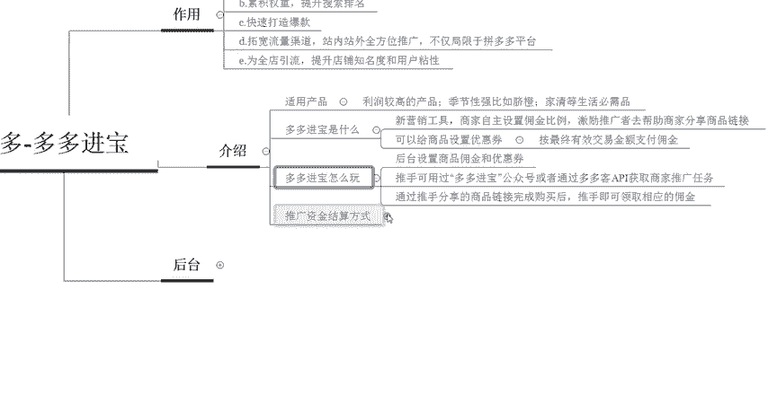

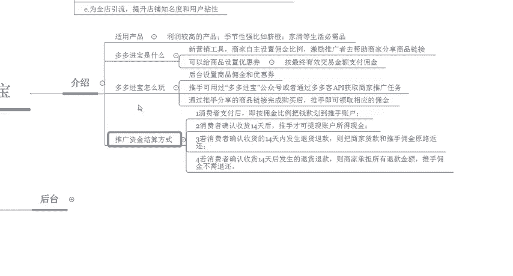

那么以上呢就是关于多多进宝的一些介绍啊，那么我们接下来就来后台实际的了解一下这个平呃多多客这个多多进宝到底是在哪里去进行开通啊。我们呢首先打开我们的登录的这个后台，然后找到多多进宝新建一个商品推广啊。

比如打开后台之后，直接拉到最下方，在最下方的位置有一个呃对应的推广。

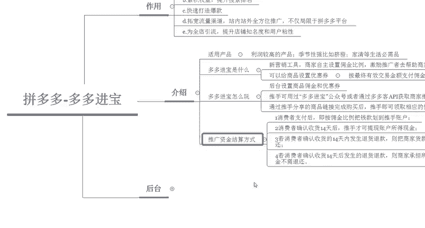

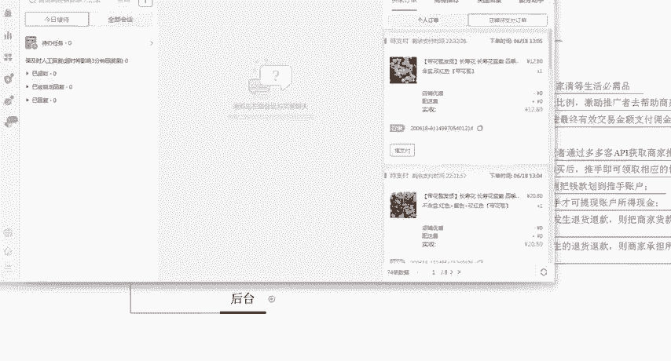

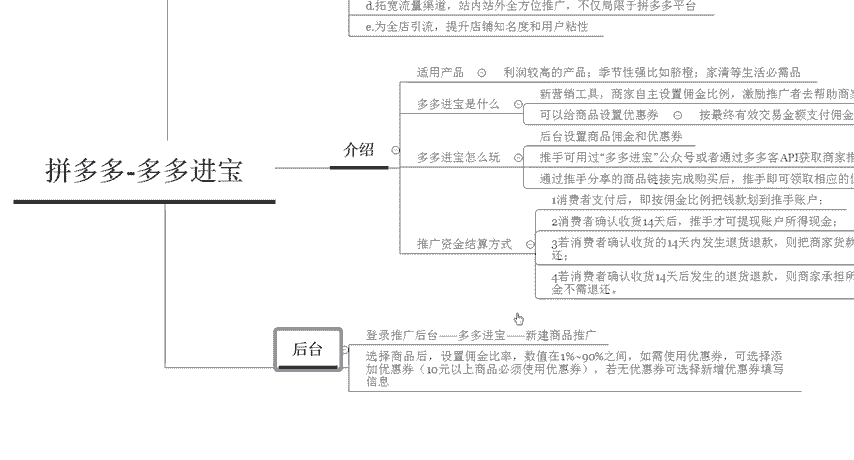

比如在这里我们就可以找到对应的这个多多进宝，然后点击多多多进宝的这个首页，就可以进入到多多进宝的一个后台。在多多进宝后台之后呃，进入之后呢，然后你可以先开通啊，你可以先开通佣金比例呢一般设置10%。

当你开通了之后呢，就可以类似于这个直通车的一个推广一样，然后添加你商品的一个链接，把你商品的链接添加进去之后呢，然后就可以设置对应的一个啊优惠券或者是其他的一些呃佣金比例的一些设置啊。

如果是10元以上的优惠呃，10元以上的这个商品呢是必须要设置优惠券的这个点大家需要注意一下。如果说你没有优惠券可以使用的话，那么必须要新增一个优惠券，然后填写好对应的一个信息，就可以正常的去进行推广。

好，那么以上呢就是关于多拼多多的这个多多进宝的一些基础的一些了解啊，那么啊最近呢也有很多的小伙伴来私信我问我有没有多多进宝的一些。

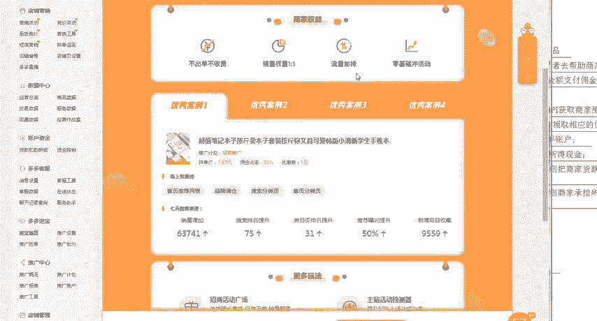

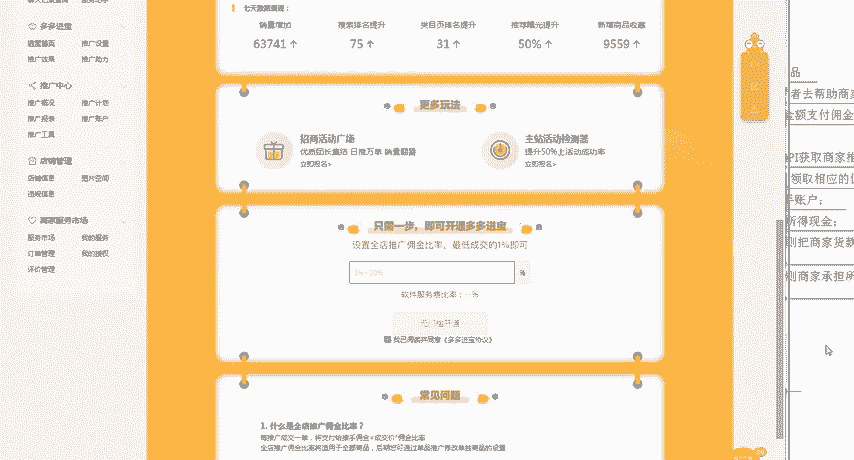

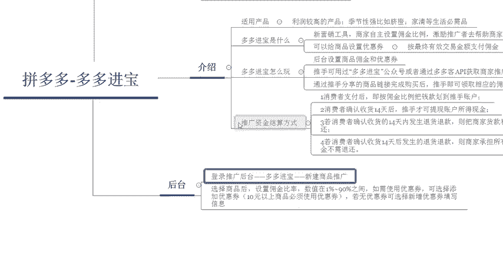

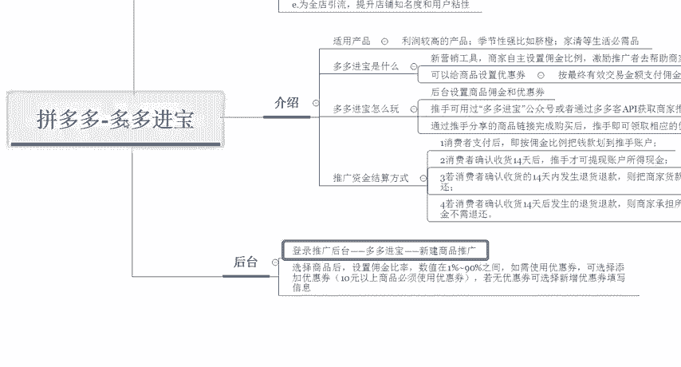

资啊很明确的告诉大家，我这边是有的，而且呢今天也会给到大家非常多的福利啊，那后期呢我也会定期的分享更多的一些干货内容啊，包括想要福利的，想要这个干货的都直接私信来找呃西罗老师就可以了啊。

那么啊今天给大家的分享呢到这里就结束了。感谢大家的观看，再见。

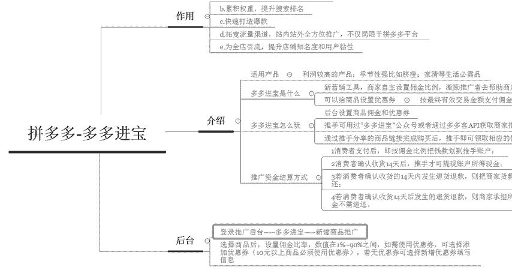

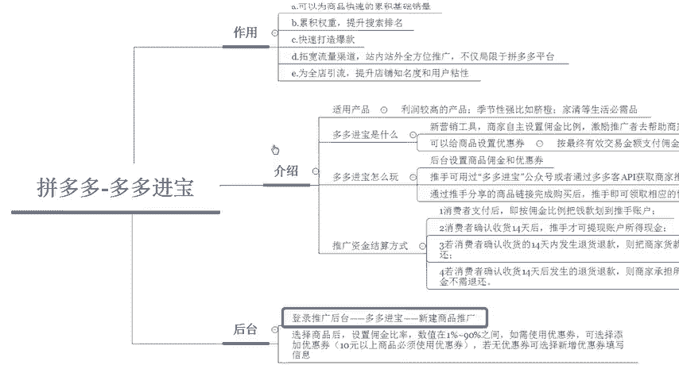