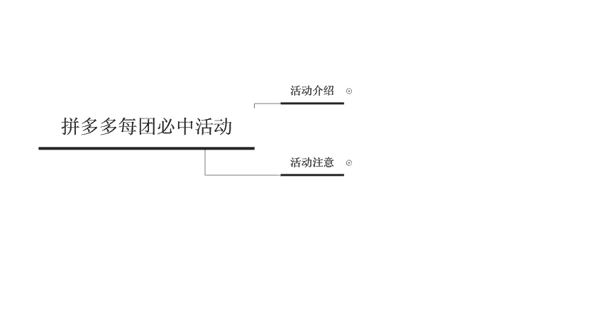
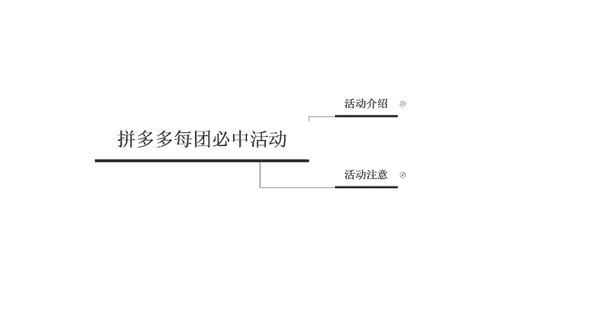
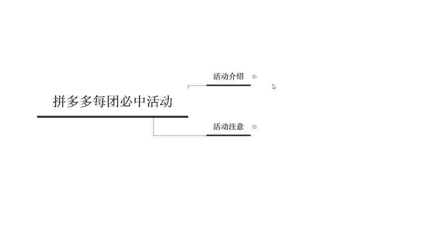
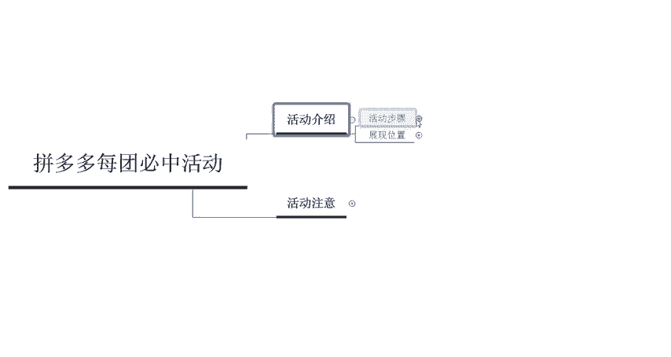
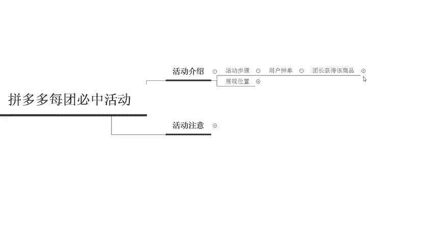
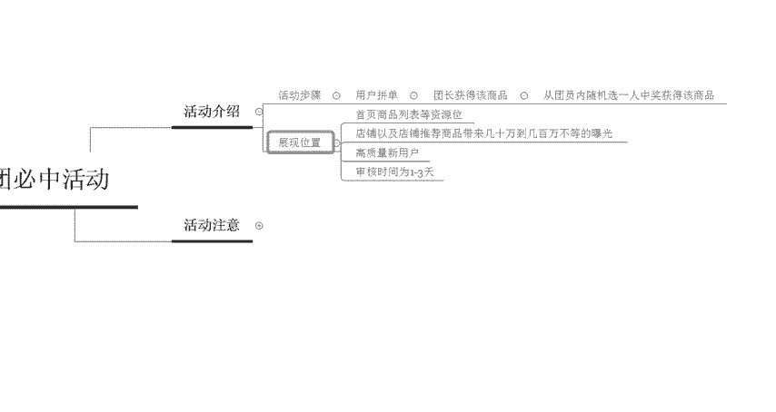
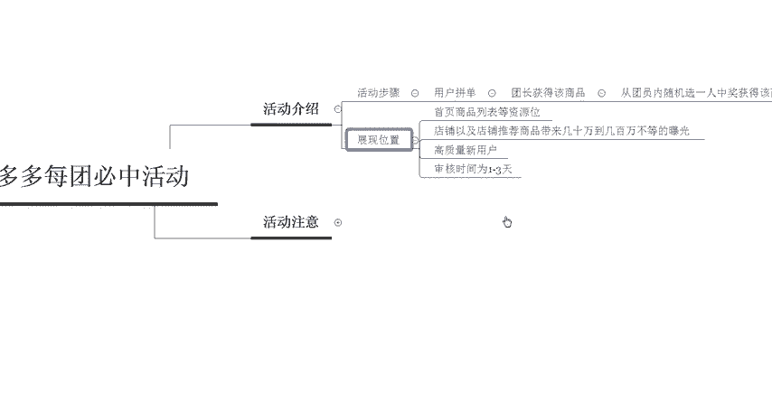
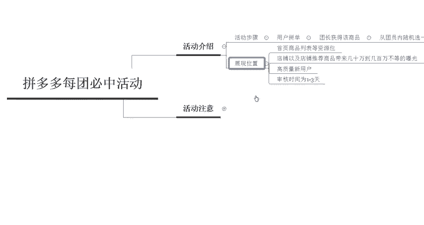
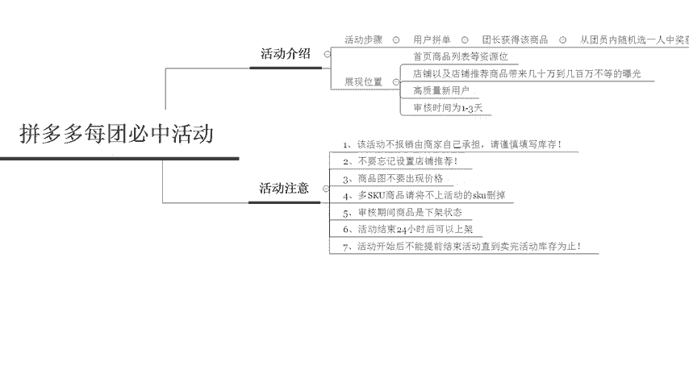
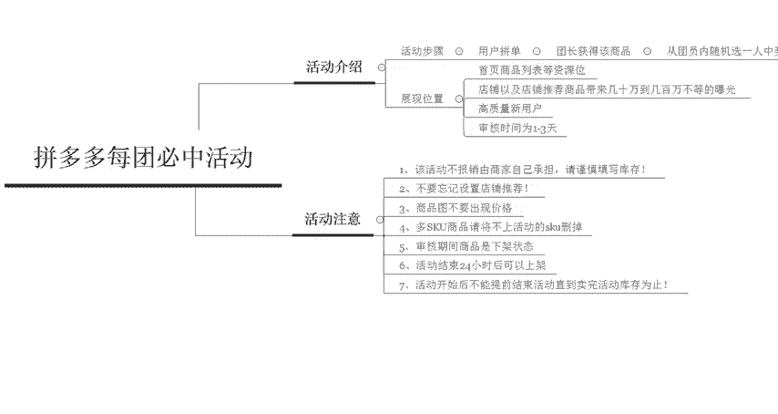

# 【拼多多运营实操教程】中小卖家拼多多开店打造新品全流程教学！跟着实操半个月，爆款成功率翻倍，快速实现日销300+单！ - P28：第28节：拼多多运营每团必中活动 - 拼多多-运营 - BV1UN2wY3E5W

hello，各位小伙伴们，大家好，又到了今天的干货分享时间啊。今天还是由我巨黄教育的西楼带给你们拼多多的干货分享。那么今天呢我们来了解一下拼多多美团必中的活动啊。

当然这个美团必动不是那个大家点外卖的那个美团啊，而是这个每个人啊每个人参与团购啊，这个美团啊，所以呢呃我们先来认识一下这个活动到底是以一个什么样的方式来运营的啊。

因为有很多的同学呢呃或者很多的小伙伴们呃不太知道这样的一个活动啊。最近呢我透露出我想要录这一期视频的时候呢，呃也有很多的小伙伴在问我什么是美团必动啊。

所以说今天呢先给大家带来一下这个美团必动的一个活动的一个介绍。

首先啊这个美团币重呢，它是有一定的这个活动步骤的啊，而且美团必重呢是规定必须是一个新用户啊才能成团啊，才能成团。团个呃这个团队的人数呢必须是10个人而开展的一个成团活动。

所以说呃我们接下来具体的来看一下啊，具体的来看一下。首先第一步我们要入呢就是用户拼单，这个用户呢一定是一个新客户啊，如果是老客户的话是没有参加呃没有呃权限参加这个美团币中的一个活动的。

所以说用户拼单的时候呢，团长就会获得这个商品啊，获得这个商品直接免费送给团长。然后呢，下一步的一个操作呢是从这10个人里面就是我们会选出一个团。然后从这10个人里面呢，随机挑选一个人中奖，获得该商品。

就是相当于是免费送啊，免费直接送给他们啊，相当于是你需要送两个订单啊，你需要送两个订单，团长获得一个，然后随机。

中奖的一个。那么整体的这个活动呢啊大致的一个流程呢就是这样。然后它总体展现的一个位置呢是直接展现在首页商品列表的这个资源位里面的。

所以说它带来的流量和曝光是非常大的店铺以及店铺推荐的一个商品呢可以带来几十万到几几百万不等的一个曝光，所以说这个活动的一个呃流量是非常庞大的。但是说对于店铺啊是有一些要求的啊，不是每一个店都可以上。

然后呢，它还可以给我们带来一些非常高的高质量的一些新用户啊，然后这个如果你提报了活动之后呢，审核的时间大概是1到3天。

那这个呢就是关于这个美团必重活动里面的。

基本的一些了解啊，那么我们在做活动的时候呢，有几个注意点需要给大家说一下啊，总共有7个注意点啊。首先第一个，如果说你一旦上了这个活动之后呢啊这个活动是。

平台不报销的。所以说你送出去的这两个订单全部都是由自己承担的啊，所以说你在填写这个库存的时候，一定要填写谨慎啊，不要人家开了这个100团啊，开了100个团，然后你就需要送出去多少啊，100个团的话。

那就需要送出去200单，那200单你亏钱了啊。然后第二个呢是千万不要忘记设置店铺推荐。因为这个活动带来的曝光是非常大的。如果你发现当这个消费者不太喜欢你这一个产品的时候。

他可能会看到你店铺里面另外一款产品，所以说店铺推荐一定要设置好，然后再去上活动。第三个呢是商品图，千万不要出现价格，这里面是不允许出现价格的啊，因为有两个这个两者两个这个订单呢是免费送的。

所以说它不允许出现价格。第四个呢是多个SKU的商品，请呃一定要把这个不上活动的SKU删除掉，否则的话啊就会带来一些歧义啊，否或者是上不了活动，导致审核失败。那第五个呢是审核期间商品必须是下架状态啊。

审审核期间必须是下架状态。然后呢，第六个是活动结束24小时以后才可以进行上架啊。然后第七个呢是活动开始之后呢，不能提前结束活动啊，必须要把这个库存卖完了之后，你才可以呃去操作其他的一个东西。

所以说这个活动呢有很呃只有少部分的人愿意去做啊，因为你上了这个活动之后，你其他的推广什么东西都不能做了啊，只能呃只能等到把这个库存卖完为止。所以说这个活动呢相对来说还是比较难的啊，比较难的。

好，那么以上呢就是关于这个拼多多美团币种活动的一些介绍。那么相信大家对于这个美团币动呢已经有了一些基础的一些了解了啊，那么后期呢我也会定期的在这个平台呢分享更多的一些拼多多干货的内容啊。

那么有想要学习拼多多或者想现在正在做拼多多苦于没有方法啊，不知道应该怎么样去做的。那么可以随时联系西楼啊啊，然后呢今天的给大家的这个干货的分享呢到这里就结束了啊。现在找我的话，还有这个新手大礼包啊。

来带你们厂长，带你们入门啊，所以说赶紧私信来找我吧。

