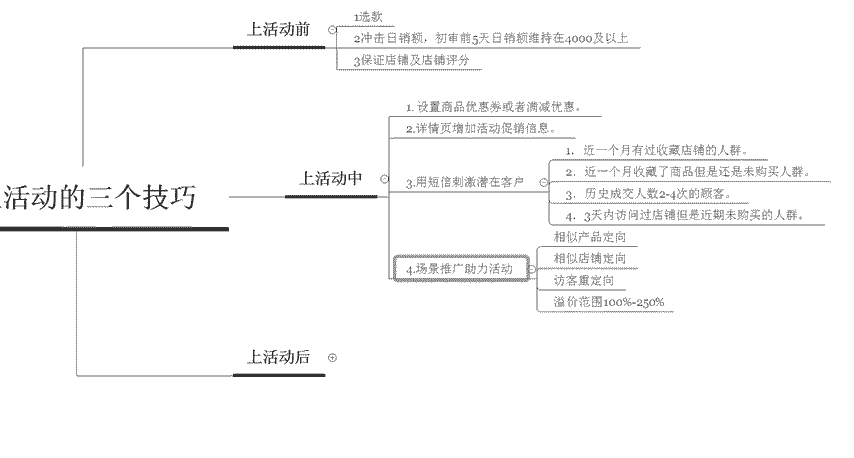

# 【拼多多运营实操教程】中小卖家拼多多开店打造新品全流程教学！跟着实操半个月，爆款成功率翻倍，快速实现日销300+单！ - P29：第29节：拼多多上活动的三个技巧 - 拼多多-运营 - BV1UN2wY3E5W

hello各位小伙伴们，大家好，我是巨黄教育的西楼。那么今天呢带大家来认识一下拼多多上活动的一个呃三个技巧啊，那么也首先呃欢迎各位呢来到我的拼多多系列课堂啊。

因为很多的这个商家呢觉得上新品呢这个活动没有什么用啊。但是说其实一开始如果说你利用好了上活动也是帮助我们呃实现这个产品前期积累的一个非常重要的一个点。

所以说所有的活动呢呃销量的一个积累呢都是会计入权重的啊，我们活动以后呢，还可以拉动产品的一个自然销量。并且呢活动在拼多多里面相对门槛是比较低的，而且是免费的。

所以说除此之外呢还可以迅速让我们的运呃获得这个对应的一个运营对接啊，比如说对接小二啊，最重要的呢是可以提升我们多多推广的一个质量分啊，后期呢也可以节约这个开车的一个成本。

所以说这个呢对于我们呃整体店铺上。来说，你想要去上活动，对于店铺来说是非常非常重要的啊，所以说那么我们今天呢就呃来带大家啊来呃为这个上活动都需要准备哪些东西啊，抓住这个免费让我们销量提升的一个机会啊。

来了解一下拼多多上活动中的最核最为核心的三个技巧。首先我们把这个活动呢分为三呃三个这个节奏点啊。第一个呢就是上活动之前和上活动之中，然后还有这个上活动之后啊，分别这三个点呢，我们都需要做哪些东西。

我们先来看一下我们上活动之前所需要做的一些准备工作，主要有几个点啊，有三个点啊。第一个呢就是选款一个款好不好？是决定你能不能推起来的一个非常重要的因素。所以说选款这一块呢，千万不能草率。

那么到底应该怎么样去选款呢。如果说大家有不知道的，可以去参考我之前的一个呃分享的一些干货的课程啊，那么呃我们呢啊在这边呢给大家提一个小建议，你可以直接看平台上最近活动销量比较多的。

并且是呃卖些啊卖在这个上了活动之后卖的比较好的那这些呃产品呢，你可以拿来做一个呃模仿或者是抄袭啊，你直接用他们的一个款式就可以了啊，这是其中的一个非常好好用的一个办法啊。

那么第二个呢就是我们在上活动之前呢，需要冲击日销啊冲击这个日销额。在拼多多里面呢考核的就是我们店铺的一个日。日销额的一个呃数据。所以说在活动开始之前的初审前5天。

你日销额呢基本上必须要维持在4000以上。否则的话你的日销是低于4000的啊，很有可能就上不了活动，就会被活动驳回啊，那么第三个点呢是保证店铺和这个店铺的一个呃评分啊，首先我们商品的数据要全部飘红。

那么店铺呢啊要高于这个行业5倍的一个均值，商品的评分呢也要高于行业的个均值，这是最基本的一个标准。那么这个呢就是我们在上活动的时候啊，上活动之前所需要准备的一些准备工作啊，同时。

但是说有一些商家呢可能会觉得我上了活动呢，那是几个小时就被迫下了活动啊。但是其实在拼多里面呢，是因为你很多很多人呢不知道测试期啊，这个活动呢上了活动之后，会有一段时间的这个测试期。

测试期主要考核的呢就是客户的一个转化率。所以说在这个测试期期间呢，我们呃提升这个转化率是非常重要的啊。那么我们在上活动期间呢，首先啊就要先去保证我们可以获取到很高的一个转化。所以说在测试期的时候呢。

我们需要设置商品的一个优惠券或者是满减的一个优惠。那么第二个呢是详情页里面增加活动促销的一个信息啊，通过测试之后呢，我们就可以知道哪些助力活动效果呢，可以帮助我们扩大商品的一个效益啊。

那么第三个呢是在活动操作期间呢，我们需要用短信刺激一些潜在的客户啊，比如说啊近一个月有收藏过店铺的一个人群，还有近一个月收藏了商。

但是没有购买啊，历史成交人数啊到2到4次左右的客户，就是说我们的一个老客户啊，然后呢，第四个呢是3天内访问过店铺，但是说近期并没有购买过的类似产品的一个人群。所以说我们在发短信的时候呢。

也是呃需要注意的。那么第四个点呢啊就是场景推广可以助力我们的一个活动，在上活动的时候呢，我们的一个呃活动的一个转化率是非常强的啊。因为我们价格低，并且销量非常大。所以说这个时候开场景是非常的有帮助的。

我们的商品权重有了之后呢呃出价就会变得很低，而且还能提升销量。

那么开场景的时候，我们重点开的四个定向呢，就是啊三个定向啊，三个定向呢就是呃相似产品定向和相似店铺定向，还有一个访客重定向啊，最终呢我们这三个定向呢溢价的一个范围呢在100%到250%之间。

这个呢就是我们在上活动期间所应该去做的啊一些事情。那么当我们活动结束了之后啊，应该怎么样去做呢？首先第一个你要做好催复。在拼多多里面呢可以用短信提醒买家来进行付款。在12个小时以内没有付款的。

可以提醒到位。然后呢，第二个呢是售后问题一定要做好，这个我就不用多提了，你售后做不好，你生意不可能长久。第三个呢就是送赠品啊，不要像送这种橡皮筋啊这类的一个东西啊，要送跟自己产品相关联的一个产品。

比如说你是卖小白鞋的，那么你可以送这个小白鞋的一个呃清洗剂或者是小白鞋的一个清洗产品。那第四个点呢，就是我们一定要主动啊，生意来了之后，你必须要主动啊，不主动，你怎么会有故事呢？

所以说你第一个呢在拼团成功之后呢，可以给买家发消息的一个啊，会有一个可以给买家发消息的一个机会。那么第二个呢就是在物流即将到达的一个过程中。

或者是已经签收产品了的时候，你要发消息去询问一下啊，是否有收到我们的产品。如果没有收到，请及时联系客服人员啊。然后呢，如果说他有不满意的话，也可以及时联系我们的客服人员，这样可以大大降低你的一个小插曲。

或者是降低我们的一个收到中差评的一个概率啊。那第五个啊最后一个呢就比较简单了啊，付费推广助力啊，多多推广呢啊和加入这个呃投入拉高啊，可以增加投入，拉高我们店铺的一个访客啊，还有销售额这些数据。

利用付费推广啊，强行来拉动这个物流异常带来的一些降权。因为上了活动之后呢，我们的物流异常是。可能会有很多。所以说呢这个时候你就需要开车来进行维护。那么以上呢就是我们在拼多多做活动的一个过程啊中啊。

比如说上活动前上活动中，还有上活动后，我们分别要做的一些东西或者是技巧。那么现在各位小伙伴们到底有没有理解到或者是学到东西呢啊，那以后期呢我也会定时的在这个平台里面更新更多的一些拼多多干货的一个内容啊。

如果说大家有想要学习或者是想要了解的，可以随时私信我或者是在评论区留言，我都会给大家一一回复啊，然后呢呃近期是因为这个618的一个活动嘛，所以说有福利大礼包赠送给大家啊。

那么大家可以直接私信我领取福利大礼包。好，那么今天给大家的一个分享呢，到这里就结束了，感谢大家的观看，再见。

