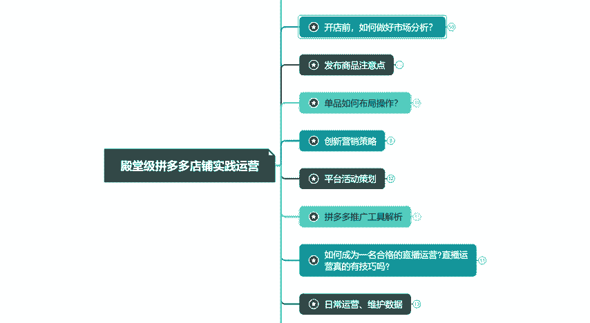
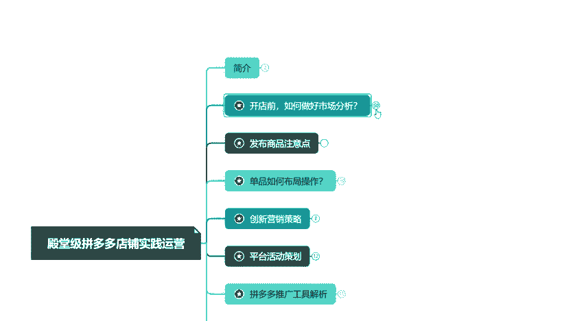
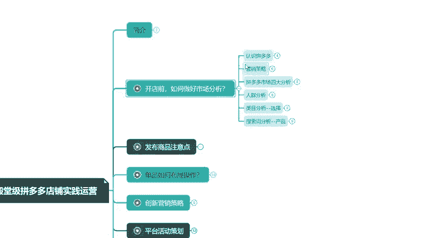
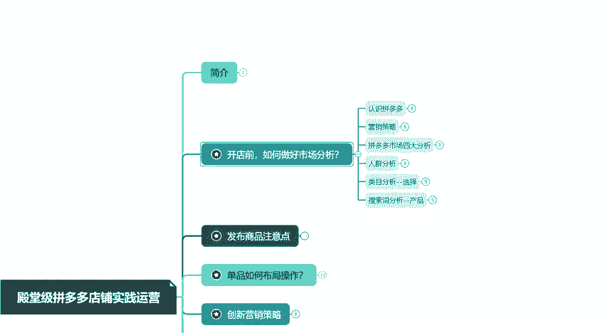
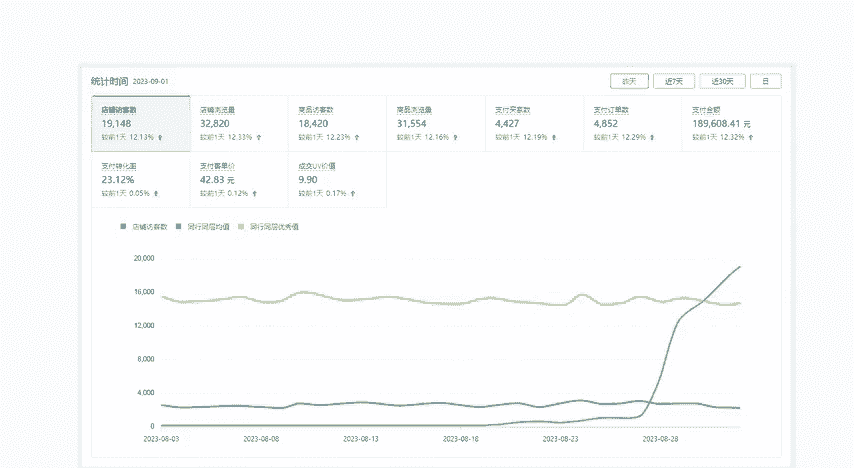

# 【拼多多运营实操教程】中小卖家拼多多开店打造新品全流程教学！跟着实操半个月，爆款成功率翻倍，快速实现日销300+单！ - P30：第30节：拼多多开店前的市场分析 - 拼多多-运营 - BV1UN2wY3E5W

hello大家好。今天呢我们学习第一节课开店前如何做好市场分析。我们呢需要通过6个板块去对我们市场进行一个分析。那么像我们盲目的去跟从以及盲目的选款。那么最终的一个结果肯定是白猫盒，对吧？

就跟之前有一位小伙伴留言啊，说做了几个月的一个店铺。那么资金前前后后也是花了不少钱，但最终看这个数据一塌糊涂。那其实也是在座各位目前所遇到的一些问题。那市场分析我给各位是分为了6个板块。

那首先任职拼多多。

那么我们需要知道所做平台的一个优势啊，优势它是在于拼多多抓住了三线城市以及农村市场的一个空白，实现低端啊供应链和我们低端消费人群低成本的一个链接。这就是我们的一个拼多多它的一个优势。这些。

那么其次我们需要了解并且熟知拼多多店铺营销策略。那么以方便我们为后续去做好一个布局。啊，并且我们需要就是说分析了解产品市场以及人群侧重兴趣爱好等。像我们目前就是说在操作的这些店铺，那么给大家看一下数据。

那像这个家电不是做的一个球鞋。是从我们就是说7月30号，那么一直到我们的一个8月24号的一个过程，那么数据是直线在上升的。那么数据是非常好看的。那么其实很多小伙伴也比较羡慕，对吧？那么我们再看一下。

就是说近期我们的一个就是说月饼，那么月饼在目前来说是一个非常就是说旺季的一个产品，对吧？那么也是在我们8月18号之前啊，它数据都是一直为零，只是说上架的一个产品，那么没有去操作。

那么在我们8月18号之后，我们开始介入去操作，一直到我们的一个8月228号，那么数据呈现一个直线上升的一个过程。所以像目前这几家店铺，那么从开店到运营到报单。那么整个过程呢是精细化进行一个操作的。

那么这些呢都是就是说通过我们这个运营最终得到的一个结果。那么为了方便各位就是说学习啊，整理的一套就是说详细的资料。这套资料是结合了我们实操坐垫的一个经验，包括过程啊，细节注意点方式的。

能够给各位提高运营能力、思维方式的。那么需要这些内容的，那么就是说可以在评论区联系我给大家看一下。

那么需要的，那么抓紧联系我啊，侠课。