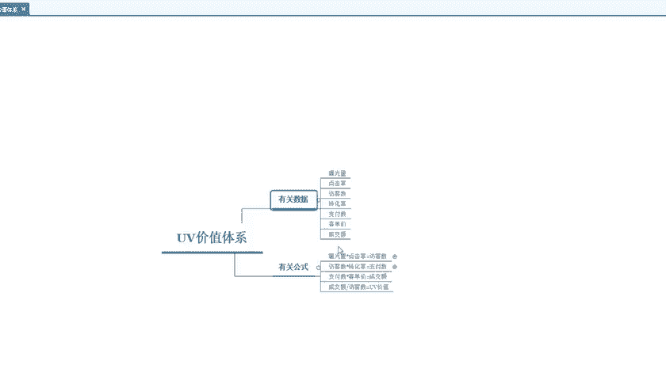
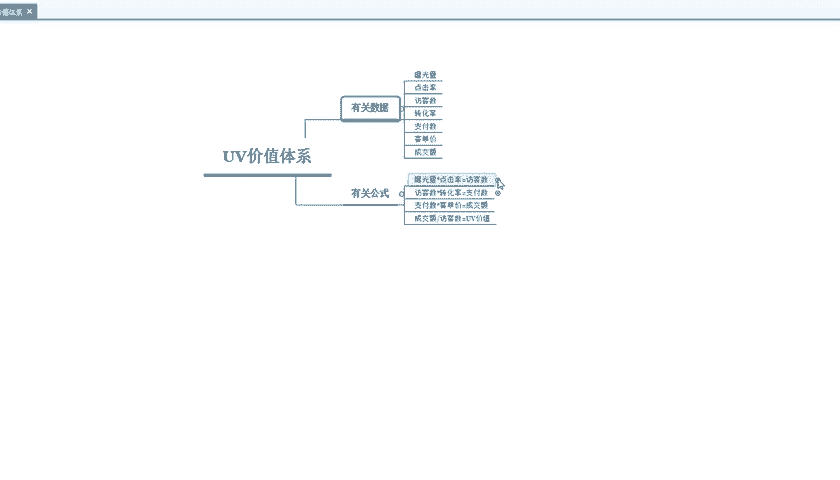
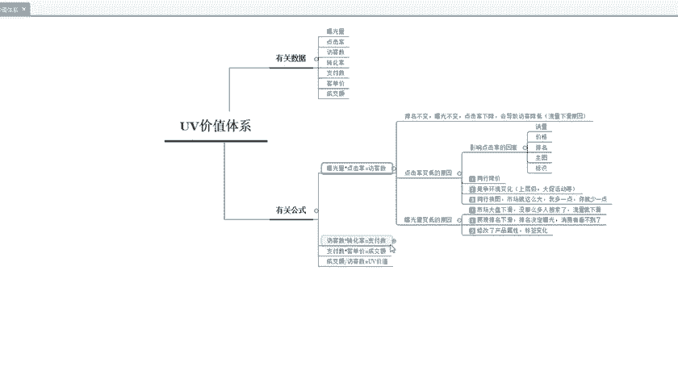
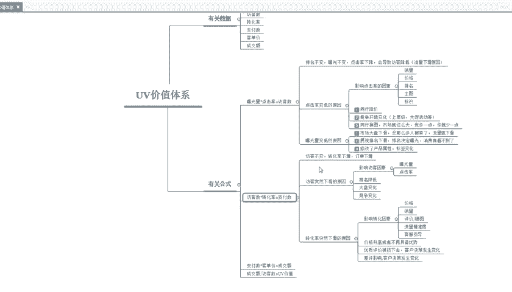
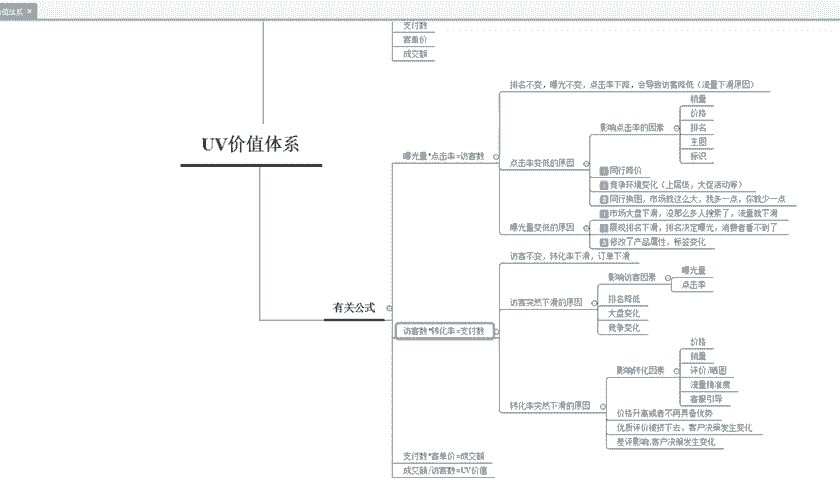

# 【拼多多运营实操教程】中小卖家拼多多开店打造新品全流程教学！跟着实操半个月，爆款成功率翻倍，快速实现日销300+单！ - P31：第31节：拼多多开店uv价值讲解 - 拼多多-运营 - BV1UN2wY3E5W

hello，大家好，我是项目老师。这一期呢我主要给大家讲解一下拼多多的UV价值。首先我们先看一下这两点。第一点就是说UV价值主要是哪些数据呢？

数据的话就是分为曝光量、点击率、访客数、转换率、支付数以及客单价、成交额，这些都是需要查看的。那么有关的公司我们就可以看一下。比如说曝光量乘点击率等于访客量。

访客数乘转化率就等于支付数量。支付数量乘客单价就等于成交金额。成交额除以反客数，那么就等于优惠价值这个。

它里面还有一个细分，大家可以看一下这个细分呢就是说排名不变，曝光不变，点击率下降，那么就会导致你的访客下滑。大家就要知道这个原因，点击率变低的一个原因就是说。销量价格排名主图标识。

这个标识的话就是像一些品牌呀，它前面就有一个标签啊这种它就叫个标识。然后还有一个就是说同行的降价，这个话也会它会影响你产品的一个竞争力。还有一个竞争的环境在变化，就是说要上一些层级大促活动这些。

第三1点就是同行的换图市场就这么大。那么我多一点，你就少一点，就大概这个意思，知道吧？那么。曝光量面低这个原因就是说我们这个产品可能它的市场下滑了，没有那么多的人搜索。也就是说这个。流量也就会下滑。

第二点就是说展现的排名下滑，就是说排名决定了曝光，消费者看不到了。如果说你的产品消费者搜索出来看不到，那么你的展现就会很少，点击量也会减少。第31点就是说你可能修改了商品的信息。

像标题啊、属性啊、主图这些只要你去修改了，那么平台就会您自动更新，自动更新以后呢，你的权重排名就会进行下滑。然后就是访合数乘转换率等于支符数量。这个它有一个详细分析。

第一点就是说。

访客不变，转化率下滑。这个订单它就会下滑，这个访客高啊，他可能就是。流量精准性，流量不够精准，那么它的转化率就会下滑。反客是主主要下滑的原因，我这边给大家写出来了。

就比如说一个影响反客的因素就是包光量点击率，还有一个排名、大盘竞争，这些都是由。影响反客下滑的一个原因。那么转换率主要下滑的原因就是分为。价格啊、销量啊、评价、晒图这些访客的精准度，客户的引导。

这些都是需要优化的地方。然后就是说价格升高或者不再是具备这个优势。大家在定价的时候千万不要去调整价格，因为你调整的价格的话，可能这个影响就会很大，会导致这个链接直接可能死掉。所以说大家在定价的时候。

一定要前期把价格设好。哪怕你设置高一点，可以通过这个优惠券啊来给它降低价格。然后还有一点就是优质的评价被挤下去了。那么客户的决策，那么肯定也会在发生变化。然后最后一点就是一个差评的影响。

差评这个其实大家都知道。那是做店铺的可能都会有一些差评，但是差评呢。确实也会影响一个客户的角色度，可能就因为看你这差评，那么导致他不会购买。这人也会有。所以说大家。如果说转换率下滑。

就可以根据我说的这几个点去进行优化一下。好了，这一期呢关于这个拼多多的有位价值就给大家讲解完了。大家有不理解的可以来。咨询我。我这边是项目老师，感谢您的观看，再见。

