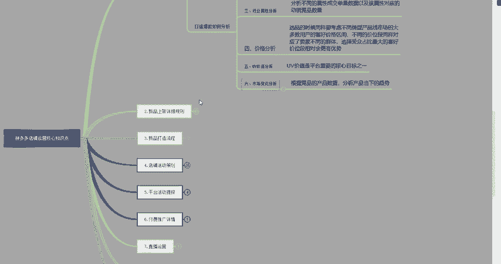

# 【拼多多运营实操教程】中小卖家拼多多开店打造新品全流程教学！跟着实操半个月，爆款成功率翻倍，快速实现日销300+单！ - P32：第32节：拼多多运营爆款分析核心点 - 拼多多-运营 - BV1UN2wY3E5W

hello，大家好，今天给大家分享一下2023年拼多多爆款分析的核心点。那么我这里给大家讲一下，为什么我们还要去分析这个爆款呢？因为在大多数商家运营这个店铺的时候呢，都会把这个精力或者花费啊。

这些都用在这个商品上面。其实很多时候呢并不是你自己操作的问题，也有可能是你产品本身的一个问题。如果说你的产品再不好，你花再多钱，再多精力上面，它还是做不起来。下面呢我给大家展示一个真实的案例。

一个店铺呢。是我自己的一个店铺呢，也是我朋友的。因为我自己的爆款呢是进行分析过的，给大家看一下我自己分析过的数据。

这个看一下，就是9月1号的嘛，差不多访客的话就在46000多。这个支付买家算来就是8000多，转换率达到18。几。大家都可以看到这个UV价值也还是蛮高的嘛。然后再给大家看一下我朋友的。我朋友呢。

他这个数据就是8月22号的嘛，大家看得到他这个支付买家数才600多单，但是呢他的访客其实还挺高的，但是他的转化率并不高。这个呢就可能说明他自己的流量不精准。因为他的产品呢选择的时候就是在市场畅销榜里面。

就是说随便找一个产品直接开始上架，进行了操作，也没有去进行分析啊，这些。然后他这边问到了我呢，我给他分析了一下，分析之下呢，他优化了一下了之后呢，数据呢就慢慢的有了提升。他前几天给我截图了一个数据。

我把他优化之后的数据也给大家看一下吧。这个就是他优化之后的数据，就是在8月27号，这个访客呢就直接涨到了1万多。他这个支付买家数呢也是达到了呢。1000多这个转化率也达到了上升。

大家都可以看到这个真实的数据。这个UV价值呢，这些大家都看得到。好了，这个案例呢就给大家展示完了。

现在我们开始进行正题。这个问题就是说打造爆款的如何分析。大家可以看一下，主要呢分为6点。第一点就是说行业的体量分析，这个呢它是什么意思呢？其实就是说我们在确定一个产品之前。

你自己要去了解一下这个产品当下的一个市场如何，也就是我们所说的产品要做一个详细的市场数据分析，来看一下当前的一个趋势。如果说趋势上涨。那么你就可以操作趋势下滑。那么你就去进行放弃。

然后第二个就是说市场竞争的分析。这个竞争分析呢，其实就是说针对自己所做的一个产品，要去做一个平台的调研。也就是我们所说的竞品分析，分析一下这个买家的。属性是什么？消费的层绩又是什么？

那么卖的人又有多少呢？品牌的竞争力是有哪些呢？然后我们都要去进行分析一下竞品的销量，这个销量是非常重要的，销量越高，才能说明这个产品呢市场数据越高。然后第31点就是说行业的属性分析。

属性分析就是说我们要分析不同的属性成交单量。以及这个塑性对应的动销竞品的数量有多少，可以在里面找出竞争低。同时呢还有一些成交体量的数据逻辑呢，其实就是跟那个分析南海词，大家都知道吧。

这个思路其实差不多的。然后呢，我们在里面选择一些热卖的属性来进行操作就可以了。第四1点就是说价格分析。这个价格呢其实大家都知道是比较敏感的。而且在拼多多里面竞争也是非常大的。选品的时候呢。

同样也要考虑不同类型的产品线，市场的大小，这些都是要考虑，而且你还要去考虑这个产品所对应的人群，他们的消费成绩到做少，喜欢哪个价格的产品。那么你的产品是否做到，可以做到消费者喜欢的这个价格。

如果说可以做到。那么这个也是一个优势。如果说你这做不到的话，那么要不你就换产品，要不你就降低这个产品的价格来满足消费者。然后第51点就是我们所说的UV价值，这个UV价值应该大家都清楚就是。判断一个。

店铺的访客精不精准？如果说它的优惠价值越高，就代表我们访客的质量越高。所以说只要我们店铺内商品开始操作了，操作了就会有数据。有的数据呢我们就要开始去。考量这个UV价值啊，UV价值越高。

代表你的流量质量越高，给您带来的。盈利才会越高。然后第六1点就是说市场变化分析。这个市场变化分析呢，就是我刚才给大家讲的竞品分析，其实差不多就是一个点吧，就是说我们要根据。

竞品的产品数据来分析产品当下的一个趋势。很多店铺呢，由于在产品还没有跟上市场需求的时候，便就可能就慢慢的这个店铺呢，其实是个好的店铺，结果买成了一个死的店铺。针对这一类型的产品呢。

需要不断的去看一下同行的店铺上架一些新款呢，大家可以去做一个更新。这样的话。自己的店铺也会慢慢火起来。然后呢，最终我要给大家说一个注意点，就是说不管你的爆款数质太好，但是也不可能保持一直好下去。

任何一个产品它其实都是有一个存活的周期的。针对这些产品呢，可以通过创新或者是新品布局，或者是通过一些店铺的活动来。提升你店铺的一个销量以及访客的质量。好了。

这一期呢我先把这个打造包款的分析点这6点就给大家讲完。下一期呢，我将继续讲解以下这几个内容。当然。我的内容还是比较多的。干货比较多。下一期我将继续分享这些内容，再见。

