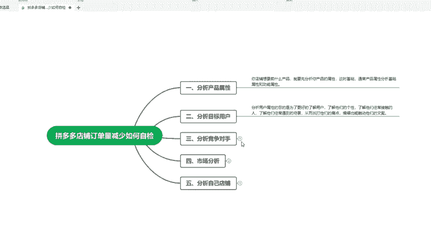

# 【拼多多运营实操教程】中小卖家拼多多开店打造新品全流程教学！跟着实操半个月，爆款成功率翻倍，快速实现日销300+单！ - P33：第33节：拼多多店铺订单下滑如何自检 - 拼多多-运营 - BV1UN2wY3E5W

hello大家好，我是夏木老师。这一期呢我主要给大家分享一下拼多多店铺订单量减少的时候，我们该如何去检查自己的店铺问题。首先我们先看一下整个大纲，整个大纲分为5点。第一点就是说我们分析产品的属性。

这个呢意思就是说你店铺想要卖什么样的产品，就要先分析你产品的属性，这时候的属性就是通常指产品的属性分析，基础的属性和功能的属性，就比如说你这个产品它属于什么材质有什么作用。作用给您带来的优势是什么？

这个地方一定要表达清楚。第二点就是分析自己的目标客户。这个地方就是分析用户的属性，目的就是为了更了解。用户了解他们的一个个性，了解他们经常触碰到的一些人，了解他们经常遇到的场景。

那么从这些地方找到他们的痛点，编辑出能触动他们的一个文案，就是说根据客户的需求来匹配相关的产品，这样的话才有效的能提高访客，以及提高转化率。第三一点就是。我们要分析竞品，这一点是非常重要的。

分析竞品就是说你在决定开这个店铺之前，那么你就应该有一个详细的规划，就分析行业现状及后期的发展前景，你可能都要做一个详细的规划，分析竞品对手，那么要选择什么好的款式，那么竞品外卖这个款式卖的好。

那么可能才能说这个产品的市场比较大，需求量就比较大，做好产品的一个布局。就比如说利润款活动款引流款这些只要把内容修改，那么你可能才能主动的去出击找准方向。

预期其中，你不要盲目的去操作，什么都没有去做，就直接开单。开始让你产品进行操作，这样是完全不对的。

然后第四1点就是说市场分析，市场分析我们就要分为两点。第一点就是增量市场。第二点就是存量市场。增量市场。就比如说你现在的店铺已经做的很不错了。为了明年或者后年的发展，有可能呢已经着手开始找到新的产品。

这个时候呢，你需要数据去分析一下，这个产品的当下市场或者是以后的市场该怎么样，这对后期的一个决策是非常重要的。如果说你这一步做了，那么后面所做的极有可能就。

泡汤了，知道吧？所以说大家在做一个新品的时候，那么肯定要看一下这个产品后期的发展，再想想下一步该怎么去做。第二点，这个存量市场就是说任何产品的销售，它会有一个生命周期。就比如说旺盛期平稳期衰退期。

更多的买家所选择的产品就会处于相对稳定的阶段，以及是一个存量市场，作为一个合格的经营呢，那么你需要不断的去思考你现在产品所处的这个市场需求量。大不大？😡，若。处于一个衰退的阶段。

那么你这个时候就要重新去换一下产品。就比如说服装这种季节性产品，像一些水果也是季节性产品。如果说你现在78月份。夏装。夏装过了之后，就是秋装冬装。那么那你可能在秋冬的时候卖。夏装的衣服。

那么肯定就会处在一个衰退期，这个地方肯能就不太适合操作了。这个时候旺生期才是夏期，知道吧？所以说这个地方一定要去分析。

第五1点就是分析自己的店铺，这个地方就是说清楚的自己了解自己店铺的一个实际情况，就是查看店铺上是有没有什么违规呀。无论是店铺违规还是单品的违规，都会导致你店铺的质量分下降，在店铺导向搜索的趋势下。

这时候你的自然搜索排名一定会有下滑的。流量下降，又会引起你店铺的层绩下降。

所以说然后要进一步的限制你免费自然流量的获取恶性循环。所以说大这个地方大家就要去检查一下自己店铺的指标，这个也是相当重要的。如果说你的店铺指标太低，那么你就要做好一个。售后，那么把这个指标提升起来。

你的商品的权重，店铺的权重才会提高。那么这个时候呢，你的自然流量也会提高。好了，这一期呢我已经把这个全部的内容给大家讲解完了，一共5点，大家有不理解的可以来咨询我。这一期的。

内容就给大家讲完了，下一期将继续分享一些拼多多的运营知识点，再见。

