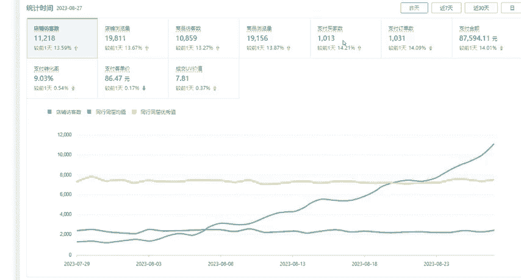

# 【拼多多运营实操教程】中小卖家拼多多开店打造新品全流程教学！跟着实操半个月，爆款成功率翻倍，快速实现日销300+单！ - P34：第34节：拼多多运营付费推广诊断 - 拼多多-运营 - BV1UN2wY3E5W

hello，大家好，今天呢我给大家分享的是2023年拼多多的一个最新的和序运模式。我在这里为什么要说它是一个最新的核心模式呢？因为我自己目前经营的这个店铺。就是通过这个模式操作起来了。

我根据自己的经验给大家总结了9点。首先我先给大家看一下我自己店铺的一个数据。

首先大家看一下吧，这个地方是多多搜索的数据，近90天的数据。然后呢，花费在8万多，交易额可以达到183万以上。然后呢，投产呢做到了22。08%。然后再给大家看一下我自己店铺的一个。

总数据这个地方我给大家看的是一个9月1号的，这个大概大家都看得懂吧，就是访客数2万差不多。然后的话支付买家数达到了4000多，也是在一个上升的趋势。支付转换率就是在20%以上了，大家都看得到。然后呢。

我给大家分享的内容呢，其实就是说主要提升我们店铺的这些数据了。

然后呢，这一期我先给大家分享这个第一点，产品市场分析的一个付费推广诊断。那么我们为什么要去诊断这个？付费推广呢，我就给大家举个最真实的例子吧，就是说我身边的一个朋友哈。

他前几年自己店铺的数据还是相当可以的，几一天的话基本上也是几千单。然后呢，他这个地方就开始松市，基本上就没怎么管自己的店铺，就认为自己也可以一直好下去。然后呢，今年拼多多改了一些规则，大概应该。

大家都清楚，就比如说这改销量，很多销量都被删除了。然后呢，他自己就是因为这个删除店铺的销量呢被删除了50%的样子，结果数据就下滑了很多。他这个时候就比较错折。不急了，然后就不知道自己该怎么去操作。

优化了以后呢，也没发现效果，然后才问到我这边，我就根据我自己的一个经验给他说了一下，把这个总这个运营知识点给他发过去。然后呢，他就根据我给他说的优化了一下。然后他前几天给我发了个数据。

我把这个数据也给大家看一下吧。

这个数据就是他建不来，就是8月27号的，大家也可以看到这个数据呢，大家也看得明白，基本上都是在上升的一个状态。现在的订单基本上一天就是1000多单，也是没有问题的。

好了，数据呢就给大家看完了，我就给大家进入正题了。首先我们看一下这个付费推广分为几点。主要呢其实分为4点，就是第一点，就是我们开推广的时候没有流量，流量太少是什么原因？第二个就是说我们开推广的时候。

点击率太低，是什么问题。第31点就是平均点击话费太高，它又是什么原因呢？第四1点就是转化率太低。这种情况我们先去怎么优化。首先我先给大家讲解第一点。

第一点就是说我们为什么流量少这种情况其实大家应该都测试过，就是我们产品刚上架的时候，我们可能用搜索值或者是全标题都搜索不到。因为这种情况下，你的产品它是没有权重所言的，也就是我们自己的产品销量太低。

评价太低，没有权重排名。所以说导致你搜索不到。这种问题我们该怎么去解决呢？就是说你上架以后可以把链接分享给你的朋友啊，这些让他们帮你做一些坑产出来，做一些销量做一些评价基本上呢你的搜索就可以提高。

并且你开推广的时候也可以拿到流量。第二个就是点击率太低。这个点击率太低呢，我们分为两点，就是说标题和商品的价格。首先我们要先。检查一下自己的标题是否用的正确，是否可行。比如说你这个标题关键。词选择错了。

那么你这个。关键词的点击率就会影响你整个推广的点击率。其次就是说价格。你如果你的价格就是高于了同行，那么你就可以考虑一下降价或者是换一个款式来进行推广。如果说你的价格还可以降架。

那么降价你不要直接去修改原价。我们可以通过一些营销工具来进行。降低这个价格就可以了。然后第31点就是我们的平均点击发费太高，是什么原因呢？其实这个的话，首先在于你刚开始设置推广的时候。

一个选词上不同的阶段呢，不同的类型产品就有不同的一个选词。比如说你这个推广才刚刚开始的时候，就是你在初期的时候，建议大家呢选择的关键词呢不要选择太大的值大值反而你的排名拿不到，反而你选择那种热度中等。

反而呢它的转化率比较高的词，这样的话比较好。因为转化率越高，反而它的访客越精准。相对来说你选择一些精准的长位置，这样的话数据比较好。然后等你的推广数据起来以后，你再去开这个大字都是可以的。

第四一点就是说转化率太低，转化率太低就主要分为3点。第一点就是我刚才说的嘛，你基础的评价，基础销量太少了。那消费者看了你的产品，这些东西参考的数据太少，他们就会失去一个信任度。

那么肯定就不会太去买你的产品。第二个就是详情页和主图有没有问题。因为详情页它是直接影响到你的一个商品的转化率的。它个主图呢，你就要看一下是否已把产品的卖点完全的展示出来了。

这个卖点直接可以影响你产品的一个点击率和点击量。然后第31个就是SKU的设置布局是否有没有问题。这个布局呢，大家可以参考一下竞品的一个布局，就是说价格怎么设置的，它的SKU怎么去设置这个。

文字上面怎么表达给消费者的？比如说他们会设置一些店长推荐，然后店铺热销，然后把这个SQU设置出来，大家都可以根据我给你。说了这个去进行优化一下。好了，证据七呢，我关于这个。付费推广的一个诊断。

这四点就先给大家讲解完了，希望这一期看完了也对你有所帮助。下一期呢我将继续分享拼多多的运营干货，再见。

