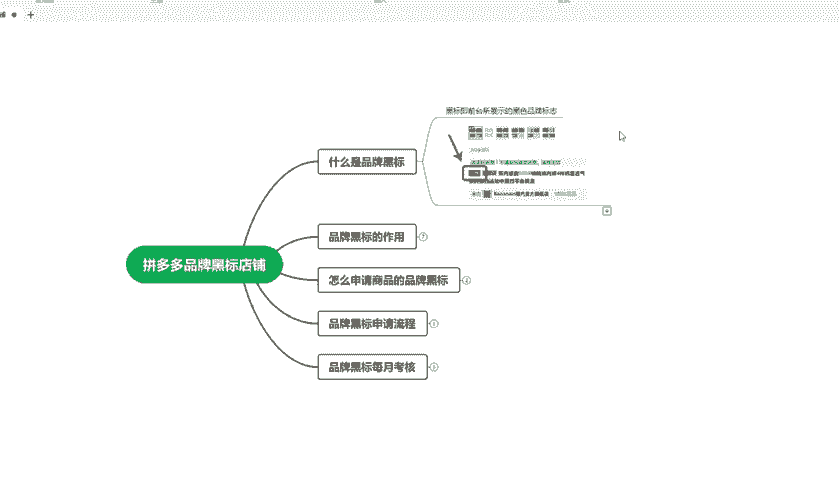
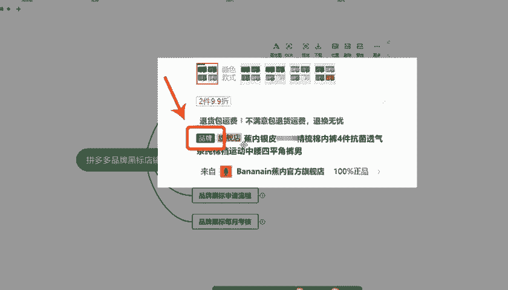
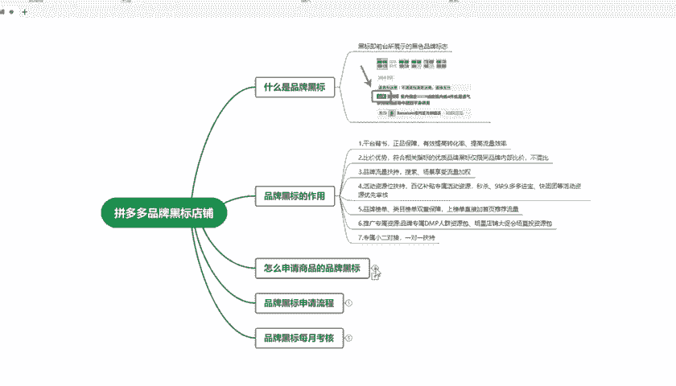
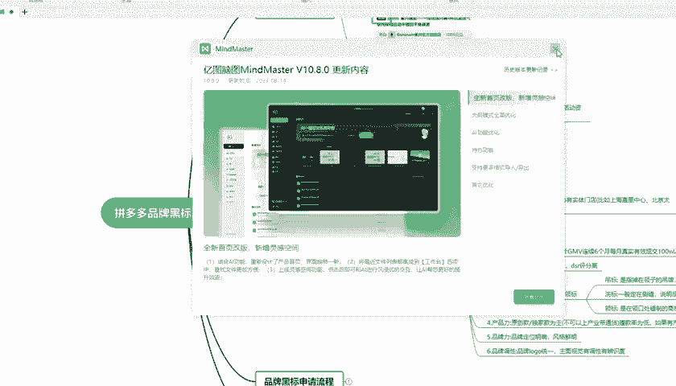
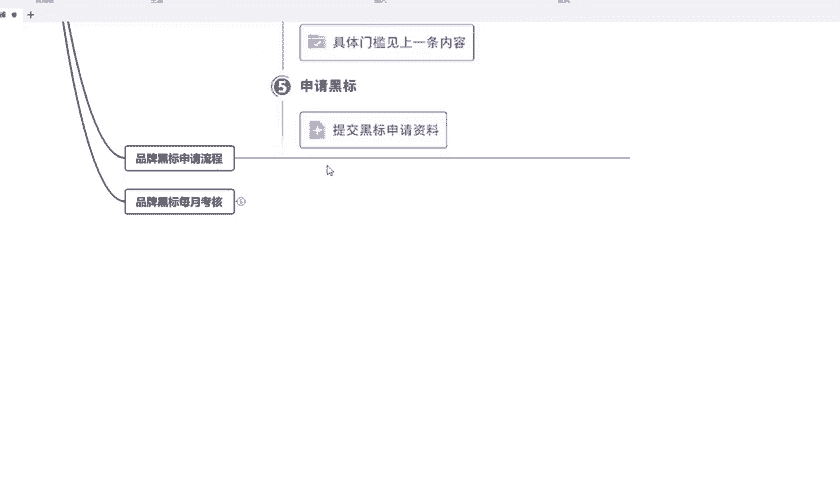
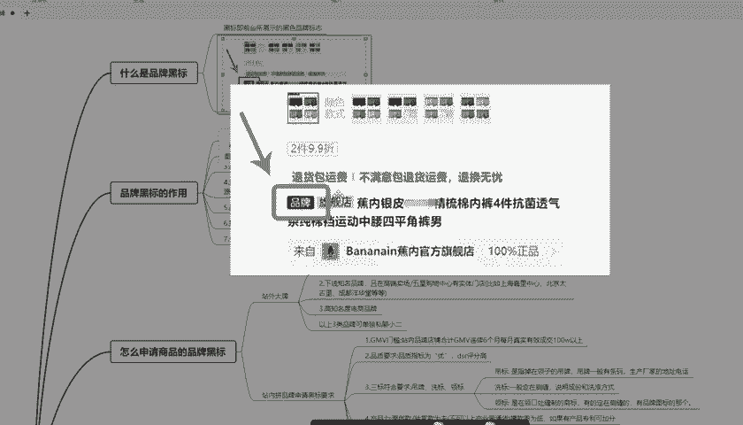
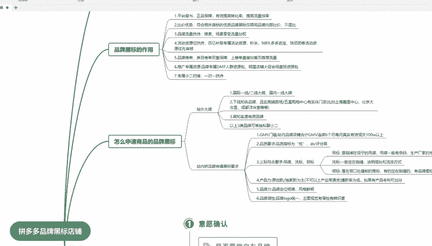

# 【拼多多运营实操教程】中小卖家拼多多开店打造新品全流程教学！跟着实操半个月，爆款成功率翻倍，快速实现日销300+单！ - P35：第35节：拼多多品牌黑标如何申请 - 拼多多-运营 - BV1UN2wY3E5W

hello，大家好，我是夏梦老师。这一期呢我主要给大家讲解一下拼多多品牌黑标的店铺。那么我们首先先了解一下什么是品牌黑标。品牌黑标的话，但是就是在那个标题的前面展示一个黑色的标志，就像这个样子。

它展示一个品牌。我们简称它为黑标。那么。

这个黑标它的主要作用是什么呢？主要作用就是分为7点。第一点就是说平台背书。正品保障有效的提高您店铺的一个转化率，提高流量的效率。第二点就是比价优势。

符合相关指标的优质品牌黑标仅限同品牌内部比价就是它不会混比，这样的话也是有优势的。第31点就是品牌流量的扶持搜索场景享受的流量加权。第四1点就是活动资源位扶持，百亿补贴，专享活动的资源秒杀呀，9。

9块多多进榜快团团等活动，资源位都会优先的给你审核，审核通过的概率也会很高。第51点就是品牌榜单。内幕榜单双重的保障上榜单以后呢。就直接加入到了首页这个推荐流量。在活动里面。活动的流量也会更多。

第六点就是推广专属资源品牌专属的。人群标签资源包明星的店铺大促会场就会直接投入到资源包里面，这个也是一个很好的推广数据。第七点就是会给您对接一个专属小二一对一的扶持金给你的店铺。所以说。有这个品牌黑标。

那么是相当好的一个作用。那么我们怎么该去给我们的商品申请这个品牌黑标呢？

那么主要分为两种。

第一种就说站外大牌。第二点就是站内拼品牌申请的黑标要求。那么我们先看一下这个站外大牌是什么。站位大牌呢，它就分为国际一线、二线大牌、国内一线大牌这种。第二点就是说下线的知名品牌就那一些高端的卖场。

比如说那些。北京太古里亚、成都又氧花糖，那么有这些大品牌都是可以的。第三1点就是知名度要高电商的品牌。你不要随便一个。知名度很低的品牌，你都要去申请，那么肯定这样是并行的。

那么如果你满足上面这个条件的话，你就可以去单独的私聊小二，让小二给你审核。那么审核通过以后，就可以拿到这个品牌黑标。然后就是站内品品牌的申请黑标要求。第一点就是说成交额门槛就是站内的品牌店铺合计。

成交额连续6个月，每个月的真实有效成交必须要达到100万以上。这样才可以。第二点就是说品质的要求，品质。指标为U的DSR评分要高，这样也才可以。第31点就是。商标符合要求，就比如说吊牌洗标领标。

这里我给大家备注了，就吊牌的话就是指吊在名上那些吊牌吊牌一般就会有条码生产厂家的地子电话之些都必须要有这个。这个就是洗标洗标的时候一般在测缝，就说明这个。成分和洗涤的方式。

然后这个就是领标领标一般在领口处会有一个红字的商标，有一定的侧缝的。有些呢它是定在这个侧缝的，那么也会有一个品牌图标的那个这样才行。第四1点就是产品力，这个就是原创力啊独家款为主，不可以上产业代通款。

撞同款的为D这样的也才行。如果有产品专利，那么你这样的话更加分。第五1点就是品牌力，品牌力定位明确，要风格鲜明，这样才行。第六1点，品牌调性就是品牌的logo要统一。主图的视觉有调性，有识别力。

这样才可以。那么品牌我们该怎么去申请呢？申请的话，这里有一个大纲，大家可以看一下，就意见就是如果自己想要做品牌黑标，那么品牌的规划就是品牌定位啊，品牌规划商标的申请入住开店。

就是品牌必须要那个旗舰店这样才能开设多店铺规矩服法，那么你就可开几个旗舰店这样达到黑标，就是具体门。然后就接上一条内容就是这个地方。就提叫A这个。申请黑标的资料审核通过以后呢，那么你就会有一个这个标签。

就是像我们上面你大着标的这个品牌标签。

然后我们最后再看一下它这个黑标也是有考核的。考核指标就是说品牌的质量分、平台求助率、品牌状况率、领航员排名这些。那成交额考的话就是品牌的成交额要排名要前80%，站内的品牌成交额要达标。

调性的考核就是视觉调性，款式原创率、抽检考核就是品牌抽检呢，还有商标合格率，品牌包装合格率，这些都是要检查的，其他的话就是一个品牌主体管控能力、货品品控率，这些都是要检查的。好了。

这一期呢我已经把这个拼多多的黑标店铺。详细的内容给大家讲解完了，希望可以帮到你。下一期呢我将继续分享一些拼多多的。运营字识点。感谢您的观看，再见。

