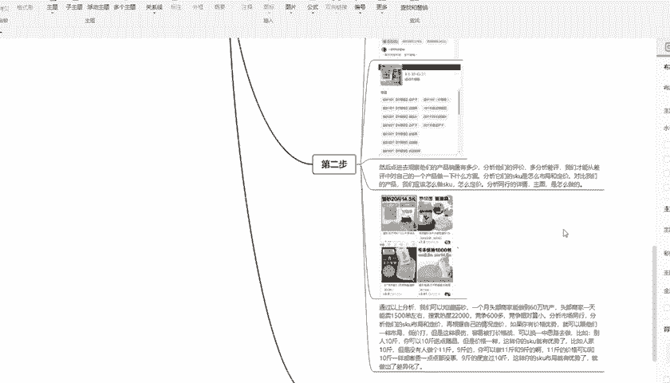

# 【拼多多运营实操教程】中小卖家拼多多开店打造新品全流程教学！跟着实操半个月，爆款成功率翻倍，快速实现日销300+单！ - P36：第36节：拼多多利用市场数据选择爆款 - 拼多多-运营 - BV1UN2wY3E5W

hello，大家好，我是夏马老师。这一期呢我主要给大家讲解一下拼多多如何分析市场数据来选择爆款。首先我们看一下整个大纲分为6点。首先我先给大家讲解一下这个数据分析的目的是什么。主要目的就分为4点。

第一点就是掌握产品目前的一个运营情况。第二点就是预测产品发展的整体趋势。和季节性这些方面都要去参考。比如说我们做服装，这种就是一个典型的。记忆性产品。第31点就是发现产品的痛点问题。继续的提出优化方案。

可以把那个痛点优化以后，作为卖点来展示你产品的一个优势。这是四点就是说找替代产品。要做一个差异化，这样的话可以提高你产品的一个竞争力。然后第二点就是说数据分析的思路我们分为四点。

第一步就是说确定数据分析的目的，要确定分析产品的关键影响维度。这个就是说。他数据的好坏也决定了我们产品。市场的好坏。那么第二点就是说我们要去收集这个数据。

收集的数据说产品的市场走向、关键词的排名情况以及排名上升快的竞争对手，这些情况都是需要去了解。第三点就是说整理数据，比如说销量啊、评价数据、店铺分质量、店铺商品数量，这些都需要去进行查看。

然后的话就是说第四一点。分析这个数据。分析数据就是说提出开发的建议，并确认产品利用手中的数据，从而来判断首次发货。数量和这个营销的一个计划，大家都可以去参考一下。这里呢我给大家举个例子。

群例的话可以看一下，我这里是用这个猫砂给大家举例的哈。我们先分析就大概分为了三步，我给大家做了个简单的总结吧。就是说首先我们要。了解这个产品在拼多多，它有多大的一个市场容量，卖的最好的那几家有多少单。

就是说日销量是多少，多少坑产，多少。一个月的看产单又是多少？我们可以利用拼多多收商家后台去查看这个关键词的市场数据。那么也可以用第三方数据查看。

竞品的这些数据。那么就比如像我这个给大家截图的这个箱包杀，它这个搜索入度，搜索入度是多少？那么就比如说这个产品在拼多多有22000的搜索热度，那么竞争指数在626。初步的判断呢。

这个还是其实还是比较可以的。那么可以知道这个行业的平均点击率转换率主要关键词有哪些？关键词的市场出价又是多少？这个大家都可以看到。

第二步呢就是说我们要查看一些竞品的数据，就是说像这个竞品，它评价有多少。然后上回有哪些活动，大的SQU怎么布局的，这些都需要去查看。这样的话我们才能从差评端。它这个评价要多看。

就要从差评里面找出一个产品的优化方案，婚姻要分析他们的SQ怎么布局，怎么定价。对，比我们的产品，我们的产品该怎么去做这个规格。分析同行的竞品啊、详情页、主图，这些都是要去看的。通过以上的分析呢。

我们就可以大概知道这个猫砂一个月的头部商家呢可以做到60万。大家都可以看到这个地方。

这个地方呢就是说。做了60万，头部上家一天呢就大概1000多单。搜索热度大概就是2万02。竞争呢就600多，竞争其实600多其实算比较低的啦。分析市场同行，分析他们的SKU定价，再根据自己的情况来定价。

如果你的价格有优势呢，就可以跟他们一样的布局低价打。那么这样的话可能对于你来说比较商吧。就是打价格战。那么这种情况下，我们可以换一个思路去做。比如说别人1斤你可以10斤送点赠品，但是价格要一样。

这样的话你的SKU就比较有优势。比如说人家10斤。但没有人做11斤酒精这样，那么你就可以做个11斤酒精这样的一个差异化。11斤的价格呢可以和10斤的价格呃稍微贵一点，其实都没关系，毕竟你能量用多一点嘛。

但是酒精呢你要便宜过10斤。这样的话你还可溜那个布局的话和定价都是会有优势的，就做成了一个差异化。第三步第三步的话就比较简单，就是产品的一个要求。产品的要求是，首先它需要满足产那个市场的需求。

因为这个需求越大，那么代表我们产品的后期的市场才会越好，确保卖家所做的产品能够体现视频的一个销量。而数据的大小则取决于团队大小的匹配来判断而定。当然，在风险控制方面呢。

也就是说卖家的质量与侵权这两个关键点上面，这两点呢也是最核心的地方。最后的话就在竞争力上面，价格呀差异化及产品的。是带这些都是本小事的。所以说大家在这些方面都需要去。进行了详细优化。好了。

这一期呢关于拼多多如何分析市场的来选择爆款。这个大概的一个疗程呢就给大家讲解完了。后期的话我会将这个知识点给大家详细做一个简单的操作。大家有不明白的可以来联系我。

下一期呢我将继续给大家分享一些拼多多的运营知点，再见。

