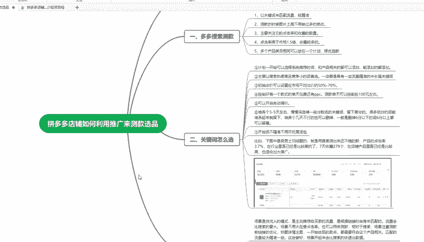

# 【拼多多运营实操教程】中小卖家拼多多开店打造新品全流程教学！跟着实操半个月，爆款成功率翻倍，快速实现日销300+单！ - P37：第37节：拼多多利用推广来测款选品 - 拼多多-运营 - BV1UN2wY3E5W

hello，大家好，我是夏木老师。这一期呢主要给大家讲解一下拼多多店铺如何利用推广来测款选品。首先我们要了解那个潜力款的要求是什么，那么肯定是点金率要高，收藏量要高。那么我们该怎么去测款呢？

首先我们要看一下多多搜索测款的方式方法。这个地方就需要以关键词来匹配流量，这样的话就会稍微精准一点。流量越精准，那么你的数据判断起来才会更精准。第二点就是说测款的时候，图片上面不要做过多的修改。

就是说不要修改的太大。就是最好就是原图就直接往上放这种最好。第31点就是主要关注它的点击率和收藏的数量，这个是关键。因为在前期测试的时候，你的基础可能做的就不是太好。基础的要就是指基础销量。

基础评价这些。这个时候呢你就不要去要求什么转化，最主要关注点击方在点击率和收藏上面。第四1点就是说点击率要高于市场的1。5倍。这个市场的1。5倍呢，是指的是这个产品的关键词，市场点击率的1。5倍。

收藏一定要多，收藏的话我们可以以10%的收藏率来作为。判断标准。第51点就是多个产品类目相同的，那么可以放在一个计划里面择优选款。这个地方就是说把所有的项目那个产品呢放在一个计划里面。

测试34天之后来通过数据删除一些数据数据差的，把那个数据好的，留下来。这样的话就是择优选款就可以了。那么。这个关键词我们该怎么去选呢？

这个地方就是说计划一开始的时候就要选择系统推荐的词和产品相关的词都可以添加，能添加的都添加。因为在前期的时候，你可以添加多一点词。后期的话你还要进行筛选的，知道吧？

第二点就是说主要以搜索热度高竞争力小的的词来作为首选，一定要具有一定流量精准的中长位词。这个时候。常位是越精准越好，不要一开始就进行选择大尺。

第31点就是初始出价可以设置在市场平均出价的50%到70%之间。第四1点就是控制好每一个款式的当天花费，还有PPC这个PPC就是每。平均点击发费收款当天呢，就可以控制在100块钱日限额左右就可以了。

第五一点就是可以开启这个自动调价。自动调价呢，大家不要开的太高，开的太高的话，可能花费就比较高。第六点就是培养个3到5天，慢慢筛选一些分数低的关键词，留下质量分高的很多低分的词可能培养起来了。

那就可以留下。那么培养几天不行的话，也可以同时删掉，一般删掉六分以下的词，六分以上的呢就可以先留着养一下。第七点就是。开始死的时候。不要去开什么精准。扩展包这个开起来可能就会影响影响你流量一个精准度。

比如我这里给大家举个例子，下头里面就是一个蓝士羽绒服的，就是用搜索测试的还不错的款。产品的点击呢3。7%，在行业里面就比较算高的，7间的收藏呢达到了279%个，在店铺产品里面也算比较高的。

那么这种情况下。

我这个产品就可以进进行大力的推广，这个地方就这个样子给大家显示一下，看一下。

然后就是说我们利用多多搜索来进行测款。多多搜索。大家都知道这个推广的模式呢，它属于货找人的模式是主动推荐给买家的流量，是根据链接的自身来匹配的流量会比搜索的要大。

但是场景你不要太在于这个点击率也可以用来测款，相当于搜索场景注重于测管前链接的优化标题详情主图，一开始体现的卖点都需要符合这个产品的相关才行，匹配的流量，那么才会更精准一些。

这些做好场景开起来就会比搜索更快速的出流量，一个款式能不能做呢？那后期能不能做报呢？需要建立在测款之后的数据基础之上，因为有了数据我们才能去判断这个。款式行不行？这款前期大家就不用花过多的钱。

在这个产品上面可能一一天100就差不多测个5到7天就差不多5到800块钱。对这样就可就不要盲目的去推嘛。一个产品时好时坏，那么就可以从这个数据里面查看到有一些产品做不出来，就不用纠结，足够。

保证能够挣钱稳定的赚钱，那么就可以了。所以说大家就可以根据我这一期讲的这个用推广来进行测评。选品来进行操作一下。那么这一期的内容呢也给大家讲解完了。下一期呢我将继续分享一些拼多多的语音知识点。

感谢您的观看，再见。

