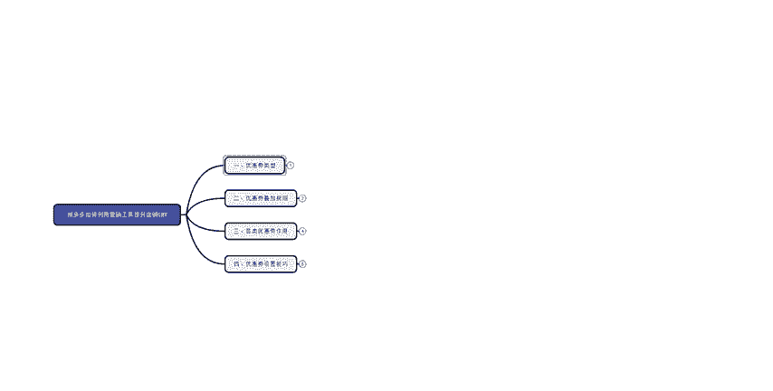
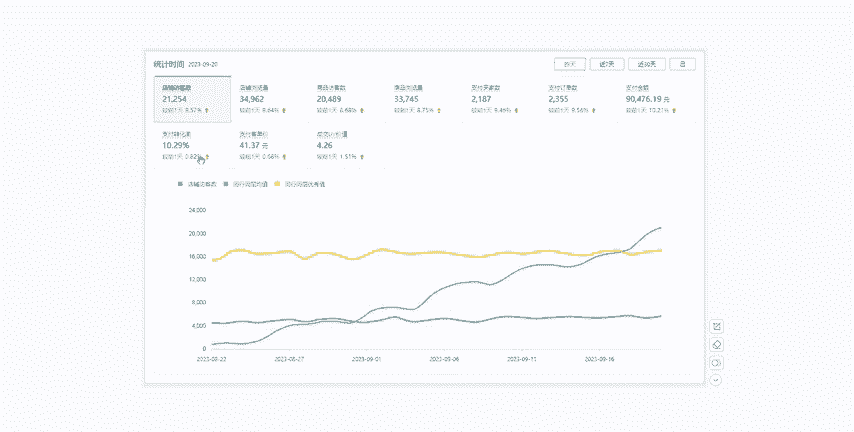
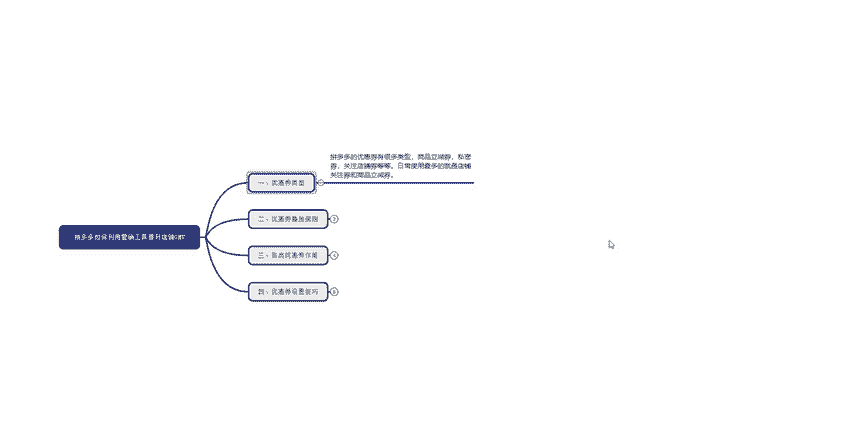
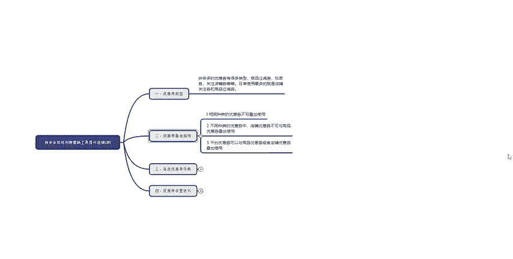
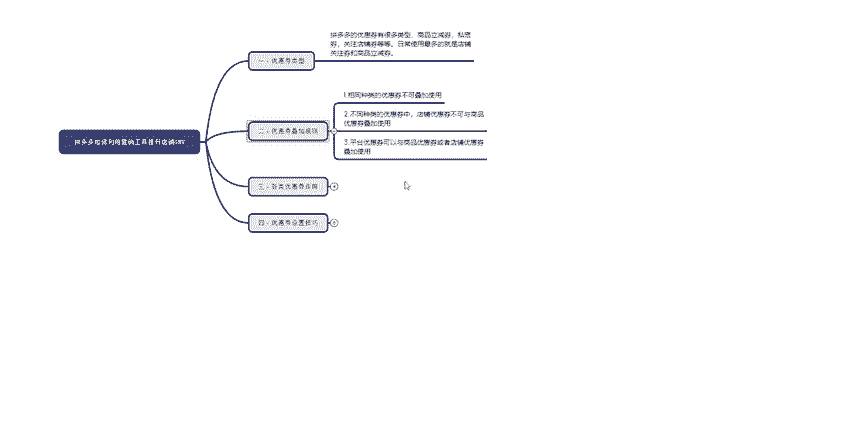
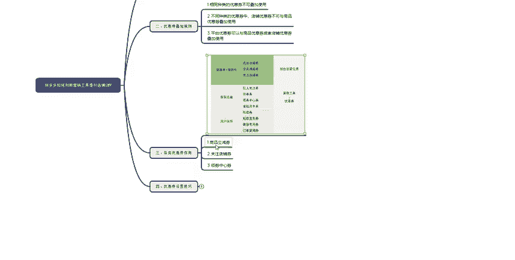
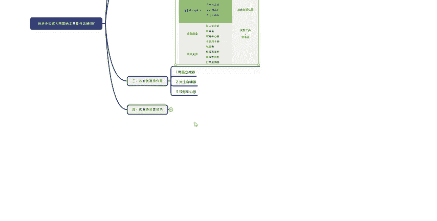
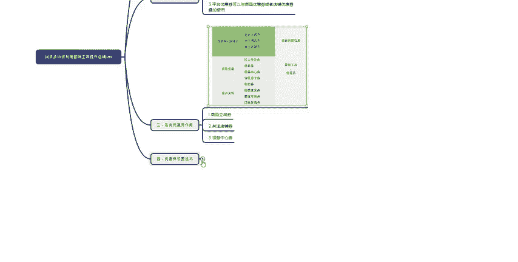
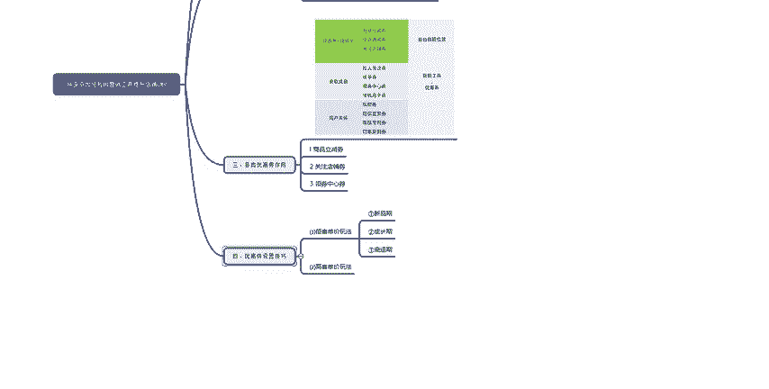
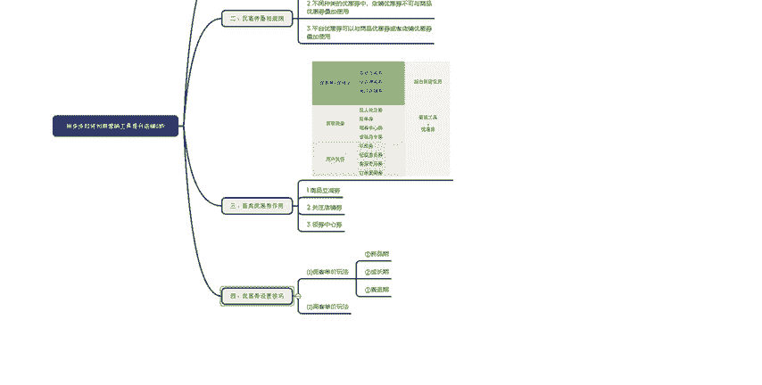

# 【拼多多运营实操教程】中小卖家拼多多开店打造新品全流程教学！跟着实操半个月，爆款成功率翻倍，快速实现日销300+单！ - P38：第38节：拼多多利用营销工具提升店铺成交额 - 拼多多-运营 - BV1UN2wY3E5W

hello，大家好，这一期呢主要给大家分享一下拼多多如何利用这个营销工具来提高我们整个店铺的。成交金额主要我们先看一下整个大纲的内容，整个大纲呢分为四点。这四点呢也是我自己在做店过程中总结的主要核心。

这里呢给大家看一下我自己利用这四个方式做出来的数据。

首先给大家看一下这个。店铺这个店铺的话，我统计的时间就是给大家看的是9月20号，大家都可以看到访客的话大概是3万多，支付买家数也是3000多的样子，支付转换率呢达到了近10%，优惠价值呢也是快接近五了。

大家都可以看到这个真实的数据哈。然后呢，再给大家看一下我另外一个店铺的数据。另外一个店铺呢，这个数据要得稍微低一点。然后反馈的话就是202万多吧，然后支付买家数就是2000多。当然这个时间都是20号。

大家都可以看到这个转换率就稍微要高一点。因为呢他这个店铺的。流量精准一些，所以说它的转换率达到了近11%。但是呢它这个UV价值就要稍微低一些。好了，这个地方呢案例就给大家看完了。首先我给大家。

开始讲解这个正题。首先大家先看一下这个优惠券类型，大家可能很多人都不太了解这个拼多多里面有哪些优惠券。其实优惠券就是主要分为商品优惠券、私域券、店铺关注券。然后还有那个店铺满减券等等。

这个的话都是我们自己用的比较多的。但是。很多人都不知道这个优惠券在使用的时候，它会有怎么样的一个叠加规则。大家可以看一下，这里呢我给大家总结了3点，这个就是说相同种类的优惠券就不可以叠加使用。

比如说两个商品优惠券，但是呢它一个是20，一个是50。如果说你这个产品同时满足了这两个优惠券的。

使用要求，但是你只能使用优惠额度高的这个不能使用低的这个的话就是说。不能同时使用。第二个就是说不同种类的优惠券中，店铺优惠券不可与商品优惠券叠加使用。这个大家应该都了解，就是说店铺优惠券。

然后和商品右券，你就只能选择一个来进行使用。当然还是说。哪个优惠权高金额的。高一些，但是你两个都满足，那么就会给你优先让你使用这个优惠额度高的优惠券。

上一个就是说平台的优惠券可以与商品的优惠券或者是店铺的优惠券叠加使用。平台的优惠就是说像你报名了，它有一些报名的会有一些活动啊，活动里面它有一个优惠券，还有一个领券中心啊。

这些可能它就会领取商品优惠券或者是店铺优惠券进行。叠加使用。第三一步就是说这个优惠券的作用，大家可能都不太了解它怎么使用。其实主要给大家总结了4点吧，这大家可以看一下这个图吧，这个图主要是如果说就是。

客人讲就是主要是要。把这个课程量提升，还要提高这个转换，你们就可以去使用一下商品立减券啊，还有权店的满减券，还有这个店铺的关注券。如果说你只想获取流量，对于新品来说哈，你可以去设置一个拉人关注券。

拼单券领券中心还有省钱月卡啊，这些都可以。用户关怀的话，这个就是说你用于。做这个订单复购的话也可以，这个的话就可以设个私密卷啊，短信直发卷、客服专用券订购。还有这个订单的复口权，这些都还是可以使用的。

然后我主要给大家分享一下这三点。第一个就是商品优惠券。这个的话其实就是说主要是用来提升你单品的一个转换率。主要是你设置一个门槛，当然你也可以设置不不使用门槛。但是的话它这个商品优惠券，大家要记住。

它要影响你这个商品的历史最低价。第二个就是说关注的店铺券。这个的话其实说对于新品来说呢，新店来说，你可能整个店铺呢刚开始店铺的人气权重比较低。

那么你就可以通过这个店铺关注券来提高你商品以及店铺的整个人气和粉丝带动店铺的综合权重。第31点，领券中心的券。这个的话，它其实是一个平台的活动，它有固定的资源位消费者可以在领券中心这个资源位呢。

或者是在商品的详情页可以直接领取这个优惠券。店铺的话也会因为你报名这个活动获取到高额的流量。第四1点就是说。

优惠券的设置技巧，其实大家可能都不太了解这个优惠券在什么时候使用，怎么样去设置合理。这里的话我就给大家分享一下。

第一个就是说我们第一课单量往下，这个的话我们主要分为三个阶段。第一个新品期。新品期的话，就比如说你新品刚刚上架，想让跟它快速破零。这种情况话的话，你可以使用一个凑单专区或者是多件优惠，多件优惠。

你可以绑定这个。你自己店铺卖的好的爆款，这样的话就可以促进这个新品的单品转化。第二个就是说成长期这种情况的话，你就是会去报名一个活动。如果说你报名这个活动以后，但是呢这个产品在活动里面的表现不太好。

那么你就可以设置一些营销工具，就可以。比如说。限时限量、评价有礼，商品优惠券或者是店铺优惠券，这些的话就可以刺激客户，让客户在短时间以内可以付款，大幅度的成交，提高你这个单品的成交金额。

第31个就是衰退区，衰退区可能就是说你报名的活动以后呢，这个活动。结束了你的产品下来了，这种情况下，你就要去设置一个营销，不然的话它的价格它就发发生变化发生变化呢。

你的店铺的流量或者是商品的流量可能就会处于一个下滑的状态。所以说你这个时候就可以去设置一些。短线营销或者是。限时限量把这个折扣设置大一些，还可以设置一个新客专享券，这些都是可以的。然后呢。

就是说高客单家的玩法是什么？高客单家就是主要是你利润在40%以上参加活动呢，还有付费这些都是极其优势的。因为你去参加这些活动或者是推广啊，你都不会亏钱。而且利润也还蛮高的。

那么你就可以利用付费推广加营销工具的方式来进行操作。营销工具话你可以设置一个短信营销啊，就是说提醒那些买家，你店铺的现在在搞一个活动，让他们。

光顾一下您的生意啊，这些优惠券的话，你就可以设置一个领券中心店铺关注券这些就可以了。好了，这一期呢我就把这个拼多多的营销工具使用的方式方法给大家讲解完了。下一期呢我将继续给大家分享一些我自己的干货。

给大家可以看一下我自己这些干货都是可以给大家分享的。如果有不了解的，也可以来联系我。好了，这一期的内容就给大家讲完了，再见。

有什么不了理解的，也可以联系我。