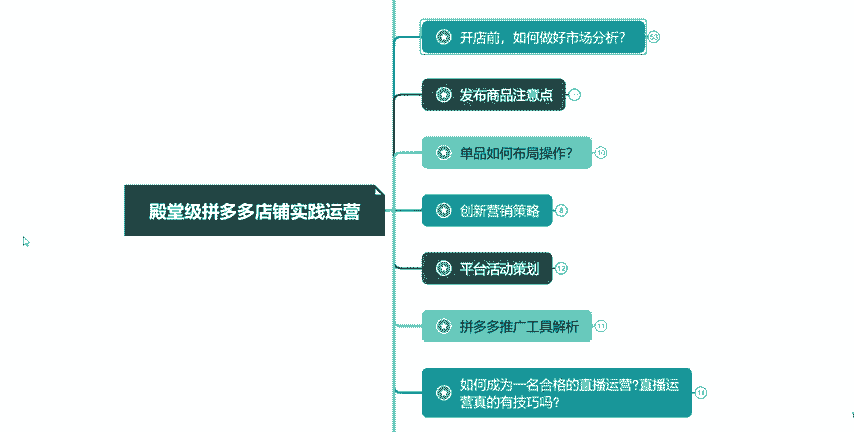
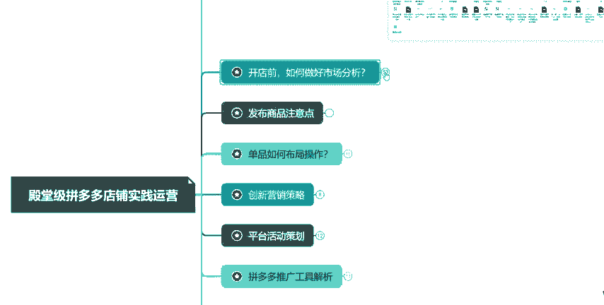
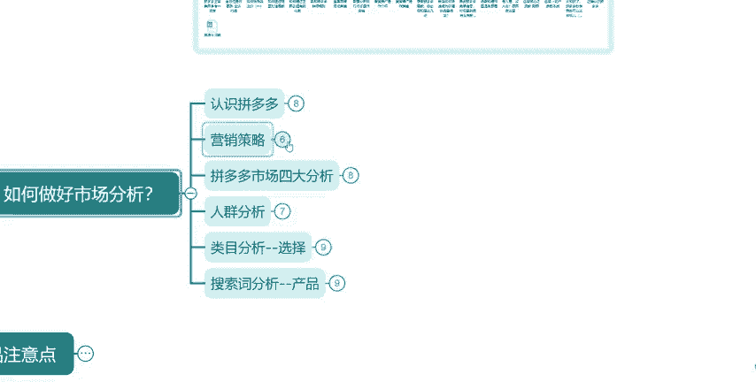
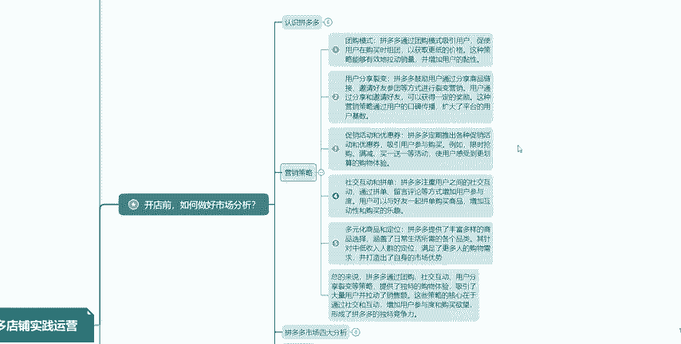
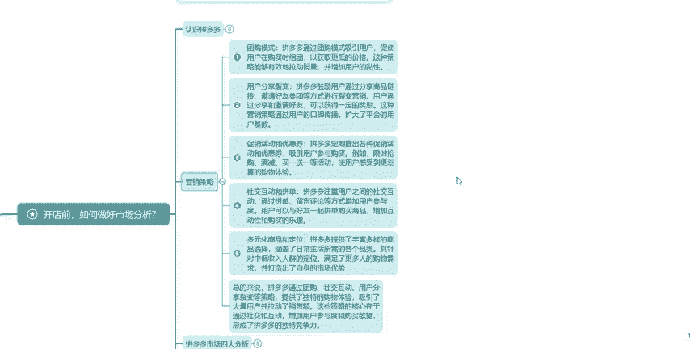
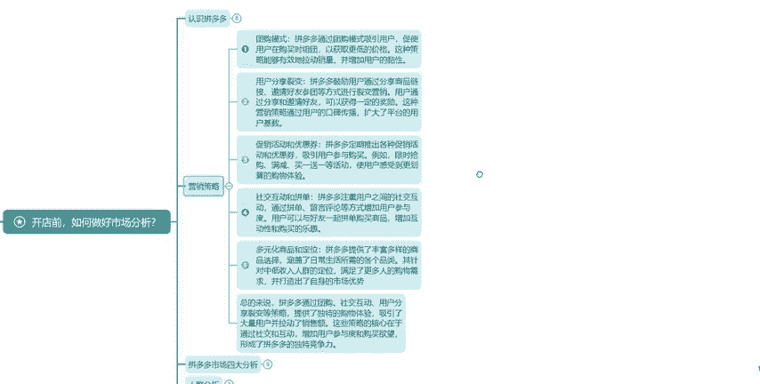
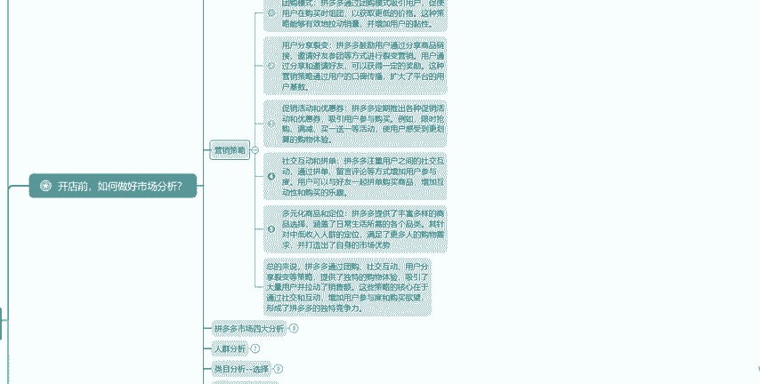
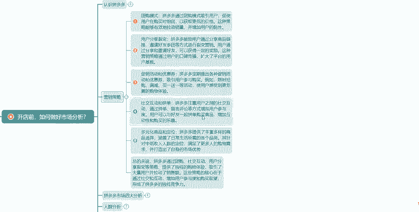
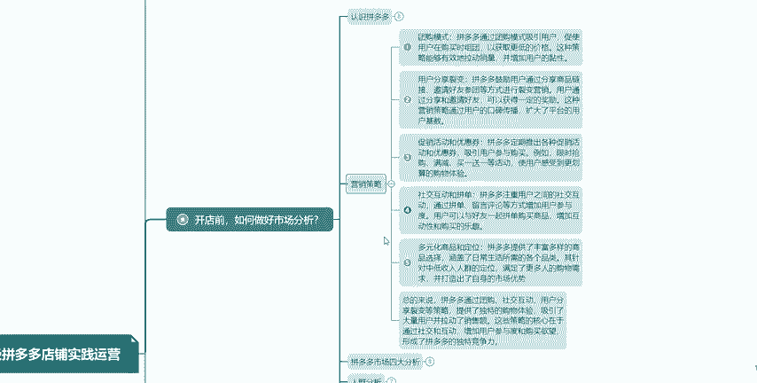
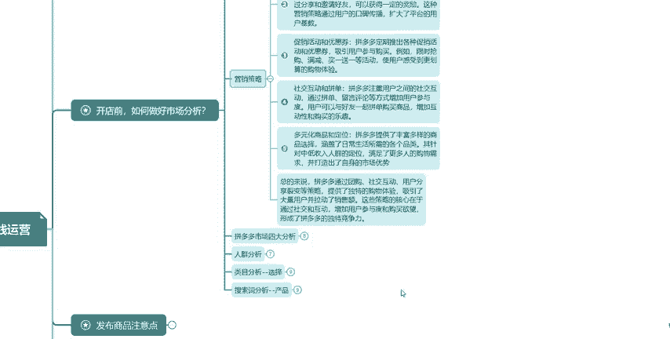

# 【拼多多运营实操教程】中小卖家拼多多开店打造新品全流程教学！跟着实操半个月，爆款成功率翻倍，快速实现日销300+单！ - P39：第39节：拼多多市场分析营销策略 - 拼多多-运营 - BV1UN2wY3E5W

hello大家好。那么今天呢继续为大家讲解我们拼多多店铺时间运营。上节课呢我们为大家讲解到我们的一个市场分析当中的正时拼多多。这节课呢其实为大家讲解我们第二点营销策略。

营销策略我们是为大家整理了6个方面的一个点。那么给大家看一下。

那首先给大家讲解的是我们团购模式。团购模式它简单来说就是说吸引更多的一个消费者进行组团来低价进行购买。那其实对于前期来说，我们做一个基础数据，那是非常O的，并且能够带动我们的一个店铺权重，对吧？

那其实这是我们前期引流其中的一个方式，这个是非常可行的。而且如果说像我们团购模式做了之后，那么对于我们产品非常O的一个情况下，那么像这些用户，那么也会二次三次进行购买，成为我们的一个店铺粉丝老顾客。

对吧？所以说。团购模式呢它是非常重要的。所以大家一定要去做。那么第二个是我们的个用户分享裂变。用户分享裂变，这个用法是比较广泛的，尤其是在我们前期大多数用户都是在使用这个方式。

就好比我们刚开始做这个拼多多，对吧？那么没有数据的一个情况下，那么自然会影响到我们首先是权重。第二个就是说转化，所以说我们前期呢一般都说会分享给我们的一个亲戚朋友或者朋友圈，对吧？

让这些更多的一个朋友亲戚来帮我们在前期能够促进成交，做一些基础的数据，像评价晒图销量，对吧？三个点，那像我们的一个店铺关注也可以去做一下，这就是我们前期的一个方式。像如果说有的。

他是在玩小红书或者抖音或者其他的一些站外渠道的情况下。那么我们可以通过他的一个账号分享到他们的一个就是说圈子当中，让更多更广的一个消费者能够知晓我们店铺卖的什么产品。那么从而产生更多的一个成交。

这也是我们的一个方式。所以说方式就是说分为就是说前期或者还有就是说我们有这些渠道的一个情况下进行去操作，主要就是这两个板块。那么第三个是我们的一个促销和优惠券。

那么其实促销活动就是说在我们参加就是说拼多多入驻之后，那么一般就是说过一周两周三周的一个时间。那基本上就可以满足活动的一些基本要求就可以开始去参加活动了。像拼多多呢一般就是说有就是说一年四季。

那么都有在参加的一个活动。那么也有就是说这种大促活动，那么定时他推出，然后我们去参加的一个活动。所以说根据我们店铺。

自身以及产品自身的一个情况来选择这些活动，是否适合我们适合的一个情况下，我们可以选择去参加活动。它根本的目的就是说以低价吸引更多的一个消费者前来进行购买。这样能够就是说刺激我们店铺的一个快速增长。

并且呢能够积累更多的一个用户，这就是我们促销活动一个根本目的，并包括我们的一个优惠券，优惠券其实从我们一开始开店之后，上架产品我们就会去设置优惠券，一直像我们中期啊前期后期其实优惠券是不停的不会断的。

所以说你看我们其实像一些大量铺。那么优惠券它是非常丰富的，就是给消费者更多的一个选择。那么像我们一般理解就是说买的多优惠的更多，这就是我们优惠券的一个根本目的，让你们能够就是说低价买到更优质的一个产品。

这就是我们优惠券以及我们促销活动。那么第四点是我们社交互。和拼单。社交互动呢是就是说拼多多它非常注重的一个环节哈。那么这个相当于就是说用户之间的一个社交互动。那么。

通过拼单、留言、评论等方式增加用户参加度。那么用户可以与好友一起来拼单购买，那么互相增加一一些快乐，对吧？趣味，这就是我们拼单对吧？像拼单，我们一般就是说去拼多多购买，一般都会选择拼单。

而不是说单独购买。因为拼单。那么价格其实说更便宜一些，对吧？其实我们去拼多多那买东西其实它价格我们也是选想要就是说价格便宜，产品更加优质，这就是我们其实最终的一个目的。

而且拼单呢对于拼多多来说也是非常独有的一个玩法。那么目前来说也只有就是说我们拼多多有这个拼单的一个方式。那么其他平台目前还没有，所以说这个是属于拼多多独有的。那么第五点是我们多元化商品和定位。

那么像我们拼多多，它是提供了非常丰富的一些产品进行选择。那么覆盖了我们所有生活日常啊，不管吃喝拉撒住，对吧？这些其实都是。进行了一个投入。所以它覆盖的一个类目范围是比较广泛的。不管是。

中高端人群还是说我们中低收入的人群定位。那么这些他都是全面去覆盖了。但是它最终侧重的还是我们中低收入人群的一个定位。那么满足更多消费者购物的一个需求，打造出自身的一个优势。

这就是我们的一个定位以及多元化的一个商品。那么其实拼多多这里总的来说，那么拼多多它是通过我们团购啊以及社交互动啊，用户分享啊等其他的一些方式来展示他独有的一个就是说购物体验。那么吸引了大量的用户。

那么并拉动了他的一个销售额。这其实拼多多它最终根本的一个目的，它就是低价以及让我们消费者能够享受到更优质的一个产品。它其实这就是我们拼多多的根本目的。

好了，那么今天呢就给大家讲解到我们战略。

就是我们营销策略这里下节课呢继续为大家分享我们后面更多的一些知识点。那么持续关注，那么不迷路。那么下方有我的联系方式，那么还有什么问题不清楚的，可以在微信上面联系我，也可以就是说留言在评论区进行留言。

为我会一一为大家讲解我们的更多的一些内容。好了，下节课我们再见。

