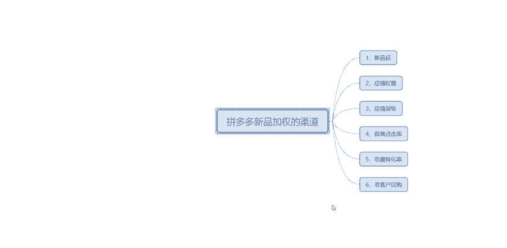
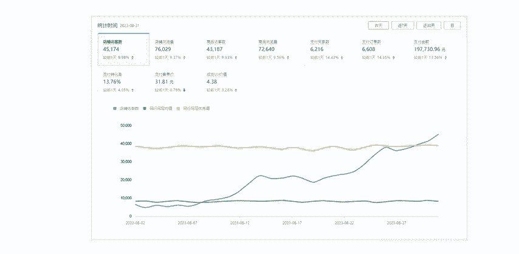
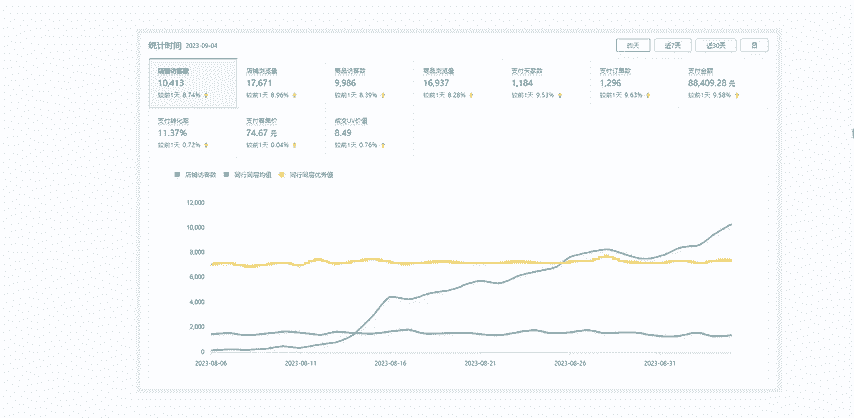
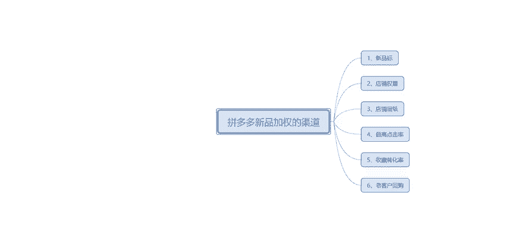
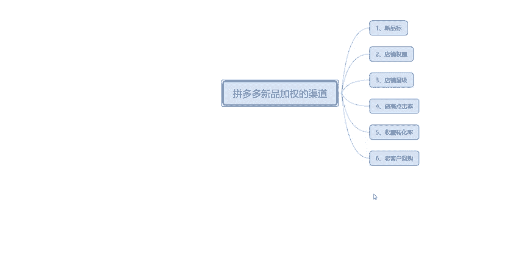

# 【拼多多运营实操教程】中小卖家拼多多开店打造新品全流程教学！跟着实操半个月，爆款成功率翻倍，快速实现日销300+单！ - P40：第40节：拼多多开店新品加权渠道 - 拼多多-运营 - BV1UN2wY3E5W

hello，大家好，这一期呢主要给大家讲解一下拼多多新品加权的渠道有哪些？大家在做店铺的时候，其实最担心的一个问题就是说我们的产品上架之后没有流量，尤其是一个新品。很多商家呢在新品上新以后呢。

虽然他新品有一个流量的扶持，但是呢这个流量只是一个最开始的流量。如果说你不去操作，它流量还是会很少。这个其实初始流量可能就就10个以下。但是如果不操作就无法更好的扶助这个产品做好数据。

这里呢给大家看一下我自己店铺上架了一些新品。

这些新品做出来的数据。大家可以看一下这个地方呢，我给大家看的是8月31号的数据。这个产品呢我自己上架的是一个食品的牛肉干，大概的话操作了3个月左右吧。然后的话流量就。做到了店铺的。

他这个是店铺的总数据哈，大家可以看到，整体上都是一个在比较上升的一个状态。然后呢，这里还有一个上架了差不多一个月的产品，这个它是一个工业的产品。工业产品的话，他这个访客只有1万多。

1万多支付买家算就是1000多的样子，支付转换率就是10%几。好了，大家看一下我这个案例看完了之后呢，我今天就开始讲正题了。正题的话就是说给大家分享一个新品加权的一些小技巧，让你们在新品的时候呢。

能获得更好的一个流量。这里呢主要分为6点。第一点就是说新品标。这个新品标其实大概应该都知道，只是说新品。

它重在于这个新品标，新品标它会。流量会给你更多的一个扶持。但是呢，你这个想要获得。新品标最好在上架以后24小时之内就要去破零。这样的话获得新品标的概率就会大一些。但是呢大家要注意这个新品标。

有些类目是没有的。现在支持类目呢可能就一些女装啊、男装啊、男鞋啊。女鞋啊、内衣内裤啊、运动鞋等等这些。如果说你自己的产品。看同行，他都没有新品这个标签，那么就说明你这个内幕他不支持就没有关系。

然后第二个就是说店铺权重，店铺权重的话，它是决定你新品搜索复持的。也就是说你这个新品它初始个流量是一个很重要的因素，权重越高。那么我们新品上新可以获得的一个初始流量就会越高。所以说大家在店铺权重这一块。

自己也要去。观察好自己的一个店铺服务数据。服务数据就是我指的是像店铺的成绩啊，DSR分呐，还有一个消费者体验分呐，这些东西都需要去观察。第三步就是店铺成级。

店铺成级就是我刚才说的就是说需要你店铺的一个成交金额来计算的。就是说近30天成交金额。大家在刚开始新店的时候呢，可以去做一个成交大单，把这个成绩做到第二第三去。当然。

我们要做到一个新品稳定的流量，需要做到4到5的样子才可以。然后第四一步就是说做高点击率，我们要知道是拼多多给到你初始流量是为了什么。其实这个答案大家肯定都知道。

就是说让你的产品能够通过这些曝光吸引到你的用户进店，从而购买你的产品转化的话就是平台的成交额。然后的话。哪怕这个客户进来看你的产品，他不去成交，但是他这个点击也是对你店铺有帮助的。然后第五步收藏转化率。

这个收藏转化率其实主要针对于非标品，收藏转换率越高，说明这个款式呢能够受到用户的一个认可。第六一步就是说老客户的回购。这个的话其实说在新品上线后呢，我们想要一个快速的增权。

我们就需要通过一些老客户回购来实现这个非常不错的一个流程。大家可以在营销工具里面设置一个订购复购件。这个话就是针对那些老客户来购买你这个新品，他可以使用这个优惠券的。好了。

这一期呢我把这6点就给大家讲就完了。大家有不理解的可以直接联系我。我这边还有更多的干货给大家分享给大家看一下，这些都是拼多多一些干货，有需要的话可以找我了解。

好了，这一期内容呢就给大家讲完了。大家有不理解的可以联系我。直接。