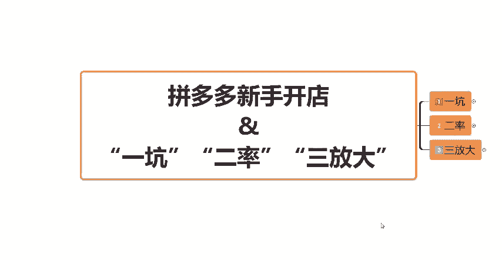
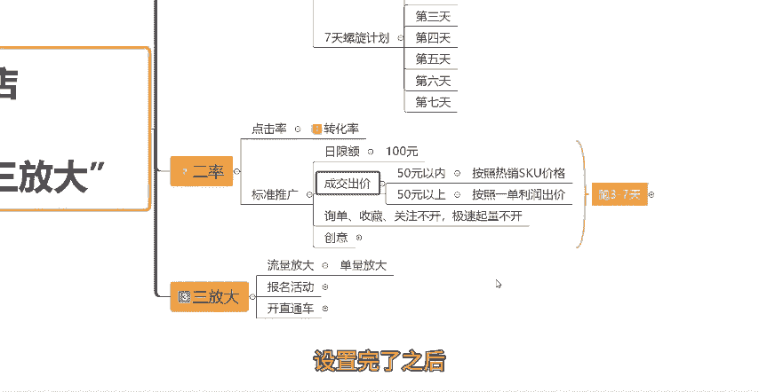
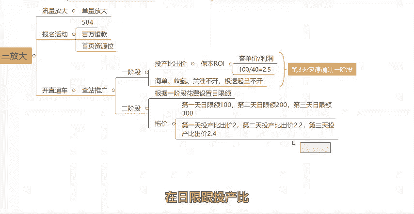

# 【拼多多运营实操教程】中小卖家拼多多开店打造新品全流程教学！跟着实操半个月，爆款成功率翻倍，快速实现日销300+单！ - P4：第4节：拼多多运营“一坑”“二率”“三放大” - 拼多多-运营 - BV1UN2wY3E5W

你们就记住这个口诀就可以，一坑二氯三放大。什么是一坑呢？一坑指的就是我们的坑产排名。二氯指的就是。

点击率和转化率。那么三放大呢就是我们的流量放大跟单量放大。那么今天这一期视频呢，我会跟大家重点来讲一下这几个点，它们到底是什么意思，以及该怎么去操作。那么具体的细节，大家可以先给点个关注再收藏。

我会一步一步的教大家。那么话不多说啊，开始我们这一期视频的正题。首先一坑。

坑产上你的产品上架之后啊，不要直接的去改百万的销量，或者说做百万销量评价。这样你直接去做的话，其实是很容易被查的啊。一旦被查，那么你这个链接就废了，又要重新的去做。建议大家先做一定的这一个坑产。

我们拿到了排名权重之后，再去做百万的销量评价，这样会更加的好。那么我们可以打开店铺的后台啊。

找到数据中心，然后有一个流量数据在这个地方。大家要记住两个数据，一个是店铺的访客数，一个是成交的UV价值。记住这两个数据，当然不是记入你自己店铺的啊，而是要记录同行同层级的一个数据。

我们在这个地方可以点击近7天。然后点击访客数，在下面可以看到三条线，也就是三个数据指标，蓝色的呢是我们店铺自己的一个数据，绿色的是同行同城平均值，黄色的是同行同城的优秀值。

然后成交UV价值这个地方也是一样的三个数值。那么我们需要把同行同层优秀值的这个数据记录下来。首先是访客的，我们把鼠标移到这条线上面，就可以看到同行同城优秀值的一个大概的访客数据。

像这个数据大概就是8000多的一个访客。然后点击成交UV价值一样的，也是把鼠标移下来，可以看到，基本上在10左右10以上。

样的一个UV价值啊。然后我们把这两个数值记录下来了之后呢，我们就可以利用这两个数值来计算出同行同层级优秀的GMV也就是坑产的一个数据指标。那么同行优秀GMV它的一个计算公式呢，就等于同行优秀的访客。

乘以同行的UV价值。也就是刚才我们所记录的这两个数据。我们把它记录下来，然后把这两个数值乘以一下，就得到了我们的同行优秀的GMV。

然后我们得到了同行的优秀GMV之后呢，我们就可以去计算出我们7天要操作的一个单量了。因为我们刚才看的就是近7天的一个数据啊，所以说我们算出来了之后呢。

我们计算出7天的操作单量就等于同行的优秀GMV除以产品的客单价。

就是我们产品卖多少钱啊，就是产品的客单价，用同行GMV除以产品客单价，就得到了我们7天要操作的一个单量啊，要操作的一个单量。然后这7天要操作的总单量我们得出来了之后呢。

我们当然不是说一天或者说7天平均这样把它做下来，而是要去做一个螺旋计划。什么叫螺旋计划呢？就是我们要有增长的一个数据，要有增长的一个指标。你的整个的单量应该是慢慢的往上提升的。

所以说你要把这总单量平分布到7天，而且要保证每一天要比昨天多一点点。所以说第一天第二天、第三天、第四天、第五天、第六天、第七天，你要把这总单量。

分在这7天当中，然后第一天少一点，第二天比第一天多一点，第三天比第二天多一点，按照这样的一个数据增长的一个指标去来操作这7天的一个单量。O那么这就是我们的一个坑产排名的一个操作方法。

我们根据这样的一个数据去做单量去做做坑产就可以了。然后我们有了这样的一个坑产之后啊，再去给我们的链接做基础的销量跟基础的评价。这就到了我们的第二步二滤二滤就是测图测款，测点击率测转化率，好吧。

然后具体怎么测呢？我们可以在店铺后台找到这个付费推广，然后我们开一个标准推广。在这个地方啊，大家可以在店铺的后台首页找到推广平台，推广平台中主要有两种方式全站推广和标准推广。我们首选的是标准推广。

在标准推广当中呢新建一个标准推广的计划。然后把你要推广的这个产品添加进来，在这个地方它会需要你设置一个日限额，然后需要你设置出价。那么日限额这个呢，我们可以首先先设置个100块钱，然后成交出价。

这边有两种情况啊，你们根据你们自己的一个实际情况来，如果你的产品客单价是在50块钱以内的，那么。

就根据你的这个热热销的SQU的价格来出价就可以了。比如说你热销的SQU这个价格呢是卖13块钱，那么你的这个成交出价在这个地方你就可以去设置个13块钱，好吧。

那如果说你的这个产品的客单价是在50块钱以上呢，那么你就按照你卖一单的利润来出价。比如说你卖一单100块钱，那么你有30块钱的利润，那你这个成交出价就可以设置为30好吧，就是这样的一个出价公式。

然后成交出价我们设置好了之后，下面的这个询单收藏关注出价，这三个都不开都不开啊，然后急速起量，这个东西我们也不开，好吧，也不开。

然后这几个点呢设置完了之后。

接下来你需要去找到你刚才创建的这个计划啊，创建的这个计划。比如说。

来，比如说这个是我们刚刚创建的计划，我们需要点击更多，然后点击创意。

点击创意这之后，这边有一个编辑创意，我们需要在这个图库当中选择我们要测试的主图啊。比如说哪些图是我们要测试的，然后我们把它添加进来啊，添加进来，点击确定，然后这个计划呢，我们就设置好了，设置好了之后。

我们需要跑3到7天，然后去看一下数据啊，看一下数据主要是看产品的转化率数据跟产品的主图点击率数据，一般建议大家转化率产品的转化率要达到5%以上。然后图片的点击率要达到10%以上。

这是一个合格比较好的一个数据。当然了，不同的类目，这个数据指标呢会有一点点不同。但是这个数据最低不能低于你行业的平均值。好吧，做好这两个点，做好这两个率呢，基本上就能实现一定的这个流量基础了啊。

能够实现一定的自然流量基础了。这个时候啊就要到。

呃第三个点，第三步呢就是放大了，放大的话其实主要就是流量放大跟单量放大有两种方式。

第一种方式是报名活动。报名活动的话主要啊如果说你是比较有实力的这个商家呢，建议你可以直接的去上一轮这个584的一个活动。那也可以去上这个保百万爆款啊，百万爆款的这个热销活动。那么这些活动啊坑产。

然后销售指标表现好的话，还有机会啊可以去回价上一个首页资源位的一个活动。主要报名活动呢就是这三个活动，你们可以去看一下你们的这个活动门槛活动的要求有没有达到，有达到的话，可以去报名活动。

这是一个能够放大你自然流量以以及你单量的一个非常好的一个方式。然后第二种方式呢就是我们去开直通车，开车的话，这个地方就不是开标准计划了，而是要开全站推广计划啊，开全站。

因为全站推广它是全渠道推广的一个投放方式。所以说这个全站推广它的流量肯定是少不了的。那么全站推广它分为两个。

阶段一个是计划的一阶段，一个是计划的二阶段。那首先第一阶段第一阶段怎么开呢？我们同样的可以在后台。

找到全站推广啊，比如说我们打开一个全站推广。然后同样的我们也是要新建一个这个全站推广的呃计划啊计划点击你要推广的这个产品，然后在这个地方它会也会让你设置一个日限额啊设置一个日线额。然后日限额呢。

建议大家可以先不限啊，先不去设置这个日线额。然后它会让你设置一个成交出价。这个成交出价跟标准推广，它的有一个不同的，就是它让你会设置一个目标的投产比，而不是按照这个多少钱去出价了。好吧。

它会让你设置一个投产比。然后前期在一阶段的时候，建议大家可以直接的先按照保本RI的一个方式去设置这个投产比出价，目标投产比ROI是什么意思呢？就是用我们的客单价除以利润。这个就是我们的一个保本RI。

比如说你的产品客单价是100块钱。然后你的这个利润一单是40块钱。那么你的保本RI就是。

2。5在这个地方呢，你就去设置2。5就可以了。好吧，不要按照系统推荐的这个RI来来去出价啊，按照保本ROI按照这个计算方式，根据你的产品实际的去计算一下，这是一阶段啊。

然后同样的下面这个询单收藏关注这三个都不开。然后下面这个急速起量也不开，把它关闭掉啊，把它关闭掉。好吧，这是一阶段，然后设置好了之后，我们需要先去跑3天跑三天，让它快速的拉出数据，快速的获取到这个订单。

获取到成交，跑三天，快速的通过一阶段啊，一阶段，然后进入到二阶段进入到二阶段二阶段呢，我们可以根据一阶段的一个实际的花费来去设置我们的日限额。比如说我们可以设置个100200300都可以了。

然后我们需要去看日限额的一个消耗速度。我们来进行托价，并且放量。比如说啊我第。

天我的日限额设置的是100块钱，然后第一天日限额100烧完了。第二天呢我可以把日限额设置到200块钱，200块钱同样的哎也很快的烧完了。那么第三天呢我就可以把日限额设置设置到300块钱。

这样慢慢的啊慢慢的去进行拖价，也就是花费往上走，那么曝光订单也在往上走的时候，我们就可以进行拖价了，拖价的时候要1。1点的拖，不要太着急啊，每次零点几0点几的去拖就可以了。怎么拖呢？

比如说第一天日限额100块钱很快的烧完了，那么第一天呢这个投产比我设置的是2，对吧？那第二天我把日限额加到200了之后呢，我的投产比就可以把它设置为2。2，对吧？我往上提个0。几。

然后第三天呢日限额300也烧完了。第三天呢这个投产比我可以设置成2。4，知道吧？所谓的托价就是我把投产比慢慢的往上加往上加，跟着我的日限额。

起往上加啊。然后同时呢在日限额跟投产比往上慢慢拖的情况下，我们要去看日限额的一个消耗速度，以及点击转化的一个情况。如果说我脱价了之后啊，这个计划还能够稳定的去跑，对吧？还日限额还是每天能很快的消耗完。

并且转化率呢也还是达到一个呃满意的一个状况下，那么这个托价我可以继续拖。如果说我发现我托价完，我的这个直通车的计划整体的这个不管说是曝光量啊，还是转化啊还是点击啊，这些数据有明显的降低了。

这个时候我就要停下，我需要先把数据稳定住，我再继续拖。当然啊托价也不是无止境的去拖价啊，因为平台它不会让你高倍的去进行盈利的，都会有一定的这个峰值的。所以说当你发现托价有明显的下滑的时候啊。

你就停止托价稳定的去跑就可以了，好吧，这个就是我们开直通车的一个操作啊。

然后同时呢我们的直通车也可以搭配活动去进行一个更大的一个放量就可以了。那么这就是当下起款的一个全流程的新手按照这样的一个方式去操作，也能够轻松的上手。那么看到这里还有什么不懂的小伙伴呢。

或者说需要表格资源的，可以在评论区评论留言666，找我领取一份我整理的店铺综合运营大礼包。好吧，同时也别忘了一键三连支持一下，感谢大家的一个观看。

