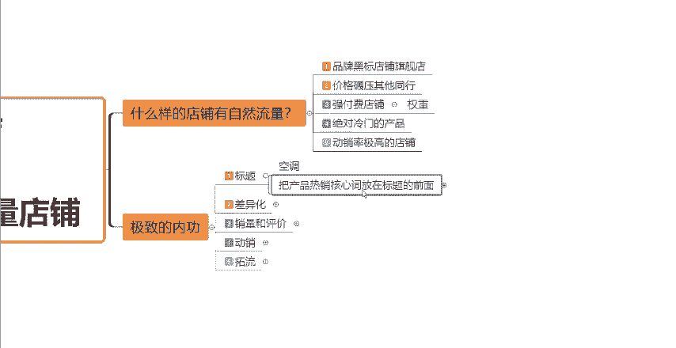
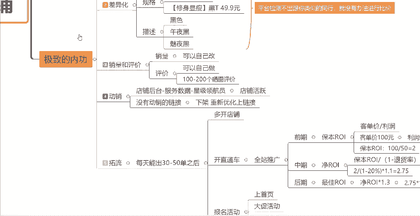

# 【拼多多运营实操教程】中小卖家拼多多开店打造新品全流程教学！跟着实操半个月，爆款成功率翻倍，快速实现日销300+单！ - P6：第6节：拼多多极致内功打造自然流店铺 - 拼多多-运营 - BV1UN2wY3E5W

如果说你的拼多多店铺操作了一段时间，自然流量一直很少，想要获得大量的自然流量，又不知道从什么地方下手的。那么今天一定要耐心的看完这个视频啊。首先现在拼多多平台本身自然流量就比较少。那么到目前为止呢。

自然流量还比较多的。或者说比较好做自然流量的店铺有哪些呢？首先第一种呢就是我们的这个品牌的黑标店铺，也就是我们通常所说的旗舰店。因为品牌的它消费者会首先去搜索这个品牌，品牌它有一定的知名度。

然后如果说你是授权店的话，这种它本身就是自带自然流量的。那么第二种呢就是你的这个产品的价格啊可以碾压你的同行，一般来讲，比如说我们的是工厂，或者说是这个供应链的源头。那这样的话。

你的产品的性价比特别的高，价格特别的低。那么你的店铺它是很容易做自然流量的。

然后第三种的话是我们的这个强付费的一个店铺啊。强付费的话就是我们通过直通车去拉高店铺的这个权重。那么权重提高了，然后我们可以去报名活动，报名活动之后，我们就可以获得活动的一个很大的一个自然流量的。

那么第四种的话就是你做的这个产品是绝对冷门的产品。因为你的产品足够的冷门的话，那平拼多多平台啊，它会需要这种各种多样化的产品。所以说你的这个店铺啊它是很容易做自然流量的。然后第五种的话就是动销率店铺。

那么什么是动销率店铺呢，就是比如说我每天上架1到2个产品。然后我做好店铺的极致的内功，它也是可以给我们带来自然流量的。那么通常来讲，以上这5点。

如果说你赚的越多，那么你的自然流量相对来讲也会越多。呃，今天这一期视频的话呢，我就会跟大家来讲一讲，我们每天上架1到2个产品，做好极致的内功，获得自然流量的一个方法。

那么做好极致的内功啊，首先呢我们要做好店铺的一个标题，然后要做好差异化。其次呢就是我们的这个销量和评价啊，然后我们需要去做好店铺的动销。那最后一步呢就是破硫。首先先跟大家讲这个标题啊。

第一步标题应该怎么去做呢？教大家一个方法，我们可以通过拼多多的这个买家的页面。这个搜索框，大家应该都知道在哪。那么我们可以通过搜索的热搜词的方式去做，怎么操作呢？来，首先比如说啊现在夏天到了嘛？

我们如果说想我们卖的是这个空调。那么我们作为消费者来讲，我们肯定会在搜索框这个地方直接搜索空调对吧？那搜索完空调之后呢，大家可以看到展示的这些关键词啊，有空调一匹空调清洗剂，空调1。

5匹二匹或者空调挡风。

这里面的关键词的产品类型会比较多，有空调本身也有清洗空调的东西，也有空调的挡风板。所以说这个关键词啊还不是特别的精准，那我们就需要给它输入一个相对更精准的关键词。那，比如说你卖的就是空调这个产品。

那么你可以再精准一点。比如说你卖的是几匹的对吧？你卖的是一匹的或者1。5匹或者2匹的那我们可以加入关键词，比如说我们卖的是1。5匹的，我们就输入空调1。5匹。那这个时候啊展现的这些下拉框池。

大家就可以看到了，它就是相对相对很精准的了，就没有除了空调之外的产品了。大家可以看到展示的这些关键词啊，空调1。5P、一级能效、空调1。5匹单冷空调1。5P、小米、美的、格离、华凌，这些下面就是品牌了。

那这个时候啊我们就需要去分析哎，为什么？空调1。5P一级能效这个关键词，它会出现在这些下拉框池的最前面。那就是因为这个关键词啊。

它是目前在空调的这个产品当中点击这个词的消费者是最多的那所以说它会排在另外的这些词的前面。那么我们把空调五P一级能效这个关键词加入到我们的这个产品标题当中，并且把它放在我们的标题比较靠前的位置。

那我们加入了这个词之后，我们再去选择其他的关键词加进来。比如说你做的是不是品牌的，对吧？你把品牌词也加进来，你是单人的还是冷暖两用的啊，还是有其他的，比如说呃这个什么省电啊等等等等之类的关键词。

你再把其他的这些关键词加到你的标题当中，最终我们组成了一个满足30个字啊，满足30个字。

并且通顺。然后。包含和热门。核心关键词。

并且没有任何违禁词。只要你的这个产品的标题啊达到了这几个要求，那么就是一个还不错的标题，知道吧？

所以我们。按照刚才的方法，先把产品的热销核心词找出来，放在你的标题前面，这样的话你就可以去帮助我们获得一部分的自然流量，这是第一个点啊。然后第二个点我们需要做好差异化。

其实所谓的差异化就是我们经常讲的防比价啊，防比价。我们可以通过主图规格描述这三个点去做到差异化。那么主图怎么做呢？主图这边给大家两点建议。

一个是我们可以去做不同的角度。那不同的角度是什么意思？比如说我们卖的是什么啊，T恤，对吧？然后我们可以去看一下找一下有没有跟我们同行类似的这个款式。大家可以看到像这个这一个款跟这个款，他们是有点像的。

对不对？但是他们的这两张图片差异在哪里呢？你看到没有这一件T恤，它是往左边的这一件T恤，它是往右边的。然后这一个地方呢，它的这个logo跟它的这个logo不一样。

然后左上角呢它的这个品牌的这个logo跟这个品牌的logo不一样。所以说这两张图呢，它是有一定差异化的。那么我们去做图的时候，也可以按照这样的方式，你跟你的同行跟你的相似产品去做出不同的角度。

然后这个产品上面的这个图案，或者说你这个图片上的这个logo，如果说能做到不一样的话，也去做到。不一样的logo知道吧？那还有比如说做其他的一些产品，比如说我们做呃水果的对吧？

那么水果呢一般来讲这个主图上就配的不同不这种各式各样的营销词了。那比如说上面这个。

啊，每人只能拍一箱赠送拍5斤发10斤。那么我们是我们可以怎么去做？我们是说我们可以把在这个图的这个基础上，我们可以说一人只能拍一箱，对不对？然后下面我们可以说拍10斤送10斤，或者说拍两斤送一斤。

拍两斤，拍三斤送两斤等等等等。我们用不同的这种营销词的文案，是不是也可以做出差异化，对吧？所以说我们的这个图片啊，就通过这两个方面，一个是不同的产品角度，一个是不同的营销文案。

通过这两个方面去做到差异化。然后第二个点规格规格的话怎么做呢？那比如说我们这个时候我们的同行卖黑色T恤的对吧？那么它的规格描述的是黑色T恤，然后50块钱。那在这个基础上，我们想要做出差异化。

我们就可以写，比如说。

修身显瘦黑T，然后价格呢我们可以卖49。9块，这样的话是不是就直接的跟大家区分开了，对吧？平台呢就不会说把我们的产品跟它的产品变成这种类似或者说同款的产品了。然后这个就是规格的描述。

大家可以在同行的基础上去做一下修改，做一下优化，然后做出差异化就可以了。然后第三个点描述描述这个点呢，那比如说我们的这个衣服的颜色，对吧？那同行比如说可能会写一个普通的黑色，那我们是不是可以把黑色。

这个颜色给它做一下这种优化，给大家做一下有逼格的处理。比如说我们不写黑色，我们可以写午夜黑，对吧？它也是黑色，但是午夜黑给人的感觉就不一样，是不是？然后或者写媚夜黑都是可以的。那比如说你是白色。

你你可以不用只写白色呀，我可以把它变成纯白，或者说奶油白或者说亮白色，对不对？很多的这种关键词啊，是可以做出差异化的，所以你们要动一下你们的这个脑袋啊，动一下你们的思维，一定要做好差异化啊。因为。

拼多多这个平台啊，它的比价是很严重的。一旦平台把你的产品跟你的这个同行的类似产品做做这个比价了。如果说它的价格比你的高还好。你的你的产品如果说有极致的性价比，那还好。

一旦它的产品的价格比你的产品要低的话，那么你就很难拿到流量的。你的流量就全部被它给拿走，知道吧？所以说平台检测不出跟你类似的产品，它就没有办法进行比价，这个才是我们做好仿比价的这个关键啊。

然后这是第二个点啊第二个点。

然后第第三个点啊第三个点就是我们的这个销量跟评价啊，销量跟评价销量的话其实是可以自己去做的。我们可以自己去改销量，改销量具体怎么改呢？我在前面的视频有跟大家单独出一期教大家具体怎么去改销量啊。

然后大家如果说不会的小伙伴呢，可以去找一下我那个前面的视频。如果说没有找到的话也没有关系啊，可以在评论区找到我，然后我给你分享一下，然后评价也是一样的，评价的话。

建议大家可以先去做100到200个评价晒图评价啊。然后这个呢你可以自己去做，也可以去找资源做。同样的，如果说不会做的，或者说没有资源的小伙伴呢，也可以在评论区找我啊，找我给你分享一下都没有问题的。

这一点的话很简单，销量跟评价的话，很简单，你们自己去做就可以了，就不多讲了啊。

然后第四个点呢，就是我们的这个动销，这个是很重要的啊很重要的一个点，就是我们一定要去做好店铺的动销。动销在哪里看呢？在我们的店。

店铺后台，然后有个服务数据，然后找到星级领航员来，我教大家具体在哪里看啊，这是我们店铺的后后台首页啊。然后在这个地方数据中心下面有一个服务数据，我们点击一下，然后点击完之后，在这个地方有一个星级领航员。

看到没有？我们往下滑，然后看到这边有一个叫做店铺活跃的东西，这个呢就是我们的店铺动销率啊。它是根据我们店铺30天内，店铺内所有的发布的商品，然后他们的订单成交的这个活跃度，然后产生的一个数据指标。那。

像这个店铺94%，它是什么意思呢？就比如说我的店铺啊上架了100个商品，但是在30天之内呢，我店铺这100个商品它只有94个商品有这个成交，有出单，知道吧？它的动销率就是94%，所以说在30天之内啊。

没有出单的产品。

啊，没有这个动销，没有出单的这个链接，我们需要去把它下架，然后重新的针对这个链接去做一下优化。优化好了之后，我们再上新链接。

知道吧？这就是我们为什么说每天要上架1到2个链接的原因。因为你的店铺当中啊肯定是有链接，它是出不了单的。出不了单的话，我们就需要下架，重新优化。那当我们的店铺每天能出30到50单之后呢。

我们就可以去选择其他的拓流方式了，这就是第五步拓流，我们可以去多开店铺，对吧？你一家店铺能出30到50单，ok你掌握了这个方法之后，你再去开一家店铺，同样的方法，你再去做做到每天能出30到50单。

那你每天是不是就能出100单左右了，对不对？这是第一个方法，你可以去多开店铺。当然你有条件的情况下啊，那第二个方法呢，你可以去开直通车，直通车，当你每天能自然流量能出30单到50单之后啊。

你可以开直通车去拓大咱们的这样的一个流量，拓大咱们的这个订单。直通车的话直接的首选去开。

全站推广，那么全站推广怎么开呢？因为全站推广它的一个出价的一个方式是按照投产比去出价的。所以说这边简单的跟大家讲一下，我们分为前期中期跟后期它的一个投产比怎么出价，跟大家简单的讲解一下啊，前期的话。

我建议大家就直接按照保本的ROY去出价就可以了。那么保本ROY怎么去计算呢？很简单，用你的客单价去除以你的利润就可以了。那比如说。

这个时候比如说我们的产品客单价是100元，对吧？那么我们卖一单的利润是多少？比如说是50元OK那我们的这一个。保本RY是多少？就是保本I就是。100除以50。等于2。这个时候啊我们的保本RY就是2。

那么你前期的这个投产比出价呢，你就可以先出2，知道吧？先按照二去出。那么什么时候到了中期呢？当你发现比如说你前期的日线额是100块钱，对吧？你发现你的这个100块钱能够很快的烧完。

那么你在在第二天在隔天的时候，你就可以把你的日限额给提升一下。比如说你可以出200块钱，当你发现200块钱也能够烧完的时候，这个时候证明了你的这个直通车的计划权重是比较高的了，是提升上来了。

那么就到了中期的一个环节，知道吧？那么你就可以去把你的这个RY给做一个提升。你可以按照你的我们叫做进RY去出价。进RY什么意思呢？怎么去算呢？就是用我们的保本RY去除以一减去退货率再乘以1。1，知道吧？

因为这个时候啊我们的店铺是有自然成交的。

那么开了直通车之后，直通车也可能会给我们带来成交的。我们的店铺是有了一定的这个订单的那我们在这种情况下，肯定就能够大概的知道我们的退货率是多少，知道吧？那我们做一个假设啊。

那比如说我们的保本RY刚才算的是2，对吧？那除以一减去，那这个时候比如说我们的退货率是20%啊，我给大家做打个比方啊，这边你们根据你们自己的店铺实际情况去算啊，那20%再乘以1。1%等于多少。

大家可以算一下啊。一减20%，也就是1减0。2%，就等于2除以0。8，然后乘以1。1，那这个时候啊得到的数据是多少？2。75，对不对？所以说到了中期啊，当你的日线额再增加的时候。

你的这个投产比出价也会随着慢慢的增加。当然啊不是说让你一下子把你的这个投产比二变成2。75啊，这是不行的，这个跨度是有一点点大的。比如说你今天的日限额是100，然后你明天要提升到200，对不对？

那你这个时候就可以把你的这个投产比出价，从2变成2。1或者2。2，然后你的日限额从200增加到300，你可以继续把你的投产比出价往上加，你可以2。32。4，对吧？最终跟着你的日限额的增加。

把你的投产比慢慢的增加，不要一次性到位，好吧？那最终呢你可以。

提提高到这个2。75，知道吧？那么当你随着你慢慢的慢慢的增加。

你的直通车的权重会越来越高。那我们当到了后期啊，我们就会形成一个最佳的RY。什么是最佳RY？就是你的直通车，如果说能开到这个RY的情况下，你的直通车肯定是赚钱的，知道吧？肯定是赚钱的。

因为当你的直通车是保本RY的时候，你会不赚钱，或者说会少亏一点小亏一点点。因为什么呢？因为保本RY它没有把你的这个退货给算进去，知道吧？当你把退货扣掉之后呢，你如果说这个RY是2的话，你可能会小亏一点。

当你开到进RY的时候，你这个叫做什么？这个叫做你的盈亏平衡线，就是你开到进RY的时候，你肯定是不亏钱的，知道吧？你肯定是不亏钱的，那么当你开到最佳RY的时候呢，你是会赚钱的，好吧？

那么进最佳RY呢就等于进RY乘以一。3。比如说上面我们算的进。

RY是2。75，那么我们用2。75去乘以1。3等于多少等于。3。57，也就是说你开到了这个3。57，你肯定是赚钱的。如果说你能够开到比这个3。57更高的话。

那么你的这个直通车就是表现非常好的一个直通车了，知道吧？那么你们的出价呀，前期中期后期怎么去投产品出价呢，就按照我今天教给你们的这个公式去出。好吧，那么这是第二种方法。

我们可以用这个直通车的方式去拓大我们的流量。然后第三种方式呢，就是我们可以去报名活动啊，报名活动，那比如说活动报名什么呢？上首页我们可以去报或者说大促活动我们可以去报或者9。9块或者限时秒杀。

这些呢都是呃这个效果比较好的一些这个活动啊。你们如果说条件符合的话，就可以去报名。好吧，那么这一期的视频呢，就跟大家分享这些内容啊，你们做好了极致的内功之后啊，我相信你们的。

店铺肯定会有大量的自然流量进店的。那么看到这里的小伙伴，如果说还有什么不懂的呢？可以在评论区评论3个6啊，666，然后在评论区找到我，找我领取一份。我给大家整理的这个店铺运营的综合大礼包。那看到这边呢。

同时也别忘了一键三连支持一下，好吧，感谢你的支持。

