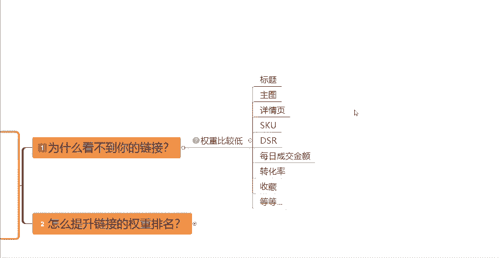
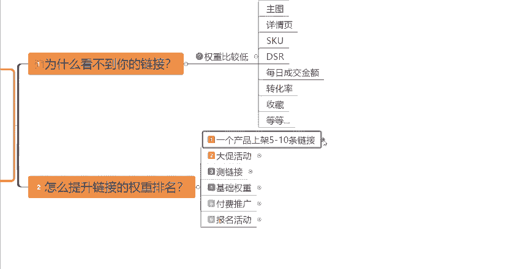
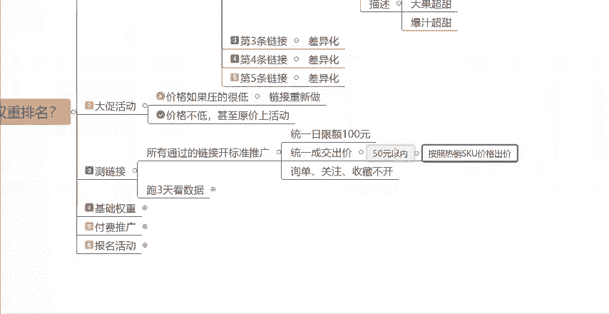

# 【拼多多运营实操教程】中小卖家拼多多开店打造新品全流程教学！跟着实操半个月，爆款成功率翻倍，快速实现日销300+单！ - P7：第7节：拼多多店铺没流量没订单破局 - 拼多多-运营 - BV1UN2wY3E5W

拼多多新手开店，新店铺没有流量，没有订单，甚至开直通车也开不动，不知道从什么地方下手的。那么可以耐心的看完今天的这一个视频啊。首先要先跟大家讲一个误区啊，就是你们的店铺新链接做好之后。

千万不要直接的丢到直通车当中去。因为直通车这个工具啊，它只能够给你买来流量，它是没有办法给你直接买来订单的。如果说你的一个链接，连基础的这些数据基础的权重都没有做好。那么直通车你只会白白的花钱。好吧。

那么今天的话呢先教大家一个起店的实操的步骤啊。那么包括一些起店的资源啊表格啊，大家都可以在评论区找到我找我领取。呃，首先呢我想让大家先思考一个点啊，就是假设今天有一个消费者，他想买一个东西。

那为什么你的链接没有出现在比较靠前的位置，这是为。

什么呢？因为你的这个店铺的权重比较低，你的链接的权重比较低。那权重这个东西到底是什么？什么是权重呢？对吧？权重它是存在于链接里面的，存在于我们的店铺里面的。那么链接里面包括你的标题，你的主图。

你的详情页，你的SQ你的价格等等，这些它都组成了你的这一个链接组成了你的权重。那么店铺里面呢，比如说我们的店铺的DSR，然后我们店铺每天的这个成交金额，也就是坑产，还有我们的整体的转化率。

包括我们的链接的收藏等等等等。通过这些东西，它组成了我们的这个叫做权重的东西。

如果说你店铺每天的成交金额比较高，对吧？或者说你的转化率特别高，你的收藏也特别高，你的以上的这些东西你都做好了。那么你的链接就会变成一个老链接。你的店铺呢就是一个有权重的一个店铺。

那我们如何能够让一个新链接变成一个权重比较高的老链接呢？今天的话我就教给大家一个叫做同产品多链接的操作方法，也就是怎么去提升链接的权重排名。

首先啊我们一个产品就是我们同一个产品其实是可以去上架5到10条链接的，这5到10条链接都是这一个产品。那你每一个链接啊肯定是不能完全一样的对吧？我们就需要去做出差异化。那么首先呢比如说我给大家举个例子。

你的第一条链接，第一条链接呢你可以直接的去什么去超抄什么？你可以去找到你这个行。

业你这个产品的畅销榜，然后在畅销榜里面呢，你可以找到你同行卖的比较好的这个链接这个产品。然后的话呢我们可以去抄它的主图，抄它的详情页，抄它的SQU等等等等。

然后我们抄了主图，抄了详情页，抄了SQU之后呢，我们要做稍微的修改一下。主图稍微修改一下详情页稍微修改一下SQU包括最重要的价格要稍微修改一下。我们的价格可以稍微的比它低那么一点点。

因为啊拼多多这个平台，假设有一个消费者下单之后，它会在那个页面啊给它推荐同款的一些商品。如果说你的价格比它的低。那么你的这个产品就很有可能会上推荐页的一个位置。这种玩法呢就叫做节流玩法啊，叫做节流玩法。

它是比较适合于这种客单价比较低的。然后主要是用来跑量的这种厂家，这是我们的第一个链接啊，然后第二个链接呢，我们就一定要去做出差异化啊，做出差异化。什么是差异化呢？就是我们俗称的防比价。

一般的话啊拼多多它会根据主图，根据规格，根据描述去区分你的同行。那么前面的话呢，也有很多的小伙伴去问我这个主图具体应该怎么去做。其实主图的话。

一般来讲啊要么你去做出这种嗯不同的角度，或者说用不同的文案，或者呢你去做这个图中图，对吧？就是把你的产品的图片抠出来。啊，抠出来，然后去生成一个透明图。

然后呢你再去找一个其他产品的图片来当做你的这个背景图啊，然后你把把这两个图片合成一下，就生成了一个不一样的图片。这个呢就叫做图中图啊，这个呢就是主图的一个做法。然后第二个呢，就是我们的规格。

规格怎么去做呢？那我给大家打个比方，比如说我们卖一斤水果20块钱，那我们可以把它变成什么变成比如说开业或者说新店特惠大果一斤20元，对不对？这种情况下，你就跟同行区别开了，啊。

然后比如说同行它的描述是甜，对吧？那我们可以做什么呢？我们可以做大果超甜，或者说爆汁超甜，是不是我们通过这种不同的文案去给它。

跟同行去对比，去做到差异化。这样的话我们就可以做到防比价的一个效果啊。然后这三个点啊，主图规格描述这三个方面你都做出了差异化的话呢，那么系统这个时候就会认为你跟你的同行卖的不是同一个产品，对吧？

你卖的贵的情况下也会拿到流量，也有流量。那么剩下的链接，比如说第三条链接。

第四条链接第五条链接按照同样的方法啊，我们也依次的去做到差异化。那么我们做了这么多条链接啊，下一步的话就非常的重要了。就是第二步我们去报名大促活动，报名大促活动的一个主要的目的啊。

就是为了去检测一下我们的链接防比价有没有做好。如果说你发现你报了大促活动之后，这个活动把你的价格压到非常非常的低，给你压价的，那么就证明你的这个链接防比价没有做好，你的链接就需要重新去做。

当你发现如果说你的这个价格压的不低啊，甚至说你可以原价去上活动，那就说明你的这个链接防比价已经做的很好了。我们就可以继续的进行下一步的操作了。

好吧，那下一步的操作呢就是测链接啊，测试链接。因为我们上架了5到10条链接，这5到10条链接不可能说每一条链接我们都能把它做爆。所以我们就需要从这5到10条链接当中呢，去找出去测试出一条这种潜力。

有潜力数据表现非常好的链接，我们重点的去操作。所以说我们可以去开标准推广。然后我们把所有的链接全部的放在这个标准推广的计划当中。然后日线额呢，我们可以统一出价100。然后这个成交出价呢。

我们也给它统一的成交出价。成交出价，你就按照这边给大家一个公式啊。如果说你的这个产品的客单价是在50元以内啊，那么你就按照你的。

热销SKU的价格。出价。好吧，这是50块钱以内的啊。如果说你的产品。😡。

客单价是在50元以上的，那么你就按照一单的利润去出价，知道吧？比如说你卖100块钱，你一单能赚40块钱，这是你的利润，那么你的这个成交出价，最高你就可以出到40块钱，你就这么出去出价啊。

50以内的按照热销SQ的价格去出价，50元以上的，按照一单的利润空间去出价。然后接下来呢询单关注收藏这几个通通不开，知道吧？这几个出价通通都不开。然后这个标准计划，我们设置好了之后。

我们就需要去跑数据了啊，去跑3天看数据，主要看什么看消耗，看曝光量，看点击量看转化。只有你的链接能够拿到消耗，就是能够烧出去前，能够拿到曝光量，能够拿到点击量甚至还能够产生转化，这才是一个好的链接。

知道吧？这个就证明了说平台它是认可了你的这个产品，认可。

你这条链接以及认可了你的这个定价的，知道吧？所以当我们跑三天之后看数据哪一个链接表现，数据表现最好，我们就优先的去操作哪一条链接。好吧，那么这是第三步啊，测链接链接测试好之后。

我们就可以进行下一步的操作了，就是基础权重的一个操作了。基础销量这个方面呢，有两种方法。

我们可以直接的去改销量，也可以直接的去找资源去操作，知道吧？这个还是很简单的。如果说呃不知道怎么去改销量的，大家可以去看一下我其他的视频，我有详细的跟大家讲过怎么去改销量以及具体的一个操作方法。

如果说还不会的小伙伴呢，可以在评论区找到我，然后我给你再分享一下，好吧，这是基础销量的这个方面，然后就是评价。评价的话，建议大家呃可以先做100到200条的这个晒图评价。

因为你不要跟我告说做这个东西没有用啊。因为你想想，如果说你是一个消费者，对吧？你是一个消费者，你在拼多多这个平台上买东西，当你看到了一个产品，它没有销量，没有评价，你会不会买。

对吧你扪心自问一下，所以说这个这两个东西啊还是很关键的，它可以帮助我们前期快速的去提升我们的这个转化率啊。然后就是第三个店铺层级。店铺层级的话，可以直接的通过做大单的一个方式去把它提升上来啊。

店铺层级在哪看，你们可以打开你们的这个店铺后台啊，店铺后台，然后在后台的首页首页的这个位置呢，你就可以看到你的店铺层级了。一般来讲，如果说你是一个新店啊，你是在第一层级的一个位置。那么你就需要先把它。

提升到这一个第三层级以上的一个位置啊，你可以在这个地方去看这个地方它会给你根据你不同的产品，不同的类目，它会给到你一个参考的这个金额啊。像这个数据的话，它是282元。

就证明就代表说你的店铺每天的成交金额要在282元，你才能够达到第三层级，知道吧？所以说你们自己去看一下你们店铺后台，这个地方它是多少块多少钱。然后你把这个数值去乘以30，就是你要做到的这个金额，知道吧？

你要做到的金额，然后得到了这个金额之后呢，你就可以直接的去通过做大单的方式，一单多件。然后先把你的店铺拉到第三层级以上。因为在同样的情况下，第一层级的一个店铺是远远不如第三层级店铺的这个流量的，知道吧？

然后。这个是店铺层级的一个问题啊。然后接下来呢就是这个店铺的DSRDSR的话呢，我们可以直接的通过多多进宝去做啊，还不知道多多进宝怎么做DSR的呢？我在前面的视频也跟大家具体讲过这个操作的方法。

大家可以去看一下我前面的一个视频，这边就不跟大家多讲了啊。如果说找不到视频的小伙伴呢，可以在评论区找到我，我给你分享一下，好吧。

然后这是基础权重的这一个部分啊，基础权重的这个部分。这一步做好了之后啊，我们就可以去考虑什么？考虑开付费推广了。也就是我们俗称的开车了啊，开车的话，它分为标准推广，以及咱们的这个全站推广。

我们前期的话一定要先通过这个标准推广啊，先给他跑5到7天的时间，让他先去累积一部分的这个真实成交，真实的订单。然后同时呢我们可以配合我们后台的营销工具当中的评价有理啊，去快速的积累这个好评，去积累评价。

然后这一部分呢也可以去帮助咱们去做一下我们的店铺的DSR也是累积一部分的这个真实的订单，带着把我们的这个整体的店铺权重去往上拉一拉。当我们这个标准推广，跑出了20个订单之后呢。

我们可以考虑再去开全站推广了，知道吧？开全站推广。

然后我们开全站推广之后啊，我们可以前期先用保本投产去投。当我们的店铺，当我们的这个直通车全站推广每天能够稳定的出30单到50单之后啊，这个时候我们的店铺啊就是有一定的权重了。

虽然说这个时候权重还不是很高。但是的话呢你如果说能够达到每天30到50单以上的话，你其实已经领先同行40%了啊。所以说我们也可以看一下，像这样的一个店铺啊，你通过这样的一个方法去做，做到第五步的时候。

你的店铺有一定的权重之后，那么到了这一步我们就可以去开什么开活动了，去报名活动的。活动的话，因为很多活动它是有门槛的，知道吧？你的店铺没有成交，没有金额，没有坑产的话，很多活动你是报名报不上的。

就算你有的一些比较基础的活动可以报上。但是它也没有办法给我们带来给我们的店铺带来一些数据的。

所以说活动的话，最主要的你还是要去报名。比如说像我们的上首页活动。

然后9。9块活动或者说一些限时秒杀的活动，像这种活动啊，加上开车，它就可以达到1加一大于1加1大于2的一个效果。那么通过这些操作方式呢，你就可以去达到就是一个盈利的店铺，你的店铺就可以做起来了，知道吧？

那么看到这里啊，还有什么不懂的小伙伴呢，可以扣台，可以在评论区扣666。然后找我领取一份，我给大家整理的拼多多的一个一些运营的资源啊，运营的一些表格啊，都是可以的。好吧。

那么看到这边的小伙伴如果说还有什么不懂的呢，也可以在评论区找到我，我可以给你解决一下，你目前遇到的一些问题。那么也别忘了啊一键三连支持一下，好吧，感谢大家的一个观看。

