# 【拼多多运营实操教程】中小卖家拼多多开店打造新品全流程教学！跟着实操半个月，爆款成功率翻倍，快速实现日销300+单！ - P8：第8节：拼多多开车之前操作投产翻倍 - 拼多多-运营 - BV1UN2wY3E5W

拼多多新手开店啊，如果说你开车会亏损或者说完全开不动，出高价呢都烧不出去钱的话，今天这一期视频你一定要看完，只要做好了这几点，你再去开车，就可以达到低花费高投产的一个目的了。大家可以点个关注啊，再点赞。

让你开车不迷茫。O那么我们正式开始今天的一个视频课程分享。开车之前必做投产直接翻倍。首先我们第一步啊还是我们的一个产品上架。产品上架主要做好这几个点，第一个是主图，第二个是标题，第三个是详情页。

第四第四个是SQU主图的话我们一定要体现核心的卖点。因为我们要提高我们的点击率。也就是把你的这个产品的核心的一个营销关键词，做在你的主图。第一张图片上，比如说像这个产品外用氨糖快速缓痛16倍缓痛效果。

德国柏林制药。那么这一个图当中有几个核心卖点呢，就是它的一个功效，快速缓痛。那么它的一个效果好坏到底怎么样？

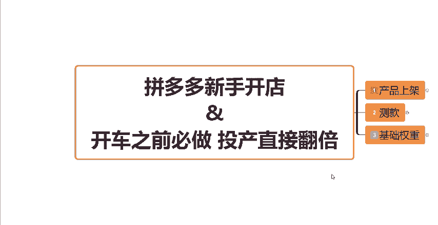

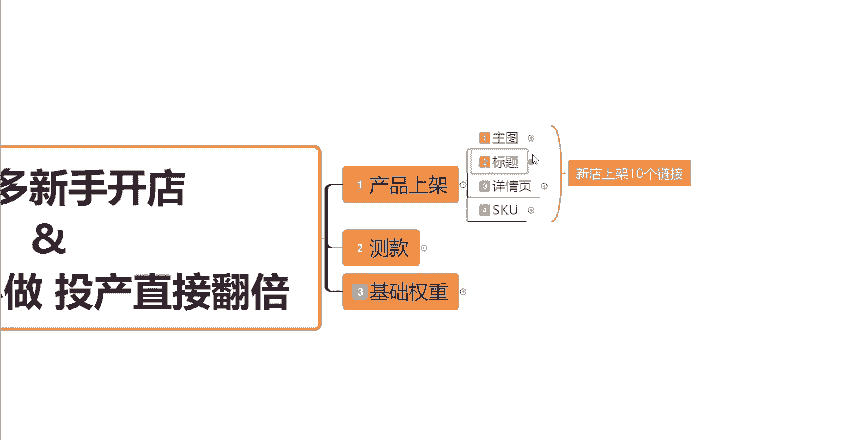

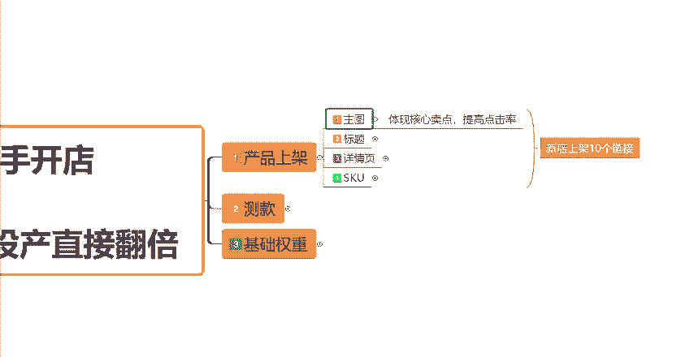

16倍的一个缓痛效果，并且它还有德国柏林制药的这样的一个呃厂家品牌的一个背书啊，这样的一个标。它把它就是做在了这些主图上。所以说你们的主图要怎么样去做出高点击率呢，就是第一个展现你产品的一个主体。

就是把你的产品放在你的主图上。另外你要搭配上你产品最最核心的营销关键词，就是你核心的卖点是什么？那么通过文案把它展示在你的主图上，就这样去把你的主图做出来，我相信点击率都不会太差，好吧。

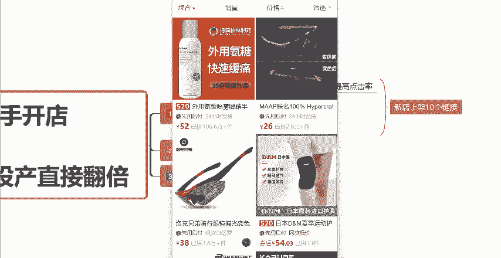

那么第二个点呢就是标题。标题的话我们都知道要写满30个字，并且要通顺，这是最基本的一个要求。那么还有呢，你一定要包含你的热门核心词啊，热门核心词。如果说你没有包含热门核心词的话。

那么你的这个产品搜索流量就会特别特别差。

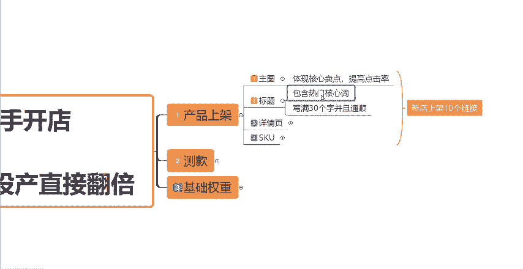

那么第三个详情页啊详情页我们能放很多张，但是呢不是说呃每一张都特别重要，最重要的一定是前面几张。所以说你把这产品它的一些核心的关键信息展示啊，包括你产品的一些核心的卖点啊，要素啊，放在前几张就可以了啊。

前几张是最重要的。因为后面很少会有这个消费者会划到最后面去看的。好吧，那么第四个点呢，就是我们的SQSQU还是那句话，我们一定要做好防比价啊，防比价。因为做防比价的一个作用，可能还有很多小伙伴不知道啊。

就是我们在不管说是做直通车推广，还是去报名活动，甚至说自然流的情况下，如果说你的这个产品你的这条链接一旦被平台就是拿去比价了的。拿去比价的话呢。

那么在拼多多这个平台上跟你同款跟你同类型的产品一定有比你这个价格更低的。那么只要说它的一个价格比你低的话，那么你就拿不到流量，知道吧？你的这个流量呢就全部被它给抢走了。你不管说自然流量也好。

还是说直通车也好，都是很难拿到流量的，好吧？所以说我们一定要做好防比价，那么SQU还是通过这三个布局去做。第一第一个类型的SQU做低价引流的。

因为我们在拼多多上会看到有的产品我们会发现哎有的产品我们看着它的这个价格好像特别特别的低。比如说像这个厨房纸，对吧？我们看到券后1。76块，那么我们我们作为一个正常的消费者来讲，我如果说想买厨房纸。

看到这个价格哇，这么低，我肯定会想点进去看一下，对不对？但是点进进来之后，我当我要买的时候，我就发现什么情况呢？唉，它的价格怎么跟我在外面的看到不一样。我点进来之后怎么变成了7。5块。

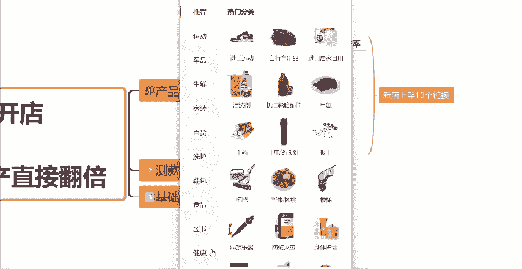

6外面是1。76块，里面是7。56块。就是因为他做的是这种有低价引流的这种SKU。

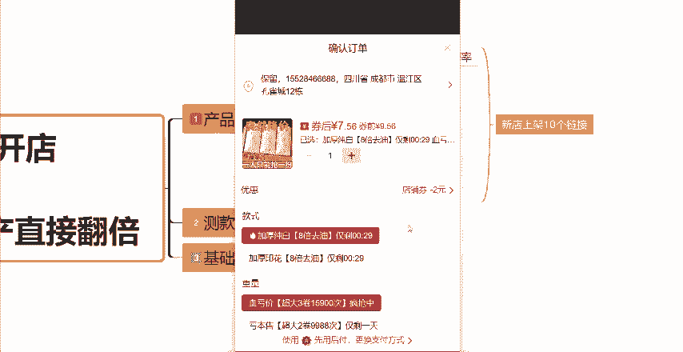

这种SQU呢可它可能是就是特别特别少啊，规格特别少的这种或者说一些体验装啊，或者说一些小样啊、试用装啊等等新品体验啊之类的。这种SQU类型的，它就叫做低价引流，用来作为提高点击率啊。

提升点击的这样的一个作用的。然后第二个呢就是热销走量的SQU热销走量就是一定是你这个链接当中卖的最好的那个SQU它就叫做热销走量的SQ比如说还是拿我们刚才看的这个厨房纸来举例，外面看到的是1。76块。

但是呢这1。76块，它可能说只有一点点，对吧？那么我们作为一个正常的消费者，我们不可能只买这么少。那么我们实际上买的最多的呢，可能是这个对吧？7。56块的这个规格我可能觉得性价比比较高。

那么这样的SQU呢，它就叫做热销走量的SQU啊，也是我们链接当中最主要的SQU。那么第三个呢就是高价利润的。SQ这种SQU的类型呢，它的一个价格客单价会卖的比较高，它的规格就是数量也会比较多。

一般来讲就是给回购的这些老老买家啊，老客户去下单的1个SQ因为我在你的店铺去买了一个产品。那么唉我觉得这个产品还不错，性价比也比较高。那我再回头来复购，对吧？那我可能说这次我就会想囤的量多一点。

我可能就去买这样的一个SQU了。这个呢它的就是用来给我们支撑利润的这个就叫做高价利润的SQ那么我们一个产品正常的SQU布局呢一定是要满足这三个的。

你得你得有低价引流的SQU你得有热销走量的SQU你得有高价利润的SQU这样的话组成我们一个健康的一个链接，健康的SQU的布局知道吧？所以说大家在做自己产品的SQU的时候呢，也按照我跟你们讲的这三个方向。

这三个方面去布局你们的SQU就可以了。好吧，那么在从这个。从这三个方向去整理SQU的同时呢，做好防比价就可以了。好吧，那么防比价具体怎么做呢？

我后面会出这个专门的视频来跟大家讲具体到底应该怎么去做好防比价啊。那么这四个点都做好了之后，就是我们一个新店到底应该上架多少个链接的一个问题了。这边给大家的一个建议是一个新店先去上架10个链接啊。

上架10个链接。那么不是说让你上架10个链接，你就得找10个不同的产品啊，不是这样的，一个链接可以上架5到就是一个产品都可以上架5到10个链接，知道吧？那么同样的一个产品上架5到10个链接。

你就需要去做不同的几个点，就是这5到10个链接，你的主图要有差异，主图不能一一模一样的标题从关键词到关键词的排列数顺序上也要去做出一点差异化。那么第三个详情页呢，详情页变一下顺序就可以了。

这个没有太大的一个要求。第四个SQ也要有所差异，知道吧？你SQU不能名称规格，包括价格都一模一样。这样的话，你就是自己再跟自己比较了。啊，不仅仅是在跟同行比较，而且还跟自己去抢量的。好吧。

所以说如果说你是同样的产品上架5到10个链接的话，那么你要去做不同的主图，不同的标题，不同顺序的详情页跟不同的SQU好吧，做好这几个点，你就可以去上架了。

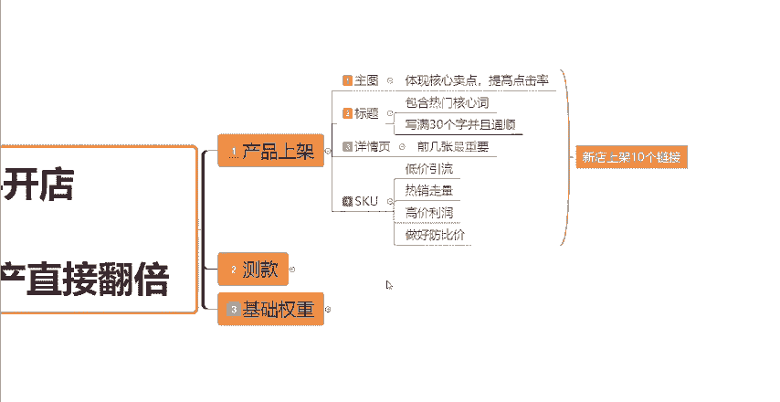

那么上架完之后来，我们来到了第二步，就是测款，一定要测款。很多小伙伴呃坐店啊就发现做了一段时间之后啊，时间也花了，钱也花了。但是一直呃做不好，就是没有效果，就是因为你没有去测款是吧？你这一步没有做好。

那么测款。首先呢我们去按照标准计划啊，就是开一个标准推广。我们在店铺后台首页然后我们往下滑去找到这个推广平台，有一个标准推广在这个地方，我们新建一个标准推广计划，然后把我们需要测试的链接。

全部的放在这个计划当中啊，我们直接添加商品，然后把你要测试的商品，哎，我全部的添加进来，知道吧？全部的添加进来，然后在这个地方呢。

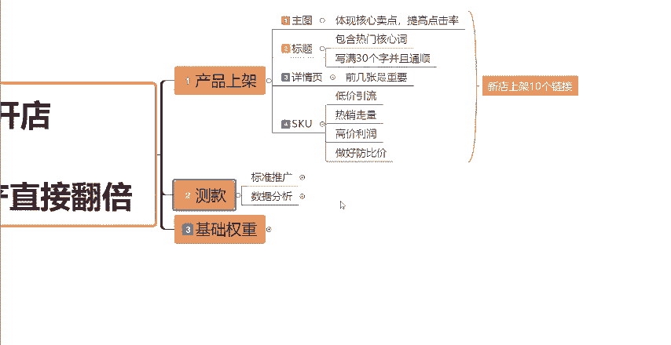

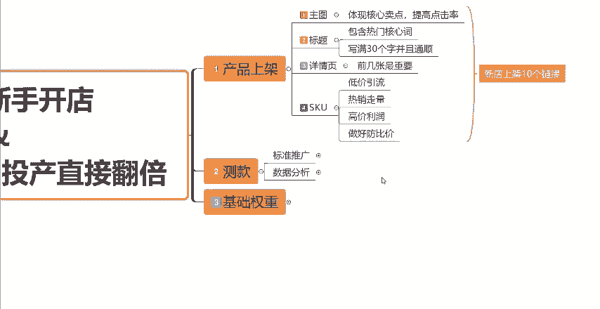

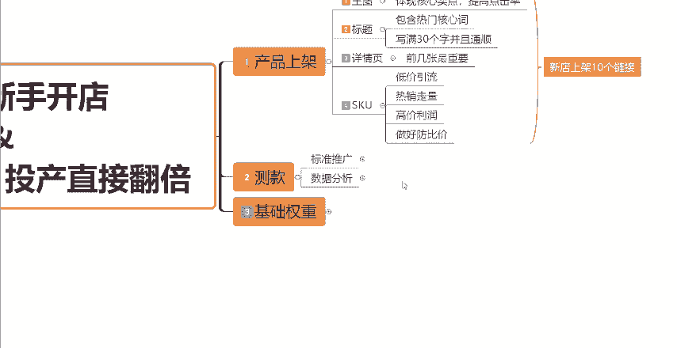

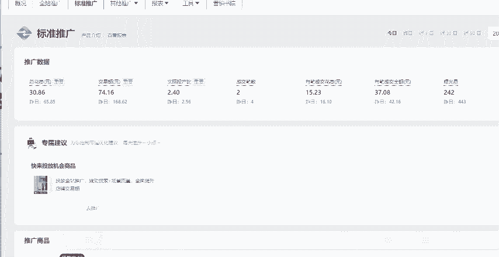

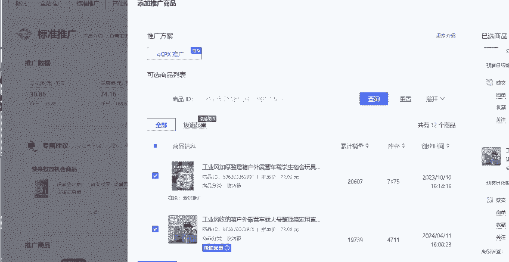

我们需要去设置设置几个数据啊，一个是我们需要去设置日限额，然后我们需要去设置出价。那么这个地方怎么去设置呢？来，我教一下大家，首先日限额统一设置100，不需要太多，知道吧？不需要花太多的钱。

每一个产品统一日限额100，然后出价怎么去出价呢？首先来教大家一个公式啊。

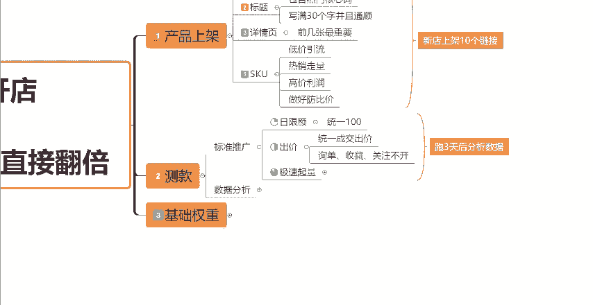

我们只需要去出成交出价，询单、收藏、关注这三个我们都是不开的，都是不开的，知道吧？只需要去出成交出价，成交出价怎么去设置？呃，50块钱大家记好一个公式就好了。50块钱以内的啊以内的。

按照你的热销SQ的价格去出价，知道吧？50块钱以内客单价的产品，按照你热销SQ的出这个价格去出价就可以了。然后如果说你的产品是50块钱以上的，那么就按照你卖一单有多少利润去出价，大家记好这两个点啊。

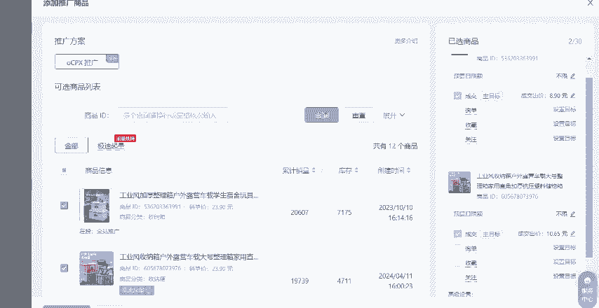

好吧，然后这是第第二个点出价。然后第三个呢极有个极速起量啊，有个急速起量，我们可以把它打开，知道吧？在这个地方看到没有？高级设置急速起量，我们可以来可以把它开起来。因为开了这个呢。

它可以更加快速的去帮我们拿到曝光，拿到数据。这几个点设置好之后呢，就可以了。然后我们可以跑三天，跑三天之后，我们再来分析数据。那么主要是看哪几个数据呢。

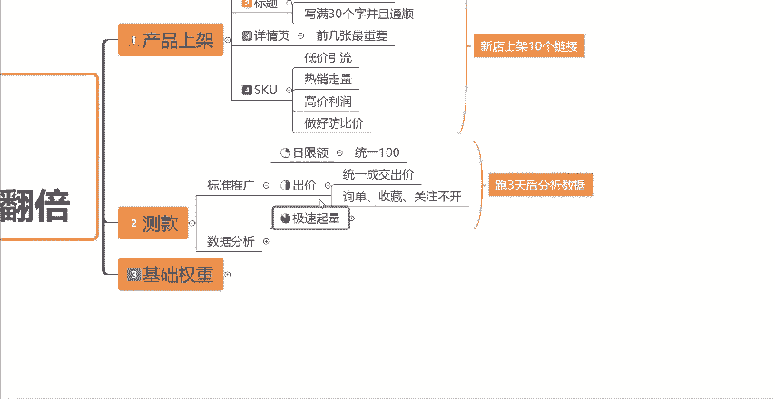

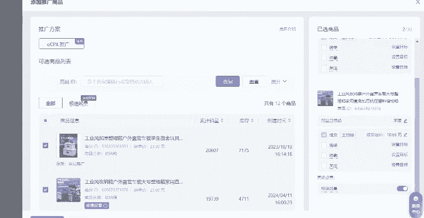

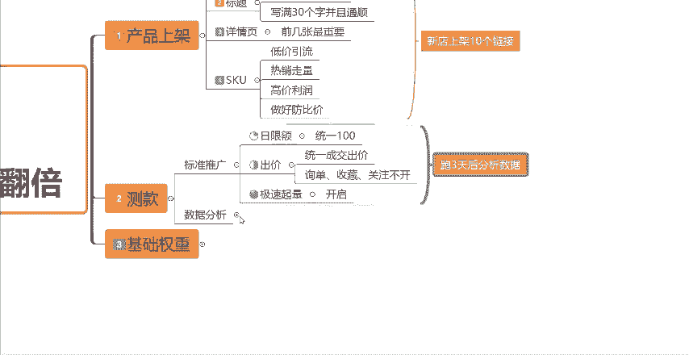

跑三天之后啊，我们首先要看消耗，也就是你这个花的钱啊，简单点就是花的钱快不快，花的多不多。首先看消耗，然后去看曝光量，然后去看点击量，最后再来看转化量啊。因为有当你的这个链接有消耗，就是能花出去钱了。

才证明啊平台它是认可了你的这个链接，认可了你的这个价格的，知道吧？所以说平台才会去帮你推广，才会去帮你获取流量。这种链接你拿出来做我们的主推款才能够事半功倍。因为很多人啊去开直通车，发现哎。

我就算是亏钱啊，我这个出价出的非常高都烧不出去。很大原因呢就是你推广的这个产品本身就是不行导致的，知道吧？我们需要去找到合适，去找到适合的主推产品，找到这个链接之后，我们再去加大力度去推广就可以了啊。

这是第二步测款。那么这一步做好之后，我们就来到第三步，我们需要去做基础的权重啊，基础的权重。基础权重啊，就是做销量，做评价，做店铺层级，做DSR。

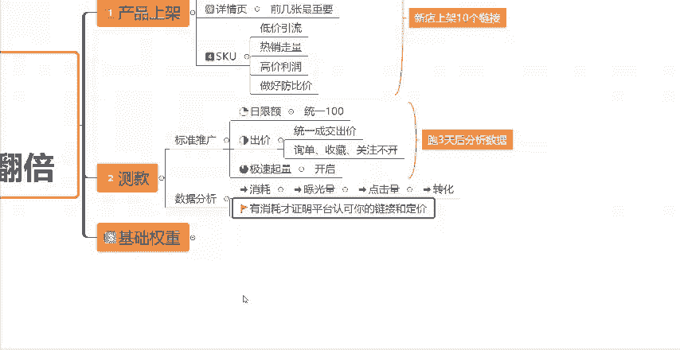

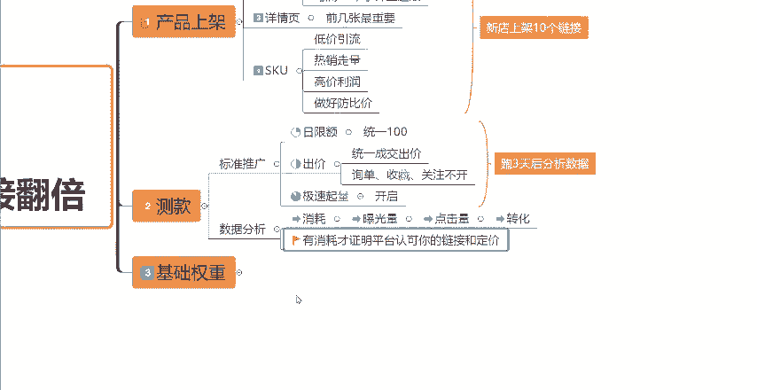

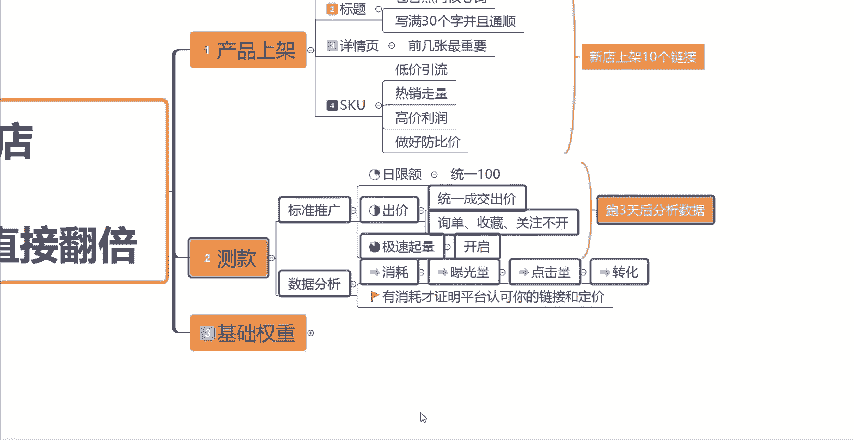

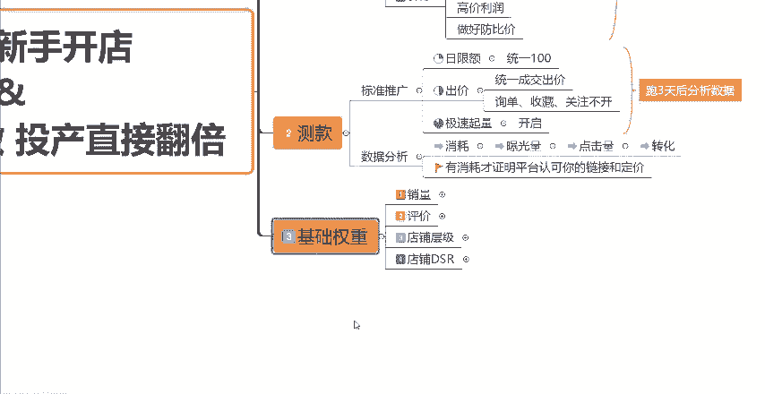

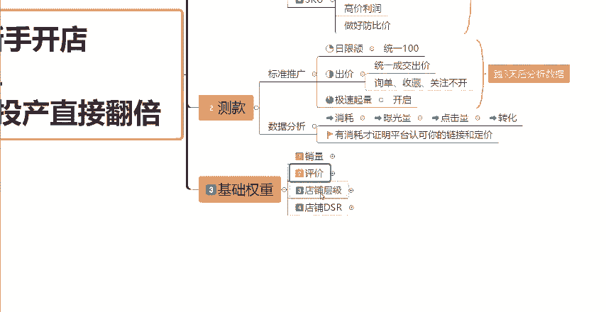

销量这个点呢你可以去，如果说你有资源的话，你可以去啊去按照我之前视频有跟大家分享过的这个爆款的周期递增计划去做周期递增计划，那么你也可以什么？也可以有一种不花钱的，就是你可投入资金比较少，对吧？

你不想花太多钱，那么你可以直接的去改销量，直接去改1万家也好，10万家也好，100万家也好都可以的，好吧，那么这个具体改多少呢？还是根据你这个行业来的，因为有可能我们有的小伙伴做的这个产品啊。

本身行业上的这个销量就不是特别的高，对吧？行业的top级商家，他可能才几万的销量。那你这个时候改个10万家，改个100万家，那不是太离谱了嘛，对吧？我们根据行业去具体分析，有的产品啊同行卖的都特别多。

都是卖几100万多件啊，卖几百万的那你这个时候呢，你的销量就可以改的稍微多一点，好吧，根据行业来，然后。

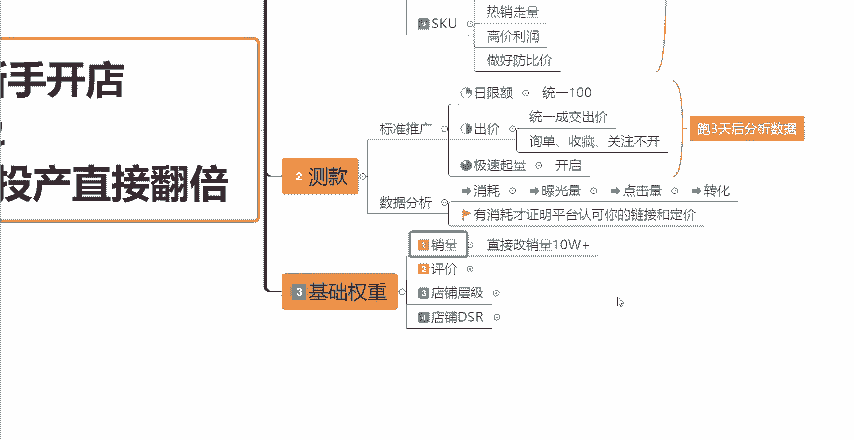

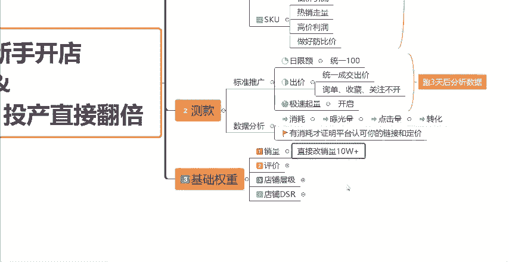

第二个就是评价啊，评价的话，我们直接的去做100到200个晒图评价就可以了。这个是基础的硬性要求啊，硬性要求好吧，你不要跟我杠说，做这些没用。

你可以去平台上去看一下有销量有评价的这个链接和没有销量没有评价的链接，哪个转化率更高，对吧？哪个流量更大，他们之间的一个差异是很大很大的啊，如果说你作为一个正常的消费者，你去拼多多上买东西。

你会去买一个没有销量，没有评价的产品吗？肯定不会的。所以说他们之间的一个转化率的差异是特别大的，包括流量能获取到流量的一个能力也是特别大的啊。所以这些都是我们做店总结到的一些经验啊，该做的。

你肯定还是要去做的，那么做好这两个点之后呢，还没有完，我们还要去把店铺的权重给做起来。店铺权重呢，就是一个是店铺的层级，一个是店铺的DSR，因为平台权重考核的一个核心重点呢就是坑产。

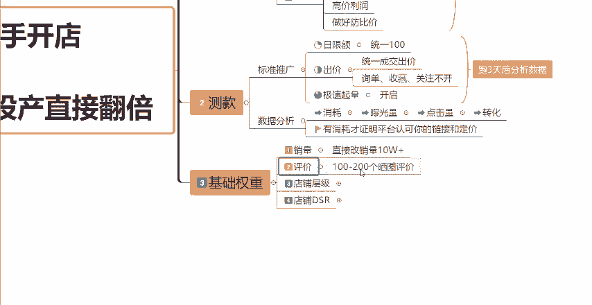

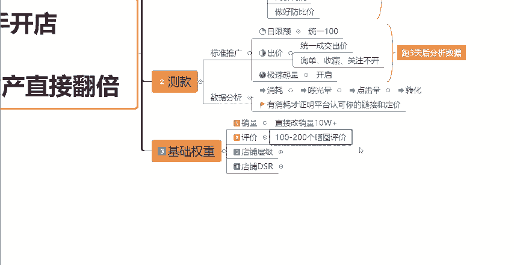

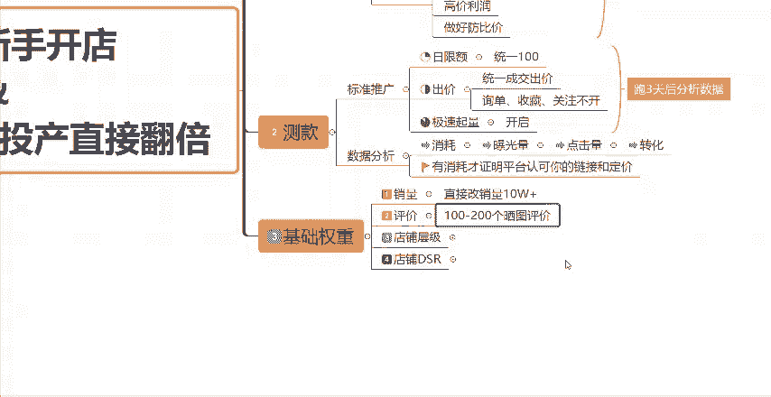

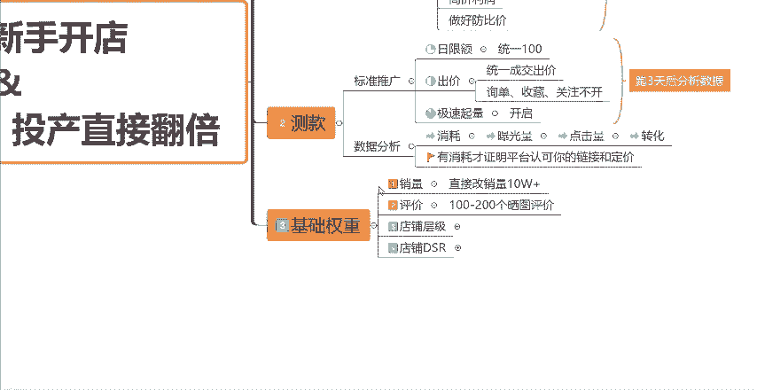

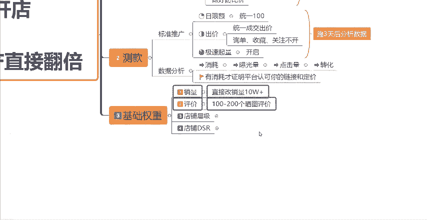

以及这个评有效的好评，也就是我们的店铺层级和店铺DSR评分的啊。那么店铺层级很简单，也很好做。

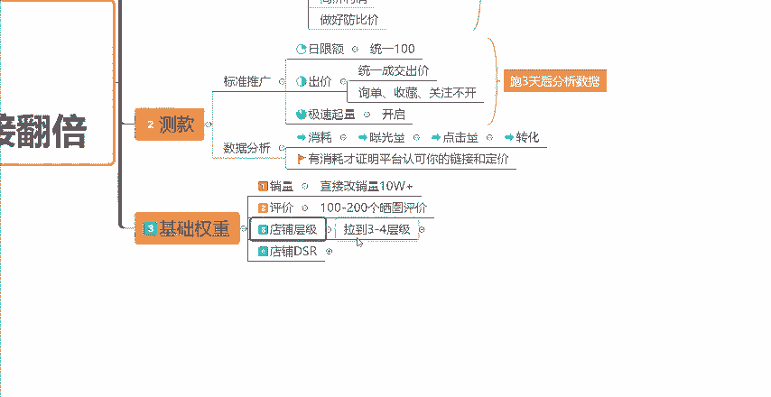

我们可以在店铺的后台直接的去看一下。来后我教大家，我们在店铺后台的首页在这个地方啊，我们直接去首页。

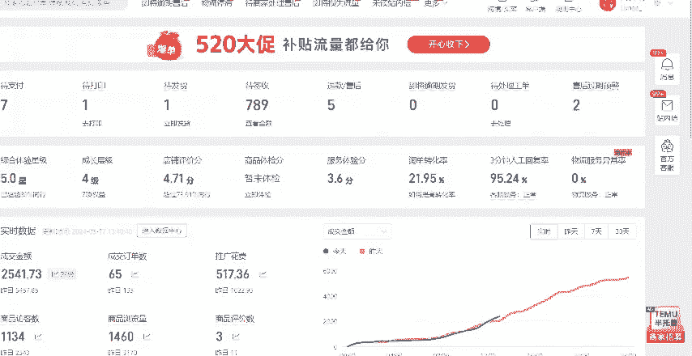

然后这边地方有个店铺层级，看到没有？这个店铺这个地方呢就会显示你们的店铺层级是在哪一个层级。如果说你们开的是新店，你们基本上都是在第一层级。那么如果说你是一个新店的话。

你要先把你的这个店铺拉到第三层级或者第四层级，就是最少你要做到第三层级以上的。好吧，因为第一层级的店铺是不可能拿到高层级的这个流量的一个上限的。店铺层级决定的你的店铺流量的一个上限。

因为不管说你开直通车也好，还是说你做自然流量的也好，第一层级的获取流量的能力是远远低于高层级店铺的。好吧，所以说先把你的店铺层级拉到第三层级以上。那么你们可以在这个地方在店铺层级。

这个地方可以直接的看到每一个不同的层级，他们的一个交易额，也就是坑产的一个要求啊，像这一个店铺。

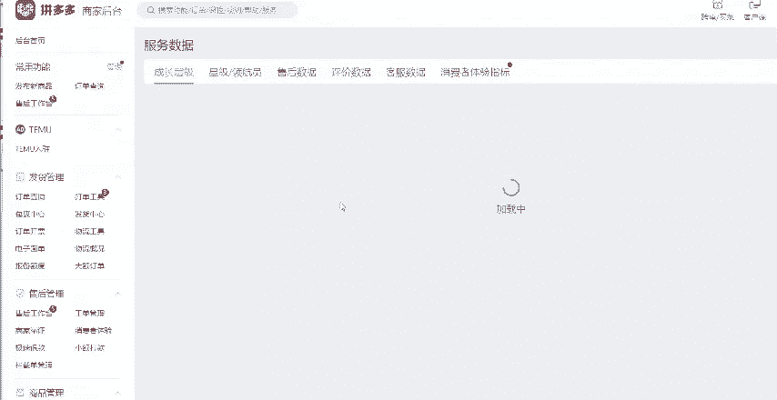

现在是在第四层级。那么第四层级的一个要求呢是近30天每天的平均交易额要在1496块钱以上，知道吧？就是30天每天要有1496，要有1500块钱这样的一个交易额。

所以说你可以先把你的店铺层级拉到第三层级去看一下第三层级这个地方像这个行业它的第三层级就是282块钱，这是每天的一个交易额的一个要求。那么你把这个金额去乘以30，就是你要做到的一个金额，知道吧？

去乘以30。那么得到了金额之后呢，我们通过做大单的一个方式，就是一单下多件啊，通过做大单的方式直接的去把这个金额去做做出来就可以了。好吧，这个很简单的很简单的。然后第二个呢就是店铺的DSR评分。啊。

店铺DSR评分DSR评分的一个方法呢也有很多种啊，重点呢跟大家讲这两种，一个是多多进宝，一个是走活动啊，走营销活动，搭配营销工具去做。然后多多的进宝的话，我们在店铺的后台啊，在后台首页，然后往下滑。

可以看到有一个多多进宝在这个地方我们直接去多多进宝首页，然后去设置一个推广啊，去设置推广，我们要去新建一个单品推广，知道吧？新建单品推广，然后去把你的这个主推链接勾选起来。

然后需要去设置你它会要求你设置一个优惠券的一个金额，这个时候呢，我们设置最低1块钱就可以了。然后直接发布，然后佣金比例也去设置到最低啊，设置到最低直接创建提交就可以了。

这个时候呢我们的这个单品多多进宝的单品推广链接就做好了啊，就设置好了。这个时候啊。

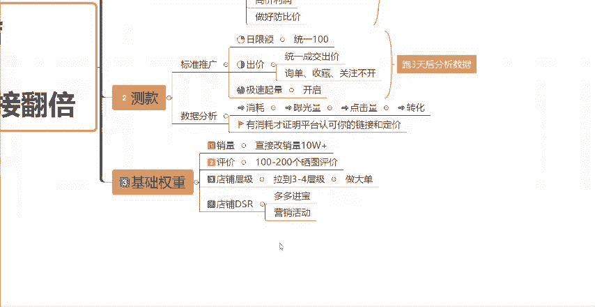

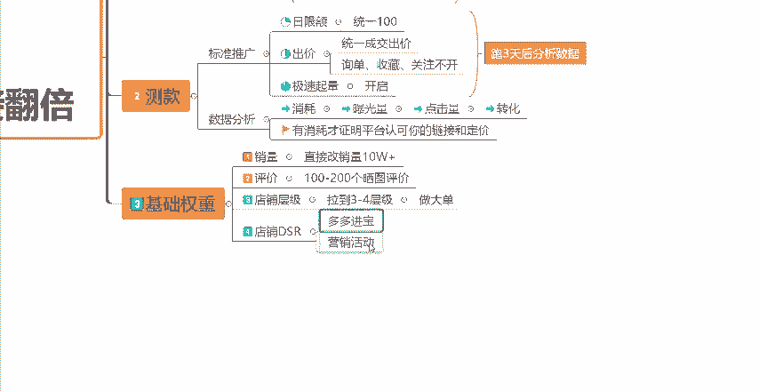

你要有个重点呢，就是。它会给你一个多多进宝的一个短链接的一个推广链接。然后我们需要去把这个链接复制一下。复制完之后，我们直接的去网页上去搜索多多进宝啊，直接去搜索多多进宝。

然后有一个多多进宝的一个官方页面，官方网站，然后在这个网站当中呢，如果说你没有账号的话，你需要去先去注册一个账号，知道吧？先去注册一个账号，注册好了之后，这个时候你的这个身份就变成了推广团长了，知道吧？

然后在这个地方有一个推广管理，有一个转链工具，知道吧？转链工具。当然这个时候我没有登录是点不进去的啊，你们注册好了之后，点击转链工具，然后把你刚才复制的这个短链接去把它转成一个推广链接，知道吧？

转换成推广链接。接下来的一个操作呢，就是你把这个推广链接去分享给你就是帮你下单，帮你操作的这个账号，让他们去下单就可以了。因为从这个链。

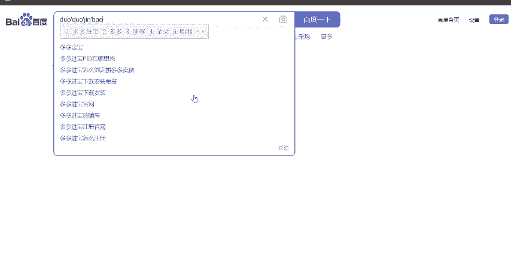

直接去下单的话，这个多多进宝它是拼多多官方的一个平台的一个工具。所以说从这个途径去下单的话，大部分的这个订单会被计入到有效评价。所以说这个你去做出DSR还是非常快的，知道吧？通过这个途径去做啊。

讲到这边，如果说不清楚的可以在评论区找到我在啊在具体的啊，我跟你讲一下，好吧？然后第二个方法呢就是营销工具啊。营销工具的话就是在我们店铺后台啊有一个这个店铺营销，然后营销工具里面。

你可以通过21365去做也可以。然后通过这个评价有礼金去做，也可以评价有礼金呢，就是在消费者下单之后呢，如果说它好评了，然后会给他去有一些这种现金奖励，知道吧？那么大部分消费者呢还是愿意去好评的。

但是呢这个方法去做呢，虽然说它也有效，但是它的一个周期呢，就是时间周期会比较长，做出来会比较慢，知道吧？所以说一般来讲我们新。的话还是建议大家通过多多金宝去做，会更快一点，好吧。然后。

我们做店铺DSR呢，就是通过这两个方法去做啊。当我们把销量做好了，评价做好了，店铺成绩跟店铺DSR都做好了。这个时候啊你再去开车开标准也好，开全站也好，基本上都能够实现高投产低花费了，知道吧？

所以说刚开店的想要开车的，想做推广的，都可以按照我这个视频教给大家的这一套方法去套用去照做就可以了啊。像这些给大家看一下这些店铺的一个数据啊。

都是跟着我一步一步的按照我教给他们的一个方法去跟着我做起来的。像这个店铺4月初的时候开始跟着我做的。大家可以看到这个上升的一个曲线啊，店铺的一个数据还是提升的非常非常快的啊。还有像这个店铺也是啊。

从4月初的时候也是提升的非常快。像这些这些这些店铺都是跟着我一步一步做起来的。所以说你们看完的这个视频，如果说你没有看懂，可以多看几遍。

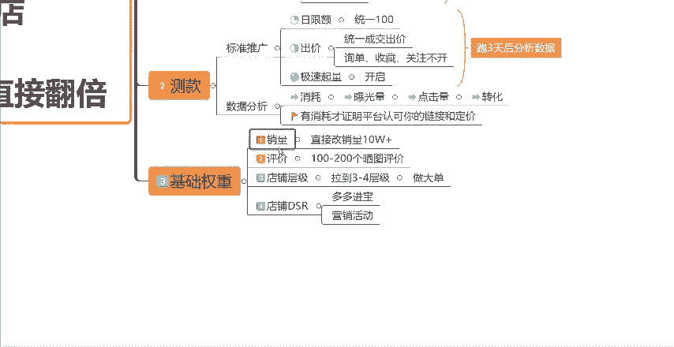

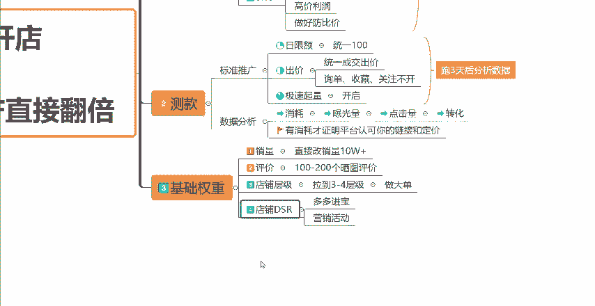

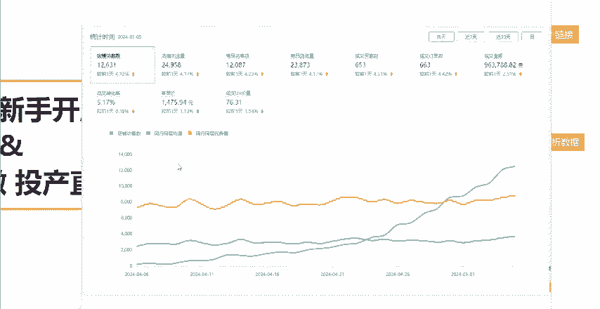

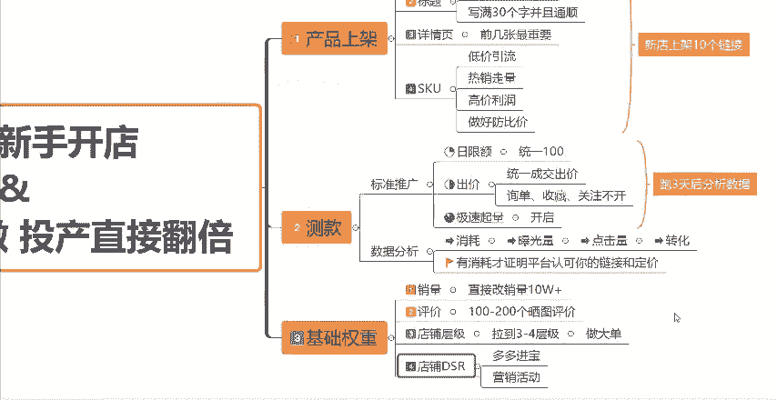

如果说学会了就直接的去套用，去照做就可以了。好吧，那么看到了这边还有什么不懂的小伙伴呢，或者说需要一些运营表格资源的呢，可以在后台给我留言666，然后找我领取一份我整理的店铺运营的综合大礼包。

然后看到这边呢也别忘了一键三连支持一下。好吧，你的支持就是我更新的一个动力，感谢大家的一个观看。

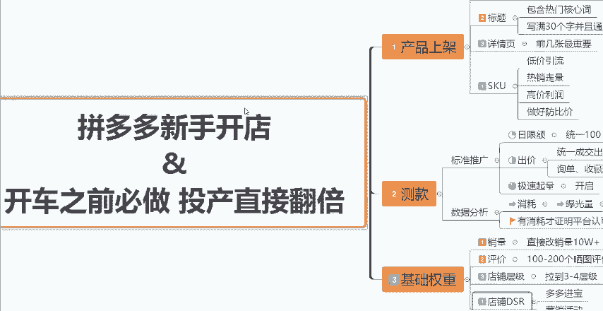

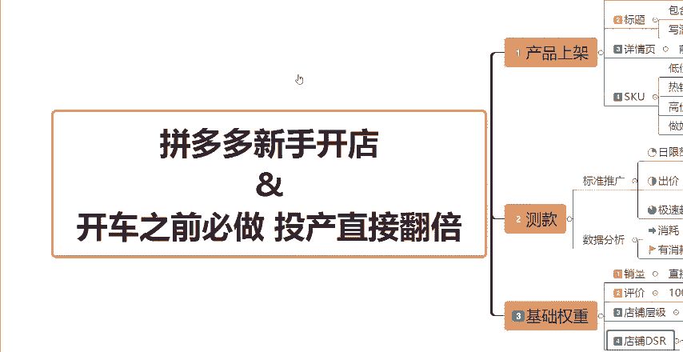

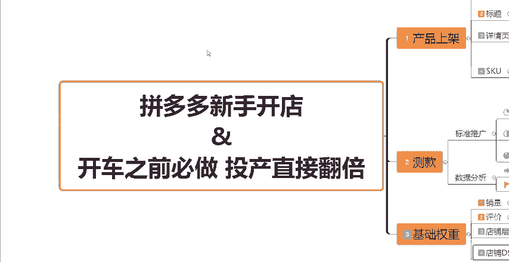

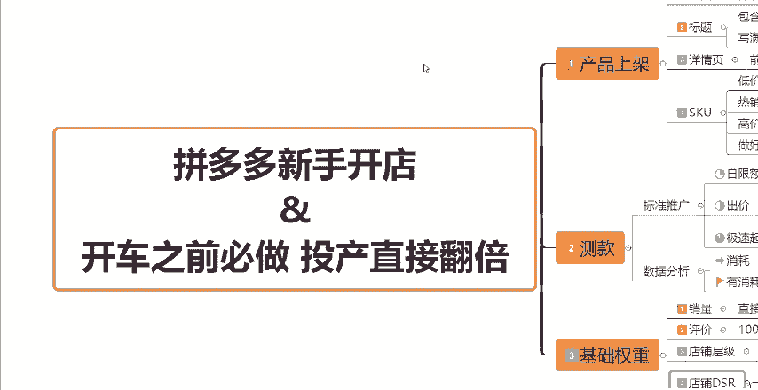