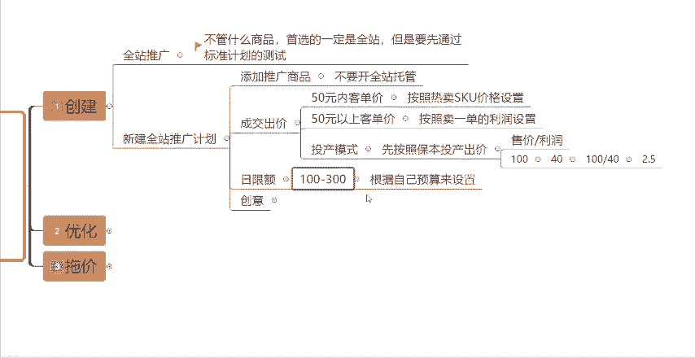
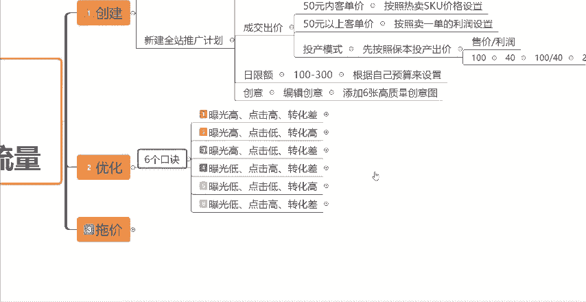

# 【拼多多运营实操教程】中小卖家拼多多开店打造新品全流程教学！跟着实操半个月，爆款成功率翻倍，快速实现日销300+单！ - P9：第9节：拼多多全站推广优化撬动自然流量 - 拼多多-运营 - BV1UN2wY3E5W

做拼多多店铺啊，如果说你还不懂得怎么开车，不懂得如何去优化直通车，那你的店铺大概率会一直亏损。新链接想要自然流量的第一步，首选全站推广啊，不管说什么产品都可以开全站。如果说你还不会开。

那么今天这一期视频呢，你一定要仔细的听完，我会从零开始一步一步的讲解，从计划的创建到优化计划到最后的托价，大家可以点个关注，再点赞，让你的坐垫投入少一半。首先呢我们开全站推广是有两个前提的。

第一个呢是虽然说我们不管什么商品首选的一定是全站推广，但是呢你的这个链接是一定要先通过标准计划去测试一下链接有没有做报的潜力的。如果说你的这个链接在标准推广当中的数据表现都非常非常的差。或者说没有消耗。

没有曝光，你就不要再盲目的再来开全站推广了。那么第二个呢就是我们在开全站推。

推广的时候，下面这个全店推广一定全店推这个托管一定不要开。因为全店托管这个产这个功能啊给你带来的流量是非常非常差的，它会让你的投产低到怀疑人生。那么我们在这两个前提做好了之后啊。

我们可以去选择我们想要推广的商品。那么推广商品就涉及到了一个出价的一个问题啊。在这个地方前期呢你肯定是按照这个成交出价去设置的。成交出价这边给大家两个公式啊，两个公式。

如果说你的产品是50块钱以内的这个客单价的，那么你就根据自己热卖的这个SQU的价格去设置这个成交出价。如果说你的这个产品的客单价是在50块钱以上的。那么呢你就按照你卖一单的这个利润去设置出价就好了。

比如说你卖你这个产品的客单价100块钱。但是你卖一单的利润，比如说有40块钱，那你的这个成交出价就可以最高设置到40。好吧，那么第三个呢就是我们的这个投产模式了啊，投产模式。

因为前期我们按照的是成本成交出价的模式，到了你的这个计划稳定了之后，我们可以把它改为目标投产比的这个模式，我们需要设置一个投产比。那么投产模式呢，前期我们可以先按照保本这个投产去设置出价出。

然后这个出价的一个具体出价呢，就是。

售价除以利润。那么投产目标就按照这个来。比如说你的这个售价是100块钱。然后你每卖一单的利润是40块钱，那么你按照这个100去除以40。然后最终得到的比如说等于2。5对吧？等于2。5。那这个2。5呢。

就是你这个地方要设置的这个目标投产比。前期呢我们就按照这个保本的投产比去出价就可以了。然后第三个呢就是我们日限额的一个设置啊。日限额这个点呢可以其实可以根据我们自己的一个预算的情况来。

因为有的人坐垫的可投入资金比较少，对吧？有的人呢就稍微的多一点，那么比较少的呢，你前期日限额设置100就可以了。如果说多一点的话，200300都是可以的。你们就根据自己的一个预算来设置这个就可以了。

然后还有一个点要注意的就是下面这几个询单出价收藏出价关注出价，这几个这三个啊都是不开的啊，都是默认关闭的啊，不要开。然后下面这个高级设置当中的基数起量，我们是可以打开的啊，我们是可以打开的。

然后这几个点设置完了之后呢，还没有完啊，这个时候还没有完，我们的创意还没有编辑，我们需要去编辑创意。我们可以找到刚刚创建的这个推广计划啊，创建的推广计划首页。

那比如说来我给大家看一下啊，比如说这个是我们刚刚创建的这个计划，然后在更多点击更多在这个地方有一个。有一个创意，然后我们需要点击编辑创意。最后呢点击这里需要添加你要去这个推广的系统的创意图啊。

因为很多小白很多新手商家，你们的图片做的都很差。所以说系统呢是自动给你全部推荐的。那么如果说你想要高点击率，那这个时候你就不能让系统给你去全部的推荐。因为有很多图，它的点击率，它的效果是很差的。

所以你要在这个里面呢去选择6张能够清晰并且展示你产品卖点的这个主图，千万不要去乱添加图片，这样的话只会浪费你的推广费，大家要记好这个点啊。那么这个地方创意我们设置好了之后呢，你的计划创建就完成了啊。

这样整体我们的一个计划创建就完成了，还是非常的简单的。那么创建好之后呢，我们接下来就是涉及到如何去优化我们的这个推广。

计划这里教大家6个口诀，你们开直通车只要系好了这6个口诀，你也能够快速的去学会调直通车。

那么首先第一个口诀，如果说你的曝光高点击高转化差的话，那这个时候呢你不要先急着去换链接，有可能是我们商品价格的问题。那么我们可以先去把我们商品的价格调低一点点。在你这个利润空间是能够接受的情况下。

降低一点点商品的价格，然后再去烧两天看一下数据。如果说数据哎转化率上升了一点，转化率表现好了一点，那我们可以接着去开这个直通车。如果说还是不行，我们就换款啊，还是不行，就换款。

别浪费这个款啊，别把我们的资金浪费在这一个款上面了。那么第二个呢，如果说你的曝光高，但是点击率比较低，而转化率呢又还可以。那这种情况下是你的创意图出现的问题。你就需要去更换其他的创意图了。

那同时你的这个投产比的出价需要稍微的去降低一点点，稍微的降低一点，我们通过调整这两个点之后呢，我们再来观察我们的看一下点击率有没有回升啊，点击率的一个情况。那么第三个情况呢，就是曝光高点击低。

并且转化也差。那这个情况下呢，我们需要什么？我们需要去。

提高我们的投产比啊，我们把投产比提高一点点，再烧3天烧2到3天去看数据。如果说这一条计划还是不行的话，把这一条计划删除掉，并且重新换链接再来开车。好吧，这一这一个情况的话。

就证明可能是你的这条计划有问题，并且你的这个链接也有问题啊，如果说出现了这种情况下就按照这样去调整。如果说第四种情况曝光低，但是点击高而转化比较差的话，这种情况啊，我们就需要去先降低这个计划的投产比。

我们先把投产比降低一点，然后再去观察2到3天看一下转化转化。如果说有上升的，那么我们就继续的去调整。如果说转化还是不行，我们就删除计划换链接。好吧，那么第五种情况呢，就是曝光低点击低而转化比较高。

那这种情况呢。

如果说就证明啊我们的产品本身就是这一条链接，这一个产品本身是没有什么问题的。那么我们就可以适当的呢去降低一点投产比，对吧？我们降低一点投产比，然后再去观察一下点击率啊，记得是观察点击率。

如果说投产比降低了之后，点击率还是比较低，那就证明创意图也出现了问题，我们就需要再去更换我们的创意图，如果说按照这两个你把这两个都调整好了之后，我相信你的这个曝光会比较高，点击也会跟着起来的。

然后最后一种情况呢，就是曝光低，但是点击高而转化呢比较差，那这种情况啊代表着我们的产品，跟我们的这个创意图是没有什么太大的问题的那这种情况下呢，我们可以说去提高我们的这个日线额。

或者说你去降低一点点投产比来提高这个曝光量啊，提高。

下曝光量让我们的这个数据更加的精准就可以了。优化之后先观察3到5天能否持续稳定，并且数据有提升。有能达到这几个条件的之后呢，我们就可以开始脱价了啊，可以开始脱价了。

那么托架它是有一个前提的，也有一个核心的托架的核心呢取决于日限额的消耗速度啊，日限额的消耗速度。这边有一个步骤啊，比如说。

我们刚刚开始啊，我们刚刚开始我们设置的是这个二的投产，对吧？我们的这一条计划，比如说我们设置的是二的投产。然后我们的日限额设置的是100块钱。那当第二天比如说我把日限额提高到200。

而提高到200了之后呢，今天的日线额也能够很快，也就是这200块钱也能够很快的烧完，那么我们可以把我们的这个二的投产给适当的提高，我们可以提高到，比如说2。12。22。3，但是一下子不能提高太多。

投产稍微的提高一点点。然后明天呢我们再去把这个日限额提高。比如说第三天呢，我们把日限额提高到300，对吧？然后我同样的我把我的投产再提高一点点2。32。4。那这样提高之后啊。

再去观察一下我们的这个日限额的消耗速度。如果说日限额还是能够很快的烧完，那么我们可以再继续往下往上加。比如说400500600。

依然能够烧完的话，并且时间烧的很快。那我们再逐步的去往上加。知道吧？所以说是要根据我们这个呃烧的日线额烧的越多，我们可以提高的投产比呢也就越高。那么这个日线额消耗的速度越快。

那就证明我们可以增加的投产比也就越高。所以说只要你的托价能够达到这个净投产的话，就可以盈利。那么什么叫净投产呢？净投产它等于你的保本投产除以一减退货率再乘以1。1，这个是你的净投产，第二呃举个例子啊。

比如说前面我们说的保本投产是2，对吧？那么这个时候啊，当我们店铺有一定的这个成交订单的之后，哎，我们发现我们的这个退货率是20%，那我就一减0。2%，对吧？那我再乘以个1。1，那最后得到的这个数据呢。

就是你的净投产啊，就是你的净投产，你们就根据你们自己的一个情况这么去算。只要说你的全站推广计划，你的投产能够达到这个净投产的话，你就是盈利的净投产。

这个比越高啊。你的这个盈利的空间也就越高。当然呢托价不可能说是无限制的去托价。当你发现啊当你发现就是我把日线完呃日线额调整完了之后，哎，我的日线额消耗的速度变慢了，或者说我的日线额消耗速度没有增加了。

那这个时候啊，这种情况下，你就不能再去调这个投产了，也不能再去增加日线额了。因为很有可能你调完之后啊，你的这个计划你就跑不动的啊，然后你的这个整体的计划，权重还有可能受到影响，知道吧？

那么当你调到了一个合适的一个空间了之后，你就不要继续往下调了。最后你要做的呢是把控你的这个日线额消耗的时间段。比如说我们可以尽量的在每天的高峰的成交时间段去烧，其他的时间段。

我们把这个时间让给这个自然成交的啊，让给自然成交段一定一定一定的这个时间。

这样去开车的话，不仅能够盈利，还能够啊去带出一点这个自然成交。OK那么看到这里呢，还有什么不懂的小伙伴，可以去看一下我其他的视频去再学习一下。那么这一这三个点呢。

就是今天这一期视频讲的重点创建计划优化计划和托价。好吧，那么如果说还有不懂的小伙伴可以在评论区评论三个6啊，我给大家整理的一份我这呃这个拼多多运营学习的综合资源大礼包。那么也别忘了一键三连支持一下啊。

那么感谢大家的一个观看。

