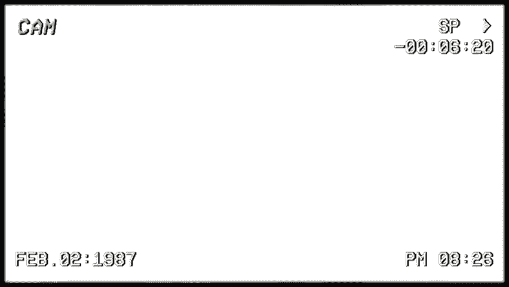
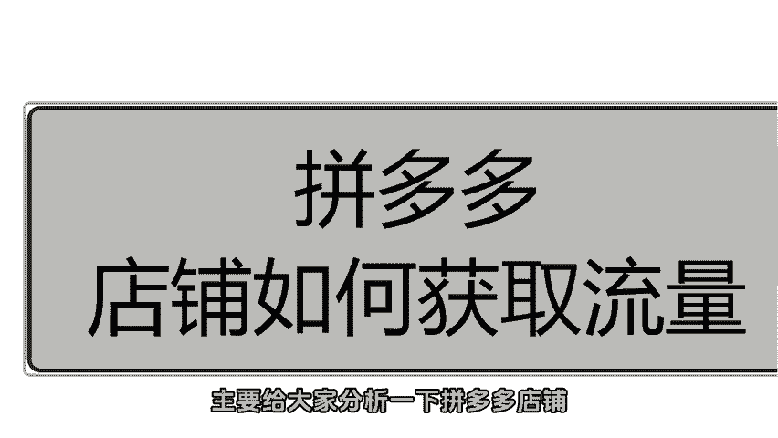
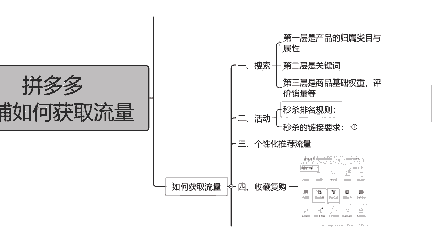
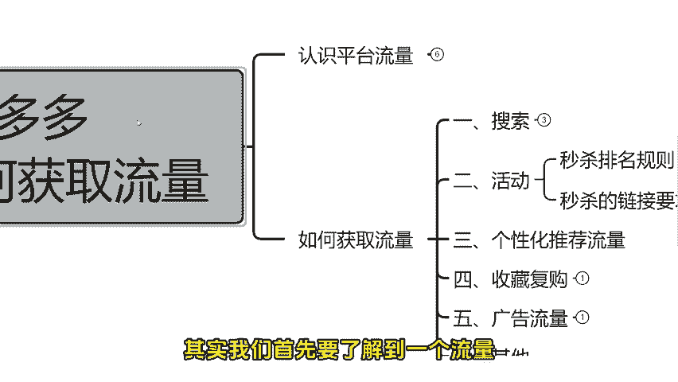
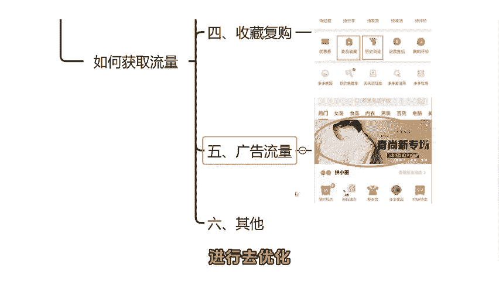

# 【拼多多运营实操教程】初学者拼多多开店必须学会！电商平台流量获取途径与实操步骤，搜索+活动+个性化推荐等流量轻松收入囊中！ - P1 - 电商运营教程- - BV1GfxjeZEeV

🎼所秋1。

hello，大家好，这期视频呢主要给大家分析一下拼多多店铺，我们怎么去获取流量。

首先我们在获取留恋之前呢，先认识一下平台的流量有哪些。这里呢一共总结了6点，第一个就是说搜索流量。搜索流浪呢它是平台的一个主要的流量来源。也就是说，买家通过搜索关键词人。

那么你的商品展现在搜索的这个截滚页面。那么这就是我们所说的一个人造货的模式。如果说已展示的排名越高，那么就相对于你这个产品呢权重越高。那么消费者也会更快的看到你的产品。

那么从而点击量以及转化都会进行到一个提升。第二个就是说活动流量。活动流量呢它是属于。拼多多平台营销活动资源位的一个流量。比如说我们报名日首页。限时秒杀。还有些9。9块啊，这些如果说你报名成功了。

那么他就会在这个活动的专区。展示出你的产品。那么你这个产品在活动当中的一个数据越好，从而你的权重排名也会更高。第31个就是个性化推荐流量。这梗流浪呢其实就是我们所说的一个千人千面。他是根据。

买家的支付、浏览以及收藏等等行为，系动会进行。推荐展示在内幕分类页，那么详情页下面也会进行展示。但是这个展示可能不是你的产品，也有可能是你的产品。它这个是随机仅展示了。第41个就是。搜藏。二。

复购的一个流量。这个流量啊，就比如说买家在个人中心，他收藏了这个产品。或者是店铺收藏三笔收藏，这都算。那么这个也可以我们称为私域流量。因为他在这个地方收藏了之后呢，他会通过这个搜藏里面进入到你的商品。

这种情况我们就可以称为收藏流量。第51个就说广告流量。这个广告联翁呢其实就是我们所说的一个付配推广。因为现在呢它拼多了里面升级呢肯就次有一个。商品推广。如果说有一些商家他没有升级。

还有一个全赞推广和标准推广，但是大部分都是商品推广。还有一个就是多多进宝，这两个都是我们所说的一个广告流量。第61个就是。其他其他这个其实我们可以说就比如说多多果园呀，还有砍价。或者是。

你把你的商品电影街分享给你的朋友，或者是你发在了朋友圈。还有说比如说你发到了小红书啊这些这些渠道引来在一个流量，我们就可以称为其他。但是这个其他的流量。我们有一个不好的地方就是说可能转化比较低一点。

那么这几个流量当中其实转化最好的就是我们所说的搜索流量。那么我们操作店铺最主要的还是操作这个搜索流量。那么在操作的时候呢，我们需要。从商品的标题上面下功夫。首先你写标题的时候，一定要把这个。

精准的关键词确定好。那么在操作销量的时候，我们需要利用这个。精准的关键词来做搜索成交。那么你是个产品，在这个关键词下面累积的一个成交金额越高。那么搜索了权重以及排名也就越高，怎么去获取这些流量？

首先我们先看一下第一个第一个就说我们的搜索。搜索呢，其实我之前讲过，就是说它这个方式属于人走货的一个情思。买家搜索关键词，那么我们的产品再出现在搜索结果类，如果说我们把搜索看作。这有过滤器。

那么就关于围绕这个搜索的规则，是以层层的紧要过滤的。那么。第一层就是说。我们。残品的一个归属类目，还有属性。其实。他搜索出来之后呢，它是有个别商品属于多个类目的。其实很多商家。你看你上架的类目是一个。

那么另外一个竞品，它上架又是一个。这个时候呢，我们在发布的时候呢，产品就会去搜索这个产品的主要核心词。那么根据搜索结果了解到拼多多它是优先展示出哪一个类目了。然后呢。

我们也可以把这个搜索排在前面销量好的一个产品呢，进行一个统计，可以通过一些第三方的工具查询一下它们的一个类目。如果说他的类目是。比较好的，那么我们也可以商架到这个类目。

然后就是说商品的一个属性其实也是非常重要的。因为呢这个商品的属性，它作为精准搜索的一个重要环节，也是拼多多，它是判定这个商品与搜索词启配性的一个重要指标。查看了一下我们自己的一个产品类目放的是否正确。

这个是我们第一步要操作地方。那么第二个其实就是放在我们这个商品的属性上面。商品的属性呢填写好了是有助于提升我们这个搜索的。而且权重上也会有提升。我们可以参考一下竞品卖的比较好的产品。

他们的这些属性填写比较完整，并且呢比较符合我们的自己的产品。这个情况呢我们就可以进行填写到我们自己的一个产品上面。第二层就是说关键词，那么这个关键词它决迹了我们商品能不能露出。

前期我们在做关键词的时候呢，建议是去做核心产尾关键词。比如说我们自己是做女装的。那么标题里面就含有女装连衣裙雪纺。那么消费者他就会通过女装连衣裙进店成交。那么。那这个权重就会给到这个大词。增加了权重。

那么我这个产品呢排名也会进行一个提升。那么它如果是通过女装连衣裙雪纺这个长尾词静电唇胶，那么也会对女装连衣裙。以及女装连衣裙、雪纺，还有连衣裙、雪纺这些关键词的搜索排名都会增加一些权重。

所以说我们在做蚕尾词，不管是标题还是做推广的时候，都是我们前区需要重视的一个地方。然后第三层其实就是我刚才说的一个。商品的。基础权重、评价、销量的骤星因素了，他露出了。我们商品中我们自己一个排名。

如果说你的权重还有评价、销量这些比较高的话，那么那权重可能就比较高。那么你的排名当然也会高一些。那么单品的关键词权重影响因素比较多，比如说点击率、转化率、单品的贡献率、复购率、客户评价单品违规。

还有扣分店铺类权重，它主要涉及到了店铺的动态评分。店铺的商品动销，店铺的一个售后纠纷，还有客户的一个回复率，这些都是需要考核得到的一个指标。因此，我们在平时操作店铺当中呢，做一些子标都需要自己注意到。

如果说。你俩一像违规了，他整个影响都死去较大的。所以说我们在做店铺当中一定要注意。第二个就说。活动。那么这个活动呢，其实我们首先要了解到一个流量，它这个流量其实就比较难获得吧，只能说。

那么活动它会让好的店铺越来越好。但是如果说你前期没有太大的一个基础，那么你就举报名这种可能会导致你这个谈产品的一个通过率比较小。所以说我们在参加活动之前一定要做好基础评价以及销量。一般来说呢。

它前期的一个活动审核机制都是针对你你这个单品。北一个日常销售情况，还有售后情况，这也是我们所说的一个动销率的问题了。那么。😡，每一个活动它其实都有一个不同的优势。那么。

我们要去了解一下各种活动的一个情况。那么再结合自己的一个产品去进行合理的选择。这里呢。😡，我建用这个限时秒杀给大家做一个。举意，首先，限时秒杀的一个规则。他就是说。对于。你这个产品。

如果说没有什么销量或者是你想要快速情深销量的话，那么就非常适合这个限时秒杀。因为限时秒杀，它其实就是为了商品更快的销售出去，产生最快的一个营业额。所以说秒杀活动结束以后，是要看活动当中的一个营业额呀。

还有。销售情况决定了活动结束后的商品排名。如果说以这个活动过程当中。这个动向率比较差，而且整体的一个评价呀这些都比较差的话，那么一项再次上这个限时秒杀可能就比较难了。而且你这个活动结束以后。

你的商品排名可能也得不到任何的一个好处。所以说。这个秒杀它对于排名，还有店铺的一个综合，都是有一些规则的。那么限时秒杀的一个。要求有哪些？振妮啊已给大家列了7个出来。首先第一个主图。

这个主图呢我们首先要做的怎么样了？做的。😡，清晰。干净一点，不要做到什么花里胡哨内容牛皮癣这种你就不要来了。这种的话你可能上去。😡，驳给你驳回了，并且呢还会影响到你这个产品的一个美感，还有视觉感。😡。

只要你能够足够的体现出商品的一个特点，卖点就可以的。第二个就说标题一标题里面，如果说你有品牌，就把品牌展示出来。然后呢卖点还有一个核心的卖点以及服务重要的材质方面。那么我们需要做一个修改就可以了。

第31个就说库存。这个库存啊在提升。的时候呢大家要注意，活动的库存记得要大于现在店铺销售了一个库存。如果说以期报收收的一个库存呢，小于了目前销售了一个库存，那么你在报名这个活动，他会给你驳回的。

第四个就是使说SQUQU啊，大家不要一下子弄得太多了，因为弄得太多，它容易驳回。所以说我们只要保持一个平衡就可以了。除非也是那种什么尼子卖服装的。这种码数SKU和色差这些除外就可以了。其他的商品。

你一般。弄个10个左右的SPO就可以了。第五个就说单设单摄，其实它就是说限时秒杀这个活动的服装类。不能单方面的报名单个SPO如果说一次单设，可能他也会给你驳回最小库存，那么不能低于平均库存的一半。

第61个就是码数的问题。这个呢其实也是针对于这个服状内。如果说你这个码数只有一个规格，单数也是均码，那么这种肯定也会给你驳回。所以说它这个活秒活杀的活动啊，它是需要你这个产品库存充足。

并且SPU的库存也要充足。第七个就说评价。评将呢他是。这样子。对于三品的评价，在现实秒杀当中是非常重要的。尽可能呢我们自己去做一些评价，或者是开启这个。评价有理。累计一些真实评价。

尽可能的把这些什么差评啊、中评啊这种压下去，尽量的保持在千分之5以下就可以的。毕竟你是个销售的多了，差评有了，系统它也会进行一个考核。如果说太多差评。那么活动不能报名。

并且营这个产品的权重排名也会进一个降低。这个性化推荐流量了。这个主要是属于或找人类一个方式。这个其实就是我们所说的一个个性化推荐流量。我们必须要去迎合精准流量的一个展现去推送。相信不赏。商家呢肯都知道。

这个它属于千人千面的，但是呢又有很多新手，咱刚开始操作的时候不太清楚我们的展品该怎么去圈定自己的一个人群。其实呢我们在圈定人群的时候呢，我们可以从关键词。组图商品标题上面入手，比如说。

我们是做这个手套的。如果我们的标题面选择了一次性手套家用和这个一次性手套批发，那么针对的群体其实就是两种了，家用的以批发它是两个概念。家用的可能需要质量高一点的高体验的商品。

而批量这种话可能就说价格比较低嘛，适良过关就可以了。那么我们在标题上面筛选以后，我们就知道如何针对性的去做这个组图以及关键词的筛选呢。第41个就是说收藏复购的这个流量。

这个收藏呢它其实是代表了一个买家的喜好度，这是增加商品权重的一个核心要素之一。复购呢它其实是系统复审商品符合买家的一个需求，以及产品质量售后的一个问题。在复购率的猛期上呢，我们其实要做一个点。

就是说做好每一个。消费者的一个购物体验，可以我们自己适当的做一些送一些小礼品啊，或者是发送一些优惠券呀，包裹的速度上面提升一下。那么。其实最主要的还是看你产品的一个质量要过关。这个其实我们可以在。

我的订单里面从这两个渠道进来看到你的产品，我们就可以称为收藏以及。复购来了流量。第五个就是广告流量。这个广告流量啊，其实它是这样子的，大家都知道现这个平台呢其实竞争比较大。

免费流量呢可以可能呢对于这中你小卖家或者是你新开店铺来说比较困难。所以说我们在开店铺前期的时候，不管你的产品有多大的优势。都是需要用到一个付费推广来进行辅助，这样的话才能快速的进行一个发展。

做推广的时候呢，我们可以用到商品推广或者是。多多进宝，当然，多多进宝可能他的数据比较差，最主要的还是靠这个商品推广。前期呢我们开推广了之后呢。我们把这个投产设置低一点，或者是你设置的成交出价。

我们把这个成交书价设置高一点，前期亏一点，它是正常的。先把数据累积起来以后，我们再考虑到提高投展或者是降低成交出价。第61个就说其他流量。这个其他流降啊，其实就。比如说什么砍价呀。😡，多多果园这街。

还有。讲你朋友圈分享这些链接来的流量。那么我们就可以称为其他流量。当然。这个流量它虽然流量可能比较高，但是。他这个转化比较低。好啊，关于这6个就给大家讲解完了。但是大家要注意核心重点。

就是说你如果说碰到了流量下滑，销售我提不上去，这种情况下，我们需要把店铺做一个全面诊断。比如说有没有违规呀，还有你的产品的基础做的是否正确了。那么推广方面做的如何，又没报名活动这些。

那么大家就可以根据我说的这几个点进行去优化。

