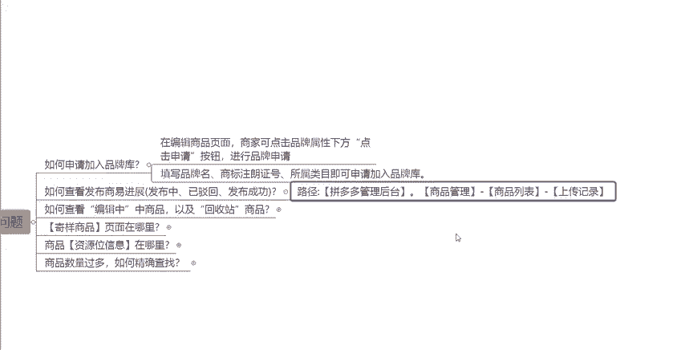
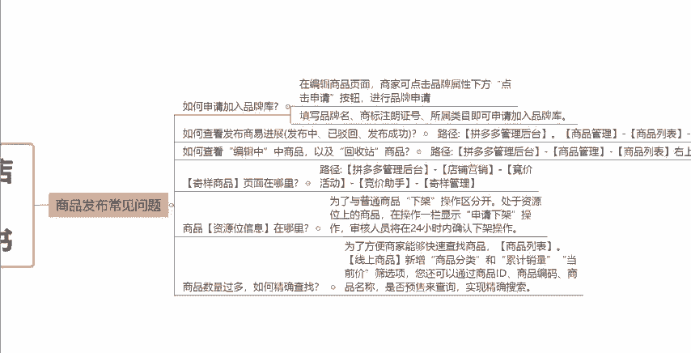

# 【拼多多运营实操教程】最系统的零基础拼多多开店教程全套，电商运营大佬专为学渣研制的新手开店保姆级教程！全程干货，简单粗暴 - P15：15、拼多多开店-商品发布常见问题 - -拼多多开店 - BV1BH1qYpEqw

hello大家好。今天这一期视频呢是关于我们拼多多新手开店实操运营白皮书系列课程当中的这一期商品发布的常见问题啊这样的一期课程。呃，前面的视频呢。

我们跟大家讲到了就是关于我们产品发布需要填写的一些具体的内容，对不对？需要的一些注意事项，那么今天这一期视频呢，我们来说一说商品发布的时候，一些常见的一个问题。对于我们店铺操作来讲呢，有很多时候啊。

我们比如说涉及到一些品牌的入驻，对吧？我们的产品本身是品牌的，那我要去填写这个品牌。唉，但是我发现一个问题啊，就是在这个拼多多属性当中的品牌这一栏的选项当中，没有我的这个品牌的选项，那怎么办啊。

这是第一个点，如何申请加入品牌库，我们一起来看一下啊，在这个编辑商品的页面啊，它是有一个地方是可以让我们去申请品牌入驻的。我们直接在商品编辑的这个下面啊品。

排属性下方有一个点击申请按钮，点击了这个按钮之后，然后我们根据我们实际的一个情况去填写我们品牌的名称，然后去填写我们品牌的注册证的这样的一个编号，以及所属的类目啊。填写完之完成之后呢。

我们就可以提交申请入驻这个品牌库了。那么入驻成功了之后啊，我们可以在商品的编辑过程当中啊，就可以直接的使用到我们的这样的一个自己的品牌了啊。那包括说我们自己的一个产品啊，在默认商家的时候呢。

也会去默认的选择到对应的一个品牌啊，这是第一个点，就是如何申请加入这个品牌库。那么再说一下第二个问题啊，就是我们在产品在发布的一个过程当中，那么我们如何去了解这样的一个发布的进度，对不对？

比如说包括我们这个产品的，比如说它正在发布中啊，或者说已经驳回啊，或者说发布成功啊等等这样的一些状态，到底是什么样的一个情况啊。那么我们可以看一下啊，在我们的这个拼多多的商家管理后台。

然后我们可以点开我们的这个商品管理，点开商品列表，然后里面有一个上传记录啊，我们在上传记录里面呢，就可以看到对应的一个链接的情况啊。那么如果说已经发布了成功啊，那这边显示的就会是发布成功。

如果说还在发布显示的就是发布中。那么在这里面啊，如果说已经就是我们被驳回的这样一个情况。那么我们要去找到它对应的一个原因。然后我们再去做修改，按照符合标准的。

这样的一个方式啊，然后去重新的上传我们的产品啊，这是第二个点。那么我们再来说一说，就是我们这个平台一个编辑中的一个商品啊，还有我们这样的一个回收站的一个商品的一个情况，对吧？

因为不可避免的就是我们的产品在发布的过程当中，可能会遇到一些比如说意外的一些情况，可能我这个产品呢在发布的时候，因为一些其他的因素，导致我没有办法第一时间去完成这一个上架。

那么这个时候呢，我们的产品可能就需要什么去保存下来这样的一个草稿信息，对不对？或者说其他的一些上传的一些信息。然后等到我其他有时间之后呢，我再回来完成这样的一个产品的一个发布，然后去正常的一个上架。

那所以呢这个时候我们可以去把它保存为一个这一个。

草稿箱对吧？我们可以在我们的拼多多啊，这是一个详细的一个路径啊。拼多多的管理后台，然后点击商品管理在商品的列表右上角有一个草稿箱或者回收这个回收站的一个位置啊。那么在这样的一个位置呢。

我们就可以把我们上次保存的这样的一个链接，然后重新的打开，再去编辑，然后去上架啊。然后在回收站里面的话，如果说有的产品可能说被我们自己不小心的删除了，或者说有时候呃某一个链接找不到了。

那么我们也可以去回收站里面去找一下。如果说是在回收站里面的话，那么我们也可以找到它，然后把它重新的去发布去上架都是可以的啊，这是第三个问题。然后第四个点呢就是呃。

寄样的这个商品啊。那么在很多的时候啊，我们在提报一些活动啊，或者说一些其他特殊类目的这种产品的情况下，平台它有的情况下会要求我们进行一个商品寄样。那么寄样的这个页面到底在哪个地方呢？

跟大家讲一下它的一个具体路径啊。在我们的拼多多管理后台，然后点击店铺营销竞价活动里面有一个这个竞价助手啊，在竞价助手当中呢，就有一个寄样管理啊，里面会有一个计样管理。

那么这边大家有一个点需要注意一下，就是目前的话平台上面的这一个寄样的话，基本上是不支持退回的啊。所以说大家要注意一下这个点。那么如果说确实啊自己的一个产品是需要寄样的话呢，那么我们在操作它的同时啊。

我们再来说一说这个呃这个资源位的一个信息啊，很多时候我们的产品在提交了一些活动提报的一个过程当中呢，我们的产品就会上架到一些这个资源位上啊。那么现在资源位呢就是为了。

我跟我们的这个普通的商品进行一个区分啊，那么这个时候我们的一些成品就是不能够直接下架的对吧？那么普通的商品呢，我们都知道它是可以这个随意下架的。那么这样的一个资源位啊，有一些资源位的这一个商品呢。

它是没有办法啊去随意的下架了。但是如果说是有资源位的一个商品啊，那么是会要求我们去点击一个申请下架。然后呢交给我们这个官方的客服，它会进行一个审核24个小时之内啊，如果说审核通过了。

那么你这个产品才能够正常的去下架。如果说是审核不通过的话，你的这个产品就是暂时没有办法去下架的。同样的还有一点啊，就是如果说我们的店铺里面有非常非常多的一个商品，对不对？

那么我们如何去能够快速的去找到其中的某一个商品，那么我们的在我们的这个商品列表当中啊，我们可以直接的去搜索我们的这个商品ID。

或者是在这或者是在这个输入框当中呢去输入我们的一些比如说产品的一个标题啊，一些关键词啊，都是可以的。我们可以通过它的这一个选项来进行一个筛选。当然呢我们也可以通过排序的一些方式去快速的找到一些产品。

比如说通过的我们的一个这个上架时间的一个排序啊，或者说通过这个累计销量的一个排序啊等等等等，这些排序方法，都是可以呃来进行操作的。O那么以上呢就是我们在店铺的运营过程当中。

关于发布商品可能会遇到的一些常见的问题啊。那么大家如果说还有什么其他的地方不理解的，想要呃沟通的，那么大家都可以在评论去找到我。然后我有空的话，也可以去解决一下大家的一些问题。

帮大家诊断一下店铺都是没有任何问题的。好吧，那么这期的视频呢，就先跟大家分享到这，感谢大家的一个观看。

