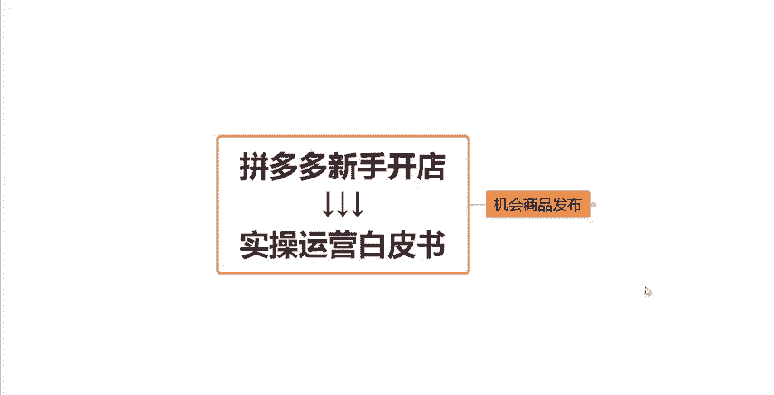
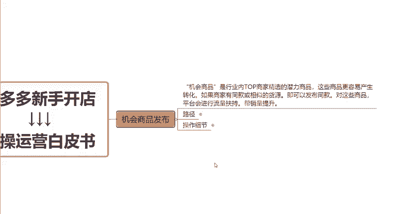
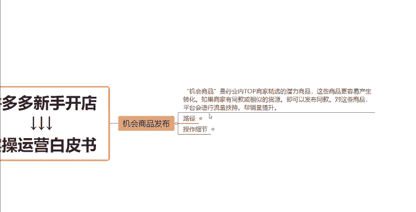
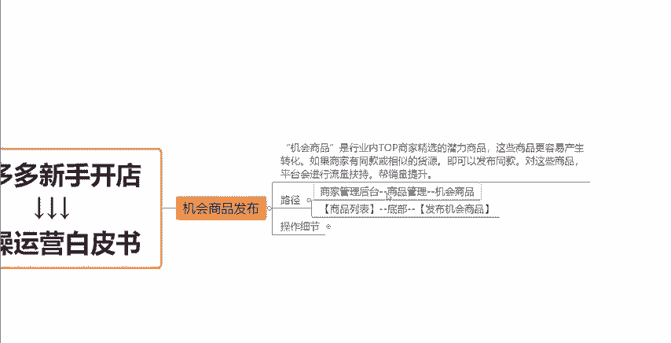
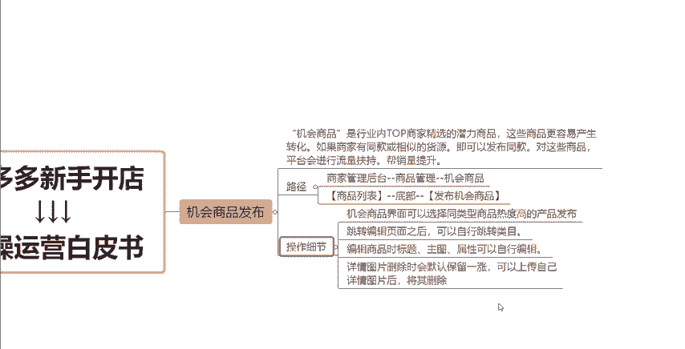
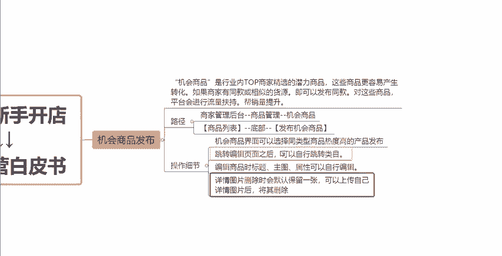
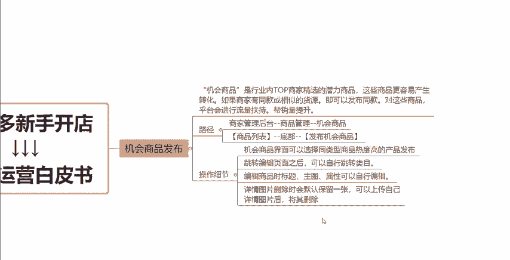
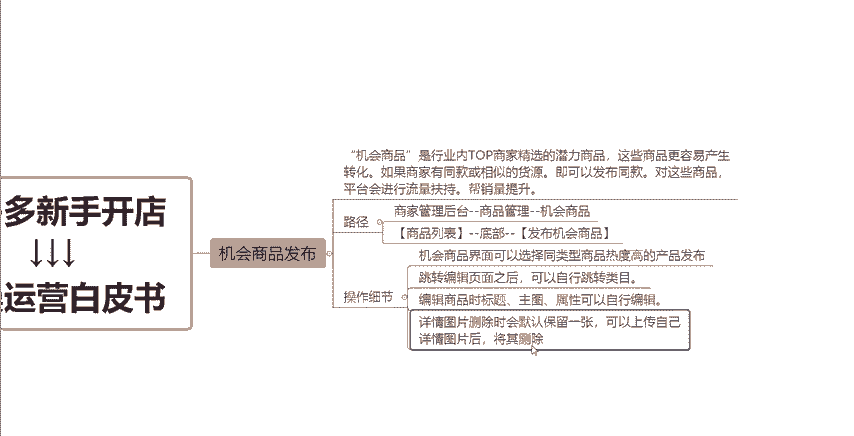
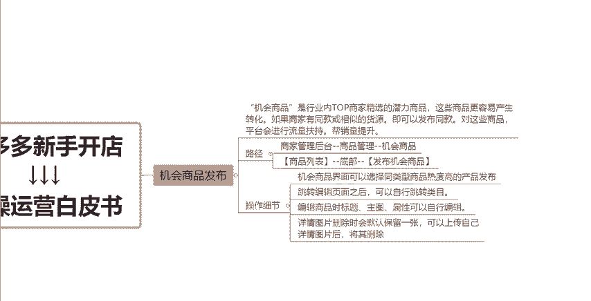

# 【拼多多运营实操教程】最系统的零基础拼多多开店教程全套，电商运营大佬专为学渣研制的新手开店保姆级教程！全程干货，简单粗暴 - P16：16、拼多多开店-机会商品发布 - -拼多多开店 - BV1BH1qYpEqw

。hello大家好，那么今天呢我们继续来聊聊关于我们拼多多新手开店实操运营白皮书系列课程当中的这一期关于机会商品发布的这样的一期课程啊。那么之前我们有说到过，就是通过机会产品发布的话，呃。

它比我们点正常的去点击这个发布新商品的按钮，它的权重呢会高一些。那么为什么呢？我们一起来看一看啊，首先呢机会商品大家先搞清楚它的一个意思是什么，就是它的这样的一个概念是什么？

机会商品啊是行业类top商家精选的一些潜力商品。那么这些商品呢在拼多多这个平台上平台它认为呢是更容易产生这个转化的那如果说我们的商家比如说有一些呃跟这些机会商品是同款的产品。

或者说是一些相似款的产品的话，那么我们就完全可以去点击发布同款的方式来去上传我们的产品啊。那么这些产品在完成这个达标之后呢。

平台它就会有更多的这样的一个流量扶持啊，能够帮助我们带来更好的一个销量的一个提升。那么这是平台它的一个说法，对不对？有了这样的一个逻辑之后啊，我们就其实可以很好的理解的，对不对？比如说我两个产品。

一个是产品A，一个是产品B。那么这两个产品都是同款相似款或者说一模一样的。但是其中一个呢是到这个就是机会产品去这个发布上架的那另外一个呢就是正常的这个发布去上架的。那么这种情况下。

两个产品如果说权重一模一样的话，注意了啊，就是它的展示不是说随机展示的。不是随机曝光的，而是会优先的展示到通过机会机会商品这个渠道进行发布的这样的一个商品。为什么呢？

因为平台它会认为这个产品它是能够更加容易形成这个转化的，能够给了它更多的这样的一个流量扶持，跟这个曝光扶持，知道吧？所以说这一点大家注意一下啊。

如果是我们发布产品的话，那么如果说你有这种同款相似款，一定是通过机会商品这个渠道去发布的。那么跟大家讲一下，就是机会商品发布渠道的一个后台的操作路径啊。呃，我们一起来看一下这两种方式啊。

第一种方式呢是我们可以直接到我们的这个商家管理后台，然后直接点击我们商品管理中的这个机会商品就可以了。进入之后呢，我们可以呃根据自己的这样的一个产品的实际情况来选择商品来进行发布同款啊。那么第二种方法。

同样的，我们可以到我们的这个商品列表，然后底部它会有一个这样的一个发布机会商品这样的一个按钮。那么我们也是可以找到这这样的一个按钮的啊。那么整个发布流程啊，跟我们正常去发布商品是一模一样的。

也是需要去填写我们商品的一些基础的这个属性啊，一些信息啊，包括我们的这个商品的库存啊规格。

等等这些信息啊。那么在操作上架的这样的一个过程当中，会遇到一些小小的一个细节跟大家讲一下。首先第一个点，我们在这个。

机位商品这一个界面去选择的时候呢，选同款的话，我们尽量的去选择那种同类型商品，然后热度更高的产品进行发布。那这样的话我们在发布之后啊，如果说完成达标。那么我们的产品它自然的这样的一个推荐曝光就会更多。

那同时另外一个点的话，就是我们点击了发布同款之后啊，这个时候我们会跳转到编辑页面啊，我们可以根据自己的一个实际情况去做这个编辑去做修改。我们修改我们的这个比如说产品的一个实际的类目。

包括说我们产品的这个标题图片属性等等这些东西都可以去修改。而详情页的话，通常情况下，就是详情页我们把它全部删除完系统呢，它会默认的保留一张啊，保留一张。那么这个时候我们要怎么去删除呢？

就是我们可以先上传一上传几张我们自己打算去上传的这样的一个。详情图片上传完之后呢，就可以把原来的那一张去删除掉了，知道吧？那同时还有另外一点呢，就是什么呢？就是机会商品发布啊。

不是说必须我的产品跟它的这一个产品是必须要一模一样的，或者说要相对来讲比较接接近的这样的一个产品啊，并不是这样的，只要是我们什么我们的产品是有一定的相似度的，其实都可以通过它去发布同发布这个同款的。

所以说大家不用再去纠结啊啊，我的产品跟它好像有一点不一样啊，或者说有这个地方哪个地方的一些差别啊，不用去纠结这个点的，知道吧？只要有一定的相似度都可以去发布同款，好吧。

O那么以上呢就是我们关于机会商品发布的一个内容啊的一个分享，希望对大家有所帮助啊。如果说大家在这个运营店铺的过程当中，还有一些其他的问题呢，大家可以在评论区找到我。

然后欢迎大家跟我一起随时的交流沟通探讨都是可以的啊。然后这期视频就先分享到这，感谢大家的一个观看。

