# 【拼多多运营实操教程】最系统的零基础拼多多开店教程全套，电商运营大佬专为学渣研制的新手开店保姆级教程！全程干货，简单粗暴 - P17：17、拼多多开店-自然流量起款方法 - -拼多多开店 - BV1BH1qYpEqw

hello，大家好，我是谢楼。那么从今天开始呢，将为大家分享到我们拼多多占流量的一个骑款玩法啊。那对于很多小伙伴，尤其是新手来说的话，可能拼多多的自然流量获取呢会比较困难啊。

包括说整个运营呢也会比较迷茫啊，可能每天呢不知道该干什么啊，每天呢也都无所事事。但是呢实际上店铺操作呢会有到非常非常多的一些啊东西，非常非常多的一些细节，需要我们去做的啊。

那么今天呢我们就来针对到我们在流量期款的操作里面的一些注意事项和操作的一些内容呢进行详细的讲解啊，为大家的运营呢啊打开思路啊。那么在整个操作过程中啊，我们想去做好一个自然流量呢。

其实很多时候还是蛮困难的，尤其它会比我们做付费流量来说要更难一点。因为付费流量呢它比较简单，就无老式的我去做了一个付费推广，把钱花出去流量就来了，对不对？所以它比较简单。而自然流量的话。

可能在某种意义上来说，它是比较难的，它也才是真正意义上的运营啊，那么首先呢我们来说一说，我想去做好一个自然流量的话，那我必须针对到我店铺呢进行一个啊选品以及产品的规划啊，这是必须的。为什么这样子说呢？

因为如果说我今天只是想当然的找到了某一个产品在拼多进行销售。那么这个产品呢它有可能并不具备很好的一个市场体量，可能他在拼多多平台根本就卖不动啊。那么这种情况之下，我去上架操作呢。

可能我很难去做到一个比较。多的一个访客数据。即使说我能够有到一定的访客量呢，也很难形成转化。所以这个是我们需要去留意的一个问题。我们需要找到一些符合拼多多平台，并且在拼多多平台有一定市场品量的一个产品。

这样呢我们去做呢，才能够更好的去达成我们的销售目标。那同时呢在针对到这类商品的这个上架过程中呢，我们还需要针对到我商品呢进行一个呃完整的发布过程中的一些商品规划啊。

那么我们需要布局到更多的展示人群布局到更多的展示的一个细分的一个场景。那么这样呢可以有利于我店铺呢啊达呃获得一个更多的一个曝光机会和这个呃流量的展示的一个入口，对不对？那么有了这样的一个先决条件之后呢。

OK我们需要针对到产品呢进行我们点击的一个优化。

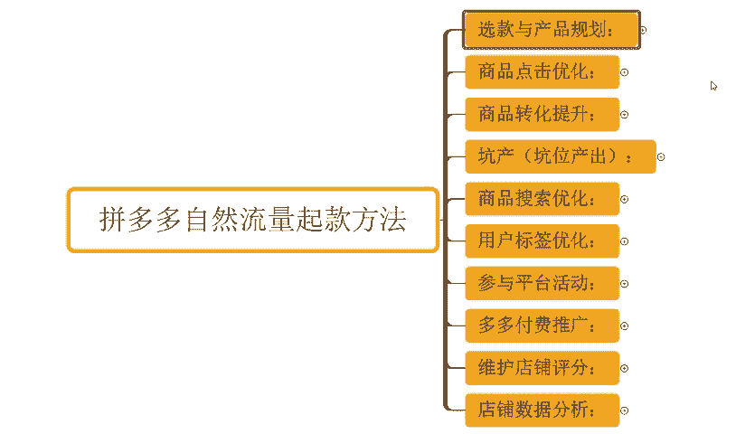

对吧当我能够有到一个相对比较不错的点击率的时候，当我的产品呢在同等曝光情况之下能够有到更好的点击率的时候，O我的产品在后续呢也可以得到更多推荐。那具体怎么优化。后面我会详细分享啊。那接着再往下呢。

当我们产品呢有了访客，对不对？我们要如何去提高我商品的转化啊，那么得到更多的订单。那同等曝光情况之下，我能够拿到更好的访客能拿到更多订单的话，那毋庸置疑我的商品的权重也会更高。

我在后续的平台推荐里面也会得到更多的访客，对不对？那么在这个过程中，另外一点呢，就是我在获取订单的时候呢，我也要保证我店铺的这个坑产，也就是坑位产出，对不对？能够有到更好的一个呃销售的一个呃数据效果。

对不对？能够比同行更优秀。那同时呢能够有到更高产出之后呢，我们才能够在整个的平台商品。

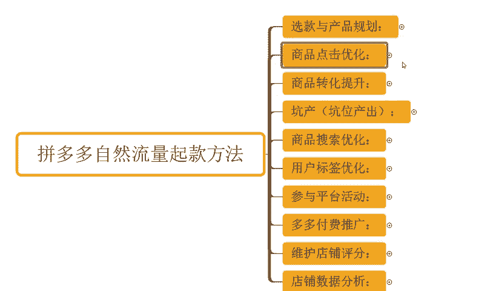

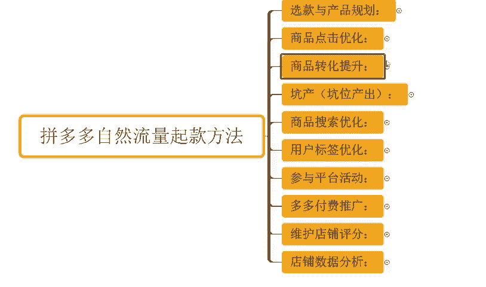

对比过程中，让平台判定我们的产品呢，它更具价值，更被买家喜爱。为平台创造的一个收益呢更多，对吧？那么这样子O我们才能够去一步一步的得到更好的曝光。

那同时呢我们还得去针对到我们商品呢去做好我们产品的搜索优化啊，那我们要搞清楚平台的哪些搜索词数据更多，哪些搜索词呢热度更高，哪些搜索词点击效果更好。

同时呢哪些搜词是更加符合我产品的更有利于我获取曝光的我能够更具竞争优势的那我都得搞清楚，那么搞清楚之后呢，针对到这种关键词呢，我们进行合理的使用和优化。那么为我店铺呢可以带来更好的曝光。

带来更多的访客啊，那么再一个呢就是我们需要去了解清楚我们的用户标签呢，并且进行优化了，对吧？那我们的店铺也好，我们的产品也好，其实它都会有到不同的商。

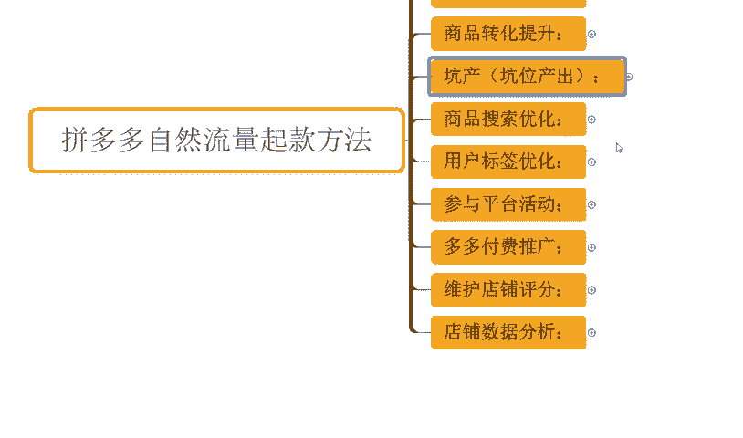

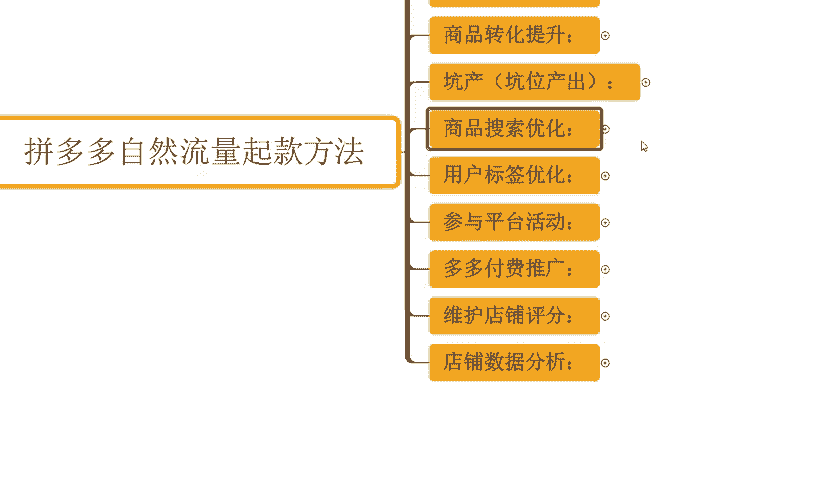

商品的推荐展示人群，而这些人群我能不能够去进行更好的转化。那么对这些流量，如果说能够形成更有利的转化的话，平台就会判定说这一类人群对我来讲它是一个精准的。那么也会针对到我店铺呢在后续的曝光过程中呢。

优先推荐这一部分人群，让我们店铺呢能够持续的或者是能够更好的维持一个高转化的一个效果，从而达成我们啊用户的一个呃转化啊，提高我们的一个这个转化率，提高我们的流量价值，对不对？

那么这样呢我们整个的店铺群众啊才会更高。包括说我们平台创造的收益呢也才会更大啊。那么同时呢我们还要去提报我们的平台活动啊，那么提报平台活动呢，它可以帮我们完成我们的一个商品活动推荐群众的获取。

同时呢在很多的展示。入口里面呢可以得到一些更多的曝光机会啊，那么在正常的产品的搜索展示端口的话，那么有了活动标签之后呢，也能够得到更好的推荐啊。但是呢我们需要去如何注意好我们的产品价格设置。

保证我们的一个商品在正常的活动推广过程中啊，不亏损或者是能够有到更加稳定更加好的收益，这个是我们需要去注意的啊，那不能说我上活动就亏对吧？那么如果说一直亏肯定也收不了的，对不对？O那么再往下呢。

我们可能还得去了解到我们啊多多的一个付费推广啊。当然那我们讲的是自然流量起款啊，可能像伙说那为什么会有到这一个多多付费推广的一个一个说明呢。那么这里呢啊没关系啊，它不冲突，那付费推广呢。

它可以帮助我们更好的收割我们店铺的一个用户啊，这个是没问题的啊，但是呢我们不是强付费去做。那这里呢会为了详细的分享到我们店铺目前的一个付费推。广方式。

并且如何去做到一个更加高效或者是呃更加啊容易达成盈利的推广方法会未来进行分享讲解啊，那么这都O的那再往后呢，我们要了解清楚就是我们店铺的评分的那么这个评分呢可以影响到我们产品的推荐排名。

那同时呢它对我们转化也有影响。那我们如何去更好的维护我们店铺的评分，怎么样去得到一个更好的店铺评分，这个是非常关键的一个点，对不对？那也会进行详细分享。然后再最后呢就是我们的数据分析了啊。

那么我们如何去针对到我们店铺的数据进行分析，如何去把控我们店铺数据背后的一些这个呃产生的一个逻辑，对不对？啊，来进行我们商品的优化。那么这个也是非常关键的一个点啊。

那这些所有的内容就是我们在整个做自然流量过程中需要去注意或者是那必须去注意的一些东西啊。那么呃后续呢我会一个一个拆开啊进行详。

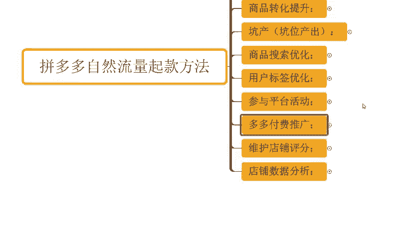

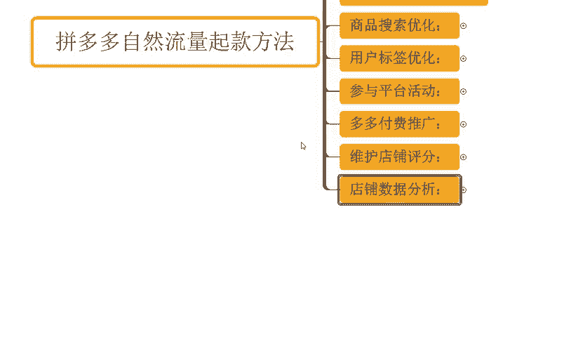

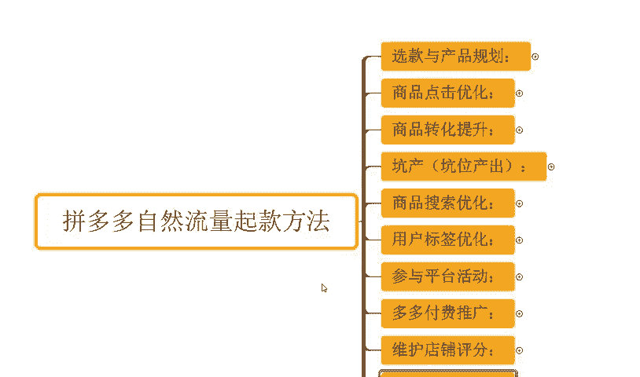

细分享啊，那么如果说还有什么其他的一些疑问啊，大家可以进行一个交流沟通，对不对？那其实很正常啊，那么每个人在这这个店铺运营过程中呢，肯定或多或少都会遇到一些其他的问题啊，那我也非常乐意为大家进行解答啊。

那同样的也有很多小伙伴可能在整个店铺操作过程中呢花费了比较多的时间跟精力，但是呢整个店铺数据呢是没有得到一个明显增长的，对不对？那如果说你是这种情况啊，确实是想要长期坐店，好好做店的话。

O那么我也建议呢可以考虑跟着实操，对吧？可以看到这一店铺也都跟实操的像这个店铺对不对？呃，最早的话访客是5000不到，对吧？那么跟着实操之后呢，一个月时间访客是直接做到了3万啊。

那么一天的订单呢是3800单啊，12。67的转化率，对不对？啊？当然还有像这个店铺啊，那么最早呢是6000不到的访客啊，一个月时间啊，从最早60不到访客呢做到了4万访客，对吧？

那么一天的订单呢是6100单啊，那么。

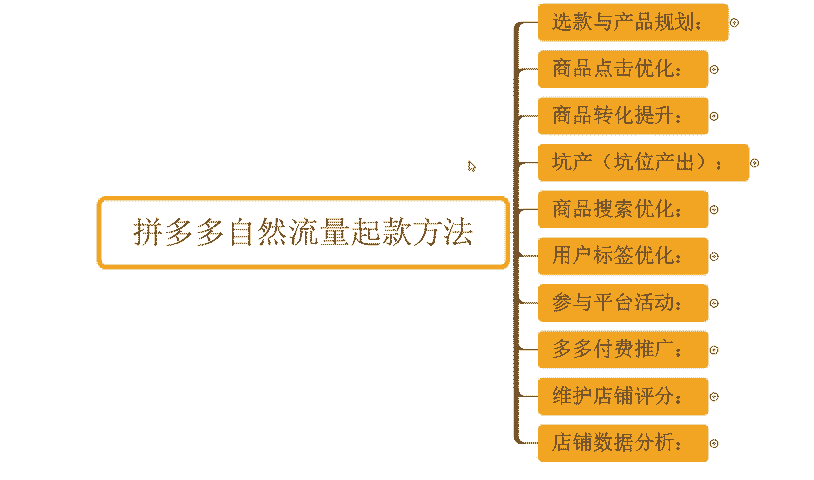

转化率呢15。16，对不对？啊，类似这种店铺还有很多啊，包括像这种店铺啊是纯新店来的，可以看到啊，最早是零访客的新店来的啊。那么跟着实操之后呢，可以看到从零访客也就半个月时间左右吧，对不对？

访客做到了5000多对吧？一天订单800多单啊，那么营业额呢1。8万对不对？14。01转化率对吧？包括有这个店铺也是零访客的新店来的对？那么从最早零访客做600多访客一天1100多单是8点29转化率啊。

所以如果说你自己没有一个好的方法确到运营经验没有到思路。那跟着实操，我相信对你自己的能提升，对你的店铺提升帮助应该是更大的啊这边也由准备到了非常多的一个视频素材可以看一下将近有100份的文档。

那么里面呢从基础到进阶的全套运素材都有的啊，包括了非常多的一些平台规则新灵操作玩法平台活动技巧以及付费推广玩法等等都有的吃透之后呢，正常店铺运营是没什么问题的。有需要小伙伴呢可以关注。

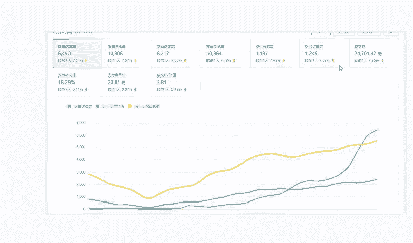

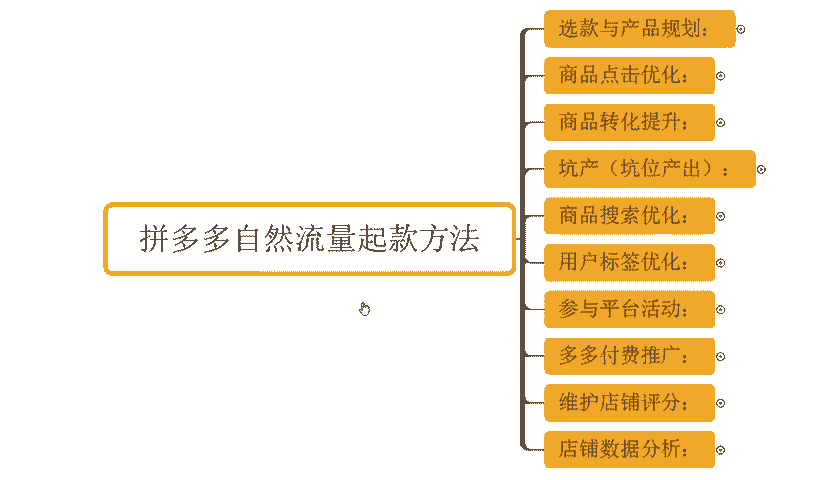

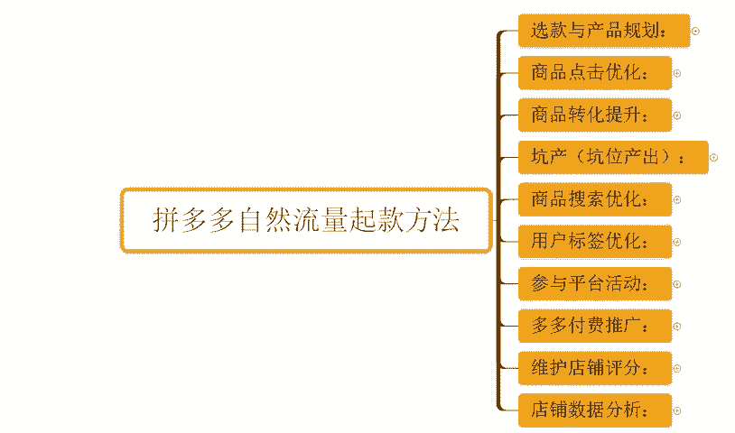

回复做点领取。