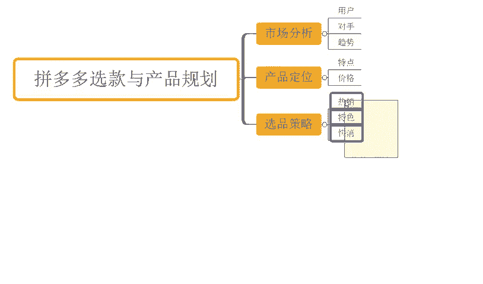
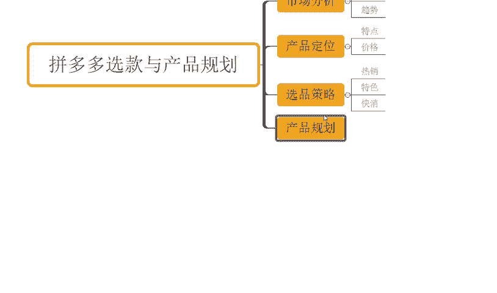
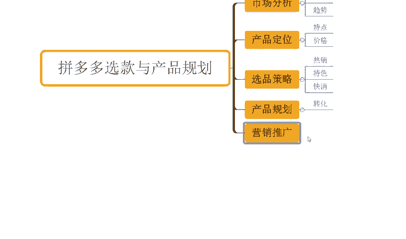
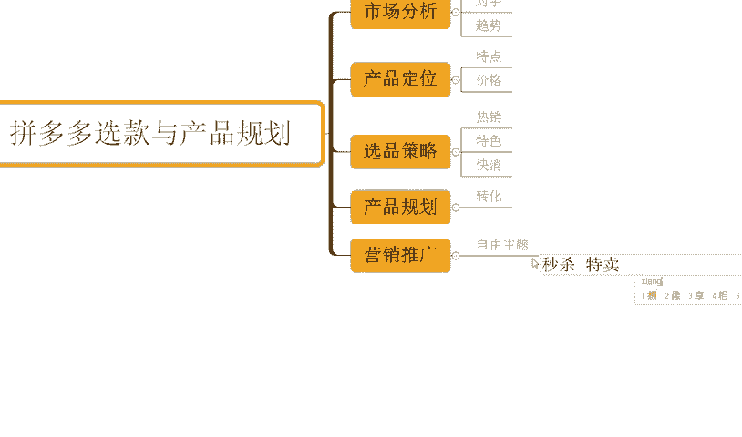

# 【拼多多运营实操教程】最系统的零基础拼多多开店教程全套，电商运营大佬专为学渣研制的新手开店保姆级教程！全程干货，简单粗暴 - P18：18、拼多多开店-选款与产品规划 - -拼多多开店 - BV1BH1qYpEqw

hello，大家好，我是谢洛。那么今天为大家分享的内容呢是我们拼多多自然流量企款中的选款与产品规划啊。那么在整个的运营过程中的话，其实产品的选款还有这个产品的规划呢是非常非常重要的，对不对？

其实呃简单的来说的话，就是我们需要去找到一些啊更加具备潜力的这种商品啊，然后呢，针对到我们市场进行分析，了解我们消费者的需求，以及我们进度情况来进行产品运营啊，就这么简单啊。

那么这是我们整个的一个逻辑的概括啊。那怎么去做呢？首先呢我们就需要针对到我们的市场进行分析。啊，那么针对市场分析的时候呢，我们需要了解清楚一些东西啊，哪些东西呢？首先第一个点呢是我们的用户。

那么我们的用户他的一个需求是什么？他的偏好是什么？他的购物习惯是什么样子的，对不对？他喜欢什么样的一个产品的表达方式，他对哪些产品表达更敏感啊，那么哪些产品表达更容易帮助我们促进转化。

OK这些东西都是我们需要去做的，或者他更加关注的问题是什么，他更加关注的一些这个产品的特点是什么哎，我们也搞清楚搞清楚之后呢，针对性的进行运营啊，那么接着再往下呢，我们需要针对到我们的竞争对手呢。

进行一个分析啊，我们了解清楚我竞争对手，他的一个呃产品的具体情况，他的质量怎么样，对不对？他的工艺，他的材质怎么样子，然后他的一个价格，他的营销策略是什么等等啊，然后根据他的这些信息。

然后我们总结出我自身产品的竞争优势是什么。那么这个就是我后续在运营过程中啊，我要去跟同行竞争的一个重要的依据，对不对啊？同时呢我要告诉。我的消费者，我哪里更好？为什么要选我对吧？O再往下呢。

我们需要搞清楚就是我们的一个市场的一个趋势啊，那么这个东西也是非常非常重要的对吧？啊，我要了解清楚当前我们产品未来或者是在整个的销售过程中的一个呃这个需求情况，对不对？比如说我卖棉衣的对吧？

那春夏秋冬肯定会有不同的季节，这个棉衣，这个产品呢卖的很好啊，它的需求更多。那我一定是呃要尽可能的找到符合当下的一个呃市场需求的产品，那么这样呢我整个推广整个运营呢会更加省力一点，对不对？

比如说明明我卖服装的话啊，夏季我要去卖T恤可能更好卖，我非得去卖一个棉衣，那么可能整个市场体量呢会比T恤要小啊，当然呢反季节仍然可以做啊，不是反季不能做啊，只不过呢整个的呃操作方式，它可能是不太一样的。

对不对？然后再往下呢，我们针对到市场进行分析之后啊，我们得需要针对到我们产品。

品呢啊进行定位啊。那么这个产品定位呢需要明确清楚我商品的特点。

啊我们需要针对到我的商品特点呢来进行我产品卖点的体验卖点的一个挖掘，对不对？我有哪些特点？我有哪些特征啊？我的产品是用到什么样工艺是什么样什么样材质。

那么这些材质这些工艺为我的商品带来了什么样的一个好处。那么这个好处其实就是我们的卖点。那么这个好处也正是我们可能买家更加关心的点。比如说买家可能比较关心的就是使用寿命问题。那我用到了什么样的工艺。

那么这个工艺呢会比别的工艺啊，更耐用，对吧？我用到什么样的材质。那么这个材质会比别的材质要更耐用，对不对等等啊，这个就是我们产品特点，以及我们产品卖点的一个逻辑关系。

那我们需要在整个的一个产品优化过程中呢？或者产品的一个定位过程中呢，就需要把这个东西做出来啊。那么接着再往下呢，我们还需要针对到我们的一个价格呢进行一个呃这个设置，对吧？

我们需要有到一个明确的价格定位啊，那么用户呢。它对于价格的敏感度远远比我们想象的要多的多的，哎要高的多的东西啊，这个东西很正常。因为拼多多平台本来就是一个相对来说呃用户价格敏感度比较高的平台。那同时呢。

价格更加的具备竞争力的话，在呃整个的平台上呢也会有到更好的产品推荐群众，对不对？所以说我们需要保证我价格呃能够去有到足够的利润的情况之下，具备到更好的一个竞争力啊。

我们如何去设置我们的这个低价的SQU如何去设置我们的价格段啊，如何去设置我们的一个SKU的一个布局啊，那么这个都是有讲究的，好不好？OK那么再往下呢，我们除了这个地方之外呢。

还需要有到一个呃比较好的呃选品的策略，对不对？

那么这个选品策略的话，我们主要是干嘛呢？根据一些呃热销的产品呢，或者是一些特色的产品呢，对吧？嗯，或者是一些这个快消品呢这样的一个方向来进行啊。

特色啊特色啊快销。

那一般是根据这样的一些呃点来出发，对不对？那首先呢我们可以多去关注一下我们拼多多的热门榜单，对吧？找一找那些选择高评价高的产品啊，那么这些产品呢它大概率来讲的话不会太差啊。

我们也可以以到这样的一个产品呢去找我们后续经营的一些产品。那再一个点呢，就是说一些特色产品呢，比如说一些地方特色的一些呃有机健康农产品呢或者其他的一些产品啊都有这种情况的啊，包括这些手工艺品啊。

对不对等等啊，都有的啊。那么再一个呢就是我们讲快销品呢，我们啊日常所需的一些必需品，对不对啊，个人护理啊、家居日用啊等等啊，那么这些产品呢都会有的比较稳定的一个市场需求。我们去操作呢。

也可能会更加容易一点啊。那么啊除此之外呢，我们还需要针对我们产品进行规划啊，那么这个产品规划的话。

我们要搞清楚的就是我们啊具体的目标人群是谁。我要根据我的目标人群呢来制定我们产品的呃这个呃细分的市场。然后呢，根据这个细分市场来来明确出国产品的价格，明确出我产品的呃视觉传达的一个内容，对不对？

那么这样子呢才能有到更加好的产品的转化啊，那么这是跟转化挂钩的啊。

OK再往后呢，我们需要针对到我们的商品呢进行一个合理的营销和推广啊。那么这个营销和推广呢，我们可以通过呃站内的渠道，也可以通过站外渠道等等，都是可以的对吧？那么站内渠道呢。

我们可以通过一些这个营销啊推广站内渠道的话，我们可以通过我们平台的一些活动啊，比如说像什么这个秒杀呀，9。9块特卖呀。

嗯。秒杀啊，还有特卖，对不对呃？现实。

线量购啊等等啊。那么这些活动来帮我们完成更好的产品的全能获取啊，得到更多的一个曝光机会啊。那么像站外渠道的话，像一些这个社交媒体啊，对吧？或者这些其他的一些内容运营平台啊，都是可以的，对吧？

那么还有呢就是我们自身的一个产品的数据维护板块啊，那包括像我们自己的这个呃用户的一个评价管理，对不对？我们要鼓励到更多的用户留下一些正面的评价，来帮我们产品的提高信任度，增加转化率，对吧？那么再往后呢。

我们需要针对到我们的产品呢啊有到更加完善的一个售后体系的一个建立啊，那么快速响应我们啊用户的一些这个呃问题的一个呃反馈啊，并且去解决他们啊，那么才能带来更好的呃经音的一个结果啊。

那么这些都是我们在前期进行选品进营规划过程中需要去做到的一些事情，好不好？

O啊那么对于整个店铺操作来讲的话，其实还有很多很多一些问题。可能很多小伙伴呢是还不清楚的。那么如果说哪里不清楚呢啊，也可以跟我交流沟通，好不好？那对于整个店铺操作而言的话，也有很多小伙伴是花费了比较多。

时间跟精力啊做了很多的销量跟评价，但是呢整个的操作可能没有带来一个很好的数据反馈对吧，几乎店铺呢也没有什么访客，那么如果说你是这种情况的，确实想好好做点程序做店O那么可以考虑呢跟着实操，对吧？

那至少来说有一点啊跟着实操的话，可以减少你自己在这个试做过程中的一些操作时间和操作之间的浪费，好不好？可以看到这些店铺呢也都跟实操这个店铺啊原本呢是5000多访客都不到，可以看到啊。

那么跟着实操之后呢一个月时间啊，一天的访客呢做到了4万个对吧？做了4万多访客啊，那么一天订单呢是6000多单，看到没有？那么直接这个订单数呢比原来的访客数还多，对不对？那转化率呢15。16啊。

高的转化率啊都还有这这种店铺啊可以看到啊原本呢是5000多访客，对吧？000多到的访客啊，跟了实操之后呢，一个月时间是干到了3万访客啊。那么3800多单一天啊，12。

67转化率啊那么像这种也都跟着实操的对不？类似这种店铺还有很多啊，这里我就不一去介绍了，对不对？当然也有一些这个店铺呢是零访客的一些店啊，像这个店铺可以看到啊，最早呢是零访客的对不对？

那同样的跟着实操呢差不多也就半个多月时间把访客就开始提升，对不对？做到了这个5000多对？一天订单呢是800多单转化率14。01啊那如果说你自己呢是没有一个完整的测思路，没有一个好的操作方法，吧？

缺运营经验，那我相信啊跟着实操的话，对你自己的能力提升对你的这个店铺提升呢帮助应该是更大的好不好？啊同样的啊这边也为大家准备到了非常多一个视频素才可以看一下，将近有100份的文档。

那么里面呢从基础到今阶的全套运输都有的啊，包括了非常多的一平台规则呀，新名操作玩法呀平台活动。

技巧啊以及付费推广的一个具体操作，对不对啊，都有的。吃透之后的话，正常店铺是没什么问题的？有需要小伙伴呢可以关注我，回复做店领取。

