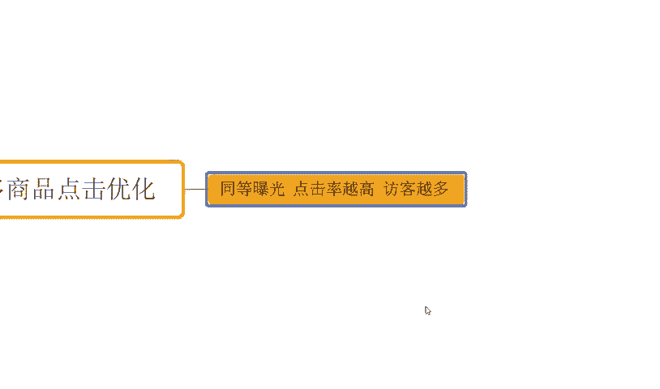

# 【拼多多运营实操教程】最系统的零基础拼多多开店教程全套，电商运营大佬专为学渣研制的新手开店保姆级教程！全程干货，简单粗暴 - P19：19、拼多多开店-商品点击优化 - -拼多多开店 - BV1BH1qYpEqw

hello，大家好，我是西楼。那么今天为大家分享的内容呢是我们拼多多自然流量企款中的商品点击优化的内容啊。那点击率呢是我们影响自然因素中可以说最重要的一个因素吧。可能对于这一个概念呢。

很多小伙伴不是很理解，对吧？给大家举个例子。那么同等的曝光情况之下啊，同等。报官。点击率。越高访客越多。因此啊点击率在整个的自然流量的一个板块考核里面呢，它的权重它的意义是非常非常重大的啊。

那么我们以数据来换算一下啊，假如说今天我们有100个曝光。

那么其中呢，商品A啊，我们这里写一下啊，商品A。

100个曝光的时候呢，点击率呢只有1%。啊，只有1%。于是乎呢，他的访客呢100个曝光只能拿到。一个访客。对不对？而商品A一。这两个产品呢可能他们就是一样的，只不过呢在图片上表达有所差异，对不对？

或者在其他方面啊展示上有所差异，导致我们用户看到这个产品之后呢相对来说啊可能他会呃比A啊更具吸引力一点。所以说A一呢它同样拿到了100个曝光。因为他们俩的呃产品属性呢价格方面各方面都差不多，对不对？

于是乎他们的推荐权重也都差不多。但是商品A一呢，他在表达上面呢是有差异的，对不对？所以呢A一的点击率呢会更高一点啊，那么A一的点击率呢假如说5%。好，那么这个时候呢，A一的一个访客呢就是5个。

于是乎啊我们同样的产品同样的曝光情况。但是呢因为点击率的差异导致我们商品A一在后续的平台考核过程中，这两个产品如果说都是被相同的人群抓取到进行推荐的话，那么A一的展示排名会远远要高于。A。他要更靠前。

于是乎他能够得到更多的自然流量。所以这个也是为什么我讲。

自然流量里面呢点击率呢它是一个非常非常重要的核心的一个因素啊，就这个地方。而我们的主图，我们的标这个标题啊，那么也是我们点击率的一个关键啊，那主图呢需要吸引眼球。标题呢需要去呃符合我们产品。

并且呢能够去呃紧密的和我们用户的设需求啊，产生关联啊，能够去紧扣我商品的特点。那么这样呢才能更好的得到更多点击，好不好？OK那么点击率的具体优化方式呢，我们来说一说，首先第一个点啊，优化我们产品的主图。

那这个呢我们首先把它搞清楚，对不对？主图。优化啊。

那么主图优化的话，其实没有我们想象的那么难，对不对？在图片层面上呢，我们要使用到一些清晰度高的啊，能够呃更加吸引用户眼球的一个图片啊，那同时呢我们要确保这个图片呢能够去准确的反馈出我们产品的卖点啊。

同时呢我们可以通过一些文字呢加入了一些优惠信息或者是营销信息来吸引户点击。那么这就可以了。而在这个过程中呢，吸引人是核心，对不对？这个这个是个关键词啊，吸引人啊，这是个核心。那怎么做到吸引人呢？

我们讲一般来说的话就是三个字差异化。

那我的产品在整个的表达过程中，我的展示过程中，对不对？呃？如果说我们呃同行使用了这个产品呢，比如说我们是一件衣服啊，同行都是用的一件红色的衣服，哎，我非得用一件绿色的衣服，对不对？在所有的图片里面。

在所有的衣服里面，我就特别的显眼。那用户只要滑动的时候，它只要滑到我的这个产品的话，它就能够一眼看到我的产品，于是我们就可以做到吸引人的一个目的，对不对？啊，当然了。

你说哎那我本来这个产品呢就是卖的是红色，比如说我们这个新年的衣服，对不对？用户收呢也就是说红色什么这个衣服是吧，或者怎么样的啊，或者是棉服那都是红色的，那怎么办？OK没关系。

那我们在产品颜色一致的情况之下呢，也可以做到我们产品的这个背景是不一样，对不对？那如果同行呢产品是红色，它的背景也是红色。好，今天我的背景做成黄色，或者是我。甚至背景弄成绿色，对吧？

我就跟别人做的不一样，我就让我的产品图片呢很显眼，很扎眼，对不对？O这就足够了啊？当然我产品能够去做到这种很扎眼，很显眼的这个过程中呢，我再去把我的优惠信息，把我的营销信息写上去。

那么用户呢才有可能看得到啊，才有可能被我们的营销吸引，对不对啊，所以这是一个非常核心的点啊，然后再一个呢就是我们展示的一个一个差异化了啊，比如说我们的这个产品呢这个同行呢都是用的模特图，对吧？哎。

他穿着这个衣服来摆个po，对吧？我偏布对不对？我偏布啊，我就偏偏的去干嘛呢？把我的产品平铺在地上，我拍一张图片，或者我就挂在那里拍一个图片啊，我挂在衣柜里面拍个图片。

或者是我就把我的衣服展开了拍一个很大的这个呃图案，对吧？我的这个衣服的一个图案是什么样子的。嗯，它有什么一些这个特点啊，我把它拍出来，我放上去行不行也可以。那它也可以起到一个差异化的作用啊。

言论上我们这个图片呢更加的显艳啊，都是没问题的是吧？然后再往下呢，我们来说一说我们产品的标题。

那么标题部分的话啊呃这个关键词呢一定是要符合我们产品的。这个是一个最重要的点啊，并且呢这个关键词在整个的使用过程中呢，不要去堆砌啊，那尽可能呢简洁明了的去展示出我们产品的特性。

或者展示出我们产品的卖点就可以了啊，能够去有到更加的通顺的一个呃可读性。那就可以的。那么再往后呢，我们在针对的点击优化过程中呢，我们还需要去适当的做到一些这个营销活动啊。

比如说像什么这个新课立减呐，对不对？

那比如说我们的一些什么优惠券呢。啊，又或者我们的满减呢，或者是我们的限时。

限量购啊。对吧啊都可以的，有了这些之后呢，也能够去吸引我们用户的点击，带来更高点击率啊，那不管是什么样的东西，我们的核心目的就只有一个点击率，好不好？那同时呢我们的产品的价格啊。

也会对我们的点击呢有影响，对吧？啊，比如说我产品呢确实呃已经很扎眼呢，也可能够让我的用户看到我了，对不对？但看到我之后发现一个问题啊，别人卖19。9块，你非得卖88。

对吧你这个贵的都离谱了，那么可能很多时候呢，你也不可能带来一个很好的点击效果。所以在整个过程中的话啊，产品的价格板块一般我们是把外路价会做的比较低一点。然后呢。

通过这一个低价的外路价呢来吸引用户点击可能我们产品实际在销售过程中呢，它并不是低价啊，但是外路价一定要低啊，什么叫外路价呢？就是我们在搜索产品的时候，在整个的搜索结果页上看到的价格。

当我们点击进这个产品之后，可能这个产品呢具体的SQ的价格呢会高一点啊，这都无所谓的。总而言之呢，就是让我们用户呢被我们价格所吸引，对不对？然后再往后呢。

我们也需要不断的去针对到我们产品的关键词呢进行优化，找到一些符合产品的啊符合我们市场的动态的一些优质的关键词来进行使用它O这就可以的对吧？价格方面啊外路价啊，外露价。

要低啊，就这么简单O那么对于整个操作来说的话，可能还有很多其他一些问题啊，那么时间关系也不可能说完全讲清楚。如果说大家还有什么其他疑问呢，也欢迎大家跟我加流沟通。

同样的也有很多小伙伴呢对店铺操作来讲的话，花费了比较多的时间跟精力，对不对？做了非常多的相当评价。但是整个店铺的数据呢没有得到提升的那如果说你是这种情况的对？你做了相应评价。

但是这个店铺访客没有得到增长O那么我建议呢可以考虑跟着实操，对吧？至少来说有一点跟实操的话可以减少你在这个试错过程中的一些操作时间跟操作资金的浪费，好不好？那么可以看到这些店铺也都是跟实操。

像这个店铺啊，最早的话访客只有多少六000不到5000多个对不对？那跟着实操之后呢可以看到整个店铺访客呢从最早这个六00不到呢直接干到了4万对？一天订单是6100单啊，转化率呢15。16啊。

包括还像这个店铺啊，那最早呢是50不到的。

访客啊跟了实兆之后呢，一天的访客呢做到了3万啊，一天订单呢3800单，那12。67的转化率对不对？那同样的还还有到很多很多的这种新店啊，纯新店来的，可以看一下啊。像这个对不对？最早临访客的新店来的。

对不对？也是跟着实操，那么直接呢快速时间直接起报，对不对？做到一天访客呢5000多，将近6000啊，一天订单呢是800多单，对不对？14。01的转化率，对吧？那么类似种店铺呢还有很多。

我就必须一一介绍了啊。如果说你自己呢是没有操作思路的去运营方法没有经验，O那么跟着实操我相信对你自己的能力提升对你的店铺提升帮助应该是更大的好不好？

O同样呢这边大家准备到了非常多的一个视频素材可以看一下，将近100分的文档，那么里面呢从基础到链接的全套运输都有的啊，包括了非常多的平台规则，新操作玩法平台的活动技巧以及付费推广玩法都有的。

那么迟到之后呢，正常订什么是么问题的。有效小伙伴呢可以关注我回复做点领取。

