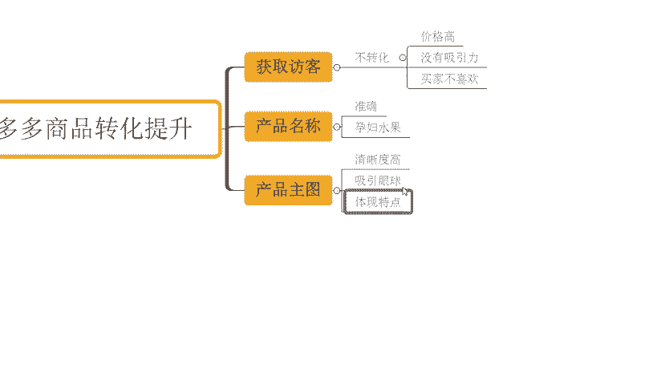

# 【拼多多运营实操教程】最系统的零基础拼多多开店教程全套，电商运营大佬专为学渣研制的新手开店保姆级教程！全程干货，简单粗暴 - P20：20、拼多多开店-商品转化提升 - -拼多多开店 - BV1BH1qYpEqw

hello，大家好，我是谢楼。那么今天为大家分享的内容呢是我们拼多多自然浏览取款过程中的一个商品的转化提升的内容啊。那么对于转换率的板块来讲的话，其实他对我们。

自然流量的一个影响是非常大的一个意义的对吧？就跟我们点击的影响差不多啊，为什么这样讲呢？啊，原因很简单，对不对？当我们店铺呢能够去获取访客，对吧？但是如果说你不转化啊，OK。

那很严重了，对吧？平台就会认为哎，你这个产品怎么回事？呃，平台给了你曝光，给了你流量，但是呢你不转化，那是不是呢你的产品有问题，对吧？呃，你的价格是不是高了，对不对？你的产品是不是没有吸引腻？

对吧你的产品是不是买家不喜欢？嗯。OK不管是哪种情况，当你没有转化的时候，平台就会判定你和那些有转化的商品啊来进行对比的话，你是垃圾，对不对？那其他转化好的产品呢更优秀。于是乎呢后期呢整个的产品的曝光。

产品的访客会更多的给到那些产品。那从而呢你这种没有转化商品呢，就会没有访客啊，你也没有办法得到很好的自然流量啊，就这么简单。对不对？那我们怎么去提升，怎么去优化我们产品的转化呢？

这个是我们可能比较更加关心的一个话题吧，可以这样说，对不对？那么可以在多个方面去展开啊，首先是我们产品的标题。

或者是产品的名称吧，好不好？我们这样说吧，那我们的。

描述啊，这里首先搞清楚一件事情，一定要准确。

这个是非常非常重要的一个点啊，我们产品的关键词和我产品本身一定是要高度符合的。举个例子。今天呢我们做了一个产品呢，是一个这个。水果啊打个比方。那么这个水果呢，我们用到了一个关键词叫做孕妇水果。

对吧那孕妇水果这个词呢确实非常的OK啊，非常的棒啊。那么呃使用到这个关键词产品呢，可能更好的呃销售为的一个坑价，对不对？转化能也比较高。但是呢我去用了这个词之后，我发现一个问题。

可能没有办法得到很好转化。为什么？因为我们这个产品可能它不适合孕妇池。对吧他就跟过孕妇水果，他不搭卡啊，你非得去用这个产品这个关键词来引流，那么你转化率能高吗？高不了啊，所以说我们产品的名称。

产品的关键词一定要准确，一定要高度符合啊。所以这是第一个点。这个点的话，我们需要去重点去分析。然后再一个就是我们产品的主图。那么产品的主图板块的话，我们要尽可能的使用到那些呃清晰度比较高的啊。

更吸引人的产品图。那清晰度。

高啊，然后呢这一个呃能够去吸引眼球的这种图片，对不对？那么清晰度高呢，可以让用户觉得哎这个品质还不错。你要是那个图片感觉跟满里马赛克一样，对吧？那这个东西人家一看就觉得你这个产品好像不咋地，对不对？

或者对你的这个品牌形象，对你这个产品形象呢不是很好，对吧？那么呃再一个呢，就是我们的图片呢，一定要能够准确的反映出我们产品的特点啊，能够体现。特点。

这样子呢我们整个商品呢在呃用户啊他能够去看到的过程中啊，也能够去充分的认知到我们的产品，对不对？可能呢也可以提高转化。那如果说我们这个主图主图这个什么不清不楚的，对不对？表述也没表述清楚。

图片到底是什么东西也没讲清楚，产品什么样子也没表达清楚，对不对？那只是通过一些麻扁的方式把人骗过来，OK可能很多时候也很难转化啊，这个就是一个非常现实的问题。那么再一个就是我们商品的一个价格了啊。

那么商品价格呢也是我们一直以来非常关心的一个话题，对不对？那如果说有用户进来我店铺之后，我的产品的价格竞争力。

不够。那么很抱歉，可能你没有任何优势情况之下呢很难转化。对吧但是如果说我针对到我的市场进行了充分的调研啊，我也都知道了我们同行，我们的一些竞争对竞争对手它的一个价格。

然后我针对到这个进行研究之后来进行我的SQU布局来进行我的价格设置。那么哪怕我没有足够的竞争优势，对吧？在价格上啊，我没有足够的竞争优势，但是这而来说我也没有什么明显劣势啊，这样呢也能够去保证我的转化。

对不对？有有到一个更好的数据。所以这个是我们需去做的一个事情啊，我们要针对到我们的市场进行调研。好吧，那么再一个呢，我们要有到一个好的商品的评论。

啊，那么有到一个好的商面评论呢，也是对我们产品。转化的一个重要的啊一个帮助的一个意义，对不对？那用户呢留下了一些正面的评价，对吧？

或者是留下了一些这个比较客观的真实的评价。那么这些评价呢能够去呃更好的影响。啊，影响我们的这个呃消费者。对不对？让他们做决定。那用户一看，哎，这个店铺产品好好像还不错，对吧？哎呀，卖的也还可以的。

对不对？哎，产品这个图片也挺好的，对不对？好像这个这个店的质量应该也不错啊。然后一看评价评价都是一些非常棒的评价。那么也都非常客观的去描述了我产品的一些特点啊，那么这个时候呢。

基本上我的用户呢形成转化的概率就会很高了，对不对？那么再往下呢，就是我们产品的详情，对吧？

那上面呢有到商品的主图，那么肯定会有个上面详情的，对不对？那么在详情端口的话，我们要去尽可能的呃突出我们产品的卖点啊，增加我们用户的一个信任度啊，那么也要针对到我们主图。

没有去表述清楚的部分呢进行补充啊，包括到我们的一些呃服务的一些内容呢，也要去讲解。那么可以更好的提升我们的一个什么信任度。

对吧然后增加转化。都要去做一个事情。

那最后呢，我们还得去干嘛呢？还得去合理的应用到我们的。

促销活动。对不对？啊，包括像我们的优惠券呢啊限限人购啊，对不对？新客立减呢等等啊。那么有了这些营销信息呢，也可以去啊帮我们的买家下啊决策啊。

那么可以营造出一些时间呢或者是库存方面的一个紧迫感啊，来帮助他们更好的完成我们订单的一个提交，得到更好的转化，对不对？有了这些之后呢，整个商品呢啊你都能做到位的话，大概率呢转化也不会说特别差，对吧？

那如果说呃整个店铺运营过程中呢，还有到一些其他的疑问啊，这个也很正常，那么也欢迎大家跟我交流沟通，对不对？这个没关系，那也有很多小伙伴可能在店铺操作过程中呢有做到非常多的销量跟评价。

但是整个的店铺数据呢没有得到明显增长的，对不对？那如果说你的店铺是属于这种情况的，O那么呃可以跟着一起实操，对不对？这样的话可以减少你在整个运营过程中的实作成本啊。

可以减少你在这个操作过程中的一个时间都进行浪费，好不好？可以看到像这些店铺呢也都是跟实操。像这个店铺可以看一下啊，那么最早的访客是6000不到000多啊，那跟着实操之后呢你看一下啊。

一天的访客呢做到了4万多。

对不对？一天的订单呢是6100多单啊，那么转化率呢15。16啊，都还是这个店铺啊也都是跟1。这么最早的访客是5000不到啊，跟了实之后呢，一天的访客做到了3万多啊。

一天的订单呢3800多单进行4000单啊，那么12。67转化率，对不对？同样的啊还有到很多的一些这种纯新店的可以看一下，像这个店铺对不对？最早是零访客的新店啊，跟实之后呢一样的啊。

从最早的零访客直接做到了一天访客5000多，对不对啊，那么一天订单是800多单，14。01的转化率，对吧？那类似这种店铺呢，我就不一去介绍了。如果说你自己呢是没有一个完整的测合思路的。

没有一个好的运营方法吧缺运营经验，那我相信啊跟着实操的话，对你店铺以及对你自己能力提升当助应该是更大好不好？O这边也为准备了非常多的一个视频素材可以看一下，就有100份的这个文档。

那么里面呢从基础到今阶的全套运素材都有的啊，包括了非常。

多的些平台规则呀、新品测作玩法、平台活动技巧以及服费推广玩法啊等等都有的。那么吃透之后呢，正常订评是没什么问题的。有需要的小伙伴呢可以关注我回复做点领取。

