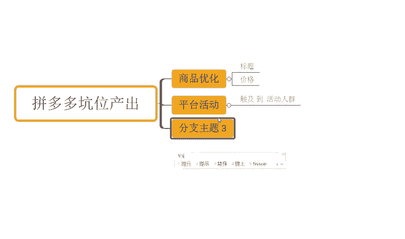
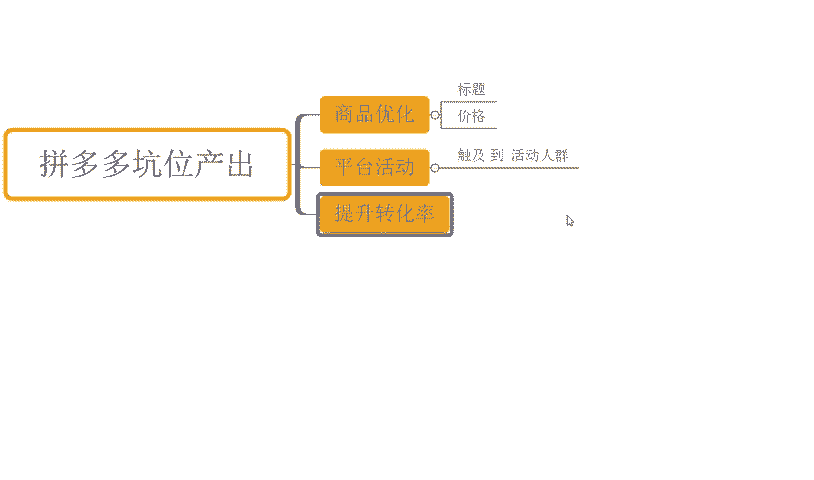
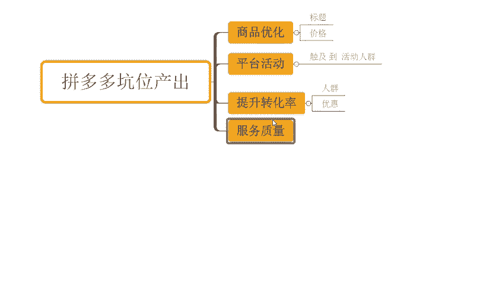
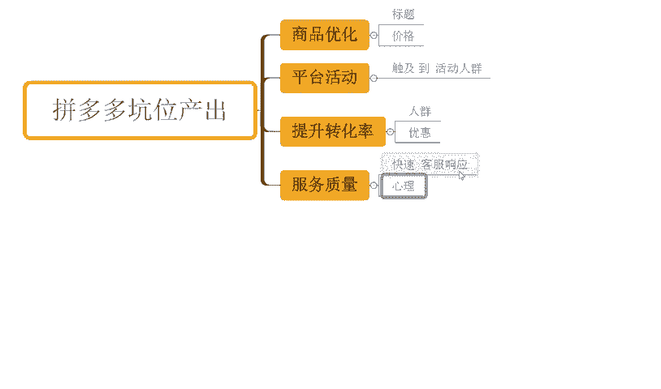
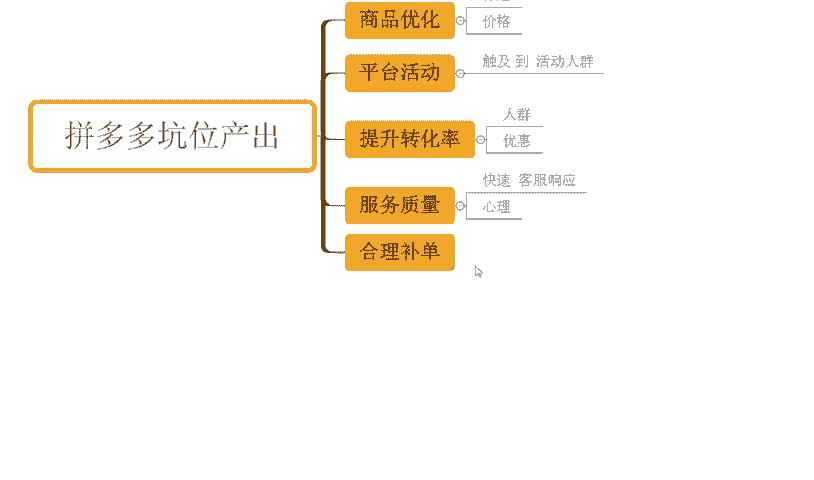
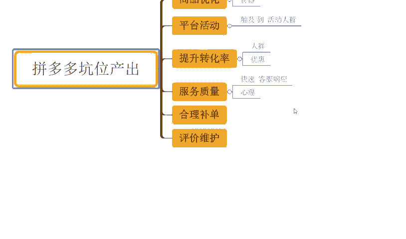
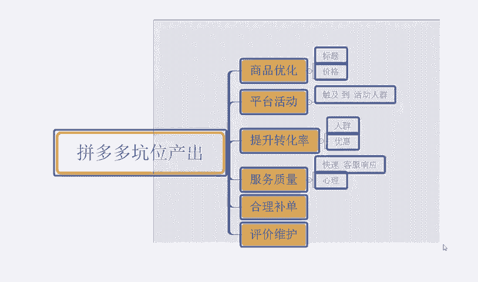
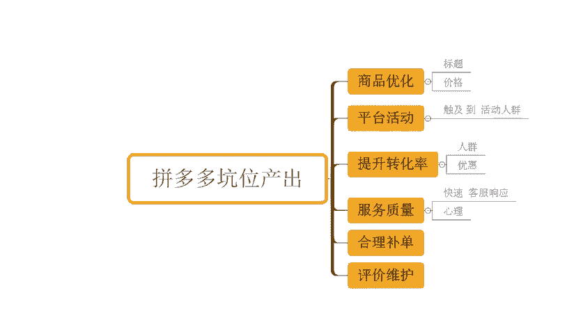
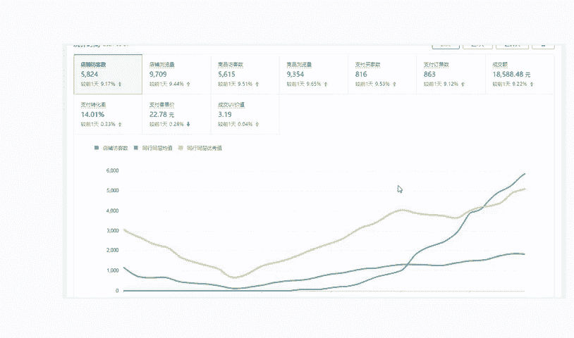
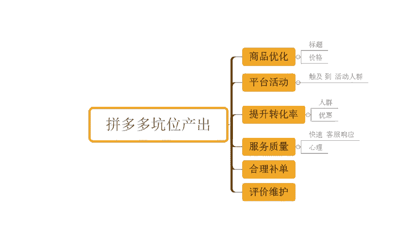

# 【拼多多运营实操教程】最系统的零基础拼多多开店教程全套，电商运营大佬专为学渣研制的新手开店保姆级教程！全程干货，简单粗暴 - P21：21、拼多多开店-坑位产出 - -拼多多开店 - BV1BH1qYpEqw

hello，大家好，我是西楼。那么今天为大家分享的内容呢是我们拼多多自然流量提供网法中的一个坑位产出的内容啊。那么可能有很多小伙伴呢对于这个坑位产出啊，这个名词不是很了解啊，我们俗称呢坑产，对不对？

那么它其实就是我们产品的销售额，我们的交易额。那拼多多平台呢在整个的流量分配过程中呢，会参考到交易额的部分。啊，或者说从某种意义上来讲啊，你交易额越大，你产品的推荐权重分配的流量就越多。

你得到的一个访客就越多。所以说我们需要不断的去优化提高我产品的坑位产出，来实现我排名增长访客的一个增长啊，那到底怎么去做呢？OK我们来看一下。首先第一个点，我要针对到我们的商品。进行优化。

那么这个商品优化呢，不是说单独的某一个产品，是我的所有的产品。我要确保我的所有的产品，我们的这个。标题啊，我们的图片。啊，我们的价格等等都是一个更加合理的。然后呢，能够更具竞争优势的。

能够去呃更容易转化的。这样子的话，我们产品得到曝光之后呢？那么我们整个店铺的交易，我们整个产品的一个呃交易额才会更多啊，那么呃它才会有到更好的提升啊，那同时呢我们还干嘛呢？还需要去。积极的或者是呃这个。

选择自己适合的一个活动啊，来进行提报啊，报名我们的平台活动。那么拼多多呢是一个活动类型非常非常多的平台。那么每个活动呢都会有到一定的。这个呃活动的人群对不对？

而这一部分人群呢对于这个活动的一个敏感度是比较高的啊。那我们积极的参加各种各样的营销活动啊，那么也可以帮我们触及到。对吧。触级啊。帮我们触及到这种的。活动人群。那么这部分人群呢它会有到呃比较高的转化。

也会比较呃容易转化一点啊。那么呃像类似我们的这个秒杀呀，对不对啊，团购啊，千人团万人团等等乱七八糟的东西，对不对？那我们可以去做啊，做完之后呢，用户看到我们成品之呢，有到一个呃在时间上在我们库存方面。

各种各方面的一些这个呃影响啊，那么可以影响到我们用户的心智来增加我们的一个转化啊，也都是可以的。当我们用户的转化更多之后呢，同样的访客情况之下，我的产出占就更高喽，对不对？那同样的访客，我产出更高。

我的权重是不是更高呢？那当然对不对？这就不用说啊，那么再一个就是我们要不断的去优化，提升我们的转化率。

当然了哈提升转化率呢在之前的一个分享中也有详细的说明，对不对？我们需要针对到我们产品的呃视觉端口啊，不管是我们的主图还是详情，对不对？进行优化，然后呢啊触及到不同的人群。

然后呢去设计不同的一个优惠信息啊。

去有到更加好的价格竞争力来达成我们用户的这个转化的一个目的，对吧？都是OK的那同时呢在我们正常的坑位产出结高过程中呢，我们还需要干嘛呢？还需要去提高我们的服务质量啊。

这个服务质量呢重点指的就是我们的客服板块了。我们要有到一个非常快速的。

客服响应时间。那么原因很简单，当用户来到我们店铺进行询单的时候。他不可能说只是在问我们，他可能在看很多产品，只是刚好看到了我的，在问我。那么也有可能他已经问过别人了，也有可能他是第一个问我的。

如果说他第一个问我的，我没有快速响应，他为了快速的去找到答案，可能这个时候呢，他也会去找别人去咨询。当别人比我早回复，早去跟他达成沟通的时候呢，那么这个时候那么可能在某种意义上来讲。

我先天的这个优势就没有了，用户可能就更加容易去流失到别人店铺去成交了。那么这样呢对我来说就是呃非常尴尬的一个点啊，原本属于我的订单，没有成交。OK我损失了。然后呢，他到别人店铺成交了。

别人店铺属于增长了。好，一来而去呢，我们数据就拉开差距了，对不对？呃，这种就是很尴尬的一个点啊。那么呃再一个点呢，就是说呃除了这个地方之外呢，我们在呃这个服务方面的话。

还有到就是呃这个售后端口的一些这个问题解决也要快速啊。那么呃问题处理的方式，也要去能够更加好的照顾到我们消费者的一个呃心理。对吧不然的话，他会觉得哎你这个处理方式呢非常的这个缓慢啊。

处理的一个进度非常缓慢。处理的方式呢也是呃这个敷衍了事的，对不对？让我觉得很不爽。那么最终呢可能会导致我们售后的一个问题放大啊，那甚至可能会引起一些这个售后纠纷啊。

那么这就没必要的那一个好的服务的一个质量呢，也可以帮我们带来更多的一个订单，包括说我们可以带来更高的一个复购啊，都是O的是吧？所以这点需要大家能够注意到。那另外一点的话就是还有就是我们要合理的去。

啊，合理的补单啊。那么合理补单呢是确保我们在不违反规则的情况之下啊，然后去通过引导，然后增加我们产品的销量啊，那么啊去杜绝呃平台识别为这个炒作的一个一个行为啊，那很多小伙伴呢对于电摩操来讲。

为了去做我们产品的自然流量，为了去提高我们产品的坑场，那么疯狂的去做补单，对不对？那导致呢整个店铺被查或者是什么呢？或者是做完之后呢。这个访客进不来，对不对啊？没有访客的时候自己补，有访客还是自己补。

那么呃一直到最后呢，发现不补就没访客，那这就是很很尴尬的一个问题。啊，这是为什么说我们需要合理的不当？然后再一点就是我们需要有到一个更好的这个评价维护。

当用户呢收到我们产品之呢，我们要积极的去引导用户呢对我们的商品留下正面的评价啊，包括说呃我们产品的特点方面呢也要去客观的去描述呃，更加真实去进行反馈。那么这个样子呢用户看到我们评价之后呢。

也能够去更好做决策啊，那么是不是他所需要的产品是不是他符合他当前的一个需求，对不对？那么也可以帮我们提高我们转化，那么转化提高之后的坑场这要去增加了。所以它是一个相互关联的过程啊，每一环都可以环的啊。

那对于整个店铺操作来讲的话，可能还有很多其他的一些问题啊，这个很正常。因为店铺操作呢，那肯定是有更多的一些细节需要我们完善，需要我们注意的啊那如果说你还有什么其他疑问的话，也欢迎大家跟我这沟通。

同样的有很多小伙伴呢对于店铺操作来讲的话，可能花费了比较多的时间精力，但是做了很多能评价之后呢，整个的店铺访馈呢是没有得到很好的一个增长的。那么如果说你是这种情况的O那我也建议呢可以考虑跟实操，对吧？

至少来说有一点啊可以迟到的话，可以减少你自己在这个坐店次作过程中的一些时间和资金的浪费。好不好？可以看到啊，这些店铺也都是更着实操。像这个店铺啊，最早的话访客是这。

这个6000不到啊，那跟着实操之后呢，访客从最早密信不到呢，一天做到了4万多，对不对？那么订单的话一天是6000多单啊，转化率呢15。16啊，包括还有从这个店铺啊可以看到啊，那最早呢访客是4000多。

50不到啊，一样的。跟着实操之后呢，一天的访客呢做到了3万哈。这个订单的话一天是3800单，对不对？转化率呢12。67啊，包括还是这种啊就是纯新店的零访客的新店来的，对不对？来最少零访客的店铺啊。

那么也是一样跟实操，对不对？从最早的零访客呢做到一天访客是5000多800将近500将近将近这个6000啊。那么一天的这个订单呢是这个800多单，对不对？那么转化率呢14。01啊，也都是跟实操的啊。

类似这种店铺呢还有很多，我就不须介绍了啊。那如果说你自己没有好的操作方法，没有运营思路，没有运营经验O跟着实操，我相信对你自己的能力提升，对你的店铺提升帮助应该是更大的好不好？

O同样这边为他准备了非常多的一个视频数才可以看一下，将近有100份的文档。那么里面呢从基础到今天的全套运营都有的，包括非常多的平台规则，新品操作玩法平台的活动技巧以及付费推广法等等都有实操之后呢。

正常店铺运是没问题的。有效小伙伴呢可以关注我回复做领取。

