# 【拼多多运营实操教程】最系统的零基础拼多多开店教程全套，电商运营大佬专为学渣研制的新手开店保姆级教程！全程干货，简单粗暴 - P22：22、拼多多开店-商品搜索优化 - -拼多多开店 - BV1BH1qYpEqw

hello，大家好，我是谢露。那么今天为大家分享的内容呢是我们拼多多自然流量取款玩法中的拼多多商品搜索优化的一个内容啊。那所谓的商品搜入优化呢，其实说白了就是针对到我们的关键词进行优化啊。

那么核心目的呢就是确保我们产品的标题里面啊，它是呃属于一些市场的热搜值啊，那么并且呢这些词呢我们能够得到一个好的排名。同时呢这些词呢是高度符合我产品的。那么这就可以的。好吧，那对于整个的思维优化呢。

其实也分为不同的一个具体啊内容啊。那么我们来看一看。首先第一个点呢，就是我们关键词的一个研究或者关键词的一些这个分析。那么分析的第一个点呢就是我们用户的习惯。可能很多小伙伴呢对这个点呢是容易忽略的啊。

我们可能更多的情况呢是站在主观的角度站在我们自己的角度去看待这个问题啊，那么给大家举个例子吧，好不好？比如说今天我们做的产品呢是棉衣啊，打个比方啊打个比方我们做的产品是棉衣。

那么棉衣这个产品呢大家应该都知道，对不对？但是在不同的地区可能会有到不同的习惯啊，那么什么习惯呢？有的地方呢它叫棉衣，没有错啦，对不对？啊，我们可能大部分地区呢都叫棉衣啊，也有一部分地区呢。

它把棉衣呢称之为棉服。对吧或者是棉袄。啊，那么这种说法都有这种叫法都有。当然没有说孰对孰错啊，这个都是对的啊，都对的那你也可以根据你自己的习惯呢，把你对棉衣的称呼呢，通过弹幕形式发出来，好不好？啊。

我们也可以看一下啊，那呃这种情况下啊，如果说我没有搞清楚用户的习惯。我去盲目操作，很有可能就会导致我流量的一个损失。比如说今天我卖了一款衣服，这款衣服棉衣，对不对？呃。

但是呢我的用户或者是我商品更符合的人群，大部分人呢习惯性是搜索棉服的。但是我的标题里面没有棉服这个词。那么可能这部分流量我就损失掉了。各位能懂吗？用户的习惯啊和我自身商品一定是要高度匹配的。

同时呢我们可以通过这个习惯下的一个产品的核心关键词呢，在我们搜索的下拉框去找到那些能够有到更高搜索频次的热搜持。那么把这些热素词呢进行我们产品标题的组合，来得到更好的。搜索。搜索啊抓取效果。啊。

那么这样呢才能得到更好的访馈，好不好？OK这是第一个点啊。那么第二个点呢，就是我们针对到标题的优化了，对不对？这个其实跟我们关键是分析是相互关联的啊。

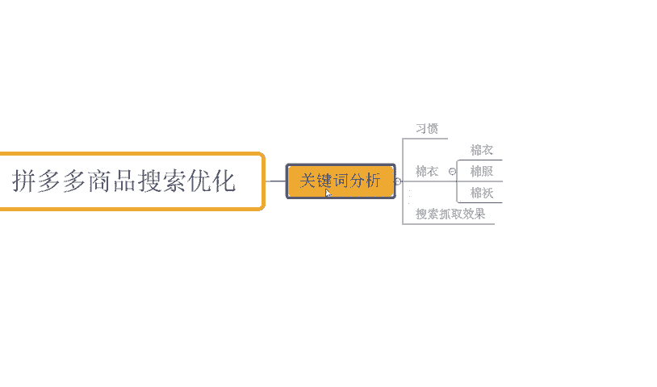

标题优化。那我们在整个的产品的标题啊进行写作过程中，我们要合理的去布局我们的关键词，对不对？那确保呢我们整个的标题呢是呃更加的简洁啊。

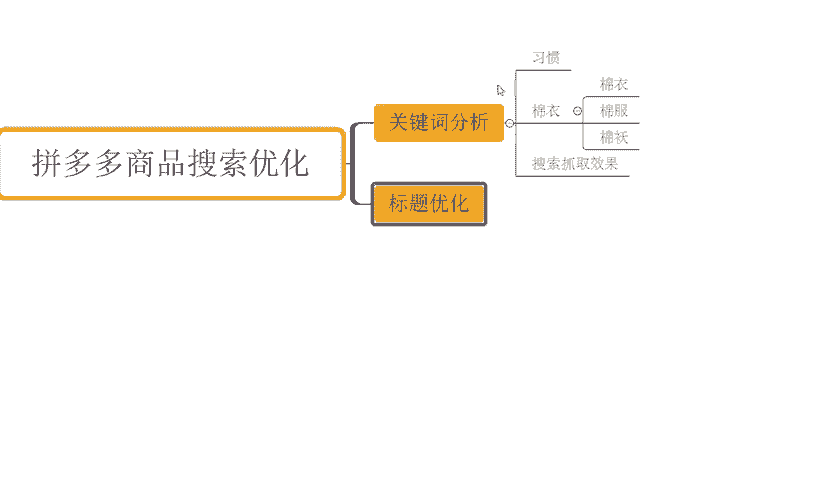

能够去更好的去使用到我们的热搜池。啊，并且呢避免堆砌啊，然后呢能够去更加的通顺一点，对吧？不用去那种特别绕口的啊啊那这个这个这个这个的呃符合要有热搜啊，热搜，然后没输进去啊。嗯，避免堆砌。

好然后呢呃能够有到比较通顺的一个可读性，对不对？OK那么这样呢才能够有更好的一个效果哈。那再一个呢就是我们在整个的搜索优化过程中呢，还要去重点提升我们的点击率啊，这个是核心点啊。

可能啊很多小伙伴又会晕了。点击率似乎你之前说过呀，对不对？没错了啊，点击率我之前说过，那么在我们搜索优化过程中的话，点击率也是非常非常重要的点啊，那用户呢通过搜索版块去看到我们产品之后呢。

一定是和我们的搜索词高度匹配的。我们的图片和我们的搜索词高度匹配，这样呢我们的点击效果才会更好，我们的用户的点击高，那么平台才会判定说我的商品和这个词更加匹配。那么后续呢会给到我更多的推荐。

可以给我带来更好的曝光。好吧，那么所以这个点的话是重点啊。那么呃产品和关键词匹。

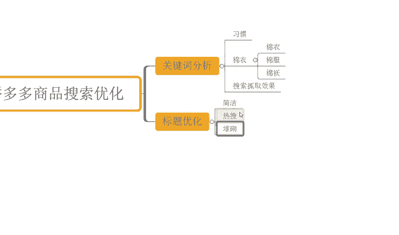

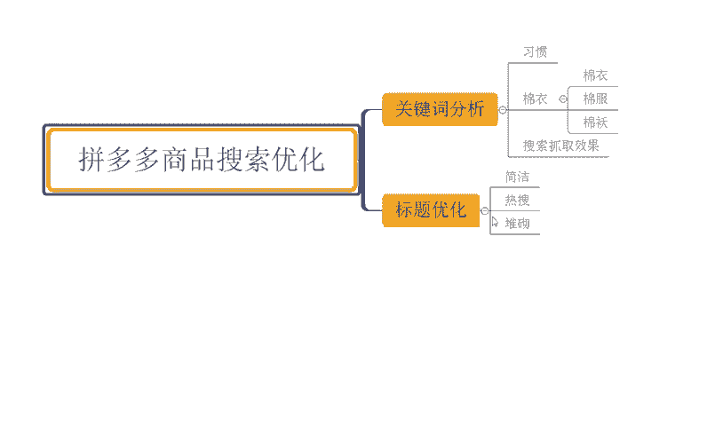

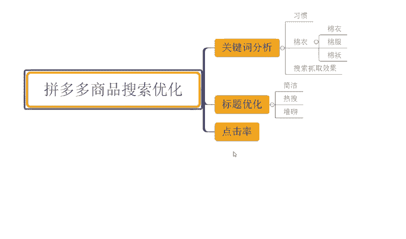

はい？然后产品和图片啊，这个这个关键词啊关键词和图片啊匹配。

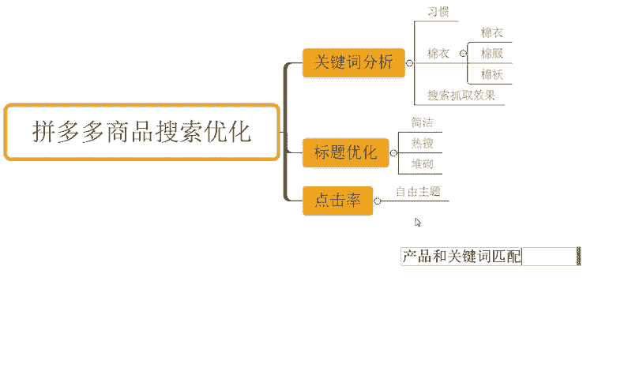

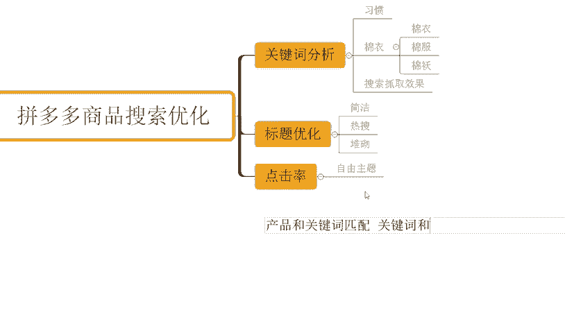

好吧，所以这么一个概念来的那有了这样的数据之后呢，我们整个商品呢，你说呃推荐曝光又多了啊，你又又精准啊，展现也精准，点界也高，对不对？那你说你这个访客能少嘛？你的占流量能少嘛，当然不能了，对不对？

肯定就会很多啊。那再一个点呢就是我们还要去干嘛呢？要确保我们的。

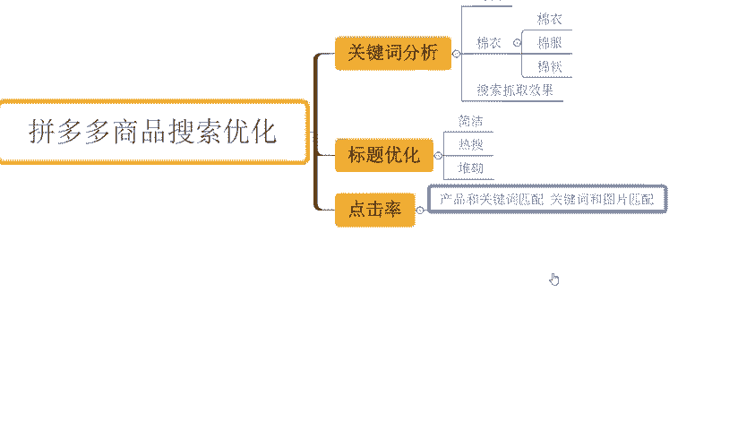

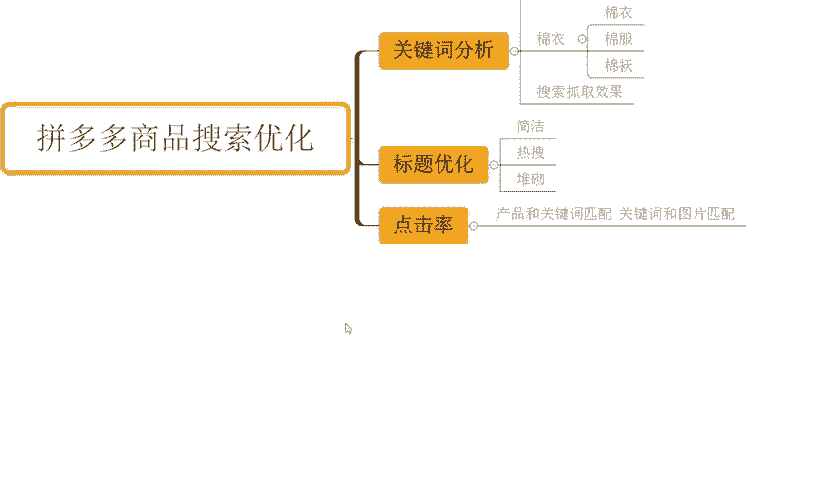

商品质量以及我们商品的价格竞争力。

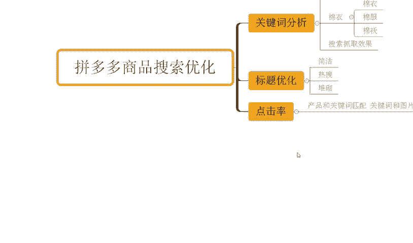

啊，这个也是我们需要做一个问题。那么首先我们要确认好我们产品的质量是不是可靠。对，这个是我们在一开始选品的时候，我们在确定卖这个产品的时候，我们要先去确认的对吧？我们可以先从这个我们的供应商那拍单回来。

对不对？

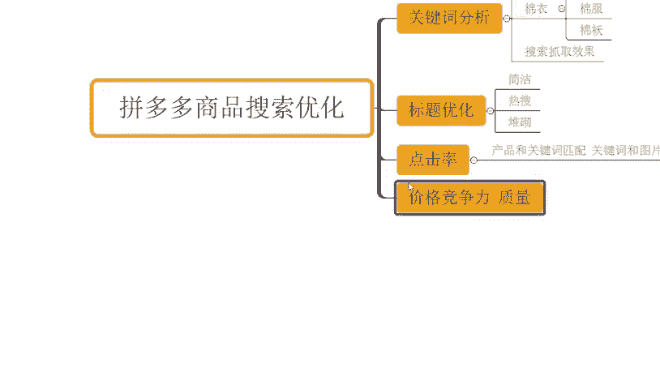

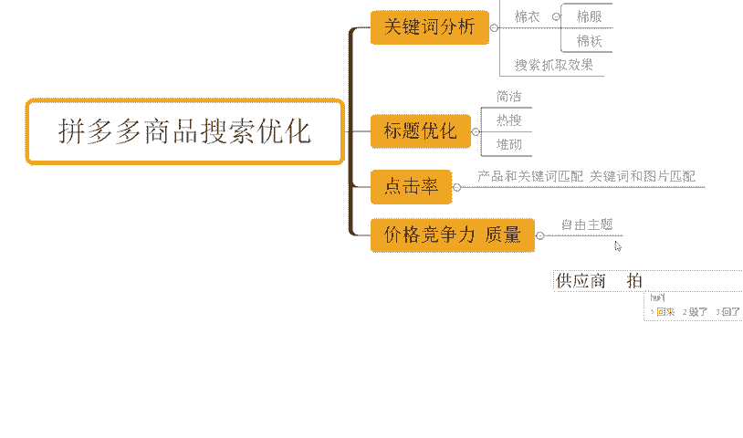

检查一下啊，没什么问题，那我再去做啊，不然的话你说你这个产品呢呃明明就只能值个2块钱，你非得卖个20块。或者你定价20块，他明明就只值2块钱那你去卖卖完之后，你说。你不会是骂死啊。😡，对不对？

上来就给你来个仅退款，一顿骂，骂完之后还给你骂退货了，哎，仅退款了，对不对？你亏死了。所以我们需要有一个更加合理的定价策略，能够保持我产品呢能够有到性价比，能够有到竞争力，这个才是关键。

那么只有这样子呢，我们产品呢在整个的后期的销售过程中呢，才能够有到更好的标签人群的一个转化和推荐啊。那么再一点呢，就是我们需要去利用好我们平台的资源啊，像我们平台的一些大促啊，对不对？

优惠券啊等等这些东西。这工具啊用起来之后呢，也能够增加我们的搜索。

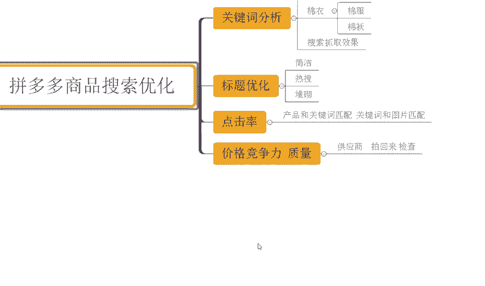

排名推荐。啊这个是我们平台的一些活动啊。

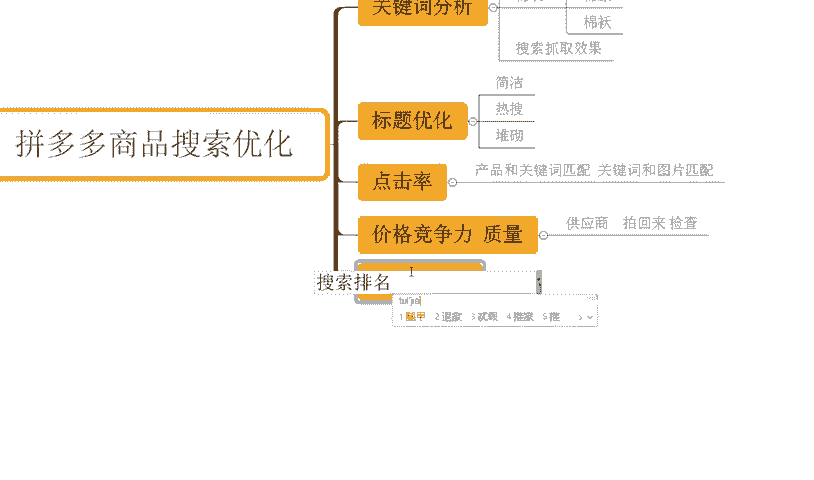

这里我也写一下。对不对？OK那么这样子的话，我们整个的产品呢有到一个好的啊产品的关键词，关键词和我们产品有匹配，对吧？我们图片和产品呢也是ok没问题匹配的那用户呢能够去看到我们产品之后呢。

有到一个很好的价格竞争利益。那同时呢我们能够去通过活动渠道去获取到更多曝光。那么自然而然，我们整个商品的搜索板块，我们产品的自然流量也就不会少，好吧？O对于整个店铺来讲的话。

肯定还有很多很多的一些其他问题啊，那如果说还有什么其疑问呢，也欢迎大跟我讲流沟通，对不对？那对于整个店铺操作来讲的话，也会有很多小伙伴呢可能做了非常多的相量跟评价。

但是整个店铺呢是没有得到一个好的数据反馈的对吧？那么如果说你是这种情况的O那么也呃欢迎啊可以考虑说跟着一起实操，对不对？可以看到这些店铺啊也都是跟实操像这个店铺最早的访客是六千不到啊，跟着实操之后呢。

一个月时间可以看到啊，这这个这个访客的话，一天做到了4万多。

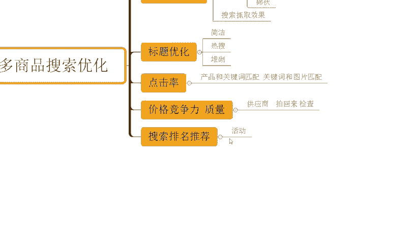

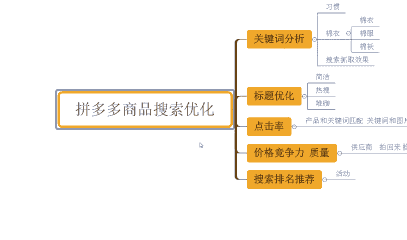

转化率的话是这个15。16啊，那么订单的话是6100多单，对不对啊？包括还有这个店铺也是差不多的啊，最早的访客是500不到的啊，看到没有？那跟了实到之后呢，一个月时间一天访客呢做到了3万啊。

一天的订单呢是3800多单，对不对？12。67的转化率，对吧？包括还有很多的这种啊啊零访客新店可以看到像这个店铺，对不对？最早零访客的店铺啊，那我跟着实到之后呢。访客快速提升，对不对？

直接做到了呃5800多，对不对？订单的话一天是800多单，对吧？转化率呢14。01啊，包括这个店铺啊，这个店铺转化率相对高一点啊，18。29转化率啊，也是零访客新店啊，快速提升，做到6000多访客。

将近1000房客对不对？一天的话1100多单。那如果说你自己没有好的方法，没有运营经验，缺乏运营的思路。OK那么跟着实尚我相信啊对你自己的能力提升，对你的店铺提升帮助应该是更大的，对不对？O啊。

这边有为大准备到了非常多的一个视频素材，可以看一下，将近有100份的文档啊。那么里面呢从基础到境界的全套运营素材都有的，包括了非常非常多的一些平台规则，姓名操作玩法平台的活动技巧。

以及富有推广玩法等等都有啊。那么吃透之后呢，正常店铺运应该是没什么问题的啊。有需要的小伙伴呢可以关注我回复做点领取。

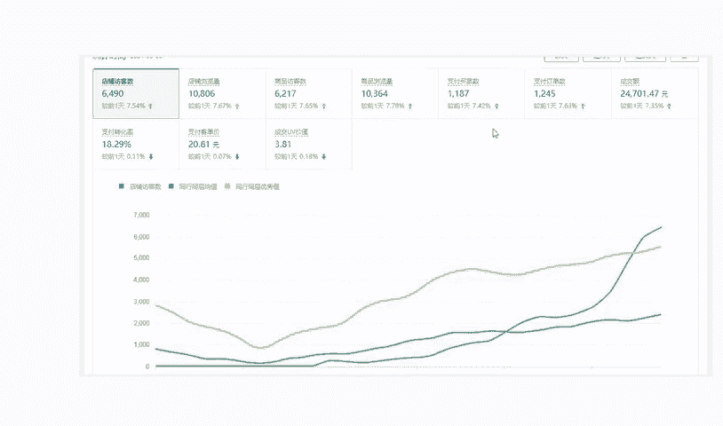

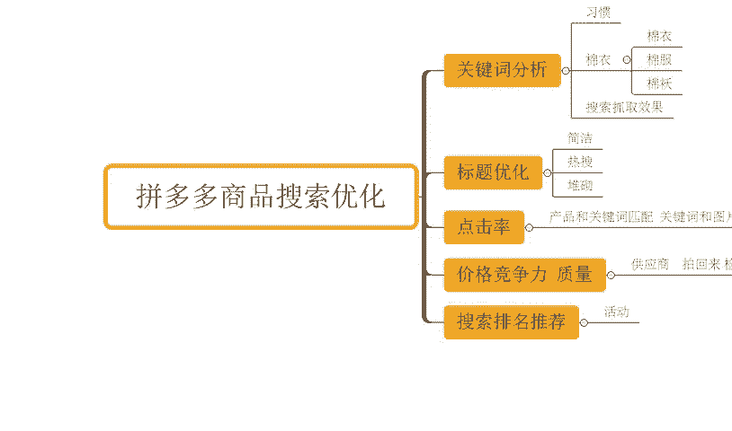