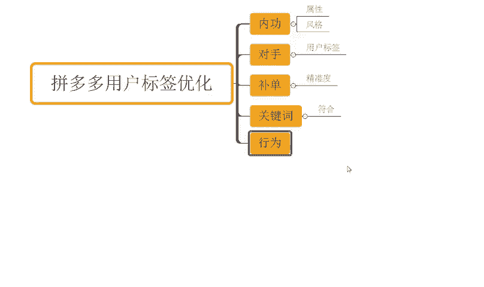

# 【拼多多运营实操教程】最系统的零基础拼多多开店教程全套，电商运营大佬专为学渣研制的新手开店保姆级教程！全程干货，简单粗暴 - P23：23、拼多多开店-用户标签优化 - -拼多多开店 - BV1BH1qYpEqw

hello，大家好，我是谢楼。那么今天为大家分享的内容呢是我们拼多多自然流量取款方法中的用户标签优化的方法啊。那么拼多多呢它本身是一个赛马机制和人群标签对应这个自然流量进行分配的一个一个操作方式啊。

那么通过我们优化我们产品的标签呢是可以提高我们流量的精准度的，对不对？那么当我们流量的精准度更高的时候呢，我们后续所有的数据进行之后呢，才能带来更好的反馈啊，比如说我们的点击会更好，我们的转化会更好。

对不对？那么有哪些方面可以影响到我们产品的那个用户标签的优化呢。OK首先那么第一点呢，就是我们店铺的内功啊，那么所谓的内功呢，就是我们店铺商品的属性风格，那么这些呢要相近啊，那为什么这样说呢？

如果说我们店铺发布的商品的属性和风格，它没有一个统一性。那么每个产品呢都会有到不同。同的人群不同的一个呃用户来进入店铺的话。那么这个店铺的整体的一个访客呢，它是没有一个呃相似度的啊，那么会比较分散。

那所有人群的特性的成这个分散的一个状态的，对不对？不集中。那么就会导致一个问题就是当我们店铺在向新品的时候，或者是这个其他的一些链接在进行推送的时候呢，平台是不知道应该给我们推送的人群是什么样子的。

那么这一点呢非常非常重要，就会导致我们店铺的一个呃流量啊不够精准。好吧，那么这是第一个点啊，关于我们这个优化店铺内功的一个内容啊。那么再一个呢就是要利用我们竞争对手的产品啊。

那么怎么叫利用竞争对手产品呢？其实道理很简单。那么我们的竞争对手呢，他可能也会有到不同的人去购买，去浏览，对吧？那么最终呢这一个竞争对手呢，也都会有到自身的一个用户标签。

对不对？那么如果说今天。有人对这一个产品有需求，那么也会被判定是拥有相同的需求标签的这么一个人群，对不对？所以说这种情况之下，如果说我们有人喜欢竞争对付这个产品。

然后呢也会到我们店铺产生一些消费行为或者是一些这个浏览搜索等等这种的一个呃用户行为的话，那么一样的我们的产品呢也可以被赋予到我们的商品标签，对吧？那么举个例子啊，呃，今天呢我啊作为一个消费者。

我在平台上呢去搜索了这个呃鞋子，对不对？搜索了这个袜子啊，搜索了这个衣服OK那么搜索完了之后呢，我也去浏览了很多产品，对不对？那么这个时候呢，刚好你的店铺是新店，你的店铺是新品。

OK那么我之前浏览的这些产品呢，他们可能是一些平台。一些爆款对不对？那现在呢我进入到了你的店铺去浏览。OK那么这个时候呢，平台就会判定像我这样的人啊，我对这些衣服、鞋子、袜子对不对？

这些爆款上面有需习的这种人可能对你的产品呢也会感兴趣，于是乎你的产品也会被推送到拥有跟我一样啊，对这些爆款上品感兴趣的人面前。那么这个时候呢，一方面呢可以得到更多的产品的推荐曝光。另外一方面呢。

可以把我们这个竞争对手，把这些爆款的产品的标签呢，也给强化到你的商品上面去啊，他这么来的啊。那么除了这个地方之外呢，还有一个大家可能用的比较多的一个东西啊，不搭。

这个是他可能接触的最多，或者是呃大家可能用的最多的方法。那每次想到说要去强调我们的用户标签呢，要去做我们产品的标签人群呢，你们可能都会想到说哎我要去做一些产品的成交啊。当然呢。

成交肯定会在某种意义上来说对我们的标签有影响，这个是毋庸置疑的，对不对？但是啊。补单的这个行为，它不是说唯一去完成我们标签打造的一个过程。这地方我强调一下啊，也不要过于依赖啊。

那么在进行补单的这个操作过程中呢，我们需要控制好补单号的一个精准度啊。那呃简单点说的话，我们要尽可能的去做好我们这一个账号的什么行为标签让他被平台赋予到一个需求啊，那么这个需求呢跟我们的产品是统一的。

那么这个时候在后续通过这些操作之后呢，我才能够去有机会得到更好的推荐。不然的话，基本上也没有什么太大意义，无非就是增加一个销量而已啊，但是单独的一个销量对我们店铺来讲的话，其实帮助并没有那么大，对不对？

所以这个点大家注意一下啊，那么再一个点呢，就是说我们在优化标签的时候呢，也需要针对到我们的关键词进行优化啊。

那么关键词优化什么意思呢？其实道理很简单。如果说今天我的产品啊，我的这个使用到的这个关键词呢，跟我自身商品呢，它的一个匹配度没有那么高，或者是它的一个精确度没有那么高啊，它不是符合的。

OK那么这个时候呢，用户可能他在看到我们产品或者通过搜索啊，能够去有机会抓取到我们产品之后呢，我们的产品呢哪怕能够去得到展现，可能也不会去有到很好的点击，或者是在点击之后产生很好的转化。

那么这个是一个非常严重的问题啊，那么只会让这种曝光产之后呢，让平台判定我们的产品呢是一个垃圾产品，对不对？平台曝光呢给到你之后呢，你不转化，你不争气啊。那么你就是一个没人喜欢的产品。那后续呢怎么办呢？

平台就把这个流量呢推动给别人了，就这么简单，对不对？所以说我们需要有到一个更加精准的曝光来合理的去引导我们用户完成点击完成转化啊，那么在整个过程中呢。

我们需要让这些符合产品的关键词呢尽可能多的去在我的标签里面体现出来，并且呢有助于我们去更好的做好我们产品的关键词数排名。那么标签达成统一之后呢，才能有到。更好的转化。好吧。OK那么再往下呢。

我们如果说想要去做好一个产品标签的话啊，还有就是我们这个呃用户的一个行为啊，这个刚刚也提到过，其实只不过呢我们可以可能没有单独去重点说明这个行为的一个逻辑啊。

那么店铺标签形成呢是受到我们消费者行为影响的，对不对？比如说我们消费者的这个性别收入偏好，那么呃喜欢的产品是什么风格是什么，对吧？购买的这个价格是什么消费能力怎么样，对不对等等啊。

那么这些数据其实往往它是跟我们用户啊这个行为产生之后来赋予到我们店铺的。如果说我们店铺本身一开始没有这部分的数据，没有这部分的人群，那么O可能也会导致我们很难去获取的这个标签。

所以说我们在一开始呢呃进行引流的时候，我们就要针对性的去操作。比如说哎我的产品是符合什么样的一个呃购物人群的。

对吧那我需要在我的产品主图上面去重点的着重的去展示出对这一类人群具有吸引力的。或者是针对的这一部分人群呢，单独去做一些视觉上的引导，对吧？呃，我举个非常非常常见的例子，大家可能在做一些这个大码女装啊。

或者是一些这个中老年女装的时候，大家有应该有看到过，对不对？像有些大码女装的话就写到去哎，比如说160斤。

啊，160斤到200斤点进来。对吧啊，他们可能会这样写啊，我只是举个例子啊，然后呢，那些中老年女装写到是什么呃，55到65点进来，对不对？

那么为什么因为它吸引的是真正意义上和他产品可能更加匹配的标签人群。那通过这一部分精准人群进来之后呢，能够去让他的店铺的一个精度啊更高。那么用户精度高时候呢，转化率也会更高。当这个转化率之后。

平台判定了你的标签人群O那么他又会针对到你的标签人群呢完成推荐啊，那么它就可以形成一个什么一加一大于二的一个效果，不断的去加深你的精度，提高你的这个推荐群重啊，是这么一个一个一个过程啊。

那么整个这些东西呢，我们搞定之后呢，我们产品的这个用户标签行为呢其实都是还不错的，对不对？当这部分标签形成之后呢，我们整个的推荐会比较多一点，转化也不错。那么自然而然，我们整个店铺数据呢。

会不断的放大。那么它也可以带动我们占略的一个增长啊。那在整个运营过程中呢，可能有很多小伙伴还会有到非常非常多的问题。那么这个很正常啊，因为做店的话肯定会有不同的问题产生的。那么没关系。

如果说你有什么地方不清楚的或者什么问题也欢迎大家跟我交流沟通。同样的啊，也有很多小伙伴可能对于店铺操作来讲的话，花费了比较多的时间资金，对不对？但是呢整个店铺的数据是没有得到一个明显增长的对？

做了很多量评价，但是访客没有提升，那么如果说你是这种情况的，对不对？确实想好好做店长期做店的话，O那么可以考虑呢跟着实操啊，那本身呢呃跟着我实操的话，对不对？那么如果说你是没有这个经验没有基础。

没有这个方法的话，那我相信呢对你的帮助应该是比较大的啊，可以看到这店铺呢都实像这个店铺啊最早的访客是5000多不到对不对？可实呢一个月时间可以看到从最早的这个5000多访客呢做到了4万访客对不？

一天的话6100单啊，都还这个店铺。

对不对？那以前呢是最早是5000访客不到啊，跟了实招之后呢，一个月时间，一天访客呢足了3万啊。这个订单呢一天是3800万啊，12点67转化率，对不对？像似这种店铺呢还有很多啊，像这种店铺对不对？

可以看到啊从新点来的？也是这样子的，对不对？起天非常快速啊。那如果说你自己不懂运营的话，那跟着实操对不对？我相信对你自己能提升对你的店铺提升帮助应该是更大好不好？

O那么这边呢也为大家准备到了非常多的一个视频素材可以看一下将近有100分的文档，那么你面非常多的一些这个从基础到应阶的一个运营素材啊，包括了啊这个平台的一些规则呀。

新品操作玩法平台活动技巧以及通玩法等等都有的。实之后呢，正常店铺有什问题的。有需要小伙伴呢可以关注我回复做点领取。

