# 【拼多多运营实操教程】最系统的零基础拼多多开店教程全套，电商运营大佬专为学渣研制的新手开店保姆级教程！全程干货，简单粗暴 - P24：24、拼多多开店-参与平台活动 - -拼多多开店 - BV1BH1qYpEqw

hello，大家好，我是谢龙。那么今天为大家分享的内容呢是我们拼多多自然流量取款方法中的参与平台活动啊。那么老规矩啊还是给大说一说参与平台活动为什么可以带动我们店铺的自流的增长，提升我们取款的速度啊。

首先呢我们举例子说明一下啊，那么今天呢假如说我们有一个产品，那么这个产品呢叫产品A产品A呢，我们期望它的一个目标售价呢是9。8块啊。然后呢，于是乎我就发布了一个拼单价啊，我比较实在啊，我发布了拼单价。

那么这个价格呢就直接做到了9。8块啊，这产品A。那么同样的呢，有另外一个产品啊，这个产品呢我们称之为产品B啊，产品B呢，我没有去直接做成拼单价9。8块，我们的最终目标售价也是9。8块啊。

那么那么这个时候呢，我做的拼单价的时呢，可能我的拼单价呢是。

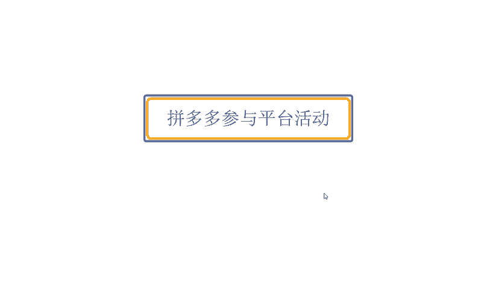

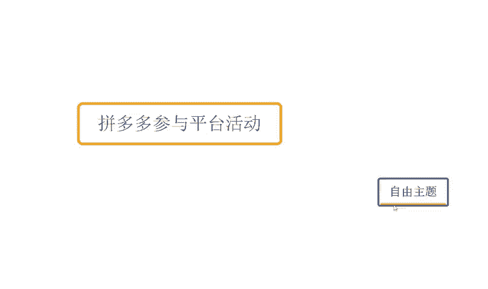

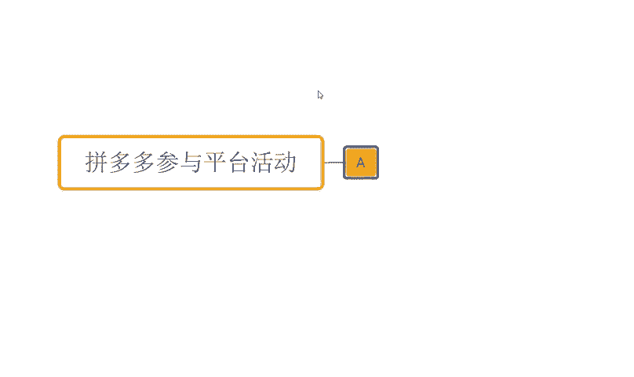

29。8块。啊，当我发布完这个价格之后呢，OK我现在呢又去报名了活动啊。那么这个活动的最后折扣价呢？OK变成了19。8块啊。当活动折扣价19。8块的基础之上呢，我店铺呢还设置了。比如说新科立减啊。

这个店铺关注券啊，商品关注券呢，或者是一些领券中心券等等这些东西啊，各种券啊。那么最终他的券后价呢。是9。8块。好吧，最优要的券后价呢是16。8块。OK那么这个时候各位我们可以设身处地的去体思考一下。

假如说是你你看到一个产品，那么这个产品呢它是满足你的产品需求的对，也是符合你的这个需求的啊。那么它的价格呢9。8块。另外一个产品呢，它的价格29。8块。

虽然说这两个产品可能对你来讲呃区别不是的那么的大啊，但是这个时候其实很多情况之下，我们往往会认为9。8块的这个产品呢是比29。8块的产品要差的对吧？那9。8块的这个产品呢，它可能最多也就值个9。8块。

甚至它可能并没有值9。8块啊，它可能只值5块钱4块钱。因为它还商家还要赚我钱，对不对？但是29。8块这个产品呢，在往往啊很多情况之下呢，我们会觉得它可能在产品的实际价值或者是产品的品质上面呢。

是这个要远远到大于9。8块的。这是我们会设身处虑的局势的话的话就是一个一个心理问题，对不对？我们不会觉得它跟这个9。8块是一样的，或者是比这个9。8块更廉价，对吧？至少这一点啊，那么在这个时候呢。

这个29。8块的产品呢又在做活动啊，打折打到了19。8块，同时呢又还有优惠券做到了9。8块。虽然说最终这两个产品呢，他们可能的展示价格，销售价格都是9。8块，但是我仍然会觉得。A。我们买了的话。

可能商家是有的赚的啊，我我并没有占到便宜。虽然说他可以满足我的需求。但是B如果我销这个进行销售啊，进行这个购买啊，不是销售啊，进行购买的话，OK我是可以有便宜占的，为什么呢？因为它有券，因为它有折扣。

那我用9。8块的一个金额去购买到了29。8块的产品。我觉得我占便宜了。各位有这样一个呃想法的，或者是对这一个。概念啊大家认可的话，公屏上方可以这个啊打个一啊或者弹幕发起来好不好？所以在这种情况之下啊。

往往啊商品B。他在产品后期的转化上面来说会更高。那么也正是因为这样的一个逻辑，平台会判定说在同等情况之下啊，有活动的商品，它和没有活动的商品会进行优先推荐我们的活动商品。因为活动商品的转化更高。

它能够去为我店铺为我的平台带来更好的收益啊。那么这就是我们为什么要去报活动的一个根本原因。那除此之外呢，当我们提报活动之后，还会到端这个专门的这个活动的一个流量啊。

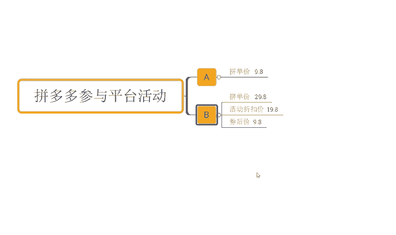

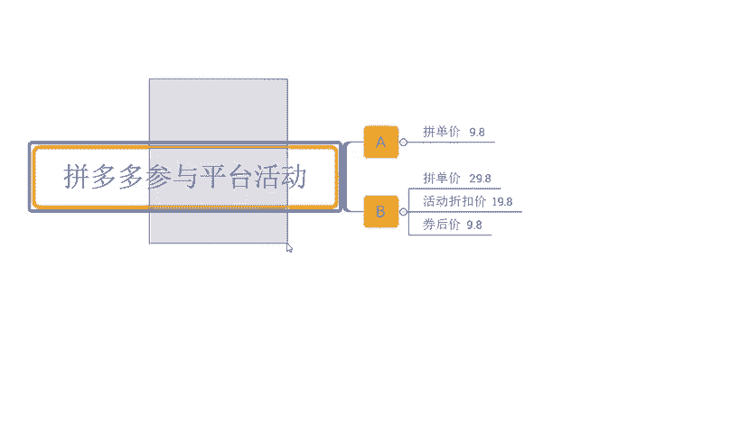

比如说像我们报名这一个平台的一个秒杀呀，万人团啊、清仓啊、9。9块啊等等啊，各种各样活动他都有自己的这个呃活动的一个渠道。

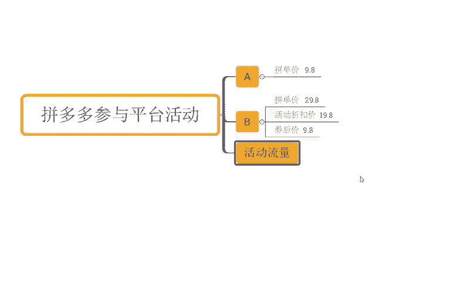

对不对？那么平时呢，他也会有在我们的搜索端口里面呢，会有到搜索词。对吧我们所谓的大促搜索池。那么这个大促搜词呢，简单点说就是你没有报名这个活动，你在对应的平台搜索端口的活动推荐位。

你是不可以有展现的那如果说你报名的这个活动，你在这里面才有机会展现。那么换句话说呢，这个活动推荐位呢，如果说有一些大促活动的时候呢，它会比正常的自然报工呢会优先展示。而如果说你没有报名活动。

那么你的排名会在这个活动后面啊，报名活动之后呢，我们正常可能是100名200名的位置，报名活动之后可能是在前50里面去竞争去去找啊，那么都有这种情况的。所以它的一个一个区别还是蛮大的啊。

那整个过程中的话，我们就需要去不断的尝试去呃提报各种各样的活动来满足我们产品的一个权重的一个增加，对不对？而在整个运营过程中的话，不同的活动，它是会有到不同的要求的啊，包括什么活动的时间呢。

活动报名的条件呢，商品的条件呢，这些我们都需要仔细去观看去阅读，了解清楚之后再去提报。那么如果说你在报名活动的时候。

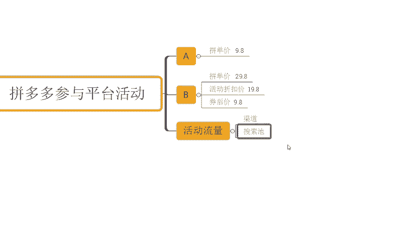

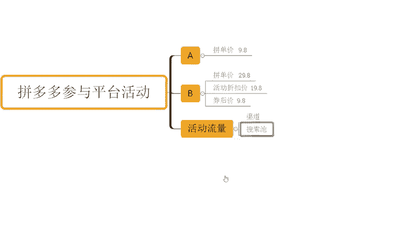

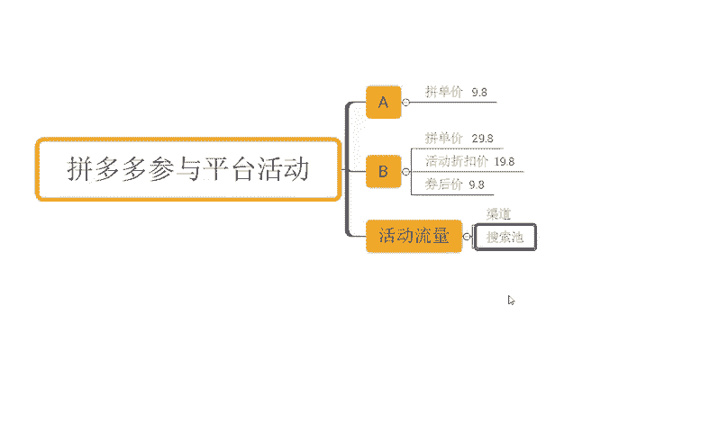

时后那么大概率呢也会受到平台的一些限制。

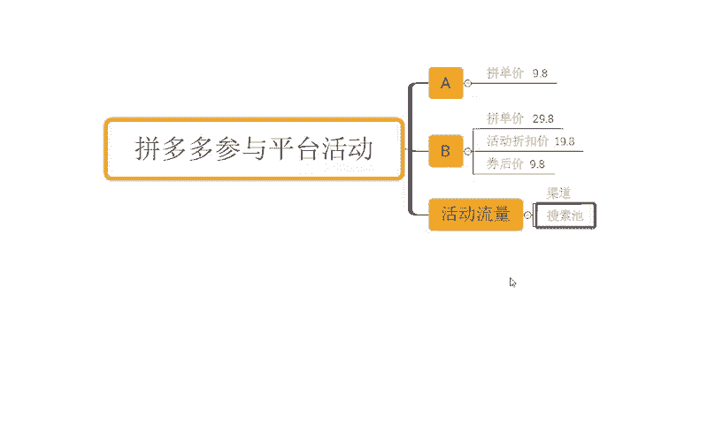

怎么限制呢？价格。

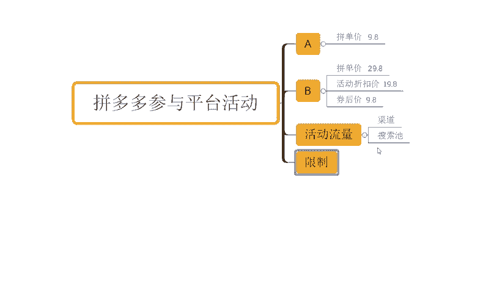

啊，这里的话我要重点说明一下。那如果说我们的商品呢在日常的销售过程中呢，你的销量不是特别多，转化率不是特别的好，平台会判定说你的产品不具备价格竞争力。

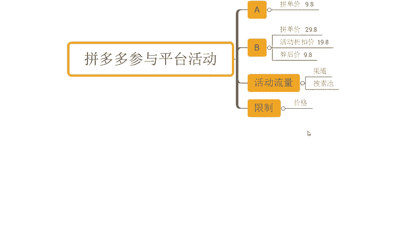

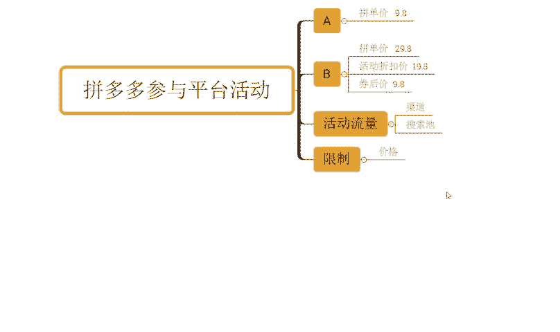

那么就会考虑说让你的活动价格变得更低，让你能够在整个活动中呢有到一个非常非常具备竞争力的一个价格，然后带来更高的活动产出，所以它就会压你价啊，那么这是一方面。

另外一方面就是说我们产品呢在日常销售过程中呢，可能会涉及到历史销售的一个最低价啊，也会有这个问题。又或者说呢我们整个的呃商品呢在呃整个提报活动过程中呢，会有到一个比价的一个一个过程，对不对？

那受到我们同行的影响，导致我们的产品价格呢会比较低啊，那如果是遇到这种情况的话，我们就需要去进行我们啊仿比价和原价上活动的操作啊那么这个部分的内容的话，我今天就不在这里分享了。因为之前提到过，对不对？

大家如果说是有兴趣的小伙伴呢可以往往前这视频去找一找，或者说是跟我家人沟通都是没问题的，好不好？那对于店铺操作讲的话，当然也不是说仅仅。

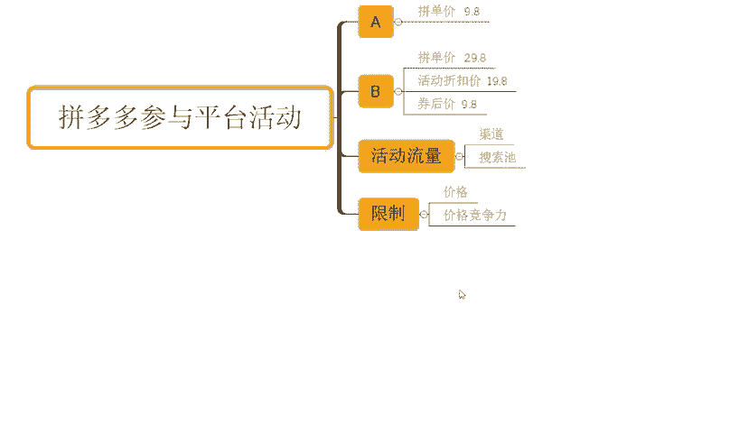

这些问题解决好就可以的，还有很多很多的问题，对不对？如果说大家还有什么其疑问，也可以跟我交流沟通。而店铺操作方面的话，也有很多小伙伴可能是花费了比较多的时间，比较多的一个精力，对不对？

做了很多的销量跟评价。但是整个店铺呢是没有得到一个明显增长的，访客没有得到增加，对不对？那如果说你是这种情况的，确实想好好做店做店的话，那么考虑跟着实操好吧，可以看到啊这些店铺呢都是跟我实操做店的啊。

像这个店铺最早呢访客是5000多6千0到啊，那么跟着实操之后呢，一个月时间做到了访客一天4万啊一天4万一天订单呢是6100多单，转化率15。16啊，包括还有这这个店铺对不对？

也是跟着实操的最早呢访客是4000多5千0到啊，那么跟着实操之后呢，一个月时间访客一天做到了3万啊，那么一天的这个订单呢是3800多单啊，12。67转化率啊，包括说还有这种啊零访客的纯新店来的，对不对？

也是一样的啊，起点非常快速，对不对？

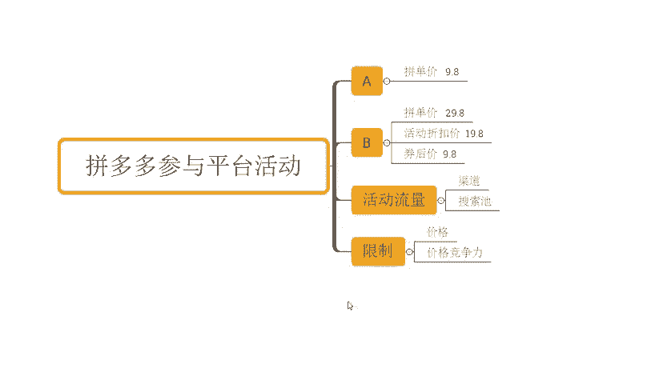

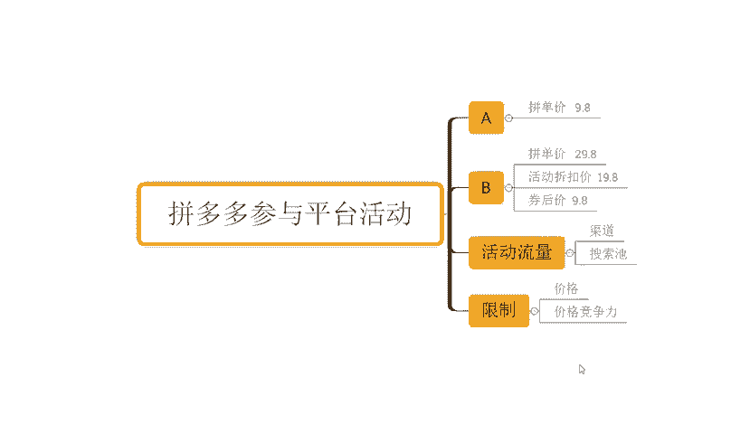

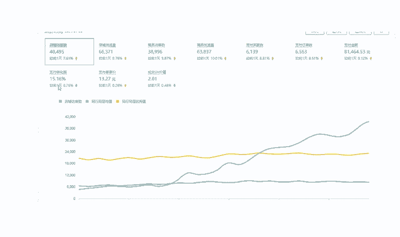

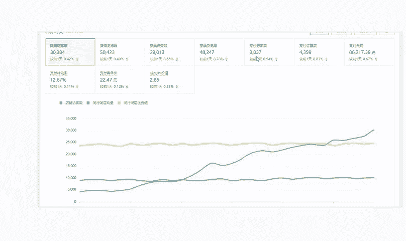

从最早零访客做到一天访客5000多，一天订单呢是800多单啊，14。01转化率啊。那么这里呢这种店铺还有很多我就不去一一展示了啊。如果说你自己呢是没有一个好的运营思路。

没有完整的运营方法缺少运营经验O那么跟着实操，我相信对于你的店铺提升对你的能力提升帮助应该是更大的好不好？O同样这边为准备到了非常多的一个视频数才可以看一下，将有100分的文档。

那么里面呢从技术到境济的全套运输都有的啊，包括非常多的一平台规则呀新品操作玩法呀，平台活动技巧啊，以及付费推广玩法等等都有啊，吃透之后呢，正常店铺也是没有问题的。有需要小伙伴呢可以关注我回复做点领取。

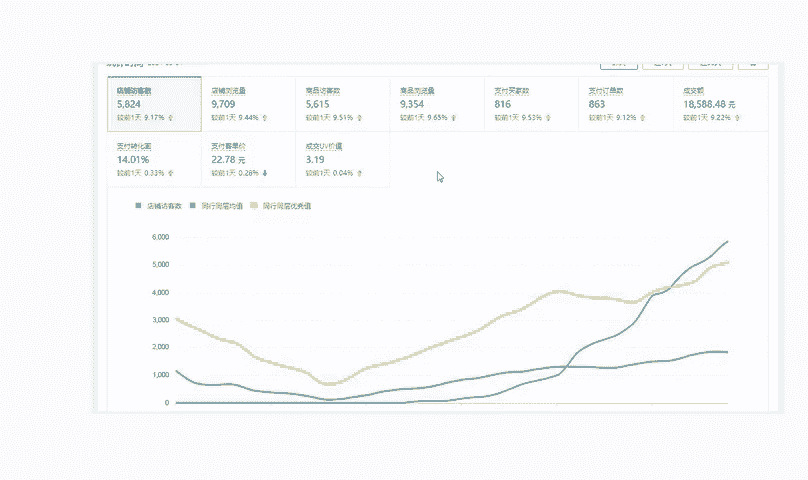

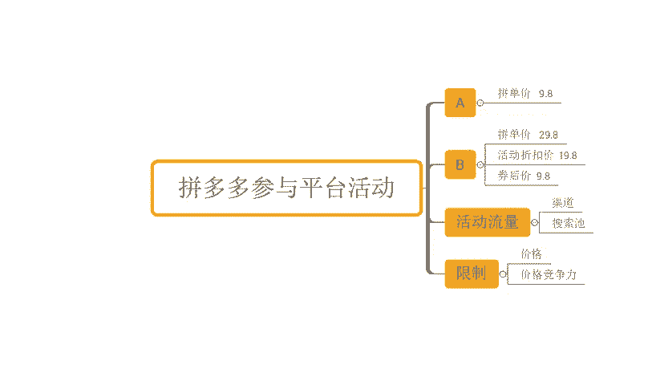