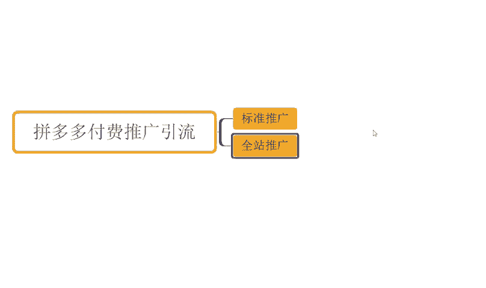
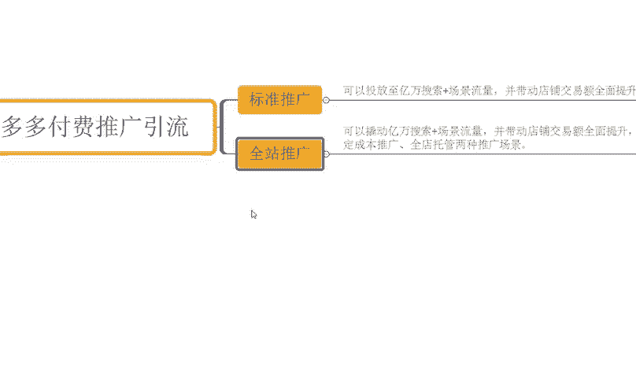

# 【拼多多运营实操教程】最系统的零基础拼多多开店教程全套，电商运营大佬专为学渣研制的新手开店保姆级教程！全程干货，简单粗暴 - P25：25、拼多多开店-多多付费推广 - -拼多多开店 - BV1BH1qYpEqw

hello大家好，我是西楼。那么今天为大家分享的内容呢是我们譬如说自然流量取款方法中的付费推广引流啊。可能很多小伙伴觉得哎开玩笑吧。西楼你都说好了自然流量引流取款的方法。

为什么说自然流量里面还会有到付费推广引流呢？O这里我要说一下啊，付费推广引流虽然说是付费，但是它可以带动我们自然流量提升啊，那么可以带来更好的产品的曝光，得到更好的产品产出，得到更好的转化。

那么全面提升我们店铺的交易额得到更好的数据反馈。而且在这个过程中的话，它跟全纯付费的一个引流是有本质区别的啊，推广方式是不一样的好不好？O那我们来说一下，目前的话平台的付费推广方式呢是会有到标准推广。

以及我们的这个啊全站推广两种为主。

对吧而标准推广呢，大家可能有这个新手来说不是很清楚他的一个一个意思啊。

那么我们可以在后台里面找到标准推广和全人推广的说明啊，你们可以在后台里面去打开标准推广以及全人推广啊。那么呃在这个页面里面呢，都会有到一个说明的，对不对？什么是标准推广，什么是全能推广啊。

这种说明可以看得到的啊，那我们去看的时候会发现一个问题，就是标准推广的话，平台给到我们的解释是什么呢？

标准推广可投放至亿万搜索加场景曝光。带动店铺交易额全面提升啊，这是我们标准推广平台的一个说明啊，这里我写一下吧好吧。

可。投放。致。意外。搜索加场景流量。并带动。店铺交易额。全面提升。

好，这是我们标准推广的一个解释啊，什么叫标准推广呢？就这么个东西。那么全站推广呢？OK全站推广说来也巧啊，他有半句话跟这个一模一样，对不对？他说全站推广呢可以撬动。

亿万搜索加场景流量啊，注意它不是投放自了，它是撬动啊。他不是投他不是这个投放者啊，它撬动了。跳动。然后呢。带动店铺营额全面提升。支持稳定成本推广，全店推广两种推广场景啊，还有这么一个说明啊。

支持。稳定成本推广。全定。托管。推保。两种啊两种。被判三人。

那么由此可见，其实标准推广和全省推广在目前的拼多多平台来讲的话，其实它已经没有什么特别大的一个差异啊，对不对？啊，至少来说在说明里面的话，其实大部分的文字说明的话，他们俩是看不出明显区别的对吧？

一个是投房子，一个是撬动啊啊，无非就这么点区别。然后呢，另外的是什么呢？呃，我们的全站推广啊，它会有到一个啊更加方便的全店托管的一个策略，对不对？

那么这里我说一下啊。在目前没有了自定义推广的这个呃情况之下呢，标准推广其实对于我们店铺来讲的话，它无非就是拉新能力相对全站会好一点，其他没有任何的优势了。啊，其他没有任何优势了。

所以说我们在操作的时候呢，呃核心板块的话还是以全店的方式去投放啊，这样子的话对于我们店铺提升可能会更好一点。那么怎么去做呢？OK给大说明一下啊，在我们产品上架的时候。

那么这个时候呢，我们针对到产品的一个发布价格呢，可以把它给做大。做多大呢？比如说我把这个产品的正常价格是10块钱，我做成100块1000块，甚至是5000块都可以把它做大。那么做大之后呢。

因为产品的价格提升，价格变高。那么平台在进行商品抓取的时候，我们在设置我们这个全站推广的时候，平台抓取的是市场均值数据来进行评估，对不对？我们的价格高，于是乎呢，按照市场均值评估呢。

我们产品整体的产出也会比那些平台其他商品要高。那么这个时候呢，我们的目标投产品。

就会相对来说可以设置的更高。

啊，道理很简单，对不对？那么设置的更高之后呢？平台在跑我们的全站推广过程中呢，会不断的系统按照我们自己设定的一个目标投产比来进行优化来进行这个投放。

那么尽可能让让我们的最终数据呢往这个目标投产比来进行贴合。于是乎呢，它在这个过程中呢，可以带动我们产品。

推广盈利的一个概率，并且呢提升我们目标转化人群的一个精度。因为它需要有个更好的产品的产出，才能做到更大的一个投产。

是这样的啊，那么这个过程中的话啊，当我设置好我们这个高投产的一个计划之后啊，我们把这个计划暂停掉。

的不要投放啊，暂停掉。暂停之后呢，我们去调整我们产品的1个SKU啊，或者是我们产品的一个价格，对不对？正常去发布发布到我正常的价格。那么发布到正常价格之后呢，我们进行产品的日常运营，对吧？

包括说我们像啊产品的活动提报啊，产品的这个基础标签的一些优化等等这些东西。那么做完之后呢，OK我们可以通过什么呢？通过标准推广来进行拉新。

啊，标准通框进行拉新拉新呢一般是三天时间啊3天。

那么这三天时间呢，不断的做一个数据递增的过程。比如说第一天我拉新的一个成本呢设置在100块。

第二天拉新成本呢，我设置成150块，对不对？我们不是设置的这个呃标准推广嘛，对吧？第三天我设置200块啊，打个比方，那么每天以50%的比例增长，对不对？那么这个时候只要他数据能够刷完的话。

那么整个访客数据是在提升的，对不对？而且呢他也会不断的去深化，优化我们产品的访客标签啊，那么再到后面呢，我们产品能够去真实出单或者是出单的一个单量啊，做到一个呃十单左右的时候。

我们再把我们的全站推广呢投放出去，让全站推广来进行我们历史标签的一个收割，形成转化，带动高投产的一个获取。那么这个时候呢。

推广他的一个引流，只会来服务于我的成交。而服务成交之后呢，产品的成交可以带动我店铺商品的更好的数据反馈，得到更多的推荐曝光。由此来拉伸我们产品的一个权重，好不？只是个过程啊，那对于店铺操作而言的话。

可能还有很多小伙伴对于一些操作问题呢不是很清楚，对不对？每个人都有不同的问题嘛。那如果说你是有么其一些店铺操作面问题的话，也欢迎大家随时跟我来沟通。那对于店铺操作而言的话。

也有很多小伙伴可能做了非常多的相当评价。但是呢整个店铺呢是没有得一个明显的访客增长的那如果说你是这种情况呢，实前好好做店长期做店的话，O那么可以跟我实操。好吧。

可以看到这些店铺呢也都是跟着实操的像这个店铺最早的话访客只有500多六千0不到啊，跟着实操之后呢，可以看到一个月时间访客从最早的这个600不到做到了4万啊订单呢从最早的这个六00访客直接变成600订单对不对？

那么转化率呢是15。16对不对？包括这个店铺。

看的啊，那么最早呢这个访客呢是4000多5000不到啊，跟了实超之后呢，一个月时间，访客从最早的这个4000多变成了3万啊，那么一天的订单呢是3800多单，对不对？转化率呢12。67啊，类似这种店铺呢。

还有很多像这个店铺，对不对？从啊最早零访客的个新店对吧？跟了实超。那么非常快速得到一个提升，一天的访客呢从零变到了5000多，6000将近，对不对？订单的话一天是800多单啊，14。01转化率。

那如果说你自己没有一个好的方法，没有运营思路，需要运营经验。OK那么跟着实操，我相信对你的能力提升，对你的店铺提升帮助应该是更大的。好不好？那么同样的这边为大准备了非常多的一个视频素材，可以看一下。

今有100份的文档。那么里面呢从基础到经济的全套运素材都有的啊，包括非常多的一些平台规则姓名操作玩法平台的活动技巧以及赋推广玩法等等都有的啊。那么吃透之后呢，正常店铺是没什么问题的。

有需要小伙伴呢可以关注我回复逐点领取。

