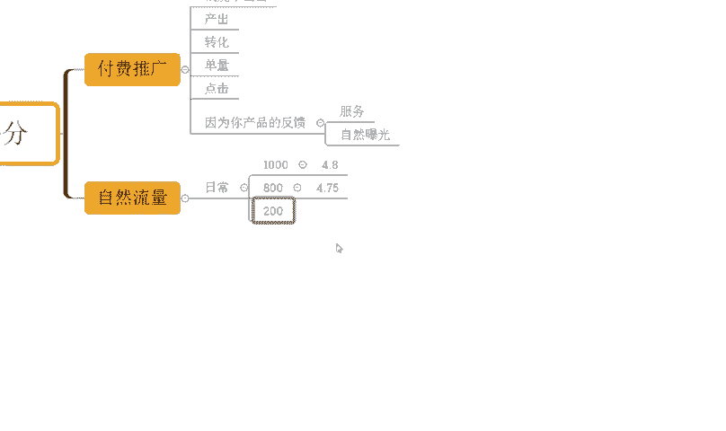

# 【拼多多运营实操教程】最系统的零基础拼多多开店教程全套，电商运营大佬专为学渣研制的新手开店保姆级教程！全程干货，简单粗暴 - P26：26、拼多多开店-维护店铺评分 - -拼多多开店 - BV1BH1qYpEqw

hello，大家好，我是谢楼。那么今天为大家分享的内容呢是我们拼多多自然流量企款方法中的维护店铺评分啊。可能很多时候呢，大家对这个店铺评分的关注度呢并不是那么高，对不对？但是这里我要说。

在某些时候店铺评分的一个啊对我们店铺影响呢是非常非常大的啊。我举个例子，有的时候可能我们在做付费推广的时候，对不对？

本来我的店铺呢是能够推得动的，但是有一天我发现我的店铺推广推不动了啊，我的钱。

烧不出去了。那么这个时候我们就会想一个问题，哎，为什么呀？是因为我产品的一个呃这个出这个推广的出价太低了吗？但是我之前可能好好的都能推得动，对不对？但是突然一天我烧不动了。我的产品的产出也没什么问题。

我产品的这个呃转化也没什么问题。对吧哎，我产品的这一个呃单量也没什么问题。是不是哎，包括我们点击啊等等啊，都没什么问题。但突然有一天我发现我的车烧不动了。为什么。如果说我们店铺没有一些不良评价的影响。

没有一些这个违规。那么这个时候你可以去重点看一看你的店铺评分。那么有可能就是因为我们店铺评分过低导致的。

比如说平台呢判定我们产品的店铺评分呢低于平台平均的一个比例啊，到达了一定的这个呃幅度之后，或者到达一定的比例之后呢，OK。那么因为你产品的。反馈不好，对吧？因为你店铺的评分不好。

所以这个时候的平台平台就会判定啊，你没有办法给到我们消费者更加好的服务。

于是乎呢针对到你的店铺呢就会进行限流。那么这个限流呢不仅仅只是局限于付费推广哦，还会有到我们自然曝光的影响。

所以这时候我为什么讲到说我们要维护我们店铺的评分。那么这个也是我们在留取款的一个重要的一个啊过程，或者是一个后续操作的一个方向。因为自然转化也好，付费流量也罢，对不对？

那么他对我们店铺的评分呢都是有一定要求的。如果你店铺评分很低。那用户大概率可能会因为你评分低呢，导致不敢下单，而在推荐流量方面呢，也会受到我们的评分低的原因导致推荐减少，啊。

那么这个呢在我们自然流量里面是要的，对不对？啊，本来我好好的啊，我店铺呢是有自然流量的。

突然有一天莫名其妙，我的访客他对吧？一下掉了一半。断崖式的。啊，那么这个呢我们就去观察对不对？我们要观察什么呢？因为每个品类它实际上对这个评分的考核是不一样的啊，观察什么呢？

我们要观察我们具体每一次流量波动和我们评分这样的关系。那么这个东西呢，我们最好呢日常的时候啊可以去做一些记录，对不对？比如说今天我的访客啊啊，这个1000个啊，打个比方啊，那我的店铺评分呢是4。8。

那有一天突然一下，我店铺访客呢就变成了800个了，对吧？哎，我发现一个问题，我店铺访客呢，我店铺的这个评分呢也没有什么太大波动啊，就4。7几。

啊，4。758啊，但有一天我发现个问题，我的访客只有200了啊，本来我平时的访客呢是也有800多左右，对不对？五六百左右啊，没有太大波动的。但是有一天我访客突然只有200了，怎么都上不去，死活都出不来。

自然流量自然流量没有开车也开不出去，对不对？那么这个时候我一看啊，我远完蛋啊，我的这个评分4。3。

啊，我的评分时间3。那么这个时候我们就要注意了，我们在日常的运营过程中，这些数据我们要做一些记录这些观察的。比打个比方，这流量它在不断的下降，对不对？变成了4。75的时候。

原本呢我的这个1000的访客呢变成了800啊，我在点击上在转化上在交易额上在UV价值上，这些各种各样的问题都没有啊，那这个时候我就可以很好的判断，那么应该就是我评分导致我的推荐权动下降了。

那么我们就要引起注意，对不对？因为它的降价啊，它的这个下降呢整体的访客下降的一个幅动呢蛮大的，对不对？那如果说这个时候我没有去留意它，到了有一天我发现哎原本我是4。7，对不对？

啊，我们的访客呢一直以来也都是维持在我们的啊800左右，对吧？突然有一天卡200访客了，对不对？4。3好，完蛋。这个时候呢我们也分析了，我的转化没问题，我的点击没问题，我的这个收藏没问题。

我的这个交易额没有问题，我的优惠价值也没问题。哦，我来看一看我的评分。

啊，啊评分掉了，评分掉了之后呢，原本的。访客啊800啊掉升了200，为什么？因为这个时候你的频分太别低了，平台会觉得啊你这样的一个服务，对于我们的消费者是种伤害。

可能会导致我们用户对我们平台也产生兴趣啊，导致平台的一个信任危机产生。那么他们就可能流失掉。我花了很大的功夫把这些人呢从其他平台抢过来的。然后因为你的服务不达标，把我们的消费者全部赶走了。

你就是我们平台的罪了。是不是于事故呢，你就会减少曝光，甚至说这个地方都没有200，可能就。这10个都不一定。是不是他就这样影响。那我们日常的过程中，我们想要去维护好我们店铺评分。

我们再去观察这些评分的一个变化和我访客变化的一个一个关系啊。那么不断的去维护优化。那这个优化过程中呢，可能大家可能会觉得哎。

那优化我们的这个店铺评分，是不是就去补单啊，补评价就可以了。其实不是。优化我们的店铺评分呃，去自己补，永远是治标。注意了啊，永远是治标。

那么所谓的治标呢，就是我哪里有问题，我去把那里出去拉上去啊，这个都是治标的。真正意义上去治本的话，O那我要搞清楚导致我评分下降的原因是什么？比如说今天我卖了一个产品对不对？那么这个产品卖的比较好。

但是这个产品的反馈一直以来都不是很好，导致我店铺差别很多。那这个时候呢我们就应该果断的去优化产品，实在是不能优化产品的情况下呢，我也要啊断臂求生，对不对啊，早做我打算对吧？不然的话你这个产品卖的越多。

对我们店铺的伤害越大，那么带来的负面影响就越大，对不对？可能就是啊我卖多少退多少，甚至我推完这些东西，我还亏啊，那就没有必要了。所以说我们这个是治标的情况下呢，我们要选择治本啊。

那同时的话我们也要去做好真实用户的一个啊好评的引导，对吧？包括说我们这个啊所谓的啊好评有你评价有你这种东西操作起来，对不对？不要说嫌麻烦嫌难啊，不要的啊。那么有了这样操作之后呢。

O我们整个店铺流量才能得到一个相对比较不错的啊稳定的一个数据啊，带来更好的一个提升。好不好？OK啊，对于店铺操作来讲的话，可能还有很多其他一些疑问啊，我知道这个东西很正常。那如果说你还什么其他问题呢。

也欢迎大家跟我沟通。同样的啊，也有很多小伙伴可能对于店铺操作来讲的话，花费的比较多的时间跟资金，但是呢整个店铺呢是没有得到一个明显的增长的啊。那如果说你是这种情况，想要好好操作店铺啊。

那么可以考虑呢跟着我实操，好不好？可以看到这些店铺呢也是跟着我实操的来。

最早的话，访客只有六0不到啊，跟着实到之后呢，一个月时间，店铺从最早60不到，访客呢做到了一天访客4万，对不对？可以看到啊，那么一天订单呢是6100单啊，转化率呢11。25。116啊啊。

包括像这个店铺也是的，可以看到。最早的访客只有5000不到，对不对？跟着实操中呢，一天访客呢从最早的5000当呢做到了3万多，对吧？3800多单，一天嗯12。67转化率对吧？

所以说你自己没有一个啊完整的策造方法的话，可能对于店铺操作讲的话，很难得到一个好的增长的，对不对？那么同样的还是这种店铺啊，从新店来的啊，最早是零访客的新店啊，跟着实操之后呢可以看到。

从最早零访客来说达到5000多访客对不对？一天的订单呢是800多单转化率呢14。01啊。那如果说你自己店铺操作讲，没有方法，没有实路没有经验，O那么跟着实操，我相信对你来说，对你的店铺来说。

当初应该是更大的，好不好？

OK啊，可以看到啊这边给大家准备了非常多的一个视频素材。那么将近有100份的文档啊。那么从基础到进行群运算都有的啊，包括非常非常多的一些平台规则啊，姓名测的玩法、平台活动技巧以及服有通玩法等等都有。

此透之后呢，正常店评是没什么问题的。有需要小伙伴呢可以关注我回复做点领取。

