# 【拼多多运营实操教程】最系统的零基础拼多多开店教程全套，电商运营大佬专为学渣研制的新手开店保姆级教程！全程干货，简单粗暴 - P27：27、拼多多开店-店铺数据分析 - -拼多多开店 - BV1BH1qYpEqw

hello大家好，我是西龙。那么今天为大家分享的内容呢是我们拼多多自然流量起管方法中的店铺数据分析。其实我们一直在强调一个事情，对不对？我们讲这个无数据不电商啊，我们所有的电商呢都是以数据为依托。

以结果为导向的。所以说店铺数据分析呢，对我们店铺的访客提升，对我们店铺的一个自然流量引流帮助是非常非常非常大的啊。那么在数据分析开始之前呢，我们必须具备的是数据的统计整理。对，如果说你没有这个。

那么抱歉是不行的啊。所以说那么大家在日常运营过程中呢，一定要有到一个记录数据的习惯。那么所有的针对到我们商品考核的数据呢，我们尽可能的多的完整的把它们记录下来，来帮助我们更好的去做好分析啊。

这一点的话大家注意一下。那么。在记录这些数据过程中的话，包括说我们讲的我们店铺层面的一些数据呢，也都可以每天去进行统计。通过这些数据的一个变化呢，我们可以找出一些规律来来完成我们店铺啊流量的一个维护啊。

那么呃自然流量的一个提升的话，那对于我们店铺数据分析板块来讲的话，要怎么去分析要做哪些分析，我们一起来看一看。首先第一个点啊，在我们整个排名考核过程中，可能大家会关心的一个重中之重呢，就是我们的转化率。

对吧我们一直以来强调的我们产品要有很好的产出。我们产品要有转化，我们的用户呢平台才会判定他喜欢我们产品，才会给我们更多推荐，对不对？所以说转化率呢也是我们一直要强调的一个话题啊。

那么如果说今天我们店铺的转化率，对不对？它是一个维持稳定的。

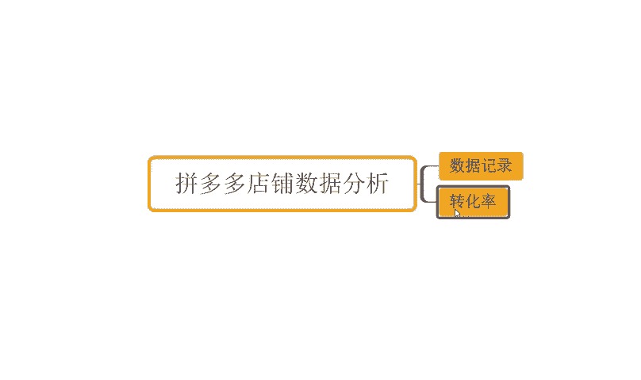

OK那我们的访客有在发生改变，那么说明我们的访客变化和我们的转化率无关。啊，那么当。访客变化转化稳定，访客变化与转化率无关的时候，我们就需要去观察。分析我们其他的数据，观察哪些数据呢？

观察我们的产品的客单价。

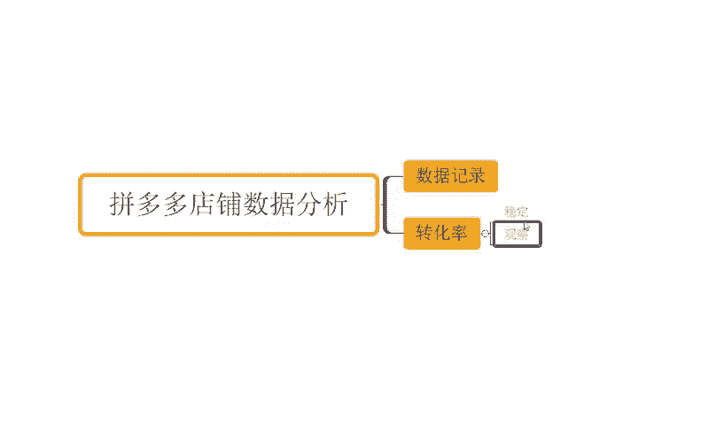

观察我们整个店铺的成交额。观察我们店铺访客的UV价值。

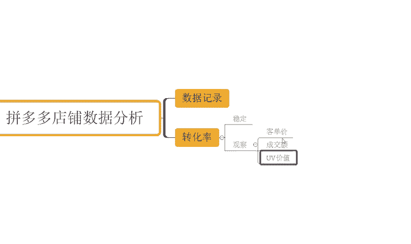

那么如果说这些数据它产生的变化，OK那么我们也可以判定说其他数据在没有变化的情况之下，我们访客变化是由这些数据变化导致的。

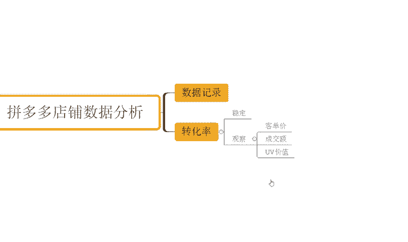

我们是以这样的方式来进行排查，来进行一个具体板块的问题查找。那么然后再针对到这部分问题呢，进行一个合理的运营策略的调整。我举个例子，比如说今天。

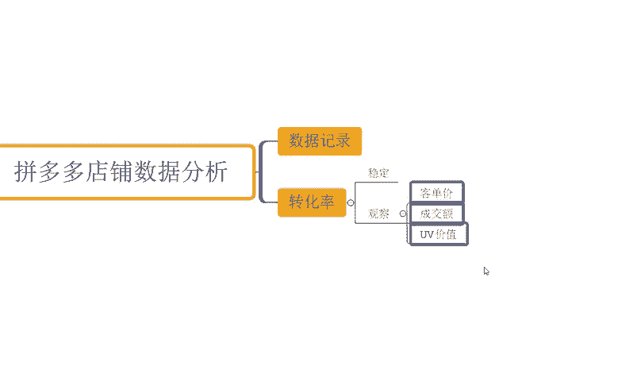

好，我们店铺的转化率呢一直稳定，对不对？做到10%。啊，做到10%啊，没有什么太大的波动。但是呢因为我们的用户呢，他可能一开始在早期时候呢购买我们商品的时候呢，会选择购买一些高客单的SKU。

所以说哪怕转化率一样，因为我的客单价下降了。

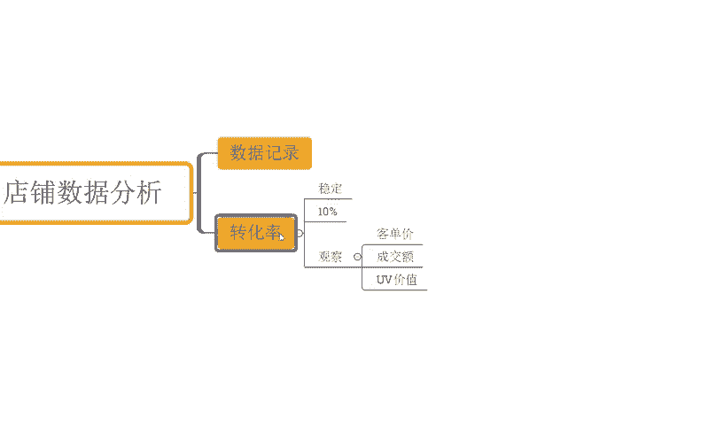

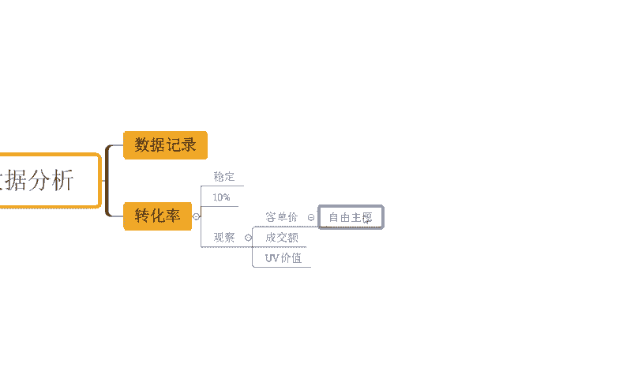

这个时候呢，我们整体的单量不变的情况之下，我的访客也不变的情况之下呢，我的成交额也下降了。

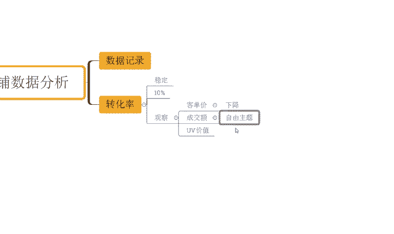

那么成交额下降的同时呢，那平均每一个访客的一个产生的价值也就下降了啊，我们的优惠价值就下降了啊。那么这所有的数据除了转化率稳定，都在下降的时候呢，好，平台就会判定说哎这个店铺呃。

为什么对我们整个访客的一个呃价值呢慢慢慢变少了。是不是这个产品呢开始过期了，或者产品有什么狭细问题。好，于是后呢干嘛呢？他就会进行一个访客的缩减？

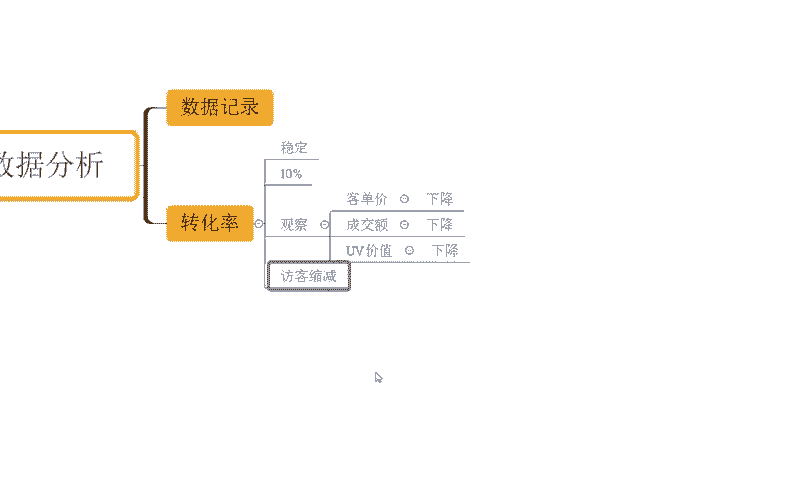

推荐的一个减少，对不对？就产生了。当访客减少之后呢，那么这些数据没有得到一个维持，没有得到一个稳定哦呃那么平台可能会判点哈，这个产品好像就是不行的过季了，或者是过气了啊，用户不喜欢它了。

慢慢慢慢这个逐渐减少呢，就会变成一个大幅度的下滑。那么整个店铺数据呢就可以就会什么啊直接就崩盘了啊。所以说当我们去做到这样分析过程中呢，哎，我们如果说确实啊我们的访客呈现出一个下降的趋势。哎。

我们来看一看我们转化率有没有问题。如果没有问题，我们来判定其他方面的问题是哪里。如果说是客单价下降了。好。

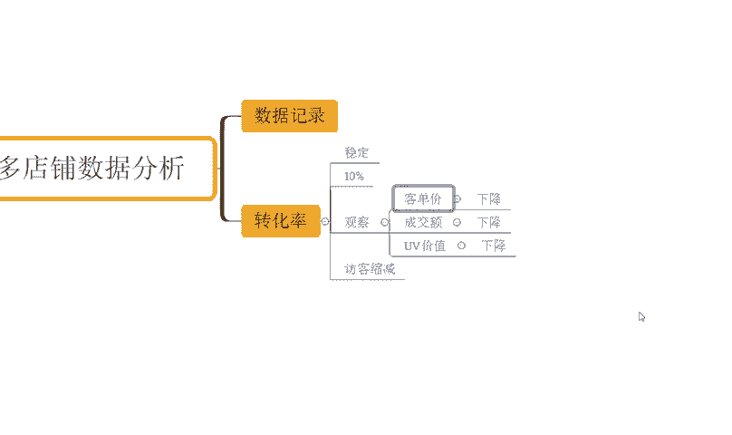

那么我们就需要针对到我们店铺客单价下降的原因进行分析。是因为我们高科端SKV的一个吸力不够了吗？又或者是。我高客单SQV没有办法去更好的吸引我的消费者。或者其他原因。那总而言之。

我们需要找出原因进行分析。我要引导我的用户来完成更高客单价的一个成交，得到更高客单价之后，来得到更好的产品的整体的产出整体的交易额的提升，那么带动我们UV价增长。

那么从而呢来保证我们产品的具体的啊这个访客数据得以维持。而不是说一直下降或者持续下降的一个过程。那包括说我们的这个呃UV价值下降啊，我们的成交额下降。那么它这各个方面来讲的话。

那么无非就是我们转化率的波动导致的，或者是我们的访客下降访客这个这个客单价下降导致的，对不对？那如果今天我们的转化率它是不稳定的。它是波动的，或者它是下降的，或者它是比较低的一个值的话。

那我们就核心目标就提升我们的转化了。

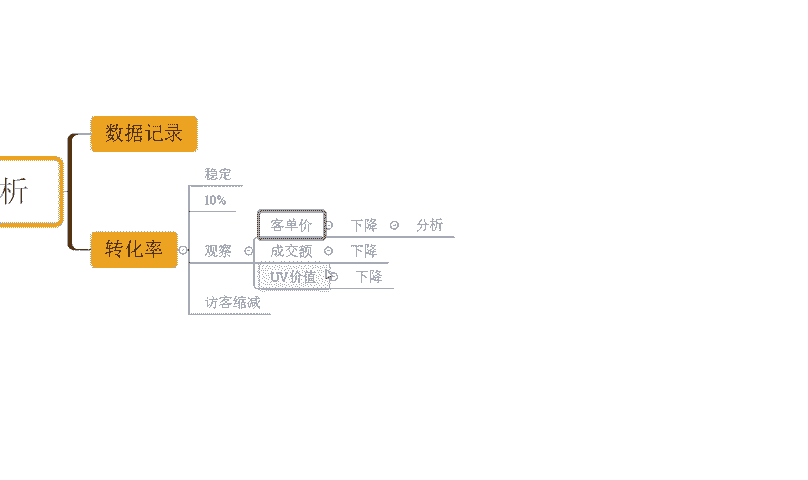

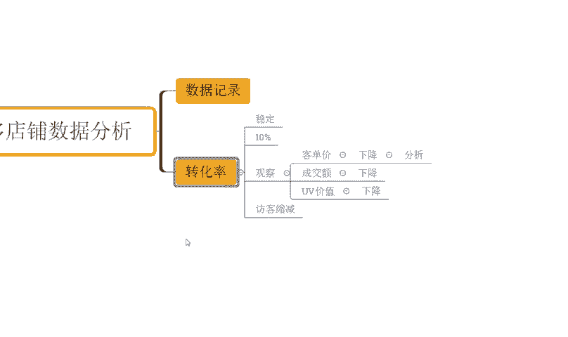

对吧那么至于怎么提升转化，其实我们在之前呢分享过程中呢也有提到过，对不对？关于我们转化的一个提升的优化啊，那如何去通过我们店铺的一些优化呢，得到更好的转化，也都讲到过。那么今呢就不去反复去强调，对不对？

那同时呢。

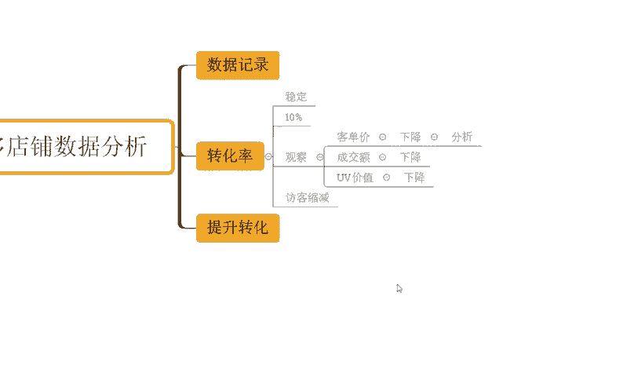

在我们这个呃整个过程中的话啊，我们除了要分析我们内部数据的一些问题之外，我们还要去干嘛呢？还要去关注一下我们外部的一些数据，对不对？我们需要去做好一些这个对比。

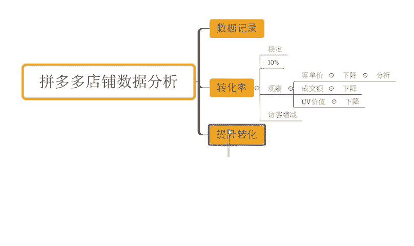

那转化率下降，比如说这个原因的话，我们去分析的时候呢，我们就可以对比外部啊。那是不是有同行有在做活动？

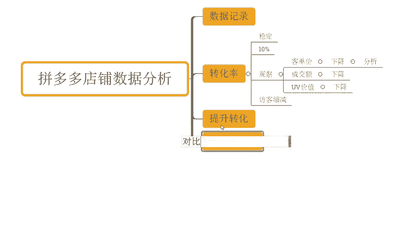

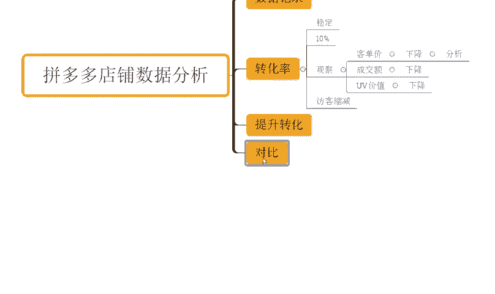

对吧他们是不是有在做一些活动价格，那么因为他的活动价格比较低，抢走了我的转化，又或者是他通过活动提供了来抢走了我的资源位，导致我的访客下降，对不对？

那如果说这是这个样子的那我们应该用通过什么方式来迎接他的一个挑战，我们是应该去做粉比价呢，还是应该跟他去刚价格呢？或者其他方面去调整呢，是不是这个们要搞清楚。

那同时呢还有就是我们的一个季节变化的一些问题也要去分析出来啊，比如说我们刚刚讲到的，对不对？可能有些产品呢它是有到一个生命周期的那如果说这个产品的生命周期已经到了。

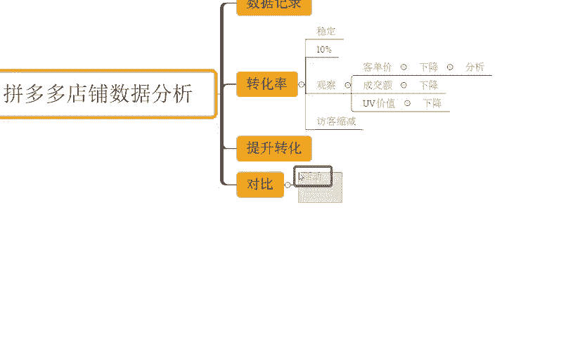

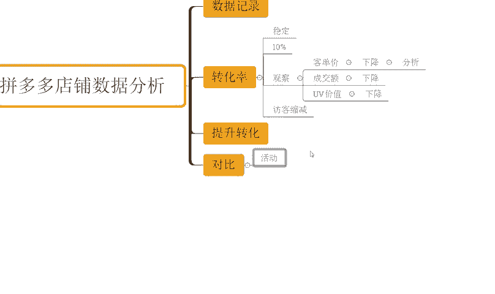

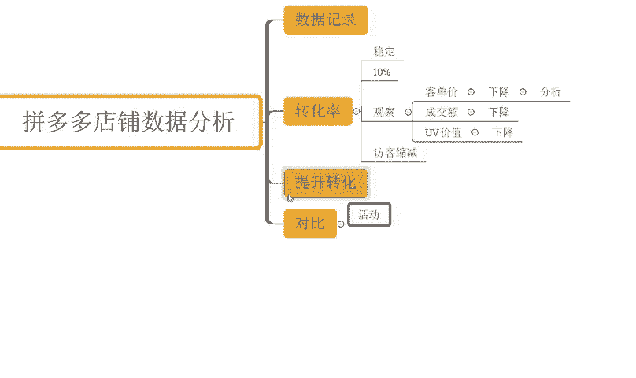

我们是不是应该强行去拉伸呢？或者是我们应该通过其他什么样的方式来进行一个迭代呢，对不对？来完成我产品的合理的这个时间线的一个过渡呢？这些才是我们一个正常去做的事情。那么有了这样的一个思维。

有了这样的一个售售方式的话，我们整个店铺的战略量取款其实是没什么太大问题的对吧？啊，至少来说，在数据层面上来讲的话，我们能够具有到更好的产出，更好的转化，更好的交易额，更好的这个呃UV价值。

更好的客源价的话，我们产品在数据层面上是肯定可以碾压我们的同行的。

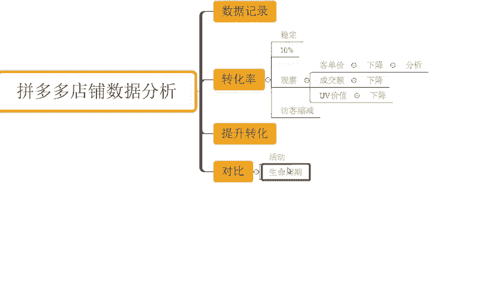

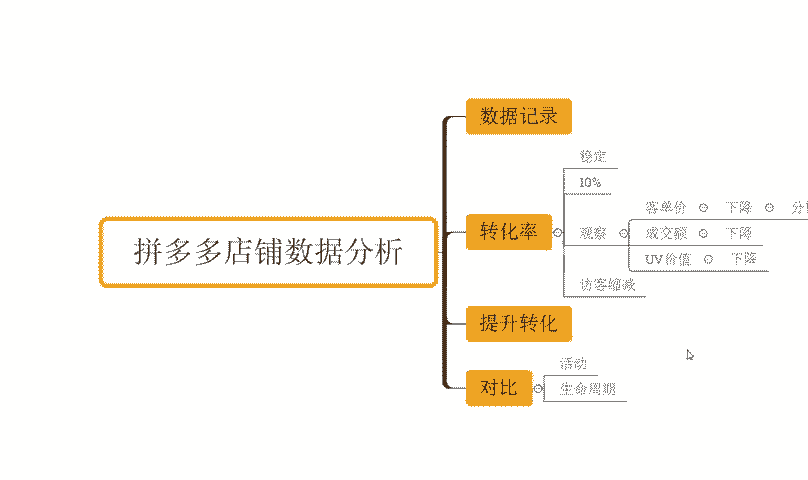

OK啊，那对于电铺操来讲的话，可能还有个很多很多的问题，这个也可以理解啊。因为每个人肯定都会有着不同的自己的一些呃难处。那如果说你自己对电铺操来讲的话，是没有这个呃。

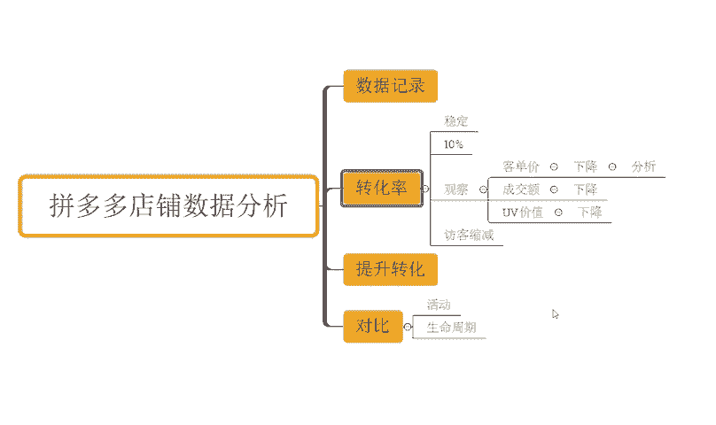

完全吃透，对不对？还有什么其他疑问的话，也可以跟我家流沟通啊，我非常乐意为大解决问题啊。

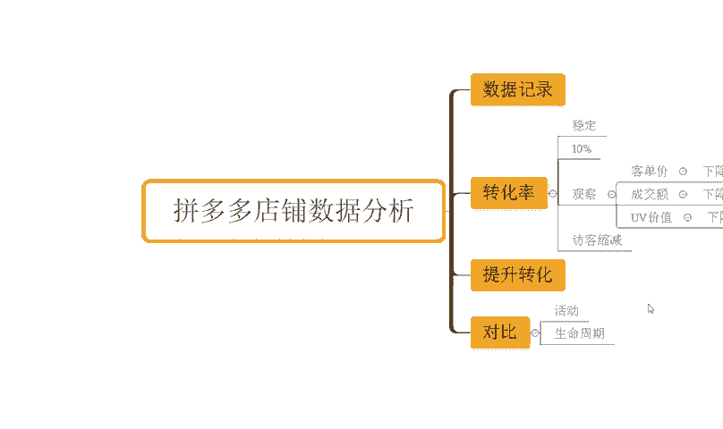

那同样的对于店铺操来讲的话啊，也有可多小伙板可能做了很多的销量跟评价，但是整个店铺呢没有得到一个很好的增长。数据呢一直处于一个不温布火的状态，对不对？如果说你是这个样子的，想要好好做业成业做店的话。

OK那么可以考虑跟着我实操，好吧，可以看到这些店铺啊，都是跟着实操的。

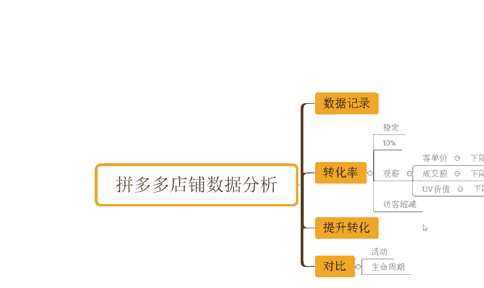

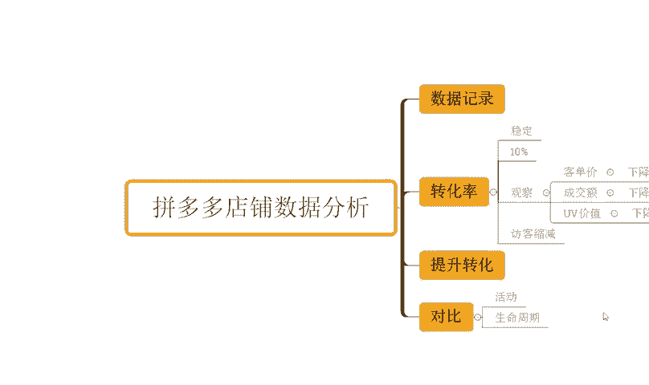

最早的话访客只有5000多，000不到啊，跟了实操之后呢，一天的访客呢做到4万啊，订单的话1000啊这个6000多单，对不对？转化率呢15。61啊，15。16啊，还像这个店铺也是跟着实操的。

最早的访客是4000多，000不到，跟着实操中呢，一天的访客做到3万啊。订单的话4800多单，12。67转化率啊，还像这个店铺呢是零访客的新店啊，从最早临访客呢跟着实操直接做到了5800多访客。

一天订单是800多单啊，转化率14。01啊。那么如果说你自己没有好的方法去来运营经验没有思路，跟着实操。我相信对你自己的能力提升，对你的店铺提升帮助应该是更大的。好吧。

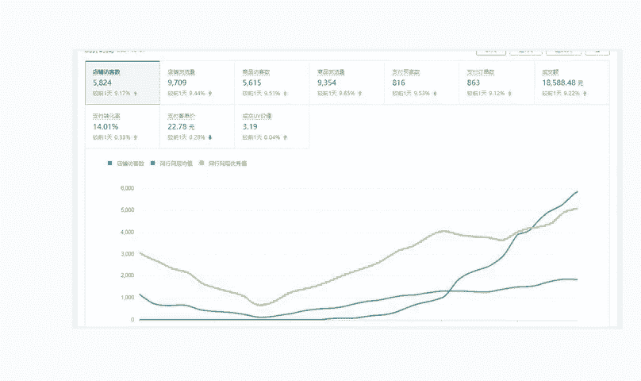

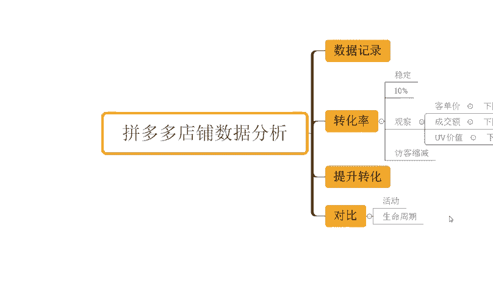

OK啊，同样这边我在准备了非常多的一个视频素材可以看一下，从基础到进接渠套运营出来都有的啊，包括了非常多的平台规则姓名操作玩法、平台的活动技巧以付费推广玩法啊等等都有。吃到之后呢，正常订面是没有问题的。

有需要小伙伴呢可以关注我，回复做点领取。