# 【拼多多运营实操教程】最系统的零基础拼多多开店教程全套，电商运营大佬专为学渣研制的新手开店保姆级教程！全程干货，简单粗暴 - P28：28、拼多多开店-店铺数据分析 - -拼多多开店 - BV1BH1qYpEqw

hello，大家好，我是西楼。那么今天给大家分享的内容呢，是我们拼多多新手开店爆款打造过程中的店铺数据分析。那么店铺数据分析呢，实际上就是我们数据分析的应用啊。那对于我们店铺来讲的话。

意义也是非常非常重大的。有很多的现的小伙伴可能说你不要说去分析了，你连数据代表什么含义都不清楚，对吧？可能这就比较麻烦一点。不过没有关系啊，那么今天呢我会抽时间为大家进行详细的分享。关于如何去分析。

并且哪些数据代表什么样的一个含义啊，会进行讲解啊，那么在讲解之前呢，老规矩啊还是先看一看，近期跟着我起实操小伙伴，他们的店铺数据好吧，那么像这个店铺啊是一个从零开始的新店，对不对？最早是零访客啊。

跟着实操之后呢，整个店铺数据呢也是非常快速的增长啊，到后面的话一天呢访客是做到了13000啊，一天的订单的话，1800多单转化率呢？13。85啊，那除了这个店铺之外呢。

还选这个店铺也是一个纯新店来的对对？零访客啊，跟着实操之后呢，整个店铺数据也是非常快速的一个提升啊，那么。

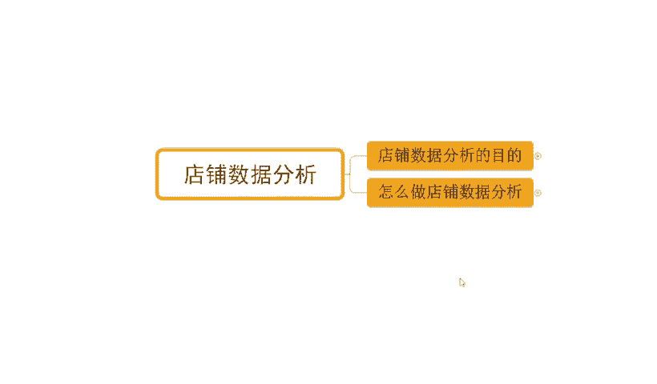

访客呢做到了6000多啊，但这个访客没有刚刚那店不多啊，但没关系啊，那整个的一个订单的话，一天是1100多单，转化率呢比较高一点，转化率是8。13啊。当然呢除了我们这种新店之外。

那老店铺数据分析也是必不可少的嘛，对不对？那像我们这个店铺啊也是一个原本有数据的店铺，最早的访客可能有个几百个，对吧？跟着实操之后呢。

整个店铺呢也是非常快速的提升到后面的话一天的这个访客呢做到了这个12000啊，那订单的话，一天是2100多单转化率呢16。37啊，也非常不错。那对于新手而言的话。

就像我刚讲到的可能想要去做数据分析很困难。为什么？因为什么数据代表什么含义可能并不是很清楚。但是没有关系啊，如果说你是有这种啊操作店铺方面的问题，或者有需要运营资料的可以找我啊，有时间的话。

我也可以带着大家一起去实操做店啊，就像这些小伙伴。

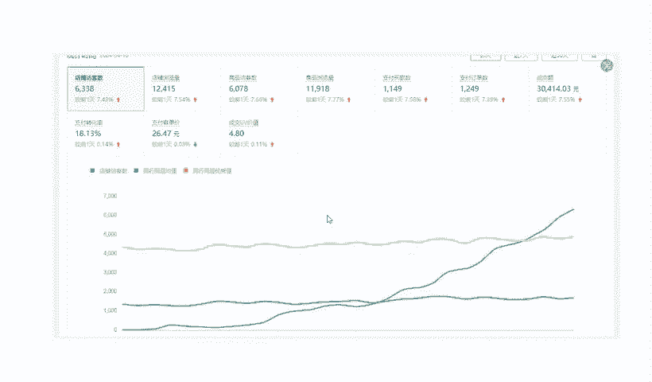

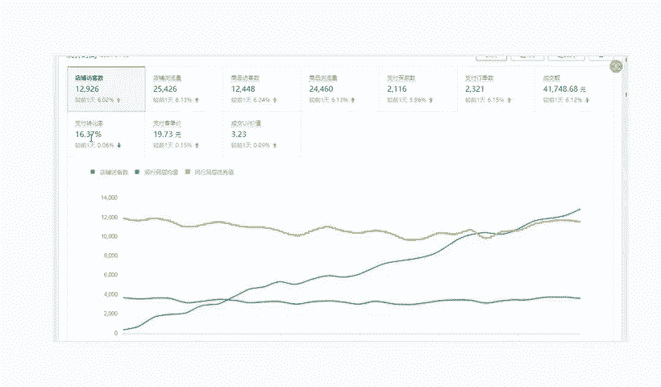

一样呢一起呢快速的把店铺做起来。好吧。那么回到我们主题中来。首先呢我们要搞清楚啊数据分析的一个目的到底是什么。那既然说我们要去做这个事情，那它总有目的吧，不可能是平白无故去做的这个事情吧，对不对？

OK的那首先呢我们来了解一下到底什么样的一个呃这个目的啊，那数据呢，它其实能够去反映啊我们店铺客观存在的问题的。

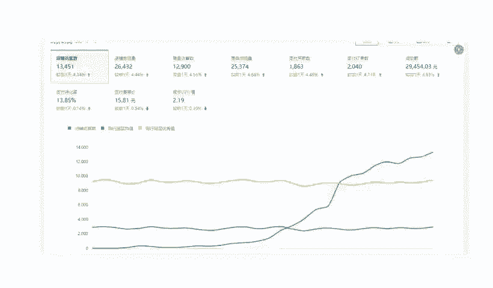

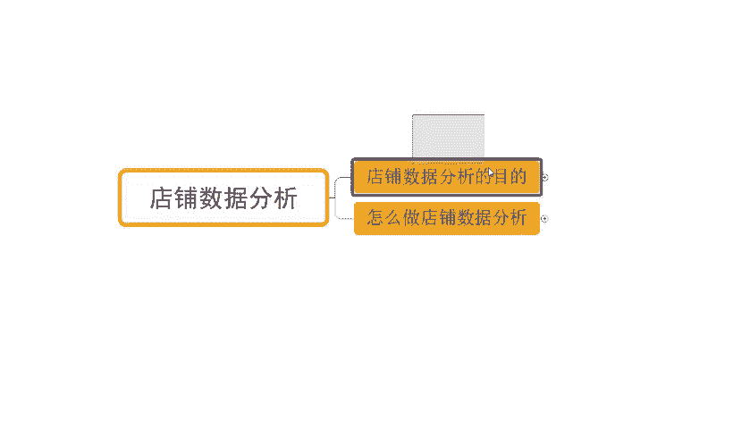

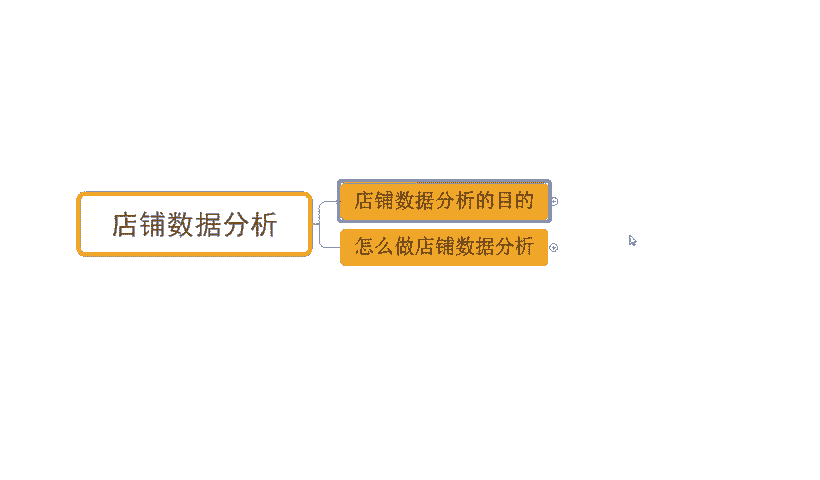

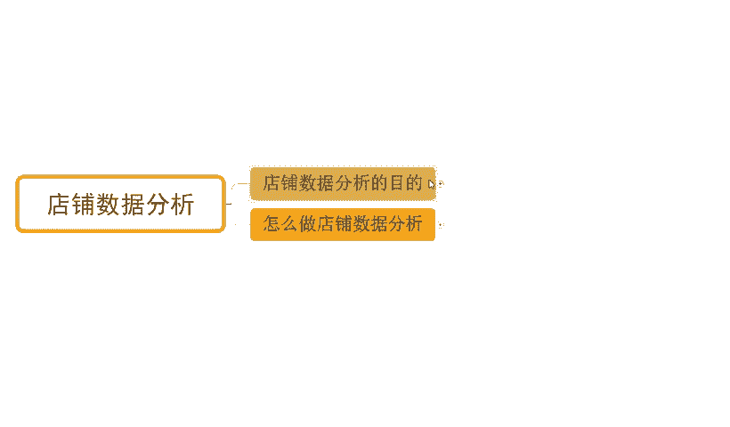

当我们通过数据分析去了解清楚我们店铺的问题的时候，就是我们能够去啊进行店铺运营的时候了，对吧？那整个的一个数据分析呢？针对性的找到问题，然后呢我们可以进行这个问题啊进行优化啊，做到一个对人下药的过程。

其实运营啊它就是一个发现问题解决问题的过程。而提升店铺数据呢，就是我们整个呃操作最终的一个目的啊，那么怎么去做我们店铺数据分析呢？OK直接开始啊，大家可以到我们的店铺后台啊，那么如果说是电脑端的话。

直接打开商家管理后台，在我们的左侧菜单栏有一个数据中心。那么在数据中心里面呢有到非常非常多的数据啊，其中呢有几个重要的一个数据啊，分别呢是我们的流量数据交易数据，我们的商品数据等等啊。

那每一个数据下面呢又会有到更。

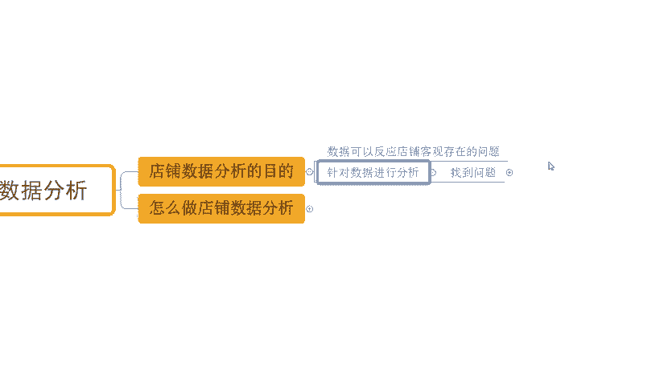

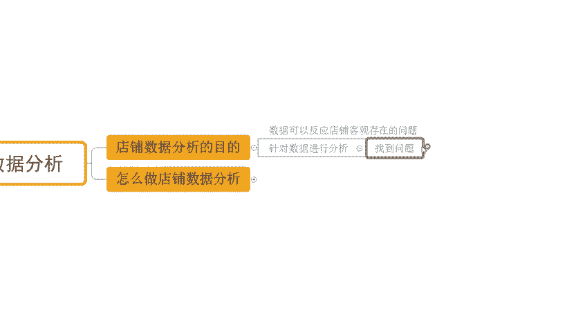

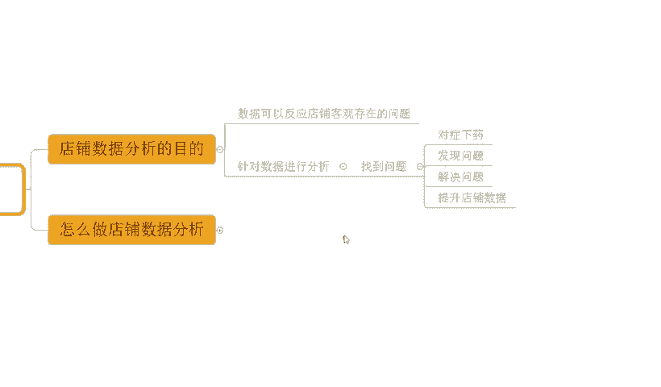

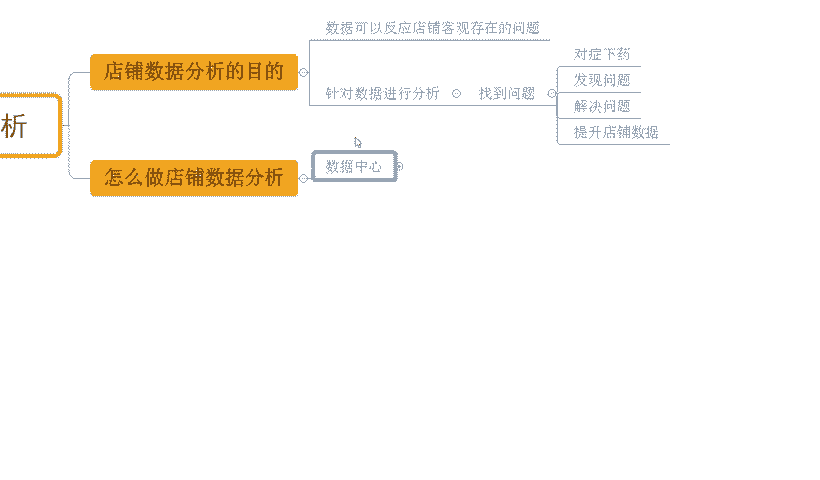

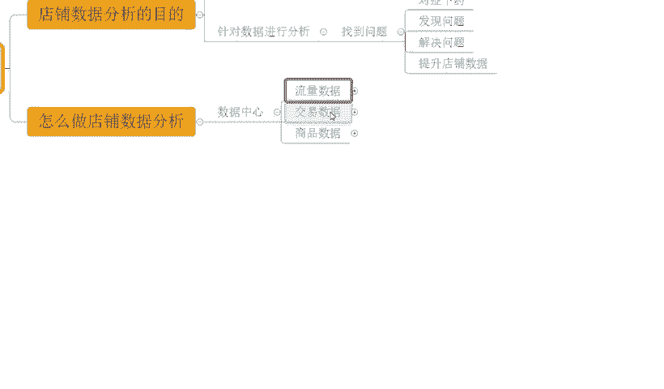

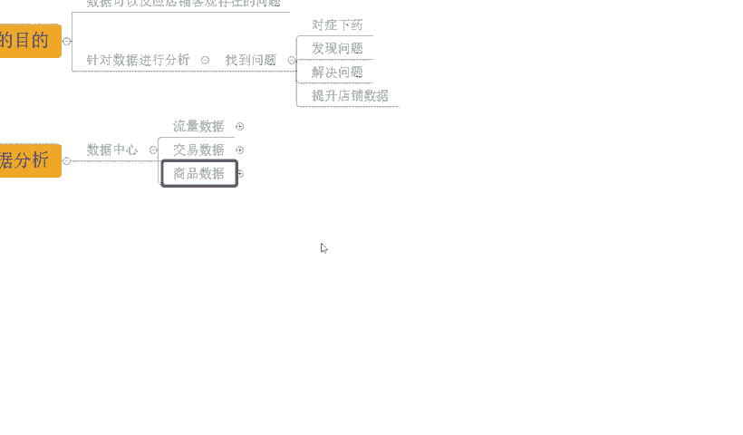

更多的一些具体细分的一些东西啊。那么这些东西呢就可以帮助我们去完成店铺数据分析的过程。比如说我们的流量数据，对不对？它里面呢会有到我们的店铺访客店铺浏览量啊。

商品访客、商品浏览量支付买家数支付件数、成交额、支付转化率、客单价和优V价值，对吧？这么多东西，那么具体怎么去分析呢？给大家举个例子，假如。

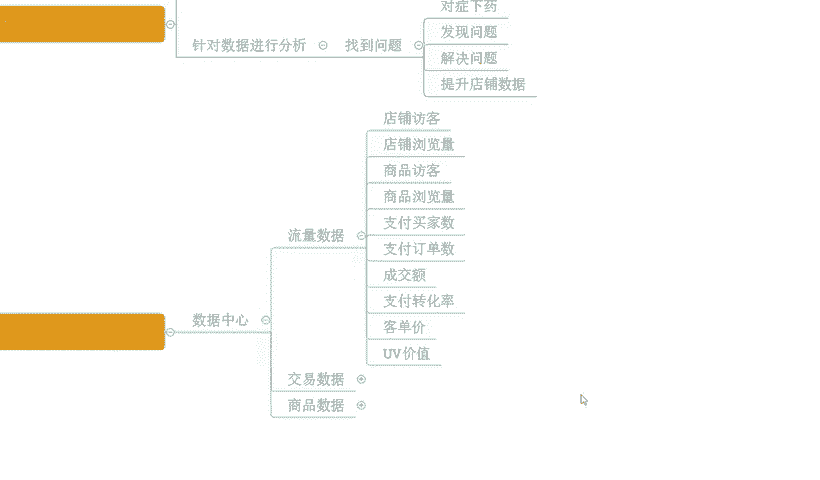

啊，假如今天呢我的。访客变少了。那么变少了是一个结果，对不对？那他为什么会变少？这个就是我们要去分析的一个核心的点，对不对？那首先呢第一步呢，我们先确认一下市场情况。

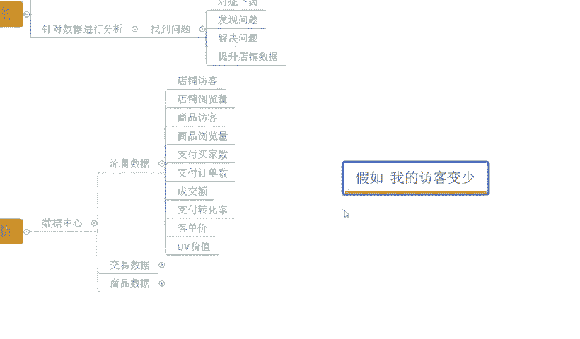

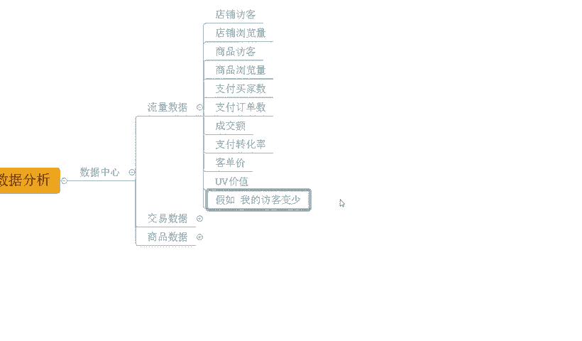

如果说整个市场大盘它是处于一个比较平稳的状态。或者是他处于一个上升状态。啊，那么这个时候我们的店铺数据下降了，你一定要去重点留意。啊，重点留意，因为这个不是一个正常的现象啊。

我们的数据呢是跟大盘所呃这个期这个趋势所相反的啊，所以这个时候呢就非常容易出现问题。那如果出现这种情况呢，首先第一件事情呢，我们要去搞清楚是不是有同款相似款通过呃这个报名活动。

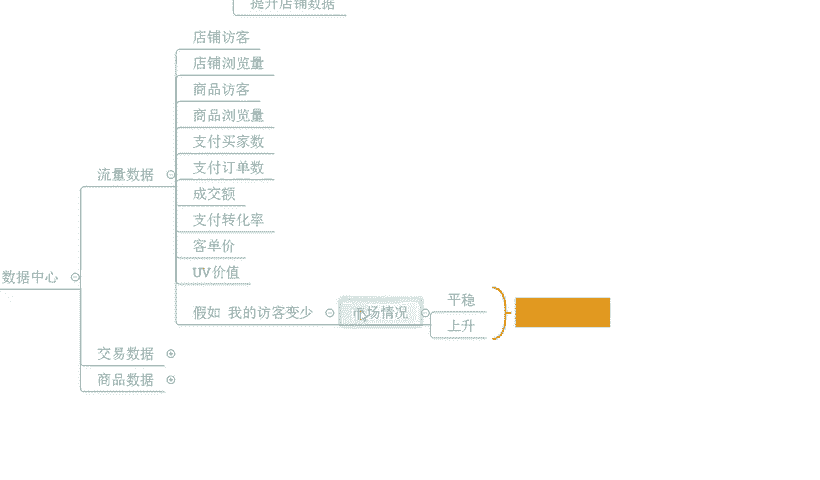

或者是通过竞价的方式啊跟我们抢资源位。如果说有，那么记得第一时间去调整我们自己的一个活动情况，对不对？如果说没有OK那么回到我们后台来观察这些商品数据。那么第一个要我们重点观察数据呢，就是我们的转化率。

我们可以重点去看一看啊，那以我今天数据变少，这个时间往前推啊，推7天啊，或者是推4天啊，来重点看一看我们的转化率的变化，那如果说我们转化率在这个过程中是处于一个相对比较稳定的状态。

而且整个转化数据呢比较好。那么数据呢应该是属于正常的。它不应该下降。如果说这个阶段整个的支付转化率波动比较大，而且呢整体的转化呢是低于我们行业的均值的那么这个时候我们就可以判断可能大概率导致我。

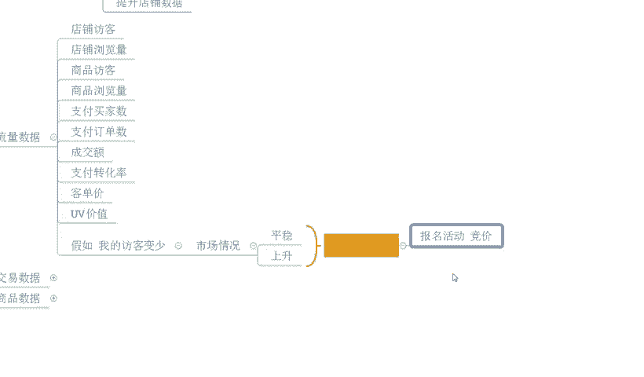

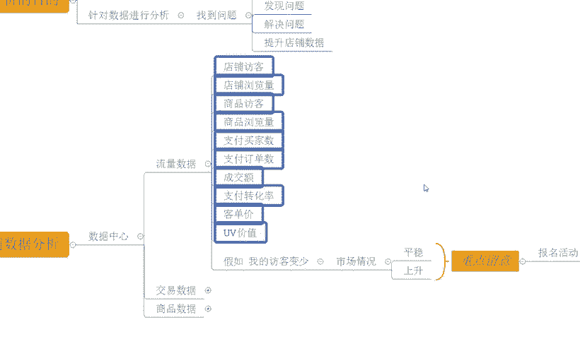

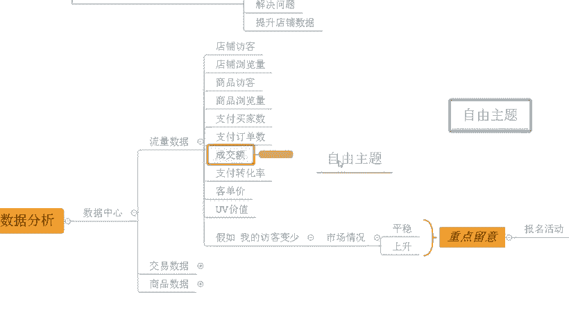

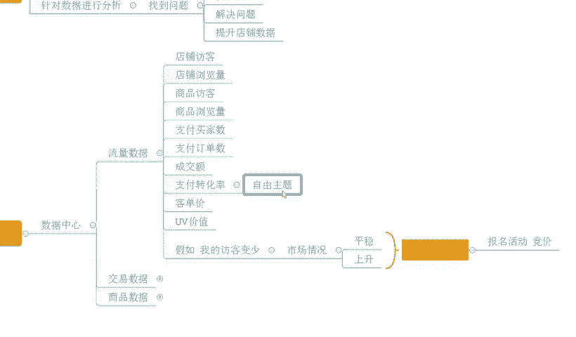

流量下降的原因是因为近段时间我整个商品的转化率比较低，导致系统判定我流量承接能力弱啊，于是乎削弱了我的推荐曝光。当然呢，如果说我们整个这个数据刚刚讲到的是平稳的状态的话。

O那我们可以去观察一下我们的客单价、成交额、UV价值等等这些数据。那么如果说这些同样的出现我刚刚讲的问题，对不对？它是一个正常的值的话，那没问题。如果说是有哪一个值是处于一个比较弱的板块的话。

那我们可以重点的去进行啊这个数据的一个优化，对吧？可以通过这个自己操作数据的方式啊，或者是引导真实客户完成一些额外的动作来达成这些目标啊，都是可以的。那么再往下呢，我们来说一说我们的交易数据啊。

交易数据里面呢除了有到我们刚刚讲到的一些重点数据之外，还会有到一些东西，就是我们的老客户的一个占比，还有就是我们的店铺的啊关注用户数啊，那么店铺的关注用户数。

还有我们老客户占呢对于我们店铺来讲也是影响非常重要的一些东西啊。那如果说我们店铺的关注数量呢，不断的在增加，而且。

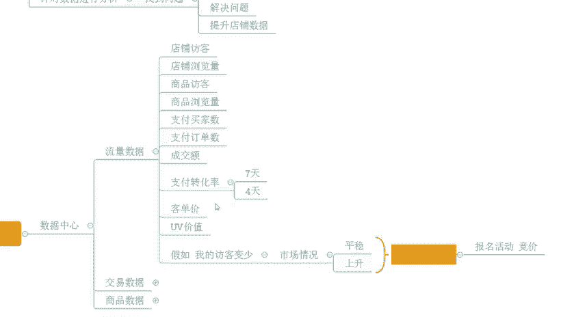

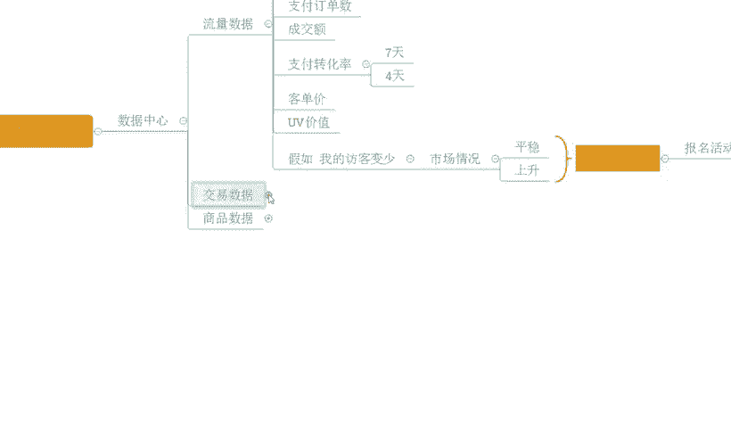

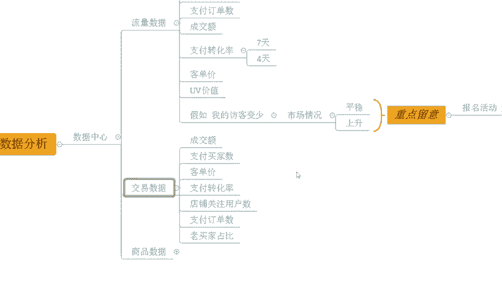

增加的趋势非常好，非常健康。数据也很稳定的话，那说明我们整个用户啊就是我们整个店铺的用户啊进来我的店铺之后呢，他啊可能相对来说精度还是比较高的。但如果说今天我们发现我的店铺访客下降了。

而在过去一段时间里面，我们整个店铺的关注数据呢在不断的减少，而且很少比例的一个关注数据O那么这个时候呢我们可以判定可能就是我们引流不精准导致的我们整体转化下降，从而导致我们整个店铺访客下降啊。

当那里面如果说还有到很多的老客户成交的话，OK那我觉得不错的，说明呢我们整个产品在过去一段时间里面，我们的老客户的一个运营还是比较不错。那我们要针对到我们的一些拉新数据进行优化啊，那么这就可以的。

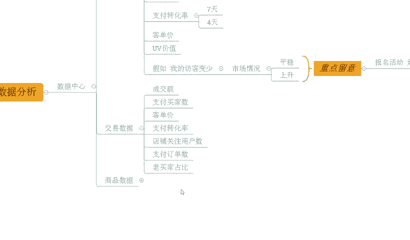

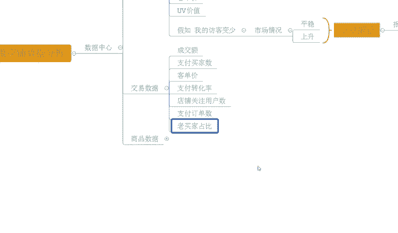

那再往后呢是我们的这个商品数据啊，那商品数据呢里面其实有非常非常多的一个东西的。其中呢有个个东西叫做商品概况啊，那么里面呢就会有到一些呃具体的数据指标。那这些东西呢。

其实在我们上面啊呃大部分的数据呢都能够去找到的。像我们的流量数据和我们的交易数据里面啊，都能找得到。但是呢会有到一个更加重要的细节，就是我们的商品明细，商品明细里面呢。

我们可以直接查看对应的某一个商品的具体数据啊，并且呢可以经过查看详情呢找到对应该数据的一些具体周期里面的一些呃曲线图来进行单独的数据分析。对不对？那么如果说我们整个店铺数据下降。就我刚讲到的对不对？

我们来看一看，那我具体哪一个产品的数据下降了。那这一个产品数据下降的原因是什么，对应到明细里面去观察转化率，观察我们的这个。

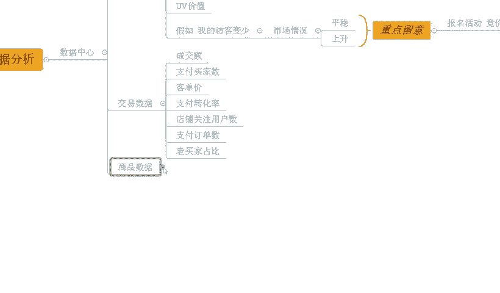

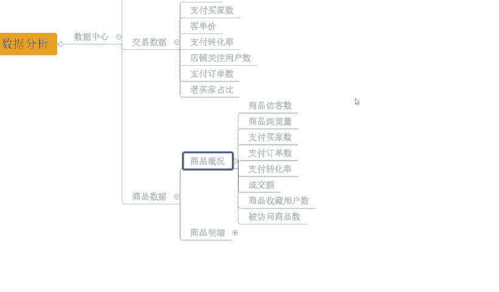

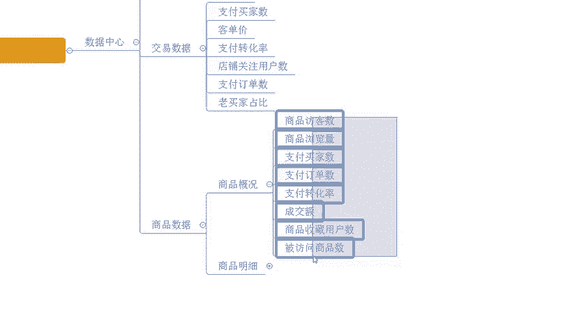

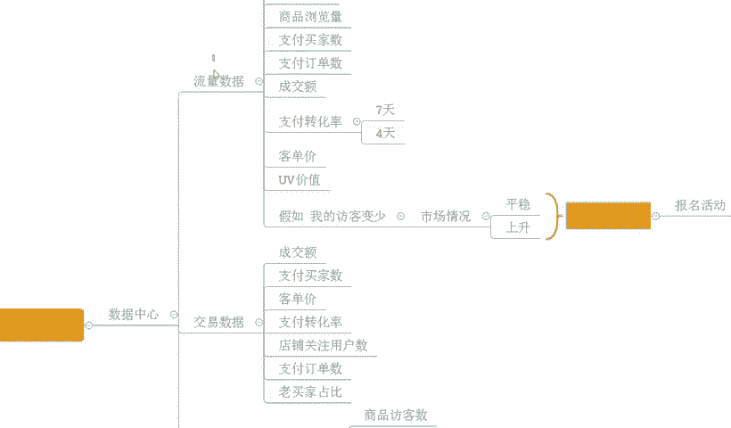

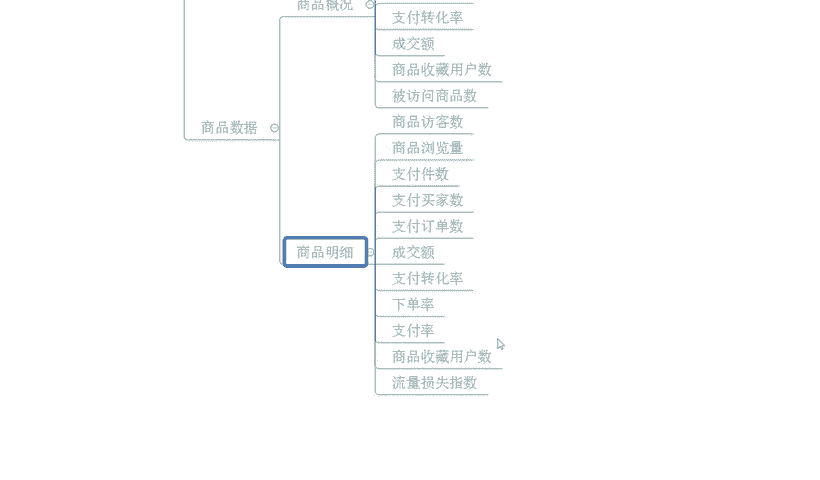

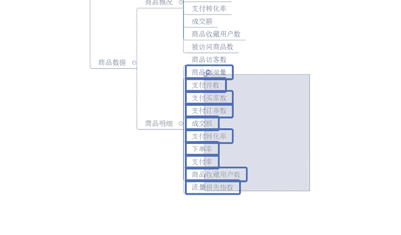

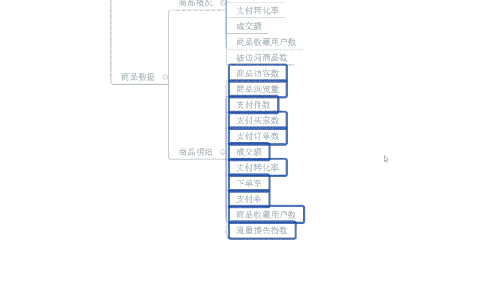

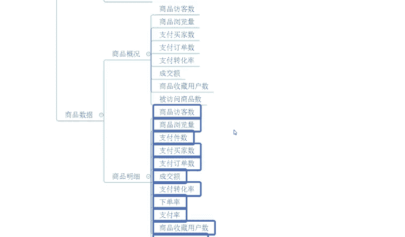

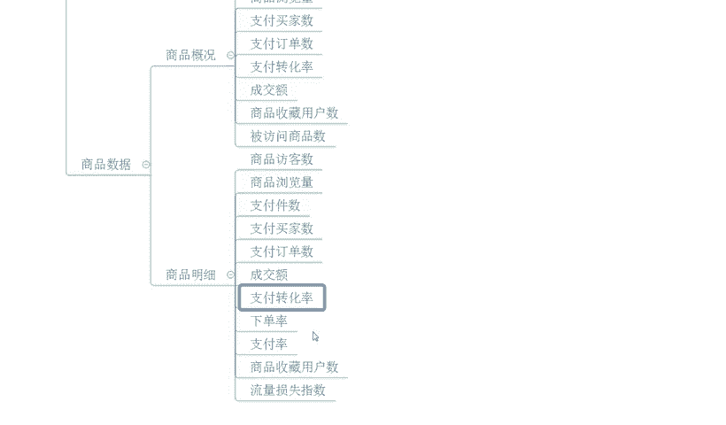

成交额对吧？啊，那么这些东西观察好之后呢啊我们还可以去关注一下我们的流量流失情况。那么流失会比较多一点，受伤也会比较少一点。那么这个时候呢就要重点留意是不是有被人这个盯上对吧？

那如果说只是我们单纯的转化率低啊，是我们成交额低的话，那么我们要去提高这个产品的这个客单价啊，或者是提高这个产品的整体转化。那通过什么样方式去达成这个目的呢？O我们可以通过一些活动啊。

优惠券呢或者是这个满减啊等等这些方式来进行啊，或者是我们通过一些其他的营销手段来达成这个方式啊，就可以了。那这样的话，整个店铺数据呢在后期呢也会呈现出一个比较稳定的一个状态，好吧？

O那么以上呢就是我们关于店铺数据分析的一个分享啊。当然对于很多的现小伙伴来说，哪怕我刚刚讲了一遍。对但是可能很多的细节呢还是不是很清楚。但是没关系啊，如果说对于整个的内容呢，哪里有不清楚的。

或者有什么店铺操作方面的问题。

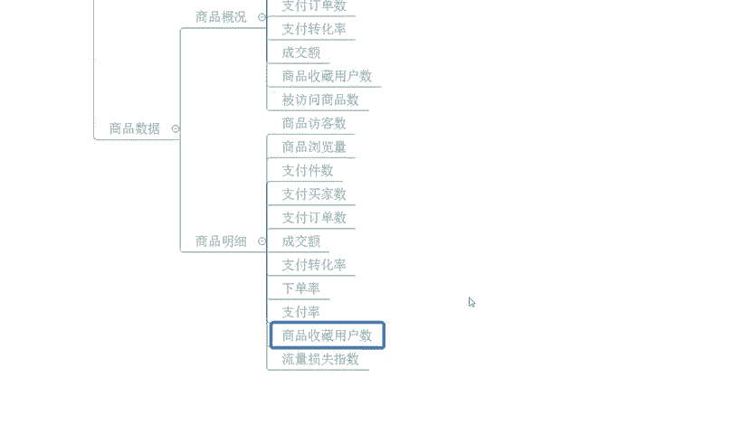

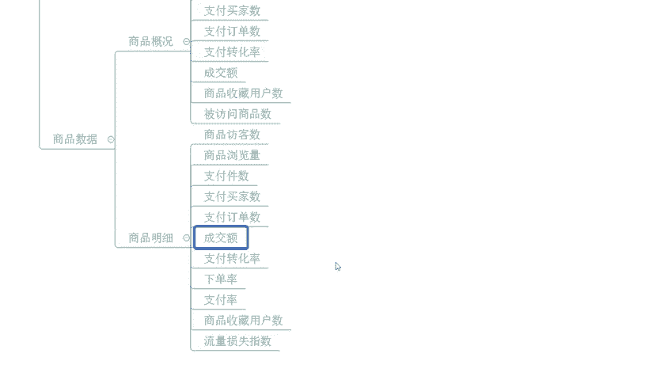

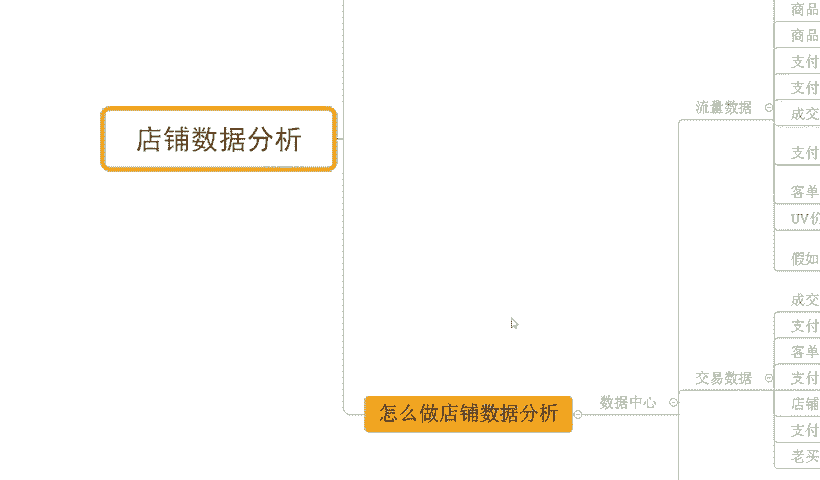

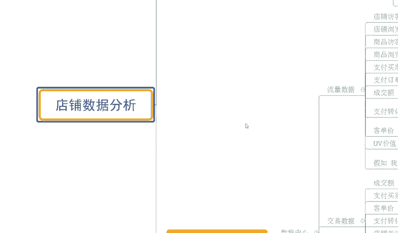

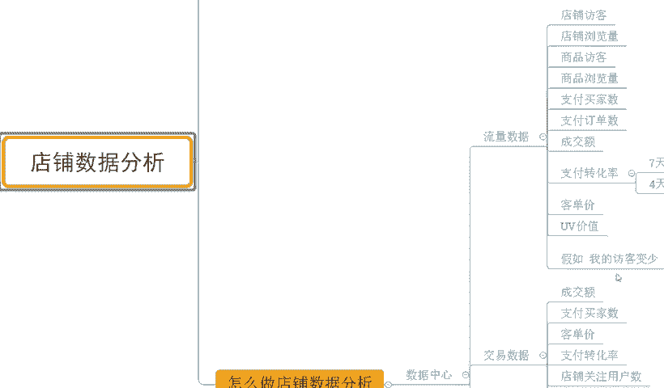

啊，有需要资料的呀，都可以随时找我啊。那么呃有时间的话也可以带着大家一起去实操坐店。就像这小伙伴一样像我说的，对不对？一起呢快速把店铺做起来。好吧，OK那么今天的视频呢就分享到这里啊，我们下次再见。

各位，拜拜。

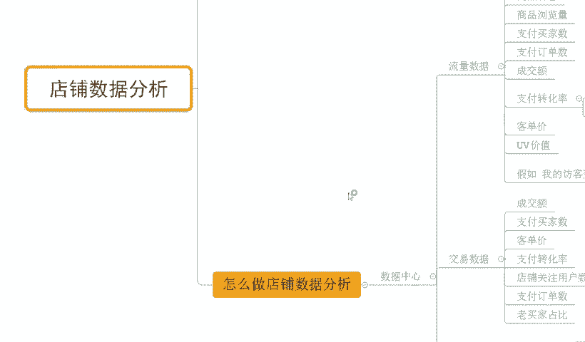

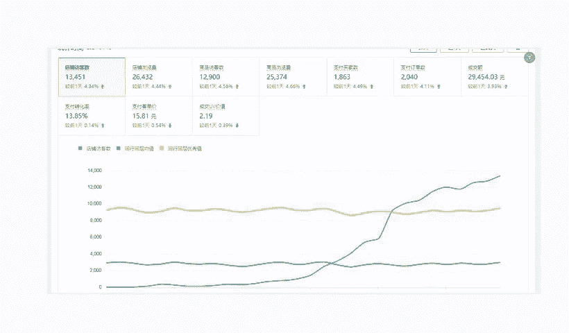

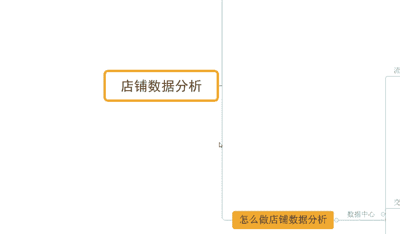