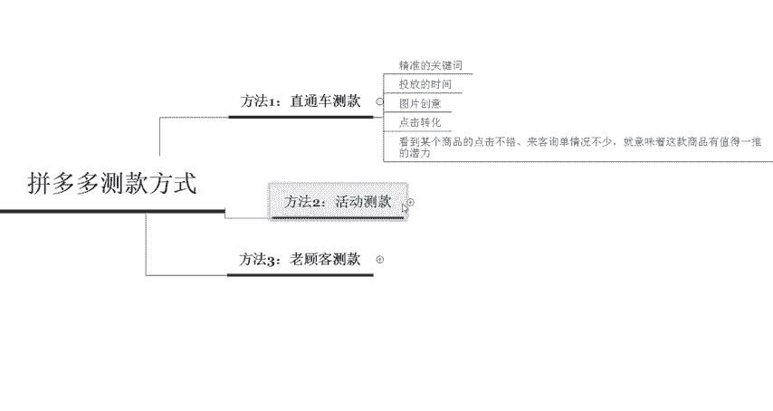

# 【拼多多运营实操教程】最系统的零基础拼多多开店教程全套，电商运营大佬专为学渣研制的新手开店保姆级教程！全程干货，简单粗暴 - P29：29、拼多多开店-测款方式 - -拼多多开店 - BV1BH1qYpEqw

hello各位小伙伴们，大家好，又到了今天的干货分享时间啊。首先欢迎大家来到我的拼多多系列课堂。那么今天给大家分享的内容呢是拼多多测款方式的一些总结啊。

那么最近呢也有很多的小伙伴在私信我说呃拼多多不知道新品应该怎么样去做。那新品在操作前期的时候，首先第一步要做的，肯定就是测款。那测款的时候应该以什么样的一个方式来去做呢？啊。

那么今天就由我希老老师带你们认识一下拼多多测款的一些呃主流的比较主流的一些方式啊，那主流的方式呢重点有3个，第一个呢是直通车测款。第二个呢是呃活动测款。第三个呢是老客户测款啊。

首先我们先来认识一下什么叫做直通车的测款。直通车的测款呢也是呃整个做电商的类的一个平台里面近几年用的比最多的一个策款。

方法就是直通车的一个测款。在做这个直通车测款的时候呢，要注意几个点啊。首先你选择的这个关键词一定要投放的关键词一定要精准啊。然后第二个呢是投放的时间需要你自己来掌控。

因为不同的时间段投放广告的一个呃效果带来的一个实际的数据都是不同的啊，那么第三个呢就是图片以及创意上面的一些优化啊，比如说我们在测款的时候呢，测试图片以及测试创意。那这些呢都是同步在进行的。

所以说整体对于每一个运营者的一个呃专业知识要求可能就会比较高。

那么我们在进行测试操作的时候呢，只能看到某个商品的点击不错啊。如果说你看到它点击不错，或者是询单的一个情况也不少，那么意味着这个商品呢是值得有一推的一个潜力的。所以说我们重点来看点击以及转化的一个情况。

我们商家在开车推广的过程中呢，也要注意监控这个商品的一个排名啊，随时随地的对于这个商品呢做出灵活的一个变动啊，所以说我们在进行实际操作的一个过程中呢啊需要找准自己的一个位置啊，做到精准与测款啊。

精准的去测款，还有定价啊，那么以上呢就是关于直通车测款的一些细节啊。那么接下来呢我们来了解呃了解一下这个活动测款。

其实在拼多多平台上面呢，它的活动是非常多的啊。如果要测款的时候，我见你们两个活动。第一个呢是新品推荐啊，第二个呢是限时秒杀啊，这个新品推荐呢它是没有什么销量要求的啊，不要求你的销量达到多少。

每天呢可以报一个产品，然后报名活动之后呢，主要看点击的转化如何啊，点击了之后转化如何啊，以此来达到测款的一个目的啊。而后者就是说这个限时秒杀呢，它上活动的一个要求可能就比较高了，比较难上啊。

在做这个店铺的时候呢啊要求让这个运营啊，只能择优去选择。所以说不是说呃每一个商品都可以上了秒杀活动的啊。如果你在操作的过程中报上这个秒杀活动了。而且呢商品可以在短时间内就可以直接全部都秒完。

那么ok这个商品呢基本就可以确定肯定就是你的主推款了，一定可以推的很好。那么这个呢就是。

在活动测款的时候，主要测试的两个方向啊，新品推荐和限时秒杀。那如果说你想要这个活动测款的时候，可以呃有这个对应的资金的话，那么你也可以同时在上活动的过程中开一下这个场景啊。

那场景的一个效果和测款的一个数据也是非常不错的。然后最后一个呢就是我们的老客户测款。如这个呢对于店铺的要求可能会比较高，前提是保证你的店铺呢已经有拥有了这个稳定的客户群。那在这样的情况下。

你就可以使用这样老客户测款的一个方法。因为它的一个成本比较低，而且呢老客户在购买的时候呢，还能给你的店铺加权啊。如果你适当的在群里面去做一些呃优惠的活动，或者是加一些呃晒图评价的一些活动啊。

那么这样还可以提高店铺的动态评分啊，也就是DSR。

所以说啊所以说我们在实际操作的过程中呢，一定要呃灵活的去运用不同的一个阶段。我们可以使用不同的一个方式来进行测款。呃，那么最后呢呃。给大家提醒一句，我们在推广之前呢，一定要先测款，测好款式再来推广的话。

就会事半功倍啊。最后呢预祝每一个在拼多多奋斗的商家呢都可以大卖啊。而且呢定期我也会在这个平台呢更新更多的一些拼多多干货内容啊，那如果说大家有想要学习拼多多或者想要了解拼多多的啊，可以随时私信我啊。

那么现在找我呢还有这个拼多多的新手大礼包领取啊，可以直接。

私信找我。好，那么今天给大家的分享啊到这里就结束了啊，感谢大家的观看，再见。

